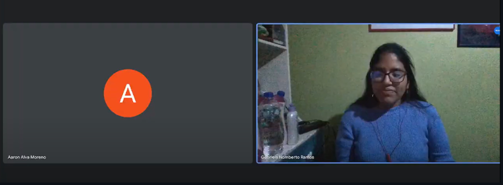
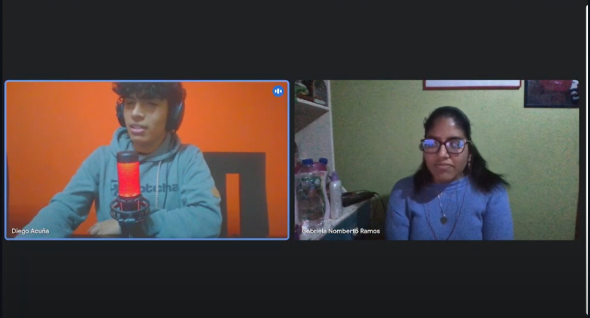

# Report Iot

Carrera: Ingeniería de Software

Nombre del curso: Desarrollo de Soluciones IOT

Sección: WV71

Nombre del profesor: Velasquez Nuñez, Angel Augusto

"Informe de TB1"

Nombre del startup: VerySafe

Nombre del producto: FalconShield

Relación de integrantes:

- Gabriela Soledad Nomberto Ramos
- Dennis Piero Quevedo Yucra
- Max Dayson Sabino Arostegui
- Elvia Guadalupe Arteaga Cruz
- Jamutaq Piero Ortega Vélez

Mes y año: Agosto 2024

Ciclo: 2024-2

## Registro de Versiones del Informe
# Student Outcome
# CAPÍTULO I: INTRODUCTION
## 1.1 Startup Profile
### 1.1.1 Descripción de la Startup
### 1.1.2 Perfiles de integrantes del equipo
## 1.2 Solution Profile
### 1.2.1  Antecedentes y problemática
### 1.2.2 Lean UX Process
#### 1.2.2.1 Lean UX Problem Statements
#### 1.2.2.2 Lean UX Assumptions
#### 1.2.2.3 Lean UX Hypothesis Statements
#### 1.2.2.4 Lean UX Canvas
## 1.3 Segmentos objetivo

# CAPÍTULO II: REQUERIMENTS ELICITATION & ANALYSIS
## 2.1 Competidores

Como grupo, investigamos a nuestros principales competidores de los cuales ofrezcan servicios similares o parecidos a los nuestros. Llegamos a la conclusion de comparar con tres empresas las cuales son las siguiente:

**1. Verisure**: Es una empresa de seguridad que ofrece como servicios primero la inspeccion del inmueble del cual solicitan sus productos para ofrecer mejor seguridad. Además, cuenta con una central de monitoreo para poder recepcionar las alarmas los siete días de las semanas y las 24 horas del día. Estos cuentan con dispositivos de seguridad como sensores para las puertes, camaras de video, camaras de foto, etc.
**2. Prosegur**: Es una empresa que brinda Alarmas monitoreadas y seguridad a cualquier tipo de persona. Ofrecen kits de seguridad para que el cliente decida cual es de su mejor agrado y prosegur acude a la instalacion, asimismo no solo se dedica en la seguridad del inmueble sino tambien de vehiculos. Todo ello esta monitoreado por una central de alertas para que al activarse pueda acudir un motorizado a corroborar la alerta dada.
**3. Securitas**: Empresa de seguridad que se basa en comprender al cliente para poder ofrecer sus servicios de los cuales el mas conocido es la camara de videovigilancia, además de brindar seguridad en muchos aspectos como seguridad remota o seguridad electrónica, tambien ofrece servicios de proteccion contra incendios para sus clientes ofreciendoles asi un reporte anual desde su compra

Teniendo estos competidores mejor descritos, podremos hacer nuestro análisis competitivo a continuación.

### 2.1.1. Análisis competitivo

Para el análisis competitivo, observamos a tres empresas que se encuentran en el mercado que ofrecen una similitud y estos son los siguientes: 

| Competitive Analysis Landscape |
| -- |
| ¿Por qué llevar a cabo este análisis? |
| ¿Cómo se posiciona VerySafe en comparación con sus principales competidores por los clientes en el mercado de seguridad de inmuebles en Lima Metropolitana? |

**Perfil del Startup**

| Startup | VerySafe | Verisure | Prosegur | Securitas |
| -- | -- | -- | -- | -- |
| Logo |  |  |  |  |
| **Overview** | Ofrece soluciones de seguridad accesibles y personalizadas para inmuebles. Se enfoca en integrar tecnología avanzada con un enfoque en la accesibilidad, buscando proteger hogares y pequeñas empresas con productos innovadores y servicios flexibles que se adaptan a las necesidades de sus clientes. | Ofrece sistemas de alarmas conectadas y monitoreo remoto 24/7. Con una fuerte presencia en el mercado peruano, Verisure ofrece soluciones de alta tecnología que combinan la seguridad física y digital, destacándose por su fiabilidad y servicio al cliente. | Ofrece una amplia gama de servicios que incluyen desde alarmas y videovigilancia hasta servicios de seguridad física y logística de valores, adaptándose tanto a clientes residenciales como corporativos con soluciones integradas. | Ofrece soluciones personalizadas que combinan seguridad física y digital, dirigidas principalmente a grandes empresas e instituciones. Su enfoque está en la integración de tecnologías innovadoras y la adaptación a las necesidades específicas de cada cliente. | 
|**Ventaja competitiva ¿Qué valor ofrece a los clientes?** | Ofrecer soluciones tecnológicas avanzadas IoT a precios accesibles, con un enfoque en personalización y accesibilidad para un público amplio. | Alta tecnología en sistemas de monitoreo remoto y servicio al cliente eficiente. | Amplia gama de servicios de seguridad integrados con una fuerte presencia en el mercado local e internacional | Tecnología avanzada y un enfoque en la integración de soluciones de seguridad física y digital. | 

**Perfil de Marketing**

| Startup | VerySafe | Verisure | Prosegur | Securitas |
| -- | -- | -- | -- | -- |
| **Mercado Objetivo** | Propietarios de Inmuebles que se encuentren en Lima Metropolitana | Hogares y pequeñas empresas que buscan sistemas de alarma conectados de alta gama. | Grandes empresas, instituciones y hogares de clase media-alta. | Grandes empresas, instituciones gubernamentales y hogares de clase media-alta. |
| **Estrategias de Marketing** | Campañas digitales enfocadas en el costo-beneficio y accesibilidad de los productos. Publicidad en medios locales. | Marketing enfocado en la tecnología avanzada y la confiabilidad. Campañas en redes sociales y medios de comunicación masiva. | Marketing tradicional y digital enfocado en la solidez de la marca y la experiencia. | Estrategias de marketing centradas en la seguridad integral y la tecnología de punta. |

**Perfil de Producto**

| Startup | VerySafe | Verisure | Prosegur | Securitas |
| -- | -- | -- | -- | -- |
| **Productos & Servicios** | Sistemas de sensores, cámaras y alarmas inteligentes, integrados con una plataforma digital para monitoreo y control remoto 24/7. | Alarmas conectadas, sensores de movimiento, y monitoreo remoto 24/7. | Alarmas, cámaras de vigilancia, control de accesos, monitoreo, y guardias de seguridad | Sistemas de seguridad integrados, alarmas, cámaras, monitoreo, y servicios de guardias.|
| **Precios & Costos** | Modelo de precios accesible, con opciones de suscripción o alquiler. | Precios medios-altos, con modelos de suscripción. | Variedad de precios según los servicios, generalmente en un rango medio-alto. Y dependiendo del kit elegido. | Variedad de precios, con un enfoque en soluciones a medida para clientes corporativos. |
| **Canales de distribución (Web y/o Móvil)** | Venta y distribución a través de web y aplicación móvil, con opciones de instalación y soporte técnico. | Distribución a través de web, móvil, y red de instaladores locales. | Distribución a través de web, puntos de venta físicos y contacto directo con clientes. | Distribución a través de web, móvil, y ventas directas a través de representantes.|

**Analisis SWOT**

| Startup | VerySafe | Verisure | Prosegur | Securitas |
| -- | -- | -- | -- | -- |
| **Fortalezas** | Accesibilidad en precios, personalización de productos, enfoque local. | Tecnología avanzada, reputación global, servicio al cliente robusto. | Amplia gama de servicios, presencia fuerte en el mercado, reconocimiento de marca. | Integración de servicios, tecnología avanzada, capacidad de adaptación |
| **Debilidades** | Menor reconocimiento de la empresa y marca | Precio elevado, menos accesible para clientes de clase media-baja. | Alto costo de los servicios, enfoque más en clientes corporativos que en residenciales. | Alto costo, enfoque más en grandes empresas e instituciones. | 
| **Oportunidades** | Expandirse a nuevos segmentos de mercado, como pequeñas empresas y hogares de clase media. | Creciente demanda de seguridad avanzada en hogares y empresas. | Crecimiento del mercado de seguridad en hogares y negocios. | Expansión en servicios digitales y mercados emergentes. | 
| **Amenazas** | Competencia fuerte de marcas establecidas | Competencia en precios de empresas locales y nuevas tecnologías. | Innovaciones tecnológicas y nuevos competidores más ágiles. | Innovación tecnológica de startups más ágiles y económicas. |

## 2.2 Entrevistas
### 2.2.1. Diseño de entrevistas
### 2.2.2. Registro de entrevistas

* **Segmento 1: Dueños de inmuebles**

  - Entrevista N°1:
    - Nombres y apellidos: Jesús Aliaga
    - Edad: 60 años
    - Distrito: Los Olivos
    - Timing: 0:00
    - Duración: 9:35
    - Link: [Enlace entrevista 1](https://upcedupe-my.sharepoint.com/:v:/g/personal/u202113876_upc_edu_pe/EXHqrhK5ujRBmGwX9MkluJUBF2d1Zprer7bJl0F41fEX1g?e=WkDqqD&nav=eyJyZWZlcnJhbEluZm8iOnsicmVmZXJyYWxBcHAiOiJTdHJlYW1XZWJBcHAiLCJyZWZlcnJhbFZpZXciOiJTaGFyZURpYWxvZy1MaW5rIiwicmVmZXJyYWxBcHBQbGF0Zm9ybSI6IldlYiIsInJlZmVycmFsTW9kZSI6InZpZXcifX0%3D)
    
    
    Jesús manifiesta que la inseguridad ha incrementado significativamente estos últimos años, por lo cual comenta que una solución de un sistema de seguridad sería muy valiosa para su inmueble ya que actualmente lo maneja de forma manual con cercos. Además destaca que para un mejor manejo, dicha solución debe tener una aplicación móvil y un sistema de alertas para varias personas, así las personas encargadas puedan saber lo que está pasando en tiempo real.

  - Entrevista N°2:
    - Nombres y apellidos: Diana Gomez Oré
    - Edad: 25 años
    - Distrito: Chorrillos
    - Timing: 9:35
    - Duración: 5:22
    - Link: [Enlace entrevista 2](https://upcedupe-my.sharepoint.com/:v:/g/personal/u202113876_upc_edu_pe/EXHqrhK5ujRBmGwX9MkluJUBF2d1Zprer7bJl0F41fEX1g?e=Hh8QaG&nav=eyJyZWZlcnJhbEluZm8iOnsicmVmZXJyYWxBcHAiOiJTdHJlYW1XZWJBcHAiLCJyZWZlcnJhbFZpZXciOiJTaGFyZURpYWxvZy1MaW5rIiwicmVmZXJyYWxBcHBQbGF0Zm9ybSI6IldlYiIsInJlZmVycmFsTW9kZSI6InZpZXcifSwicGxheWJhY2tPcHRpb25zIjp7InN0YXJ0VGltZUluU2Vjb25kcyI6NTc0Ljc0fX0%3D)
    
    
    Antes de la entrevista, Diana me comentó que se acaba de mudar sola hace aproximadamente 6 meses, por lo que el tema de seguridad es algo que le preocupa, debido a que deja su hogar solo cuando se va al trabajo. Además me comentó que ha investigado un poco sobre algunas opciones de empresas de seguridad, pero aún no se decide por alguna de ellas.

    Durante la entrevista, Diana mencionó que no ha tenido problemas de seguridad aún, pero que toda la seguridad que tiene en su hogar es colocar llave al cerrar la puerta. Es por ello que le parece interesante y ve como opción a futuro el adquirir un sistema de seguridad. Para ella es muy importante que la empresa de seguridad le brinde la confianza y seguridad que requiere un servicio de esta índole, además de que se realicen mantenimientos cada cierto tiempo y que la atención al cliente en caso de dudas o fallos sea rápida. Ella considera que los dispositivos más importantes serían cámaras, sensores y un pinpad. Además, mencionó que ella preferiría ser alertada de algún intruso mediante una llamada, ya que la atendería con mayor rapidez que un mensaje o notificación. Sin embargo, dijo que no le molestaría recibir notificaciones referentes a la seguridad de su hogar. Por último, mencionó que ella prefiere gestionar el sistema de seguridd de su hogar mediante una aplicación, ya que de esa manera podría visualizar sus cámaras y estar al tanto de la situación de su hogar en todo momento.

    También pude notar que Diana utiliza un celular con android y una laptop con Windows. Además, sus canales de comunicación son principalmente WhatsApp e Instagram. Su relación con la tecnología es bastante buena, debido a que en su trabajo están en constante capacitación, sobretodo para el uso de pc. Asimismo, está acostumbrada a utilizar browsers basados en chromium, tales como Chrome y Brave.

- Entrevista N°4:
    - Nombres y apellidos: Aaron Alva Moreno
    - Edad: 24 años
    - Distrito: San Juan de Lurigancho
    - Timing: 23:37
    - Duración: 5:00
    - Link: [Enlace entrevista 4](https://upcedupe-my.sharepoint.com/:v:/g/personal/u202113876_upc_edu_pe/EXHqrhK5ujRBmGwX9MkluJUBF2d1Zprer7bJl0F41fEX1g?e=WkDqqD&nav=eyJyZWZlcnJhbEluZm8iOnsicmVmZXJyYWxBcHAiOiJTdHJlYW1XZWJBcHAiLCJyZWZlcnJhbFZpZXciOiJTaGFyZURpYWxvZy1MaW5rIiwicmVmZXJyYWxBcHBQbGF0Zm9ybSI6IldlYiIsInJlZmVycmFsTW9kZSI6InZpZXcifX0%3D)
    
    
    Aaron compartió que recientemente ha comenzado un proceso de mudanza en una zona algo conflictiva de San Juan de Lurigancho. Al iniciar la entrevista, su preocupación por la seguridad se hizo evidente, ya que mencionó que en su vecindario hay un aumento alarmante en los robos de inmuebles y hogares. Esta situación lo ha llevado a buscar soluciones efectivas que le brinden mayor tranquilidad y protección. La sensación de inseguridad en su nuevo entorno es algo que le preocupa profundamente, lo que ha intensificado su interés por encontrar un sistema de seguridad que se adapte a sus necesidades.

    En su búsqueda de una solución, Aaron se mostró abierto a explorar tecnologías de Internet de las Cosas (IoT) que puedan mejorar la seguridad de su hogar. Está interesado en sistemas que no solo ofrezcan protección, sino que también permitan una gestión eficiente a través de notificaciones en tiempo real. Esta funcionalidad podría ayudarlo a sentirse más seguro y al tanto de cualquier situación inusual en su entorno. La posibilidad de monitorear su hogar de manera remota y recibir alertas inmediatas sobre posibles amenazas es una característica que considera fundamental para tomar decisiones informadas y reaccionar rápidamente ante cualquier eventualidad. Asimismo, nos comento que el en sistemas operativos es fanático de windows y android.

* **Segmento 2: Empresas de Seguridad**
- Entrevista N°5:
    - Nombres y apellidos: Diego Acuña
    - Edad: 28 años
    - Distrito: San Isidro
    - Timing: 26:31
    - Duración: 4:00
    - Link: [Enlace entrevista 5](https://upcedupe-my.sharepoint.com/:v:/g/personal/u202113876_upc_edu_pe/EXHqrhK5ujRBmGwX9MkluJUBF2d1Zprer7bJl0F41fEX1g?e=WkDqqD&nav=eyJyZWZlcnJhbEluZm8iOnsicmVmZXJyYWxBcHAiOiJTdHJlYW1XZWJBcHAiLCJyZWZlcnJhbFZpZXciOiJTaGFyZURpYWxvZy1MaW5rIiwicmVmZXJyYWxBcHBQbGF0Zm9ybSI6IldlYiIsInJlZmVycmFsTW9kZSI6InZpZXcifX0%3D)
    
    
    
    En esta ocasión, entrevistamos a Diego, quien dirige una compañía de seguridad. Durante la conversación, Diego expresó su deseo de mejorar gradualmente la eficiencia de su servicio, ya que actualmente sus tiempos de respuesta ante emergencias pueden llegar a ser de hasta 10 minutos, dependiendo de la zona donde se active la alarma. Esta situación lo preocupa, ya que en muchas ocasiones el tiempo es crucial para garantizar la seguridad de sus clientes. Además, mencionó que, aunque está familiarizado con los dispositivos IoT, ha enfrentado problemas con algunos de ellos, como fallos en la conectividad que retrasan las notificaciones.

    Diego está decidido a explorar nuevas opciones y tecnologías que puedan optimizar su sistema de seguridad. Está dispuesto a investigar otros tipos de dispositivos que ofrezcan mayor fiabilidad y rapidez en la comunicación de alertas. Su enfoque proactivo refleja su compromiso con la mejora continua de su empresa, buscando siempre proporcionar un servicio más eficiente y efectivo a sus clientes. La incorporación de soluciones innovadoras podría no solo disminuir los tiempos de respuesta, sino también aumentar la confianza de sus clientes en la seguridad que brinda. Nos comenta además que en su compañía, utilizan mejor el sistema Windows para el monitoreo de las alarmas.

### 2.2.3. Análisis de entrevistas
## 2.3 Needfinding
### 2.3.1. User Personas
Las personas que se presentan a continuación son una representación de los segmentos de usuarios definidos, se han tomado en cuenta las características más relevantes de las entrevistas realizadas y el análisis de la competencia las cuales incluyen: edad, distrito, dispositivos tecnológicos que utilizan, canales de comunicación, relación con la tecnología, necesidades y preferencias.

- **Segmento 1: Dueños de inmuebles**

- **Segmento 2: Empresas de seguridad**

### 2.3.2. User Task Matrix

Los User Personas que se han definido son Seele Vollerei el cual representa al primer segmento, dueño de inmueble y José Ramirez para el segundo segmento, empresa de seguridad. A continuación, se presenta la matriz de tareas de los User Personas.

<table border="1">
  <thead>
    <tr>
      <th rowspan="2">Task</th>
      <th colspan="2">Seele Vollerei   (Dueño de inmueble)</th>
      <th colspan="2">José Ramirez   (Empresa de seguridad)</th>
    </tr>
    <tr>
      <th>Frecuencia</th>
      <th>Importancia</th>
      <th>Frecuencia</th>
      <th>Importancia</th>
    </tr>
  </thead>
  <tbody>
    <tr>
      <td>Monitorización de cámaras en tiempo real</td>
      <td>Casi siempre</td>
      <td>Alta</td>
      <td>Siempre</td>
      <td>Alta</td>
    </tr>
    <tr>
      <td>Revisión de grabaciones de las cámaras</td>
      <td>A veces</td>
      <td>Media alta</td>
      <td>Siempre</td>
      <td>Alta</td>
    </tr>
    <tr>
      <td>Recepción de alertas en tiempo real</td>
      <td>Siempre</td>
      <td>Alta</td>
      <td>Siempre</td>
      <td>Alta</td>
    </tr>
    <tr>
      <td>Respuesta ante incidentes</td>
      <td>Rara vez</td>
      <td>Alta</td>
      <td>Siempre</td>
      <td>Alta</td>
    </tr>
    <tr>
      <td>Análisis de patrones de seguridad</td>
      <td>Pocas veces</td>
      <td>Alta</td>
      <td>Siempre</td>
      <td>Alta</td>
    </tr>
    <tr>
      <td>Realización de informes de actividad</td>
      <td>Casi nunca</td>
      <td>Baja</td>
      <td>Siempre</td>
      <td>Alta</td>
    </tr>
    <tr>
      <td>Instalación de nuevas cámaras y/o dispositivos IoT</td>
      <td>A veces</td>
      <td>Alta</td>
      <td>Rara vez (no es su rubro)</td>
      <td>Baja</td>
    </tr>
    <tr>
      <td>Configuración y mantenimiento de los dispositivos IoT y cámaras</td>
      <td>Casi siempre</td>
      <td>Alta</td>
      <td>Casi nunca</td>
      <td>Baja</td>
    </tr>
  </tbody>
</table>

Las tareas que se realizan con mayor frecuencia e importancia por parte de los User Personas son la monitorización de cámaras en tiempo real, la recepción de alertas en tiempo real y la revisión de las grabaciones. En cuanto a las diferencias, se puede observar que Seele Vollerei realiza la instalación de nuevas cámaras y/o dispositivos IoT, mientras que José Ramirez no lo hace, ya que no es su rubro. Por otro lado, las demás tareas coinciden en su importancia y frecuencia, aunque José Ramirez realiza la mayoría de tareas con mayor frecuencia que Seele Vollerei debido a que es su trabajo.

### 2.3.3. User Journey Mapping

En esta sección se realiza la demostración de la experiencia del usuario con el producto o servicio (como está actualmente). En este caso, se ha realizado el mapeo del viaje del usuario desde el momento en que se plantea la necesidad de adquirir un sistema de seguridad hasta que se instala y se configura el sistema en su hogar (Dueño de inmueble) y desde que se recibe la solicitud o alerta de un cliente hasta que se resuelve el incidente (Empresa de seguridad).

- **User Journey Mapping (Seele Vollerei - Dueño de inmueble)**

- **User Journey Mapping (José Ramirez - Empresa de seguridad)**
<!-- TODO -->

### 2.3.4. Empathy Mapping

El proceso de elaboración del Empathy Mapping se ha realizado tomando en cuenta las entrevistas realizadas a los usuarios de cada segmento y en base a la información recopilada en las mismas. A continuación, se presentan los Empathy Mapping de los User Personas definidos.

- **Empathy Mapping (Seele Vollerei - Dueño de inmueble)**

- **Empathy Mapping (José Ramirez - Empresa de seguridad)**
<!-- TODO -->

### 2.3.5. As-Is Scenario Mapping

Para la elaboración del As-Is Scenario Mapping se ha seguido el proceso de mapeo de escenarios actuales de los User Personas definidos y una lluvia de ideas tomando en cuenta su situación actual, necesidades, preferencias y el mercado actual. A continuación, se presentan los As-Is Scenario Mapping de los User Personas definidos.

- **As-Is Scenario Mapping (Seele Vollerei - Dueño de inmueble)**

- **As-Is Scenario Mapping (José Ramirez - Empresa de seguridad)**
<!-- TODO -->

## 2.4. Ubiquitous Language
Para el desarrollo de esta sección, como grupo debemos estar alineados con los términos y conceptos claves que son necesarios para la realización del proyecto. Además, nos ayuda a tener un lenguaje en común para entender nuestros objetivos, funcionalidades y benerfios.

Para VerySafe tenemos los siguientes términos:

1. Property Owner (Propietario de Inmueble): Persona o entidad que posee un inmueble y tiene la responsabilidad de protegerlo.
   Definición: Persona física o jurídica que es propietaria de un bien inmueble, como una casa, edificio o terreno, y busca soluciones para mejorar la seguridad de su propiedad.

2. Security Company (Empresa de Seguridad): Organización encargada de proveer servicios de vigilancia y protección a inmuebles.
   Definición: Empresa especializada en ofrecer servicios de monitoreo, control de accesos y respuesta ante incidentes para asegurar propiedades frente a amenazas como robos o intrusiones.

3. Real-Time Monitoring (Monitoreo en Tiempo Real): Supervisión continua y en vivo de una propiedad utilizando dispositivos tecnológicos.
   Definición: Proceso mediante el cual se recogen datos de manera inmediata desde sensores o cámaras para tener una visión constante de lo que ocurre en la propiedad.

4. Intrusion Detection (Detección de Intrusos): Sistema que permite identificar la entrada no autorizada en una propiedad.
   Definición: Tecnología diseñada para alertar cuando una persona o entidad no autorizada intenta ingresar a una propiedad.

5. Motion Sensor (Sensor de Movimiento): Dispositivo que detecta cualquier tipo de movimiento dentro de un área específica.
   Definición: Sensor que responde a cualquier cambio de posición o desplazamiento dentro de su rango, utilizado para alertar de posibles intrusos.

6. Proximity Sensor (Sensor de Proximidad): Dispositivo que detecta la cercanía de personas u objetos sin contacto físico.
   Definición: Sensor que percibe la aproximación de un objeto o individuo a un punto específico, utilizado para gestionar accesos o alertar sobre entradas no autorizadas.

7. Access Control (Control de Acceso): Mecanismo que regula y monitorea quién puede entrar o salir de un inmueble.
   Definición: Sistema de seguridad que restringe el acceso a personas autorizadas, permitiendo o denegando entradas basadas en credenciales predefinidas.

8. Surveillance Data (Datos de Vigilancia): Información recopilada a través de cámaras o sensores en un inmueble.
   Definición: Conjunto de datos generados por dispositivos de monitoreo, tales como imágenes o registros de movimiento, que se utilizan para evaluar y garantizar la seguridad de la propiedad.

9. Security Threat (Amenaza de Seguridad): Cualquier situación o evento que ponga en riesgo la seguridad de un inmueble.
    Definición: Situación que compromete la integridad de una propiedad, ya sea por la presencia de personas no autorizadas o por vulnerabilidades en el sistema de protección.

10. Alarm System (Sistema de Alarma): Dispositivo que emite una alerta cuando detecta una posible amenaza.
    Definición: Sistema de seguridad que se activa para notificar sobre una intrusión o anomalía en la propiedad, ya sea mediante sonido, luz o notificaciones electrónicas.

11. Incident Response (Respuesta ante Incidentes): Proceso que se sigue tras la detección de una amenaza en una propiedad.
    Definición: Serie de acciones realizadas después de la activación de una alerta, que pueden incluir el envío de personal de seguridad o la notificación a las autoridades.

12. Perimeter Security (Seguridad Perimetral): Medidas de protección implementadas en los límites de una propiedad.
    Definición: Estrategias de seguridad diseñadas para proteger las áreas exteriores de una propiedad, evitando accesos no autorizados a través de cercas, cámaras o sensores.

13. False Alarm (Falsa Alarma): Activación de un sistema de seguridad sin la presencia de una amenaza real.
    Definición: Situación en la que el sistema de seguridad detecta una actividad que no representa un peligro, como el movimiento de un animal, y genera una alerta innecesaria.