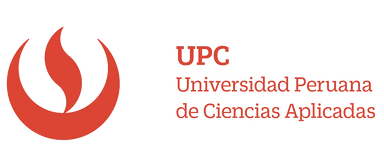

# Report Iot

Carrera: Ingeniería de Software

Nombre del curso: Desarrollo de Soluciones IOT

Sección: WV71

Nombre del profesor: Velasquez Nuñez, Angel Augusto

"Informe de TB1"

Nombre del startup: VerySafe

Nombre del producto: FalconShield

Relación de integrantes:

- Gabriela Soledad Nomberto Ramos
- Dennis Piero Quevedo Yucra
- Max Dayson Sabino Arostegui
- Elvia Guadalupe Arteaga Cruz
- Jamutaq Piero Ortega Vélez

Mes y año: Agosto 2024

Ciclo: 2024-2

## Registro de Versiones del Informe
| Version | Fecha| Autor | Descripción de la Modificación |
|-----------|-----------|-----------|-----------|
| 0.1 | 27/08/2023 | Arteaga, Elvia | Lean UX Proccess |
| 0.2 | 27/08/2023 | Nomberto, Gabriela | Antecedentes y Problemática |
| 0.3 | 29/08/2023 | Ortega, Jamutaq | Creacion del repositorio backend, Needfinding |
| 0.4 | 30/08/2023 | Sabino, Max | Estrategias y Tacticas frene a competidores, Diseño de entrevistas |
| 0.5 | 29/08/2023 | Quevedo, Dennis | Descripcion de la Startup, Needfinding |
| 0.6 | 31/08/2023 | Quevedo, Dennis | Segmentos Objetivos|
| 0.7 | 1/09/2023 | Ahuanari, Maria | Desarrollo de Bounded Context Physiotherapist Selection and Review Management |
| 0.8 | 4/09/2023 | Todos los participantes | Registro de entrevista y análisis de entrevista |
| 0.9 | 5/09/2023 | Nomberto, Gabriela | Ubiquitous Language |
| 0.10 | 5/09/2023 | Arteaga, Elvia | To-be Scenario Mapping |
| 0.11 | 7/09/2023 | Quevedo, Dennis | Impact Mapping |
| 0.11 | 7/09/2023 | Todos los participantes | EventStorming, User Stories, Tactical-Level Domain-Driven Design |

# Student Outcome
| Criterio específico | Acciones realizadas | Conclusiones |
|----------------------|----------------------|--------------|
| Trabaja en equipo para proporcionar liderazgo en forma conjunta | **TB1:**   **Max Dayson Sabino Arostegui:**   Colabore en todos los capitulos con los puntos: estrategia y tácticas frente a competidores, product backlog, diseños de entrevista, registro de entrevista y con el bounded context devices. Todo esto me ayudó a fomentar el trabajo en equipo   **Gabriela Nomberto Ramos**   Colabore en todos los capitulos tanto como la definicion y focalziacion del alcance de nuestro producto asi como las arquitecturas, modelos y mejoras continuas   **Elvia Arteaga Cruz**   Con el equipo trabajamos de manera colaborativa para organizarnos y repartir equitativamente las tareas que podían realizarse de manera individual, pero también para juntarnos en tareas grupales, como el event storming.   **Dennis Quevedo Yucra**   Colaboré en todos los capitulos tanto como la definicion de los segmentos objetivos asi como las user person, impact map, y arquitecturas   **Jamutaq Ortega Vélez**   Colaboré en todos capítulos y la comunicación y organización con el equipo se mantuvo constante y buena durante todo el desarrollo del entregable. |Concluimos que las reuniones y las mejoras continuas entre todos nos ayuda a mejorar el reporte de trabajo y poder colaborar todo de forma equitativa |
| Crea un entorno colaborativo e inclusivo, establece metas, planifica tareas y cumple objetivos. | **TB1:**   **Max Dayson Sabino Arostegui:**   Durante las reuniones en el aula planificamos las tareas y definimos las metas. En cada reunión revisamos el avance para recalcar los objetivos   **Gabriela Nomberto Ramos**   Tuvimos reuniones en el salón de clase el cual nos ayudo mucho a definir lo que cada uno debe de hacer, asimismo por medio de un grupo de WhatsApp pudimos absolver algunas dudas    **Elvia Arteaga Cruz**   El tiempo brindado por el profesor durante las horas de clase para organizar el proyecto fue de mucha utilidad para el desarrollo del mismo. Ese tiempo fue aprovechado para organizar las tareas individuales y realizar las tareas grupales. Además, contamos con medios digitales para la comunicación continua, tales como Whatsapp y Discord.    **Dennis Quevedo Yucra**   Durante las reuniones en el salón de clase el cual nos definimos y consultamos al profesor muchas dudas que teniamos y tambien se definió lo que cada uno debe de hacer, asimismo por medio de un grupo de WhatsApp pudimos absolver algunas dudas como tambien en discord   **Jamutaq Ortega Vélez**   Trabajamos de manera colaborativa en todo momento. Planificamos nuestros avances y tuvimos tiempo de hacer correcciones también. |Para este apartado, todos aportamos en la estructuracion y llenado del reporte, trabajando asi en grupo y entendiendonos entre todos |

# CAPÍTULO I: INTRODUCTION
## 1.1 Startup Profile
### 1.1.1 Descripción de la Startup
Verysafe está abordando una necesidad crítica de mejorar la seguridad de inmuebles en Lima, Perú. Con el aumento de los delitos relacionados con propiedades en los últimos años, tanto los propietarios como las empresas de seguridad están buscando formas más eficientes de proteger sus bienes. Muchas empresas de seguridad enfrentan dificultades para mejorar sus servicios, lo que deja a las propiedades vulnerables a robos y otros crímenes, causando importantes pérdidas materiales y exponiéndolas a riesgos continuos.

Para responder a esta creciente demanda, hemos fundado Verysafe, una empresa dedicada al desarrollo de dispositivos de seguridad innovadores que resuelvan estos problemas urgentes. Nuestra misión es brindar a los dueños de inmuebles y a las empresas de seguridad acceso rápido y confiable a la información sobre quién está ingresando a sus propiedades. Estamos aprovechando la tecnología avanzada, como sensores de movimiento y proximidad, para proporcionar datos en tiempo real que mejoran el monitoreo y la detección de amenazas.

Nuestra visión es convertirnos en líderes en tecnología de seguridad, resolviendo los desafíos más críticos de la seguridad de inmuebles en Perú, y eventualmente, expandir nuestras soluciones a nivel mundial.

### 1.1.2 Perfiles de integrantes del equipo
- **Elvia Guadalupe Arteaga Cruz:** Soy una estudiante de la carrera de ingeniería de software. Ingresé a la universidad para estudiar ingeniería mecatrónica, pero el mundo de la programación siempre me gustó más, es por ello que decidí cambiarme de carrera. Me gusta mucho la tecnología y las grandes cosas que se pueden hacer con ella. Tengo la ilusión de crear productos y servicios que ayuden a facilitar la vida de las personas y que nos ayuden a crecer como sociedad.
  
- **Max Dayson Sabino Arostegui:** Soy estudiante de Ingeniería de Software y me interesa especialmente el machine learning y la ciberseguridad. Tengo experiencia con la metodología ágil SCRUM y estoy familiarizado con varios frameworks y lenguajes de programación, como Angular, Vue, C++ y Python. Además, poseo habilidades blandas importantes como el trabajo en equipo, asertividad y cooperación.

- **Gabriela Soledad Nomberto Ramos:** Soy estudiante de la carrera de Ingeniería de Software en el 9no ciclo. Tengo experiencia amplia en diversos lenguajes de programación, así como el uso de servidores cloud, soy muy organizada, responsable y sobre todo puntual. Además, soy bailarina de caporales en una agrupación externa a la universidad. Todo ello me enseñó a como trabajar en equipo, apoyar e investigar temas que me emocionan como lo es ciberseguridad y bases de datos, mis mejores habilidades es la comunicación en grupo y solucionar problemas bajo presión.

- **Dennis Piero Quevedo Yucra:** Soy Dennis Piero Quevedo, estudiante de la carrera de Ingeniería de Software y estoy cursando el 9no ciclo. Tengo conocimientos en múltiples lenguajes de programación. Así mismo, me encuentro realizando mis prácticas pre-profesionales aplicando todos los conocimientos adquiridos a lo largo de la carrera. Me considero una persona responsable y sobre todo puntual. Por otro lado, soy ciclista aficionado, me gusta mucho aprender por cuenta propia y una de mis mejores habilidades es solucionar los problemas a la brevedad posible.

- **Jamutaq Piero Ortega Vélez:** Soy estudiante de la carrera de Ingeniería de Software, tengo 22 años y me encuentro en el 7mo ciclo. Me considero una persona honrada, respetuosa y responsable, siempre me gusta aportar y ayudar a mi equipo de trabajo. Poseo una gran experiencia en el desarrollo de soluciones backend con tecnologías que como Spring Boot con Java, .NET Core con C# y Node.js con JS y TS. Además, también me apasiona el mundo del DevOps y tecnologías cloud. Me gusta mucho la música y la meditación, y en mis tiempos libres me dedico a caminar y a reflexionar sobre la vida.

## 1.2 Solution Profile

### 1.2.1  Antecedentes y problemática

### 1.2.2 Lean UX Process
#### 1.2.2.1 Lean UX Problem Statements
#### 1.2.2.2 Lean UX Assumptions

#### 1.2.2.3 Lean UX Hypothesis Statements

#### 1.2.2.4 Lean UX Canvas