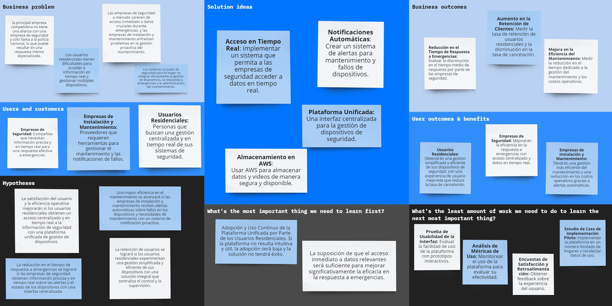

# Report Iot

Carrera: Ingeniería de Software

Nombre del curso: Desarrollo de Soluciones IOT

Sección: WV71

Nombre del profesor: Velasquez Nuñez, Angel Augusto

"Informe de TB1"

Nombre del startup: VerySafe

Nombre del producto: FalconShield

Relación de integrantes:

- Gabriela Soledad Nomberto Ramos
- Dennis Piero Quevedo Yucra
- Max Dayson Sabino Arostegui
- Elvia Guadalupe Arteaga Cruz
- Jamutaq Piero Ortega Vélez

Mes y año: Agosto 2024

Ciclo: 2024-2

## Registro de Versiones del Informe
| Version | Fecha| Autor | Descripción de la Modificación |
|-----------|-----------|-----------|-----------|
| 0.1 | 27/08/2023 | Arteaga, Elvia | Lean UX Proccess |
| 0.2 | 27/08/2023 | Nomberto, Gabriela | Antecedentes y Problemática |
| 0.3 | 29/08/2023 | Ortega, Jamutaq | Creacion del repositorio backend, Needfinding |
| 0.4 | 30/08/2023 | Sabino, Max | Estrategias y Tacticas frene a competidores, Diseño de entrevistas |
| 0.5 | 29/08/2023 | Quevedo, Dennis | Descripcion de la Startup, Needfinding |
| 0.6 | 31/08/2023 | Quevedo, Dennis | Segmentos Objetivos|
| 0.7 | 1/09/2023 | Ahuanari, Maria | Desarrollo de Bounded Context Physiotherapist Selection and Review Management |
| 0.8 | 4/09/2023 | Todos los participantes | Registro de entrevista y análisis de entrevista |
| 0.9 | 5/09/2023 | Nomberto, Gabriela | Ubiquitous Language |
| 0.10 | 5/09/2023 | Arteaga, Elvia | To-be Scenario Mapping |
| 0.11 | 7/09/2023 | Quevedo, Dennis | Impact Mapping |
| 0.11 | 7/09/2023 | Todos los participantes | EventStorming, User Stories, Tactical-Level Domain-Driven Design |

# Student Outcome
| Criterio específico | Acciones realizadas | Conclusiones |
|----------------------|----------------------|--------------|
| Trabaja en equipo para proporcionar liderazgo en forma conjunta | **TB1:**   **Max Dayson Sabino Arostegui:**   Colabore en todos los capitulos con los puntos: estrategia y tácticas frente a competidores, product backlog, diseños de entrevista, registro de entrevista y con el bounded context devices. Todo esto me ayudó a fomentar el trabajo en equipo   **Gabriela Nomberto Ramos**   Colabore en todos los capitulos tanto como la definicion y focalziacion del alcance de nuestro producto asi como las arquitecturas, modelos y mejoras continuas   **Elvia Arteaga Cruz**   Con el equipo trabajamos de manera colaborativa para organizarnos y repartir equitativamente las tareas que podían realizarse de manera individual, pero también para juntarnos en tareas grupales, como el event storming.   **Dennis Quevedo Yucra**   Colaboré en todos los capitulos tanto como la definicion de los segmentos objetivos asi como las user person, impact map, y arquitecturas   **Jamutaq Ortega Vélez**   Colaboré en todos capítulos y la comunicación y organización con el equipo se mantuvo constante y buena durante todo el desarrollo del entregable.  **TP1:**   **Max Dayson Sabino Arostegui:**   Colabore en la creación del diseño de la aplicación web, realize los wireframes y mockups, asimismo realize el sprint1 en la parte de creación para la sección eventos   **Elvia Arteaga Cruz**   Colaboré en la redacción de organization y navigation systems, así como en la recopilación de las herramientas utilizadas en el proyecto hasta esta entrega. En la parte de desarrollo, colaboré en la implementación del frontend de la página web y de la fake api con json server. |Concluimos que las reuniones y las mejoras continuas entre todos nos ayuda a mejorar el reporte de trabajo y poder colaborar todo de forma equitativa |
| Crea un entorno colaborativo e inclusivo, establece metas, planifica tareas y cumple objetivos. | **TB1:**   **Max Dayson Sabino Arostegui:**   Durante las reuniones en el aula planificamos las tareas y definimos las metas. En cada reunión revisamos el avance para recalcar los objetivos   **Gabriela Nomberto Ramos**   Tuvimos reuniones en el salón de clase el cual nos ayudo mucho a definir lo que cada uno debe de hacer, asimismo por medio de un grupo de WhatsApp pudimos absolver algunas dudas    **Elvia Arteaga Cruz**   El tiempo brindado por el profesor durante las horas de clase para organizar el proyecto fue de mucha utilidad para el desarrollo del mismo. Ese tiempo fue aprovechado para organizar las tareas individuales y realizar las tareas grupales. Además, contamos con medios digitales para la comunicación continua, tales como Whatsapp y Discord.    **Dennis Quevedo Yucra**   Durante las reuniones en el salón de clase el cual nos definimos y consultamos al profesor muchas dudas que teniamos y tambien se definió lo que cada uno debe de hacer, asimismo por medio de un grupo de WhatsApp pudimos absolver algunas dudas como tambien en discord   **Jamutaq Ortega Vélez**   Trabajamos de manera colaborativa en todo momento. Planificamos nuestros avances y tuvimos tiempo de hacer correcciones también.   **TP1:**   **Max Dayson Sabino Arostegui:**   Realize el sprint 1 en colaboración con los demás mientros del equipo, me conecte a las reuniones por discord y fomente el trabajo en equipo.   **Elvia Arteaga Cruz**   Tuvimos reunines mediante discord de manera frecuente para coordinar los puntos a avanzar. Esto nos ayudó a organizarnos en las tareas individuales y grupales. |Para este apartado, todos aportamos en la estructuracion y llenado del reporte, trabajando asi en grupo y entendiendonos entre todos|

# CAPÍTULO I: INTRODUCTION
## 1.1 Startup Profile
### 1.1.1 Descripción de la Startup
Verysafe está abordando una necesidad crítica de mejorar la seguridad de inmuebles en Lima, Perú. Con el aumento de los delitos relacionados con propiedades en los últimos años, tanto los propietarios como las empresas de seguridad están buscando formas más eficientes de proteger sus bienes. Muchas empresas de seguridad enfrentan dificultades para mejorar sus servicios, lo que deja a las propiedades vulnerables a robos y otros crímenes, causando importantes pérdidas materiales y exponiéndolas a riesgos continuos.

Para responder a esta creciente demanda, hemos fundado Verysafe, una empresa dedicada al desarrollo de dispositivos de seguridad innovadores que resuelvan estos problemas urgentes. Nuestra misión es brindar a los dueños de inmuebles y a las empresas de seguridad acceso rápido y confiable a la información sobre quién está ingresando a sus propiedades. Estamos aprovechando la tecnología avanzada, como sensores de movimiento y proximidad, para proporcionar datos en tiempo real que mejoran el monitoreo y la detección de amenazas.

Nuestra visión es convertirnos en líderes en tecnología de seguridad, resolviendo los desafíos más críticos de la seguridad de inmuebles en Perú, y eventualmente, expandir nuestras soluciones a nivel mundial.

### 1.1.2 Perfiles de integrantes del equipo
| Integrante | Imagen |
|----------------------|----------------------|
| **Elvia Guadalupe Arteaga Cruz:**  Código: u201616507  Soy una estudiante de la carrera de ingeniería de software. Ingresé a la universidad para estudiar ingeniería mecatrónica, pero el mundo de la programación siempre me gustó más, es por ello que decidí cambiarme de carrera. Me gusta mucho la tecnología y las grandes cosas que se pueden hacer con ella. Tengo la ilusión de crear productos y servicios que ayuden a facilitar la vida de las personas y que nos ayuden a crecer como sociedad.|  |
| **Max Dayson Sabino Arostegui:**  Código: u20201a991  Soy estudiante de Ingeniería de Software y me interesa especialmente el machine learning y la ciberseguridad. Tengo experiencia con la metodología ágil SCRUM y estoy familiarizado con varios frameworks y lenguajes de programación, como Angular, Vue, C++ y Python. Además, poseo habilidades blandas importantes como el trabajo en equipo, asertividad y cooperación.| |
| **Gabriela Soledad Nomberto Ramos:**  Código: u202113876  Soy estudiante de la carrera de Ingeniería de Software en el 9no ciclo. Tengo experiencia amplia en diversos lenguajes de programación, así como el uso de servidores cloud, soy muy organizada, responsable y sobre todo puntual. Además, soy bailarina de caporales en una agrupación externa a la universidad. Todo ello me enseñó a como trabajar en equipo, apoyar e investigar temas que me emocionan como lo es ciberseguridad y bases de datos, mis mejores habilidades es la comunicación en grupo y solucionar problemas bajo presión.| |
| **Dennis Piero Quevedo Yucra:**  Código: u201619823  Soy Dennis Piero Quevedo, estudiante de la carrera de Ingeniería de Software y estoy cursando el 9no ciclo. Tengo conocimientos en múltiples lenguajes de programación. Así mismo, me encuentro realizando mis prácticas pre-profesionales aplicando todos los conocimientos adquiridos a lo largo de la carrera. Me considero una persona responsable y sobre todo puntual. Por otro lado, soy ciclista aficionado, me gusta mucho aprender por cuenta propia y una de mis mejores habilidades es solucionar los problemas a la brevedad posible.| |
| **Jamutaq Piero Ortega Vélez:**  Código: u201911703  Soy estudiante de la carrera de Ingeniería de Software, tengo 22 años y me encuentro en el 7mo ciclo. Me considero una persona honrada, respetuosa y responsable, siempre me gusta aportar y ayudar a mi equipo de trabajo. Poseo una gran experiencia en el desarrollo de soluciones backend con tecnologías que como Spring Boot con Java, .NET Core con C# y Node.js con JS y TS. Además, también me apasiona el mundo del DevOps y tecnologías cloud. Me gusta mucho la música y la meditación, y en mis tiempos libres me dedico a caminar y a reflexionar sobre la vida.| |

## 1.2 Solution Profile

En este apartado daremos una explicación detallada del producto de software que presentaremos como factor innovador y la forma de monetización

Company Name

Decidimos nombrar nuestra empresa "VerySafe," una combinación de las palabras en inglés "Very" y "Safe." "Very" significa "muy," lo que refleja nuestro compromiso de ofrecer un producto que vaya más allá de las expectativas. "Safe" significa "seguro," y captura la esencia de nuestra misión de brindar dispositivos que garanticen la seguridad de los inmuebles. Así, nace VerySafe, una empresa dedicada a proporcionar soluciones de seguridad de alta calidad, comprometida a proteger lo que más valoras.

Product Name

Decidimos llamar a nuestro conjunto de productos "FalconShield." Este nombre combina dos palabras en ingléS, primero "Falcon," que hace referencia al halcón, un símbolo de agudeza y vigilancia, y "Shield," que significa escudo, representando protección. Así, "FalconShield" evoca la imagen de un guardián alerta y confiable, reflejando nuestro compromiso de ofrecer productos que aseguren la protección y seguridad de los inmmuebles de nuestros clientes. Optamos por este nombre en inglés para hacerlo más atractivo y comercializable en el mercado global, ya que el inglés es ampliamente reconocido y comprendido en todo el mundo.

Product Description

FalconShield es una innovadora línea de dispositivos de seguridad diseñados para proteger inmuebles de manera integral. Nuestra oferta incluye una variedad de soluciones avanzadas, como sistemas de sesores y alarmas inteligentes, que se adaptan a las necesidades específicas de cada cliente. Los usuarios podrán acceder a una interfaz sencilla y eficiente, donde podrán controlar y supervisar todos los dispositivos conectados. Además, FalconShield se integra con otros servicios y plataformas de seguridad, permitiendo un monitoreo continuo. Al utilizar nuestros productos, los clientes tendrán la tranquilidad de saber que su propiedad está protegida por una tecnología de vanguardia, respaldada por un equipo de expertos dedicados a brindar un servicio de excelencia. Obteniendo convenios con empresas para el seguimiento de seguridad y empresas de mantenimientos que se le pueda ofrecer a los productos que cada cliente solicite.

Monetización

VerySafe generará ingresos de forma en subscripciones y/o alquileres de nuestros productos

### 1.2.1  Antecedentes y problemática

Para la realizacion de este segmento utilizaremos la técnica de las 5W y 2H

Descripción de la Problemática

Nuestro software se enfoca en el sector inmobiliario, dado que hemos evidenciado un incremento en cuanto a robos, intrusiones y actos vandálicos y la protección del hogar es primordial, por ende la diversidad de soluciones que existen en el mercado llegan a ser costosas. Es por esto que "VerySafe" busca cubrir estas necesidades de seguridad y protección de una forma más accesibles a la mayuor cantidad de personas

**Herramienta 5W y 2H**

What - ¿Cuál es el problema?

El problema principal es el aumento de robos, intrusiones y actos vandálicos en inmuebles de Lima Metropolitana. La seguridad de los hogares y propiedades se ve comprometida, y las soluciones disponibles en el mercado suelen ser costosas, limitando su accesibilidad para la mayoría de la población.

When - ¿Cuándo sucede el problema?

Este problema es persistente y puede ocurrir en cualquier momento, pero es particularmente crítico durante las noches y en momentos en que los propietarios no están en sus hogares. Además, en épocas festivas o de alta movilidad, los incidentes tienden a aumentar.

Where - ¿Dónde surge el problema?

El problema surge principalmente en zonas urbanas de Lima Metropolitana, donde la densidad de población y la disparidad económica generan áreas con altos índices de delincuencia. Tanto en barrios residenciales como en zonas comerciales, la vulnerabilidad a estos actos es significativa.

Who - ¿Quienes son afectados por el problema?

Los principales afectados son los propietarios de viviendas que carecen de un sistema de seguridad de calidad.

Why - ¿Cuál es la causa del problema?

La causa del problema radica en la falta de seguridad adecuada en muchas propiedades, combinada con la creciente actividad delictiva en la región. Además, la accesibilidad limitada a sistemas de seguridad avanzados debido a su alto costo agrava la situación, dejando a muchas personas y negocios vulnerables.

How - ¿Cómo se llevan a cabo los hechos?

Los robos e intrusiones suelen llevarse a cabo mediante el forzamiento de cerraduras, rotura de ventanas o el acceso no autorizado a través de puntos vulnerables de las propiedades. Los delincuentes aprovechan la falta de sistemas de seguridad activos o la ausencia de los propietarios para cometer estos actos.

How Much - ¿Cuál es la magnitud del problema?

El delito de robo en viviendas ha experimentado un incremento significativo en el área urbana del Perú, especialmente en Lima Metropolitana. Según el Instituto Nacional de Estadística e Informática (INEI), en 2022, el 9.9 % de las viviendas fueron afectadas por este tipo de delito. Este porcentaje aumentó a 12.9 % en 2023, y para abril de 2024, ya se había alcanzado el 13.1 %. Estos datos evidencian una preocupante tendencia al alza en la frecuencia de robos a viviendas, lo que subraya la urgencia de implementar soluciones de seguridad más accesibles y efectivas para proteger a los hogares.

### 1.2.2 Lean UX Process
#### 1.2.2.1 Lean UX Problem Statements
El estado actual del dominio de la seguridad IoT para el hogar se ha centrado principalmente en los usuarios residenciales, las empresas de seguridad y las empresas de instalación y mantenimiento. Los puntos críticos incluyen la falta de un acceso centralizado a la información de los dispositivos, problemas de coordinación en emergencias y dificultades en la gestión del mantenimiento.

Lo que los productos/servicios existentes no logran abordar es la necesidad de integrar la gestión de dispositivos, la respuesta en tiempo real ante emergencias y la administración del mantenimiento en una plataforma unificada. Además, los competidores no ofrecen alianzas con empresas de seguridad, lo que resulta en respuestas menos especializadas.

Nuestro producto/servicio abordará esta brecha mediante el desarrollo de una plataforma IoT unificada que conecte dispositivos de seguridad, mejore la coordinación con empresas de seguridad aliadas y optimice la gestión del mantenimiento en tiempo real.

Nuestro enfoque inicial será los usuarios residenciales, ya que necesitan una experiencia de usuario simplificada que permita un control centralizado de sus dispositivos y una respuesta más rápida ante emergencias.

Sabremos que tenemos éxito cuando veamos un aumento en la satisfacción del cliente, una mayor utilización diaria de la plataforma, una reducción en el tiempo de respuesta de emergencias y una mejora en la coordinación con empresas de seguridad y mantenimiento.
#### 1.2.2.2 Lean UX Assumptions
1. User Assumptions
- Los usuarios residenciales prefieren una única plataforma centralizada para gestionar todos sus dispositivos de seguridad en lugar de utilizar múltiples aplicaciones.
- Los usuarios valoran la capacidad de recibir notificaciones en tiempo real sobre el estado de sus dispositivos y eventos de seguridad.
- Los usuarios se sienten más seguros al saber que existe una alianza con una empresa de seguridad para responder rápidamente a emergencias.
- Los usuarios tienen conocimientos básicos de tecnología IoT y son capaces de interactuar con interfaces sencillas.

2. Business Assumptions
- Las empresas de seguridad están interesadas en formar alianzas para integrar sus servicios con plataformas de seguridad IoT, ya que esto mejora su capacidad de respuesta.
- Las empresas de instalación y mantenimiento ven un valor en poder gestionar el estado de los dispositivos y coordinar las tareas de mantenimiento a través de una única plataforma.
- La implementación de una solución de seguridad IoT que optimice la gestión de dispositivos y emergencias atraerá tanto a nuevos clientes residenciales como a empresas de seguridad y mantenimiento.

3. User Outcomes Assumptions
- Los usuarios residenciales utilizarán la plataforma de forma recurrente para monitorear su hogar y gestionar sus dispositivos de seguridad.
- Los usuarios se sentirán más satisfechos y seguros al poder recibir asistencia inmediata en caso de emergencia, reduciendo la ansiedad relacionada con la seguridad del hogar.
- Los usuarios adoptarán la plataforma y recomendarán el servicio a otros propietarios de viviendas una vez que experimenten su efectividad.

4. Business Outcomes Assumptions
- Las empresas de seguridad mejorarán sus tiempos de respuesta en emergencias gracias a la integración en tiempo real con la plataforma.
- La plataforma permitirá a las empresas de instalación y mantenimiento reducir los costos operativos al automatizar el monitoreo y la notificación de fallos o necesidades de mantenimiento.
- El éxito de la plataforma en el segmento residencial facilitará la expansión hacia otros mercados, como empresas comerciales y oficinas.

5. Features Assumptions
- Una interfaz intuitiva y centralizada para el control de todos los dispositivos IoT será clave para que los usuarios residenciales adopten la plataforma.
- La integración en tiempo real con empresas de seguridad, permitiendo la comunicación inmediata y el envío de datos críticos durante una emergencia, será una característica fundamental para diferenciarse de la competencia.
- La plataforma necesitará incluir funcionalidades de mantenimiento automatizado, como notificaciones de fallos en los dispositivos, para atraer a las empresas de instalación y mantenimiento.

#### 1.2.2.3 Lean UX Hypothesis Statements
- Creemos que lograremos una mejora significativa en la satisfacción y retención de los usuarios para nuestra plataforma IoT de seguridad. Si los usuarios residenciales tienen acceso a una plataforma centralizada que integra monitoreo en tiempo real, coordinación de respuesta a emergencias y gestión del mantenimiento, alcanzarán una experiencia de usuario fluida y una mayor sensación de seguridad, con notificaciones oportunas, gestión simplificada de dispositivos y respuestas eficaces a emergencias. Con una interfaz unificada que conecta todos los dispositivos de seguridad, alertas en tiempo real y la integración con empresas de seguridad para una respuesta rápida ante emergencias.

- Creemos que lograremos un mayor nivel de eficiencia operativa para las empresas de seguridad. Si estas empresas pueden acceder a datos y alertas en tiempo real desde la plataforma IoT integrada, alcanzarán tiempos de respuesta más rápidos ante emergencias y una mejor coordinación con los usuarios residenciales. Con la integración de datos en tiempo real y alertas que facilitan la toma de decisiones informadas durante los incidentes.

- Creemos que lograremos una reducción de los costos operativos para las empresas de instalación y mantenimiento. Si estas empresas pueden utilizar una sola plataforma para gestionar el estado de los dispositivos y las tareas de mantenimiento, alcanzarán una programación de mantenimiento más eficiente y menos fallos inesperados. Con notificaciones automatizadas sobre problemas en los dispositivos y un panel centralizado para el seguimiento de las actividades de mantenimiento.

- Creemos que lograremos una mayor adopción de nuestra plataforma IoT de seguridad entre los usuarios residenciales. Si ofrecemos una solución que simplifica la gestión de dispositivos y mejora las capacidades de respuesta ante emergencias, alcanzarán una mayor tasa de compromiso con el uso de la plataforma y recomendaciones positivas a otros usuarios. Con una interfaz fácil de usar que integra todas las funciones de seguridad y proporciona una coordinación efectiva en emergencias.

- Creemos que lograremos una integración más eficiente entre las empresas de seguridad y la plataforma IoT. Si las empresas de seguridad pueden recibir información detallada y en tiempo real sobre las alertas y el estado de los dispositivos, alcanzarán una coordinación más fluida y respuestas más especializadas durante las emergencias. Con una plataforma que facilita el acceso a datos críticos y la comunicación inmediata con los usuarios residenciales.

- Creemos que lograremos una mejora en la gestión del mantenimiento para los dispositivos de seguridad. Si los usuarios y las empresas de mantenimiento tienen acceso a herramientas que permiten un seguimiento proactivo del estado de los dispositivos, alcanzarán una reducción en los tiempos de inactividad y un aumento en la durabilidad de los dispositivos. Con funcionalidades de monitoreo continuo y alertas automáticas sobre necesidades de mantenimiento o fallos.

- Creemos que lograremos una mayor confianza en la plataforma por parte de los usuarios. Si implementamos medidas de seguridad robustas y proporcionamos soporte técnico eficiente, alcanzarán una mayor confianza en la protección de sus datos y en la efectividad del sistema de seguridad. Con protocolos de seguridad avanzados y un soporte técnico accesible y confiable.

#### 1.2.2.4 Lean UX Canvas
En el desarrollo de soluciones innovadoras para el mercado de seguridad IoT para el hogar, es crucial entender y validar los problemas y necesidades tanto desde la perspectiva del negocio como de los usuarios finales. El Lean UX Canvas es una herramienta esencial que nos permite estructurar y visualizar los elementos clave de nuestro proyecto, facilitando la identificación de problemas, la definición de resultados esperados y la planificación de experimentos para validar nuestras suposiciones.

Este canvas se centra en resolver el problema principal relacionado con la falta de integración eficaz en los sistemas de seguridad actuales. A través de un enfoque iterativo y basado en evidencia, nuestro objetivo es desarrollar una solución que mejore la experiencia de gestión de seguridad para los usuarios residenciales, optimice la respuesta a emergencias para las empresas de seguridad, y facilite el mantenimiento para los proveedores de instalación y mantenimiento.

El Lean UX Canvas que a continuación se presenta detalla los problemas de negocio, los resultados esperados, los tipos de usuarios a enfocar, los beneficios para los usuarios, las soluciones propuestas, las hipótesis a validar, los riesgos críticos y los experimentos necesarios para aprender rápidamente y ajustar nuestra estrategia en función de los hallazgos. Esta estructura nos guiará en la creación de una solución eficaz y centrada en el usuario, maximizando nuestras oportunidades de éxito en el mercado.

## 1.3 Segmentos objetivo
Según el Instituto Nacional de Estadística e Informática (INEI), cerca del 12% de las viviendas en áreas urbanas de Perú sufrieron robos o intentos de robo en años recientes. Sin embargo, solo el 17.9% de las víctimas denuncian estos delitos, lo que sugiere que el problema es más amplio de lo que reflejan las cifras oficiales​. Los métodos de los delincuentes son cada vez más variados. Entre las tácticas más comunes están el engaño a empleados domésticos, la simulación de ser trabajadores de empresas de servicios públicos, y los robos durante días feriados, cuando las casas suelen estar desocupadas​.

Por otro lado, los inmuebles a nivel de Lima Metropolitana y la Provincia Constitucional del Callao tambien fueron afectadas por robo o
intento de robo en el año 2021. A nivel de ámbitos geográficos, el porcentaje de viviendas afectadas por robo o intento
de robo fue mayor en la Provincia Constitucional del Callao (7,9%), que en Lima Metropolitana (7,2%).

Por lo mencionado anteriormente es que hemos establecido 2 segmentos objetivos:

### Segmento objetivo 1: Dueños de Inmuebles
Nuestro primer segmento objetivo son los propietarios de uno o varios inmuebles, tanto construidos como en proceso de construcción. Este grupo incluye personas que, al no contar con sistemas de seguridad adecuados, deben visitar o supervisar periódicamente sus propiedades para asegurarse de que no hayan sido vulneradas o víctimas de robos.

### Segmento objetivo 2: Empresas de Seguridad
Nuestro segundo segmento objetivo son las empresas de seguridad que buscan mejorar y fortalecer sus servicios de videovigilancia mediante el uso de un software robusto y completo, diseñado para satisfacer plenamente las necesidades de sus clientes y optimizar la gestión de seguridad.

