# CAPÍTULO I: INTRODUCTION
## 1.1 Startup Profile
### 1.1.1 Descripción de la Startup
Verysafe está abordando una necesidad crítica de mejorar la seguridad de inmuebles en Lima, Perú. Con el aumento de los delitos relacionados con propiedades en los últimos años, tanto los propietarios como las empresas de seguridad están buscando formas más eficientes de proteger sus bienes. Muchas empresas de seguridad enfrentan dificultades para mejorar sus servicios, lo que deja a las propiedades vulnerables a robos y otros crímenes, causando importantes pérdidas materiales y exponiéndolas a riesgos continuos.

Para responder a esta creciente demanda, hemos fundado Verysafe, una empresa dedicada al desarrollo de dispositivos de seguridad innovadores que resuelvan estos problemas urgentes. Nuestra misión es brindar a los dueños de inmuebles y a las empresas de seguridad acceso rápido y confiable a la información sobre quién está ingresando a sus propiedades. Estamos aprovechando la tecnología avanzada, como sensores de movimiento y proximidad, para proporcionar datos en tiempo real que mejoran el monitoreo y la detección de amenazas.

Nuestra visión es convertirnos en líderes en tecnología de seguridad, resolviendo los desafíos más críticos de la seguridad de inmuebles en Perú, y eventualmente, expandir nuestras soluciones a nivel mundial.

### 1.1.2 Perfiles de integrantes del equipo
- **Elvia Guadalupe Arteaga Cruz:** Soy una estudiante de la carrera de ingeniería de software. Ingresé a la universidad para estudiar ingeniería mecatrónica, pero el mundo de la programación siempre me gustó más, es por ello que decidí cambiarme de carrera. Me gusta mucho la tecnología y las grandes cosas que se pueden hacer con ella. Tengo la ilusión de crear productos y servicios que ayuden a facilitar la vida de las personas y que nos ayuden a crecer como sociedad.
  
- **Max Dayson Sabino Arostegui:** Soy estudiante de Ingeniería de Software y me interesa especialmente el machine learning y la ciberseguridad. Tengo experiencia con la metodología ágil SCRUM y estoy familiarizado con varios frameworks y lenguajes de programación, como Angular, Vue, C++ y Python. Además, poseo habilidades blandas importantes como el trabajo en equipo, asertividad y cooperación.

- **Gabriela Soledad Nomberto Ramos:** Soy estudiante de la carrera de Ingeniería de Software en el 9no ciclo. Tengo experiencia amplia en diversos lenguajes de programación, así como el uso de servidores cloud, soy muy organizada, responsable y sobre todo puntual. Además, soy bailarina de caporales en una agrupación externa a la universidad. Todo ello me enseñó a como trabajar en equipo, apoyar e investigar temas que me emocionan como lo es ciberseguridad y bases de datos, mis mejores habilidades es la comunicación en grupo y solucionar problemas bajo presión.

- **Dennis Piero Quevedo Yucra:** Soy Dennis Piero Quevedo, estudiante de la carrera de Ingeniería de Software y estoy cursando el 9no ciclo. Tengo conocimientos en múltiples lenguajes de programación. Así mismo, me encuentro realizando mis prácticas pre-profesionales aplicando todos los conocimientos adquiridos a lo largo de la carrera. Me considero una persona responsable y sobre todo puntual. Por otro lado, soy ciclista aficionado, me gusta mucho aprender por cuenta propia y una de mis mejores habilidades es solucionar los problemas a la brevedad posible.

- **Jamutaq Piero Ortega Vélez:** Soy estudiante de la carrera de Ingeniería de Software, tengo 22 años y me encuentro en el 7mo ciclo. Me considero una persona honrada, respetuosa y responsable, siempre me gusta aportar y ayudar a mi equipo de trabajo. Poseo una gran experiencia en el desarrollo de soluciones backend con tecnologías que como Spring Boot con Java, .NET Core con C# y Node.js con JS y TS. Además, también me apasiona el mundo del DevOps y tecnologías cloud. Me gusta mucho la música y la meditación, y en mis tiempos libres me dedico a caminar y a reflexionar sobre la vida.

## 1.2 Solution Profile

En este apartado daremos una explicación detallada del producto de software que presentaremos como factor innovador y la forma de monetización

**Company Name**

Decidimos nombrar nuestra empresa "VerySafe," una combinación de las palabras en inglés "Very" y "Safe." "Very" significa "muy," lo que refleja nuestro compromiso de ofrecer un producto que vaya más allá de las expectativas. "Safe" significa "seguro," y captura la esencia de nuestra misión de brindar dispositivos que garanticen la seguridad de los inmuebles. Así, nace VerySafe, una empresa dedicada a proporcionar soluciones de seguridad de alta calidad, comprometida a proteger lo que más valoras.

**Product Name**

Decidimos llamar a nuestro conjunto de productos "FalconShield." Este nombre combina dos palabras en ingléS, primero "Falcon," que hace referencia al halcón, un símbolo de agudeza y vigilancia, y "Shield," que significa escudo, representando protección. Así, "FalconShield" evoca la imagen de un guardián alerta y confiable, reflejando nuestro compromiso de ofrecer productos que aseguren la protección y seguridad de los inmmuebles de nuestros clientes. Optamos por este nombre en inglés para hacerlo más atractivo y comercializable en el mercado global, ya que el inglés es ampliamente reconocido y comprendido en todo el mundo.

**Product Description**

FalconShield es una innovadora línea de dispositivos de seguridad diseñados para proteger inmuebles de manera integral. Nuestra oferta incluye una variedad de soluciones avanzadas, como sistemas de sesores y alarmas inteligentes, que se adaptan a las necesidades específicas de cada cliente. Los usuarios podrán acceder a una interfaz sencilla y eficiente, donde podrán controlar y supervisar todos los dispositivos conectados. Además, FalconShield se integra con otros servicios y plataformas de seguridad, permitiendo un monitoreo continuo. Al utilizar nuestros productos, los clientes tendrán la tranquilidad de saber que su propiedad está protegida por una tecnología de vanguardia, respaldada por un equipo de expertos dedicados a brindar un servicio de excelencia. Obteniendo convenios con empresas para el seguimiento de seguridad y empresas de mantenimientos que se le pueda ofrecer a los productos que cada cliente solicite.

**Monetización**

VerySafe generará ingresos de forma en subscripciones y/o alquileres de nuestros productos

### 1.2.1  Antecedentes y problemática

Para la realizacion de este segmento utilizaremos la técnica de las 5W y 2H

**Descripción de la Problemática**

Nuestro software se enfoca en el sector inmobiliario, dado que hemos evidenciado un incremento en cuanto a robos, intrusiones y actos vandálicos y la protección del hogar es primordial, por ende la diversidad de soluciones que existen en el mercado llegan a ser costosas. Es por esto que "VerySafe" busca cubrir estas necesidades de seguridad y protección de una forma más accesibles a la mayuor cantidad de personas

**Herramienta 5W y 2H**
- **What - ¿Cuál es el problema?**
  
  El problema principal es el aumento de robos, intrusiones y actos vandálicos en inmuebles de Lima Metropolitana. La seguridad de los hogares y propiedades se ve comprometida, y las soluciones disponibles en el mercado suelen ser costosas, limitando su accesibilidad para la mayoría de la población.

- **When - ¿Cuándo sucede el problema?**

  Este problema es persistente y puede ocurrir en cualquier momento, pero es particularmente crítico durante las noches y en momentos en que los propietarios no están en sus hogares. Además, en épocas festivas o de alta movilidad, los incidentes tienden a aumentar.

- **Where - ¿Dónde surge el problema?**

  El problema surge principalmente en zonas urbanas de Lima Metropolitana, donde la densidad de población y la disparidad económica generan áreas con altos índices de delincuencia. Tanto en barrios residenciales como en zonas comerciales, la vulnerabilidad a estos actos es significativa.

- **Who - ¿Quienes son afectados por el problema?**

  Los principales afectados son los propietarios de viviendas que carecen de un sistema de seguridad de calidad.

- **Why - ¿Cuál es la causa del problema?**

  La causa del problema radica en la falta de seguridad adecuada en muchas propiedades, combinada con la creciente actividad delictiva en la región. Además, la accesibilidad limitada a sistemas de seguridad avanzados debido a su alto costo agrava la situación, dejando a muchas personas y negocios vulnerables.

- **How - ¿Cómo se llevan a cabo los hechos?**

  Los robos e intrusiones suelen llevarse a cabo mediante el forzamiento de cerraduras, rotura de ventanas o el acceso no autorizado a través de puntos vulnerables de las propiedades. Los delincuentes aprovechan la falta de sistemas de seguridad activos o la ausencia de los propietarios para cometer estos actos.

- **How Much - ¿Cuál es la magnitud del problema?**

  El delito de robo en viviendas ha experimentado un incremento significativo en el área urbana del Perú, especialmente en Lima Metropolitana. Según el Instituto Nacional de Estadística e Informática (INEI), en 2022, el 9.9 % de las viviendas fueron afectadas por este tipo de delito. Este porcentaje aumentó a 12.9 % en 2023, y para abril de 2024, ya se había alcanzado el 13.1 %. Estos datos evidencian una preocupante tendencia al alza en la frecuencia de robos a viviendas, lo que subraya la urgencia de implementar soluciones de seguridad más accesibles y efectivas para proteger a los hogares.

### 1.2.2 Lean UX Process
#### 1.2.2.1 Lean UX Problem Statements
**Domain:** Seguridad IoT para el hogar

**Customer Segments:**

1. **Usuarios Residenciales:** Personas que buscan proteger sus viviendas mediante sistemas de seguridad.
2. **Empresas de Seguridad:** Compañías encargadas de responder a emergencias activadas por alarmas de seguridad.
3. **Empresas de Instalación y Mantenimiento:** Proveedores que instalan, mantienen y gestionan dispositivos de seguridad en viviendas.

**Pain Points:**

**1. Usuarios Residenciales:**

- **Acceso Limitado a Información:** Dificultad para obtener datos en tiempo real sobre el estado de los dispositivos y acceder a imágenes en vivo o grabaciones pasadas.
- **Falta de Control Centralizado:** Necesidad de gestionar múltiples dispositivos y aplicaciones, lo que resulta en una experiencia de usuario fragmentada.
- **Respuesta Lenta en Emergencias:** La integración con las empresas de seguridad puede ser lenta, afectando la rapidez en la gestión de incidentes.

**2. Empresas de Seguridad:**

- **Falta de Información en Tiempo Real:** Limitaciones para acceder a datos cruciales durante emergencias, afectando la toma de decisiones.
- **Coordinación Ineficiente:** Dificultades para coordinarse con los usuarios en la gestión de alertas y respuesta a incidentes.

**3. Empresas de Instalación y Mantenimiento:**

- **Gestión del Mantenimiento:** Dificultad para rastrear el estado de los dispositivos y coordinar las tareas de mantenimiento preventivo y correctivo.
- **Notificación de Fallos:** Falta de un sistema efectivo para recibir alertas sobre fallos en los dispositivos o necesidades de instalación.

**Gap:**

Actualmente, los sistemas de seguridad disponibles no integran eficazmente la gestión de dispositivos, la respuesta a emergencias y la administración del mantenimiento en una plataforma unificada. Además, la principal empresa competidora no tiene una alianza con una empresa de seguridad y solo llama a la policía nacional en caso de alertas, lo que puede resultar en una respuesta menos especializada y menos eficiente en comparación con un equipo de seguridad propio o aliado. Esto representa una oportunidad para ofrecer una solución más completa y eficiente.

**Visión/Estrategia:**

Desarrollar una solución de seguridad IoT innovadora que integre dispositivos de seguridad con una interfaz unificada y fácil de usar, mejorando la gestión en tiempo real, la coordinación en emergencias y la eficiencia en el mantenimiento. La estrategia incluye formar alianzas con empresas de seguridad para proporcionar una respuesta más eficaz y especializada, y ofrecer una plataforma que permita a los usuarios residenciales, empresas de seguridad y empresas de mantenimiento operar de manera más eficiente.

**Initial Segment:**

El segmento inicial será ***Usuarios Residenciales***, ya que estos son los clientes finales que utilizarán el sistema de seguridad de manera directa. Su experiencia y satisfacción con la plataforma serán fundamentales para establecer la aceptación y adopción del producto. La solución debe abordar sus necesidades de acceso a información en tiempo real, gestión centralizada de dispositivos y respuesta rápida a incidentes, destacando la ventaja competitiva de contar con una alianza con empresas de seguridad.

#### 1.2.2.2 Lean UX Assumptions
**Suposiciones sobre los Usuarios y sus Necesidades:**

- Los usuarios residenciales valoran un sistema de seguridad intuitivo que les permita monitorear y controlar dispositivos desde cualquier lugar.
- Las empresas de seguridad necesitan acceso instantáneo a datos relevantes para responder eficazmente a emergencias.
- Las empresas de mantenimiento requieren notificaciones automáticas sobre fallos y necesidades de mantenimiento para gestionar el mantenimiento de forma proactiva.

**Suposiciones sobre el Comportamiento de los Dispositivos:**

- Los dispositivos de seguridad funcionarán de manera confiable con conectividad Wi-Fi.
- Las actualizaciones de firmware podrán realizarse de forma automática y remota sin interrumpir el servicio.
- Las baterías de respaldo serán adecuadas para mantener el funcionamiento durante cortes de energía.

**Suposiciones sobre la Tecnología Utilizada:**

- Wi-Fi proporcionará una conectividad adecuada y estable entre los dispositivos y las aplicaciones.
- AWS ofrecerá una solución segura y escalable para el almacenamiento en la nube.
- La arquitectura basada en microservicios permitirá escalar el sistema de manera eficiente.

**Suposiciones sobre la Experiencia del Usuario:**

- Los usuarios prefieren una interfaz simple y directa para la gestión de dispositivos.
- Las notificaciones push y alertas automáticas serán eficaces para mantener a los usuarios informados sobre eventos importantes.
- La integración de funcionalidades en una única aplicación mejorará la experiencia del usuario.

#### 1.2.2.3 Lean UX Hypothesis Statements

1. **Facilidad de Uso:**
- ***Hipótesis:*** Creemos que si la interfaz de usuario es intuitiva y fácil de usar, entonces los usuarios residenciales estarán más satisfechos y serán más propensos a adoptar y utilizar el sistema de manera continua.
- **Validación:** Sabremos que estamos en lo correcto cuando veamos la siguiente retroalimentación del mercado:
  - *Retroalimentación Cualitativa:* Comentarios positivos de los usuarios sobre la facilidad de navegación y la gestión de dispositivos durante las pruebas de usabilidad.
  - *Retroalimentación Cuantitativa:* Altas tasas de adopción de usuarios y bajas tasas de deserción en las métricas de participación de usuarios.
  - *Cambio en el Indicador Clave de Rendimiento:* Mejora en los puntajes de satisfacción del usuario y una disminución en las solicitudes de soporte relacionadas con problemas de usabilidad.

2. **Acceso a Datos en Tiempo Real:**

- ***Hipótesis:*** Creemos que si las empresas de seguridad tienen acceso inmediato a datos relevantes como imágenes de cámaras y alertas, entonces su eficacia para responder a emergencias mejorará significativamente.
- ***Validación:*** Sabremos que estamos en lo correcto cuando veamos la siguiente retroalimentación del mercado:
  - *Retroalimentación Cualitativa:* Comentarios positivos de las empresas de seguridad sobre la mejora en la toma de decisiones y en los tiempos de respuesta.
  - *Retroalimentación Cuantitativa:* Reducción en los tiempos de respuesta a incidentes en comparación con sistemas que no tienen acceso a datos en tiempo real.
  -  *Cambio en el Indicador Clave de Rendimiento:* Mejora en los métricas de eficacia en la respuesta a emergencias y tiempos de resolución más rápidos.

3. **Notificaciones y Alertas Automáticas:**

- ***Hipótesis:*** Creemos que si las empresas de instalación y mantenimiento reciben notificaciones automáticas sobre fallos en los dispositivos y necesidades de mantenimiento, entonces podrán gestionar el mantenimiento de manera más proactiva y eficiente.
- ***Validación:*** Sabremos que estamos en lo correcto cuando veamos la siguiente retroalimentación del mercado:
  - *Retroalimentación Cualitativa:* Comentarios positivos de las empresas de mantenimiento sobre la eficiencia y la puntualidad en la programación del mantenimiento y la resolución de problemas.
  - *Retroalimentación Cuantitativa:* Disminución en los tiempos de respuesta a problemas de mantenimiento y mayor tasa de acciones proactivas de mantenimiento.
  - *Cambio en el Indicador Clave de Rendimiento:* Aumento en la efectividad de las operaciones de mantenimiento y reducción en el tiempo de inactividad de los dispositivos.

4. **Wi-Fi como Tecnología:**

- ***Hipótesis:*** Creemos que si el sistema utiliza Wi-Fi como tecnología de comunicación, entonces la confiabilidad del sistema dependerá de la calidad y estabilidad de la red Wi-Fi, lo que afectará la experiencia del usuario.
- ***Validación:*** Sabremos que estamos en lo correcto cuando veamos la siguiente retroalimentación del mercado:
  - *Retroalimentación Cualitativa:* Comentarios de los usuarios sobre problemas de conectividad o satisfacción con el rendimiento del sistema basado en la calidad del Wi-Fi.
  - *Retroalimentación Cuantitativa:* Frecuencia de problemas de conectividad reportados por los usuarios.
  - *Cambio en el Indicador Clave de Rendimiento:* Mejora en las métricas de confiabilidad del sistema y en los puntajes de satisfacción del usuario relacionados con la conectividad.

5. **Almacenamiento en AWS:**

- ***Hipótesis:*** Creemos que usar AWS para el almacenamiento en la nube de datos de video garantizará una alta seguridad y disponibilidad de los datos debido a las características avanzadas de seguridad e infraestructura confiable de AWS.
- ***Validación:*** Sabremos que estamos en lo correcto cuando veamos la siguiente retroalimentación del mercado:
  - *Retroalimentación Cualitativa:* Comentarios positivos sobre la seguridad y disponibilidad de los datos por parte de los usuarios.
  - *Retroalimentación Cuantitativa:* Baja incidencia de pérdida de datos o problemas de acceso reportados.
  - *Cambio en el Indicador Clave de Rendimiento:* Altas tasas de disponibilidad y sólidos resultados en auditorías de seguridad.

#### 1.2.2.4 Lean UX Canvas

## 1.3 Segmentos objetivo
Según el Instituto Nacional de Estadística e Informática (INEI), cerca del 12% de las viviendas en áreas urbanas de Perú sufrieron robos o intentos de robo en años recientes. Sin embargo, solo el 17.9% de las víctimas denuncian estos delitos, lo que sugiere que el problema es más amplio de lo que reflejan las cifras oficiales​. Los métodos de los delincuentes son cada vez más variados. Entre las tácticas más comunes están el engaño a empleados domésticos, la simulación de ser trabajadores de empresas de servicios públicos, y los robos durante días feriados, cuando las casas suelen estar desocupadas​.
Tenemos 2 segmentos objetivos:

### Segmento objetivo 1: Dueños de Inmuebles
Los dueños que poseen uno o varios inmuebles

### Segmento objetivo 2: Empresas de Seguridad
Empresas de seguridad que quieren mejorar/reforzar sus servicios

# CAPÍTULO II: REQUERIMENTS ELICITATION & ANALYSIS
## 2.1 Competidores
### 2.1.1. Análisis competitivo

Para el análisis competitivo, observamos a tres empresas que se encuentran en el mercado que ofrecen una similitud y estos son los siguientes: 

| Competitive Analysis Landscape |
| -- |
| ¿Por qué llevar a cabo este análisis? |
| ¿Cómo se posiciona VerySafe en comparación con sus principales competidores por los clientes en el mercado de seguridad de inmuebles en Lima Metropolitana? |

**Perfil del Startup**

| Startup | VerySafe | Verisure | Prosegur | Securitas |
| -- | -- | -- | -- | -- |
| Logo |  |  |  |  |
| **Overview** | Ofrece soluciones de seguridad accesibles y personalizadas para inmuebles. Se enfoca en integrar tecnología avanzada con un enfoque en la accesibilidad, buscando proteger hogares y pequeñas empresas con productos innovadores y servicios flexibles que se adaptan a las necesidades de sus clientes. | Ofrece sistemas de alarmas conectadas y monitoreo remoto 24/7. Con una fuerte presencia en el mercado peruano, Verisure ofrece soluciones de alta tecnología que combinan la seguridad física y digital, destacándose por su fiabilidad y servicio al cliente. | Ofrece una amplia gama de servicios que incluyen desde alarmas y videovigilancia hasta servicios de seguridad física y logística de valores, adaptándose tanto a clientes residenciales como corporativos con soluciones integradas. | Ofrece soluciones personalizadas que combinan seguridad física y digital, dirigidas principalmente a grandes empresas e instituciones. Su enfoque está en la integración de tecnologías innovadoras y la adaptación a las necesidades específicas de cada cliente. | 
|**Ventaja competitiva ¿Qué valor ofrece a los clientes?** | Ofrecer soluciones tecnológicas avanzadas IoT a precios accesibles, con un enfoque en personalización y accesibilidad para un público amplio. | Alta tecnología en sistemas de monitoreo remoto y servicio al cliente eficiente. | Amplia gama de servicios de seguridad integrados con una fuerte presencia en el mercado local e internacional | Tecnología avanzada y un enfoque en la integración de soluciones de seguridad física y digital. | 

**Perfil de Marketing**

| Startup | VerySafe | Verisure | Prosegur | Securitas |
| -- | -- | -- | -- | -- |
| **Mercado Objetivo** | Propietarios de Inmuebles que se encuentren en Lima Metropolitana | Hogares y pequeñas empresas que buscan sistemas de alarma conectados de alta gama. | Grandes empresas, instituciones y hogares de clase media-alta. | Grandes empresas, instituciones gubernamentales y hogares de clase media-alta. |
| **Estrategias de Marketing** | Campañas digitales enfocadas en el costo-beneficio y accesibilidad de los productos. Publicidad en medios locales. | Marketing enfocado en la tecnología avanzada y la confiabilidad. Campañas en redes sociales y medios de comunicación masiva. | Marketing tradicional y digital enfocado en la solidez de la marca y la experiencia. | Estrategias de marketing centradas en la seguridad integral y la tecnología de punta. |

**Perfil de Producto**

| Startup | VerySafe | Verisure | Prosegur | Securitas |
| -- | -- | -- | -- | -- |
| **Productos & Servicios** | Sistemas de sensores, cámaras y alarmas inteligentes, integrados con una plataforma digital para monitoreo y control remoto 24/7. | Alarmas conectadas, sensores de movimiento, y monitoreo remoto 24/7. | Alarmas, cámaras de vigilancia, control de accesos, monitoreo, y guardias de seguridad | Sistemas de seguridad integrados, alarmas, cámaras, monitoreo, y servicios de guardias.|
| **Precios & Costos** | Modelo de precios accesible, con opciones de suscripción o alquiler. | Precios medios-altos, con modelos de suscripción. | Variedad de precios según los servicios, generalmente en un rango medio-alto. Y dependiendo del kit elegido. | Variedad de precios, con un enfoque en soluciones a medida para clientes corporativos. |
| **Canales de distribución (Web y/o Móvil)** | Venta y distribución a través de web y aplicación móvil, con opciones de instalación y soporte técnico. | Distribución a través de web, móvil, y red de instaladores locales. | Distribución a través de web, puntos de venta físicos y contacto directo con clientes. | Distribución a través de web, móvil, y ventas directas a través de representantes.|

**Analisis SWOT**

| Startup | VerySafe | Verisure | Prosegur | Securitas |
| -- | -- | -- | -- | -- |
| **Fortalezas** | Accesibilidad en precios, personalización de productos, enfoque local. | Tecnología avanzada, reputación global, servicio al cliente robusto. | Amplia gama de servicios, presencia fuerte en el mercado, reconocimiento de marca. | Integración de servicios, tecnología avanzada, capacidad de adaptación |
| **Debilidades** | Menor reconocimiento de la empresa y marca | Precio elevado, menos accesible para clientes de clase media-baja. | Alto costo de los servicios, enfoque más en clientes corporativos que en residenciales. | Alto costo, enfoque más en grandes empresas e instituciones. | 
| **Oportunidades** | Expandirse a nuevos segmentos de mercado, como pequeñas empresas y hogares de clase media. | Creciente demanda de seguridad avanzada en hogares y empresas. | Crecimiento del mercado de seguridad en hogares y negocios. | Expansión en servicios digitales y mercados emergentes. | 
| **Amenazas** | Competencia fuerte de marcas establecidas | Competencia en precios de empresas locales y nuevas tecnologías. | Innovaciones tecnológicas y nuevos competidores más ágiles. | Innovación tecnológica de startups más ágiles y económicas. | 

### 2.1.2. Estrategias y tácticas frente a competidores

### Estrategias y Tácticas para VerySafe
#### Estrategia 1: Diferenciación por Precio y Personalización

### Tácticas:

**Paquetes personalizables**: Planes de seguridad donde los clientes puedan seleccionar productos específicos (sensores, cámaras, alarmas) según sus necesidades. Esto permitirá que hogares pequeños y medianos ajusten los servicios a su presupuesto.
  
#### Estrategia 2: Innovación Tecnológica con Enfoque en IoT

### Tácticas:
**Ecosistema de seguridad IoT**: Dispositivos adicionales como cerraduras inteligentes, sensores de humo y detectores de monóxido de carbono, integrados en la plataforma de monitoreo. 

**Actualizaciones automáticas y soporte**: Garantizar que todos los dispositivos tengan actualizaciones automáticas de software sin costos adicionales, mejorando las capacidades de seguridad continuamente sin interrupciones para el cliente.

### Estrategia 3: Marketing Enfocado en la Seguridad Asequible y de Calidad

### Tácticas:
**Campañas en redes sociales y medios locales**: Enfocar las campañas de marketing digital en mostrar historias de éxito de clientes reales que usan los productos de VerySafe en Lima Metropolitana. Usar plataformas como Facebook, Instagram y TikTok para resaltar testimonios de clientes satisfechos, con énfasis en la relación costo-beneficio.
  
**Colaboraciones locales**: Establecer alianzas con agentes inmobiliarios, desarrolladores de proyectos habitacionales y administradores de condominios para incluir a VerySafe como parte de las recomendaciones de seguridad en nuevas construcciones.

### Estrategia 4: Integración con Instituciones de Seguridad Pública y Privada

### Tácticas:
**Asociaciones con bomberos, policía y seguridad privada**: Crear convenios para que los dispositivos de VerySafe se conecten directamente con estas instituciones en caso de emergencias. Esto permitirá que los usuarios puedan recibir respuestas rápidas en situaciones críticas, diferenciándose de competidores que solo ofrecen notificaciones internas o a empresas de monitoreo.

**Control remoto desde dispositivos móviles**: Mejorar la app móvil para permitir una interacción más fluida con los sistemas de seguridad. Los usuarios podrán armar y desarmar sus sistemas, ver imágenes de cámaras en tiempo real y recibir alertas de emergencia desde cualquier lugar.

### Estrategia 5: Ampliación del Mercado Objetivo

### Tácticas:
**Paquetes para pequeños comercios**: Crear ofertas específicas para pequeños negocios como tiendas, minimarkets y oficinas que necesitan soluciones de seguridad asequibles pero efectivas. 

## 2.2 Entrevistas
### 2.2.1. Diseño de entrevistas

**Preguntas Generales:**

1. ¿Cuáles son sus nombres y apellidos?
2. ¿Qué edad tiene usted?
3. ¿Cuál es su ocupación?

**Para Dueños de Inmuebles:**

1. ¿Qué desafíos de seguridad ha enfrentado en su propiedad anteriormente?
2. ¿Qué características considera esenciales en un sistema de seguridad para su hogar?
3. ¿Cómo maneja actualmente la seguridad de su hogar y qué le gustaría mejorar?
4. ¿Qué tan cómodo se sentiría al recibir notificaciones y alertas de seguridad en su dispositivo móvil?
5. ¿Qué nivel de automatización está dispuesto a aceptar en su sistema de seguridad?
6. ¿Qué tipo de alertas le gustaría recibir en caso de una intrusión o emergencia?
7. ¿Qué tan relevante es para usted que el sistema de seguridad pueda integrarse con futuros dispositivos inteligentes que adquiera para su hogar?
8. ¿Cómo prefiere que se gestione el acceso a su sistema de seguridad: a través de una app, un panel de control, o de otra manera?

**Para Empresas de Seguridad:**

1. ¿Qué protocolos siguen cuando se recibe una alerta de alarma desde un sistema IoT?
2. ¿Cómo capacitan a su personal para responder a alertas provenientes de dispositivos IoT?
3. ¿Qué tipo de formación y equipo reciben sus empleados para garantizar una respuesta rápida y efectiva?
4. ¿Qué tipo de integración ofrecen con sistemas de seguridad basados en IoT?
5. ¿Cómo manejan la comunicación con los propietarios de las viviendas durante una respuesta a emergencia?
6. ¿Qué procedimientos siguen para verificar la autenticidad de una alarma antes de desplegar personal?
7. ¿Cuál es el tiempo promedio de respuesta de su equipo en caso de una alarma de seguridad?
8. ¿Cómo se coordina su empresa con los servicios de emergencia locales en caso de una alarma?
9. ¿Qué tipo de informes o retroalimentación proporcionan a los clientes después de una respuesta a emergencia?
10. ¿Qué mejoras están considerando implementar para adaptarse a la creciente integración de tecnología IoT en los sistemas de seguridad?
### 2.2.2. Registro de entrevistas

<table border="1">
    <tr>
      <th>Nro</th>
      <th>Nombres</th>
      <th>Apellidos</th>
      <th>Edad</th>
      <th>Distrito</th>
      <th>Minutos</th>
    </tr>
    <tr>
      <td>01</td>
      <td>Jesús</td>
      <td>Aliaga</td>
      <td>60 años</td>
      <td> --- </td>
      <td> --- </td>
    </tr>
    <tr>
      <td>02</td>
      <td>Diana Patricia</td>
      <td>Gomez Oré</td>
      <td>25 años</td>
      <td>Chorrillos</td>
      <td> --- </td>
    </tr>
    <tr>
      <td>03</td>
      <td>Luiz Alberto</td>
      <td>Minaya Herrera</td>
      <td>52 años</td>
      <td>Chorrillos</td>
      <td> 8:36 </td>
    </tr>
    <tr>
      <td>04</td>
      <td>Aaron</td>
      <td>Alva Moreno</td>
      <td>24 años</td>
      <td>San Juan de Lurigancho</td>
      <td> --- </td>
    </tr>
        <tr>
      <td>05</td>
      <td>Diego</td>
      <td>Acuña</td>
      <td>28 años</td>
      <td>San Isidro</td>
      <td> --- </td>
    </tr>
</table>

### 2.2.3. Análisis de entrevistas
* **Segmento 1: Dueños de inmuebles**
1. **Entrevista N°1**

   
Jesús manifiesta que la inseguridad ha incrementado significativamente estos últimos años, por lo cual comenta que una solución de un sistema de seguridad sería muy valiosa para su inmueble ya que actualmente lo maneja de forma manual con cercos. Además destaca que para un mejor manejo, dicha solución debe tener una aplicación móvil y un sistema de alertas para varias personas, así las personas encargadas puedan saber lo que está pasando en tiempo real.

2. **Entrevista Nro 2: Diana Gomez**

Antes de la entrevista, Diana me comentó que se acaba de mudar sola hace aproximadamente 6 meses, por lo que el tema de seguridad es algo que le preocupa, debido a que deja su hogar solo cuando se va al trabajo. Además me comentó que ha investigado un poco sobre algunas opciones de empresas de seguridad, pero aún no se decide por alguna de ellas.

Durante la entrevista, Diana mencionó que no ha tenido problemas de seguridad aún, pero que toda la seguridad que tiene en su hogar es colocar llave al cerrar la puerta. Es por ello que le parece interesante y ve como opción a futuro el adquirir un sistema de seguridad. Para ella es muy importante que la empresa de seguridad le brinde la confianza y seguridad que requiere un servicio de esta índole, además de que se realicen mantenimientos cada cierto tiempo y que la atención al cliente en caso de dudas o fallos sea rápida. Ella considera que los dispositivos más importantes serían cámaras, sensores y un pinpad. Además, mencionó que ella preferiría ser alertada de algún intruso mediante una llamada, ya que la atendería con mayor rapidez que un mensaje o notificación. Sin embargo, dijo que no le molestaría recibir notificaciones referentes a la seguridad de su hogar. Por último, mencionó que ella prefiere gestionar el sistema de seguridd de su hogar mediante una aplicación, ya que de esa manera podría visualizar sus cámaras y estar al tanto de la situación de su hogar en todo momento.

3. **Entrevista Nro 3: Luis Minaya**

Luis menciona que hace un tiempo sufrió un intento de robo en su inmueble, lo que lo llevó a contratar un servicio de seguridad con VerySure. A raíz de esa experiencia, comenta que el uso de dispositivos automatizados le ayudaría considerablemente a prevenir este tipo de situaciones. Además, destaca que tener control de estos dispositivos desde su celular sería lo más conveniente. También menciona que el sistema debería contar con comunicación directa con instituciones de seguridad, como bomberos, policía o seguridad privada.

link de la entrevista: https://youtu.be/jfX4erZaQ9c

4. **Entrevista Nro 4: Aaron Alva**

Aaron antes de la entrevista me comentó que inició un proceso de mudanza en una zona un poco movida de SJL. Al empezar la entrevista me comenta que su zona hay demasiada inseguridad y que el robo de los inmuebles u hogares esta a la orden del día. Además, me comenta que ha estado en busca de un sistema de seguridad para su hogar y de esta forma sentirse protegido ante robos, me comenta que estaría dispuesto a probar sistemas IoT y ver su funcionaldiad y mejoramiento a traves de las notificaciones que podamos brindarlos.

* **Segmento 2: Empresas de Seguridad**

1. **Entrevista Nro 5: Diego Acuña**
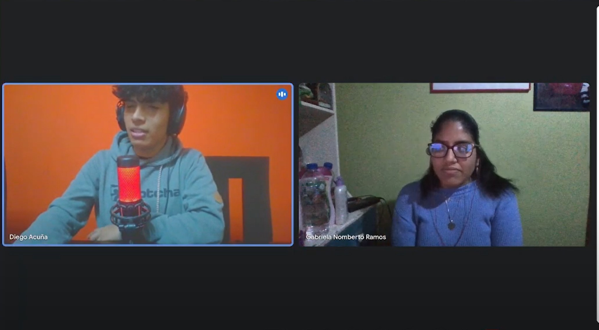

Para esta ocasión entrevistamos a Diego quien tiene una compañía de seguridad. Nos comenta que busca mejorar poco a poco dado que sus tiempos de respuesta ante una emergencia pueden llegar a ser de hasta 10 minutos y dependiendo a la zona que se dirija la alarma emitida, además nos comenta que sí esta familiarizado con dispositivos IoT pero que hay ciertas momentos que se malogran y las notificaciones no llegan ahasta despues de un tiempo. Asimismo que esta dispuesto a buscar otros tipos de dispositvos en donde pueda beneficiarse.

## 2.3 Needfinding
### 2.3.1. User Personas
* **Segmento 1: Dueños de inmuebles**
  

* **Segmento 2: Empresas de Seguridad**

### 2.3.2. User Task Matrix
* **Segmento 1: Dueños de inmuebles**
  <table border="1">
    <tr>
      <th>Tareas</th>
      <th>Frecuencia</th>
      <th>Importancia</th>
    </tr>
    <tr>
      <td>Monitorear la seguridad del inmueble en tiempo real</td>
      <td>Alta</td>
      <td>Alta</td>
    </tr>
    <tr>
      <td>Recibir alertas de seguridad (intrusos, incendios, etc.)</td>
      <td>Alta</td>
      <td>Alta</td>
    </tr>
    <tr>
      <td>Configurar dispositivos IoT y cámaras de seguridad</td>
      <td>Media</td>
      <td>Alta</td>
    </tr>
    <tr>
      <td>Consultar registros de actividad y acceso</td>
      <td>Media</td>
      <td>Media</td>
    </tr>
    <tr>
      <td>Actualizar el sistema de seguridad y firmware de dispositivos</td>
      <td>Media</td>
      <td>Alta</td>
    </tr>
    <tr>
      <td>Administrar usuarios y permisos de acceso</td>
      <td>Baja</td>
      <td>Media</td>
    </tr>
</table>

* **Segmento 2: Empresas de Seguridad**
### 2.3.3. User Journey Mapping
* **Segmento 1: Dueños de inmuebles**
  
### 2.3.4. Empathy Mapping
* **Segmento 1: Dueños de inmuebles**
  
### 2.3.5. As-Is Scenario Mapping
* **Segmento 1: Dueños de inmuebles**
  

## 2.4. Ubiquitous Language

Para el desarrollo de esta sección, como grupo debemos estar alineados con los términos y conceptos claves que son necesarios para la realización del proyecto. Además, nos ayuda a tener un lenguaje en común para entender nuestros objetivos, funcionalidades y benerfios. 

Para VerySafe tenemos los siguientes términos:

1. **Seguridad IoT (Internet de las Cosas)**: Referencia a la integración de dispositivos de seguridad conectados a internet para monitorización y control remoto.
2. **FalconShield**: Nombre de la línea de productos que simboliza la protección integral y la vigilancia avanzada para inmuebles.
3. **Dispositivos de Seguridad**: Sensores, cámaras, alarmas, y otros equipos incluidos en la línea FalconShield que protegen los inmuebles.
4. **Monitoreo en Tiempo Real**: La capacidad de los usuarios para observar y controlar sus dispositivos de seguridad instantáneamente desde cualquier lugar.
5. **Interfaz Unificada**: Plataforma de usuario que centraliza el control de todos los dispositivos FalconShield en un solo lugar.
6. **Mantenimiento Preventivo**: Estrategias y acciones automatizadas para asegurar que los dispositivos FalconShield estén siempre en óptimas condiciones.
7. **Respuesta a Emergencias**: Protocolos y acciones automáticas o manuales que se activan cuando el sistema FalconShield detecta una intrusión o emergencia.
8. **Subscripción**: Modelo de monetización basado en pagos recurrentes para acceder a los servicios y actualizaciones del sistema FalconShield.
9. **Alianzas de Seguridad**: Colaboraciones con empresas especializadas en seguridad para ofrecer una respuesta más rápida y eficiente en caso de emergencias.
10. **AWS**: Plataforma de servicios en la nube utilizada para almacenar y proteger los datos de video y otros registros de seguridad.
11. **Propietarios de inmuebles**: Personas o entidades que poseen propiedades y buscan protegerlas.
12. **Empresas de seguridad**: Compañías que ofrecen servicios de monitoreo y respuesta a emergencias.

# CAPÍTULO III: REQUERIMENTS SPECIFICATION
## 3.1. To-Be Scenario Mapping
## 3.2. User Stories

**Historias de Usuario para la Aplicación Web**

|**Número:**| HU 1|
|-| - |
   |**Usuario:**| Propietario de inmueble
   |**Nombre de historia:**| Ver historial de alertas
   |**Prioridad:** |Alta
   |**Riesgo:**| Medio
   |**Descripción:**| Como propietario de un inmueble, quiero poder ver el historial de alertas de seguridad para revisar incidentes pasados.|
   |**Criterios de aceptación:**| **Dado** que estoy en la página de historial **Cuando** selecciono una fecha específica **Entonces** puedo ver todas las alertas generadas ese día con detalles como hora, tipo de alerta, y acción tomada. |

|**Número:**| HU 2 |
|- |- |
   |**Usuario:** |Propietario de inmueble|
   |**Nombre de historia:**| Controlar dispositivos de seguridad|
   |**Prioridad:**| Alta|
   |**Riesgo:**| Alto|
   |**Descripción:**| Como propietario de un inmueble, quiero controlar mis dispositivos de seguridad desde la aplicación web para armar o desarmar la alarma.|
   |**Criterios de aceptación:**| **Dado** que estoy en el panel de control de dispositivos **Cuando** selecciono un dispositivo y una acción (armar/desarmar) **Entonces** el dispositivo realiza la acción y se muestra una notificación de confirmación. |

|**Número:**| HU-03|
|-|-|
   |**Usuario:**| Empresa de seguridad|
   |**Nombre de historia:**| Monitorear múltiples propiedades|
   |**Prioridad:**| Alta|
   |**Riesgo:**| Alto|
   |**Descripción:** |Como empresa de seguridad, quiero monitorear varias propiedades desde una única interfaz para gestionar las alertas de manera eficiente.|
   |**Criterios de aceptación:**|**Dado** que estoy en el dashboard **Cuando** selecciono una propiedad **Entonces** puedo ver un resumen en tiempo real de todos los dispositivos y alertas de esa propiedad.|

|**Número:** | HU-04|
| - | - |
   |**Usuario:** |Empresa de seguridad|
   |**Nombre de historia:**| Configurar alertas personalizadas|
   |**Prioridad:**| Media|
   |**Riesgo:** |Medio|
   |**Descripción:**| Como empresa de seguridad, quiero configurar alertas personalizadas para recibir notificaciones específicas según los tipos de eventos en cada propiedad.|
   |**Criterios de aceptación:**| **Dado** que estoy en la sección de configuraciones **Cuando** creo una nueva alerta personalizada **Entonces** recibo notificaciones solo para los eventos configurados.|

|**Número:** | HU-05|
|-|-|
   |**Usuario:**| Propietario de inmueble|
   |**Nombre de historia:** |Reportar un incidente|
   |**Prioridad:** |Alta|
   |**Riesgo:**| Medio|
   |**Descripción:** |Como propietario de un inmueble, quiero reportar un incidente directamente desde la aplicación web para que la empresa de seguridad lo gestione.|
   |**Criterios de aceptación:**| **Dado** que estoy en la sección de reportes **Cuando** lleno el formulario de incidente y lo envío **Entonces** la empresa de seguridad recibe una notificación con los detalles del reporte.| 

**Historias de Usuario para la Aplicación Móvil**

|**Número:** | HU-06|
   |-|-|
   |**Usuario:**| Propietario de inmueble|
   |**Nombre de historia:** |Recibir notificaciones en tiempo real|
   |**Prioridad:** |Alta|
   |**Riesgo:**| Alto|
   |**Descripción:**| Como propietario de un inmueble, quiero recibir notificaciones en tiempo real en mi móvil sobre cualquier alerta de seguridad para tomar acciones inmediatas.|
   |**Criterios de aceptación:**| **Dado** que tengo la aplicación móvil instalada **Cuando** se activa una alerta **Entonces** recibo una notificación push con la descripción del evento.|
   
| **Número:**| HU-07|
|-|-|
   | **Usuario:**| Empresa de seguridad|
   | **Nombre de historia:** |Acceso remoto a cámaras|
   | **Prioridad:** |Alta|
   | **Riesgo:**| Alto|
   | **Descripción:**| Como empresa de seguridad, quiero acceder a las cámaras de las propiedades desde mi dispositivo móvil para verificar en tiempo real cualquier alerta.|
   |**Criterios de aceptación:**|**Dado** que tengo acceso a la propiedad en la app  **Cuando** selecciono la opción de cámaras **Entonces** puedo ver las imágenes en vivo de todas las cámaras instaladas.|

|**Número:**| HU-08|
|-|-|
   |**Usuario:**| Propietario de inmueble|
   |**Nombre de historia:** |Control de acceso remoto|
   |**Prioridad:**  | Alta   |
   |**Riesgo:**| Medio|
   |**Descripción:** |Como propietario de un inmueble, quiero controlar el acceso a mi propiedad desde mi móvil para abrir o cerrar puertas de manera remota.|
   |**Criterios de aceptación:**| **Dado** que tengo la app instalada **Cuando** selecciono la opción de control de acceso **Entonces** puedo abrir o cerrar puertas conectadas con un solo clic.|

|**Número:** | HU-09|
|-|-|
   |**Usuario:**| Empresa de seguridad
   |**Nombre de historia:**| Crear y gestionar alertas desde la app
   |**Prioridad:**| Media
   |**Riesgo:**| Medio
   |**Descripción:**| Como empresa de seguridad, quiero poder crear y gestionar alertas desde mi móvil para estar siempre en control, incluso cuando no estoy en la oficina.
   |**Criterios de aceptación:**| **Dado** que estoy en la app **Cuando** creo una nueva alerta personalizada **Entonces** esta se activa y puedo recibir notificaciones basadas en esa configuración.|

   |**Número:**| HU-10|
   |-|-|
   |**Usuario:**| Propietario de inmueble|
   |**Nombre de historia:**| Ver grabaciones de seguridad|
   |**Prioridad:**| Media|
   |**Riesgo:** |Medio|
   |**Descripción:**| Como propietario de un inmueble, quiero ver las grabaciones de seguridad desde mi móvil para revisar eventos pasados mientras estoy fuera de casa.|
   |**Criterios de aceptación:**| **Dado** que estoy en la app **Cuando** selecciono una fecha y hora **Entonces** puedo ver la grabación correspondiente directamente desde mi dispositivo móvil.|

**Historias de Usuario para el Backend**

|**Número:**| HU-11|
|-|-|
|**Usuario:**| Administrador del sistema|
|**Nombre de historia:**| Gestión de usuarios|
|**Prioridad:**| Alta|
|**Riesgo:** |Alto|
|**Descripción:**| Como administrador, quiero poder gestionar todos los usuarios desde el backend para controlar el acceso y los permisos de la plataforma.|
|**Criterios de aceptación:**| **Dado** que estoy en el panel de administración **Cuando** agrego, edito o elimino un usuario **Entonces** estos cambios se reflejan en la aplicación web y móvil.|

|**Número:** | HU-12|
|-|-|
|**Usuario:**| Administrador del sistema|
|**Nombre de historia:**| Gestión de dispositivos conectados|
|**Prioridad:** |Alta|
|**Riesgo:** |Alto|
|**Descripción:** |Como administrador, quiero poder gestionar todos los dispositivos conectados para monitorear su estado y funcionamiento.|
|**Criterios de aceptación:**| **Dado** que estoy en el panel de administración  **Cuando** veo el listado de dispositivos **Entonces** puedo actualizar su estado, ver logs y desconectar dispositivos si es necesario.|

|**Número:** | HU-13|
|-|-|
|**Usuario:**| Administrador del sistema|
|**Nombre de historia:**| Integración con sistemas de terceros|
|**Prioridad:** |Alta|
|**Riesgo:** |Alto|
|**Descripción:** |Como administrador, quiero integrar la plataforma con sistemas de seguridad de terceros para ampliar las capacidades del sistema.|
|**Criterios de aceptación:**| **Dado** que estoy en el panel de integraciones  **Cuando** configuro una integración nueva **Entonces** los dispositivos y datos del sistema de terceros se sincronizan con nuestra plataforma. |

|**Número:** | HU-14|
|-|-|
|**Usuario:**| Administrador del sistema|
|**Nombre de historia:**| Gestión de logs y auditoría|
|**Prioridad:** |Media|
|**Riesgo:** |Medio|
|**Descripción:** |Como administrador, quiero poder acceder a los logs y realizar auditorías para monitorear la actividad del sistema y detectar anomalías.|
|**Criterios de aceptación:**| **Dado** que estoy en la sección de logs **Cuando** selecciono un rango de fechas **Entonces** puedo ver todas las actividades registradas en ese periodo. |

|**Número:** | HU-15|
|-|-|
|**Usuario:**| Administrador del sistema|
|**Nombre de historia:**| Configuración de políticas de seguridad|
|**Prioridad:** |Media|
|**Riesgo:** |Medio|
|**Descripción:** |Como administrador, quiero poder configurar políticas de seguridad para asegurar que todos los dispositivos y datos cumplan con los estándares requeridos.|
|**Criterios de aceptación:**| **Dado** que estoy en la sección de políticas **Cuando** establezco una nueva política **Entonces** se aplica a todos los dispositivos y usuarios de la plataforma. |

**Historias de Usuario para el Edge**

|**Número:** | HU-16|
|-|-|
|**Usuario:**| Propietario de inmueble|
|**Nombre de historia:**| Detección de anomalías en tiempo real|
|**Prioridad:** |Alta|
|**Riesgo:** |Alto|
|**Descripción:** |Como propietario de un inmueble, quiero que los dispositivos en el edge detecten anomalías en tiempo real para reaccionar de inmediato ante posibles amenazas.|
|**Criterios de aceptación:**| **Dado** que tengo dispositivos edge instalados **Cuando** ocurre una anomalía **Entonces** el dispositivo envía una alerta inmediata a la app móvil y web. |

|**Número:** | HU-17|
|-|-|
|**Usuario:**| Administrador del sistema |
|**Nombre de historia:**| Actualización remota de firmware|
|**Prioridad:** |Alta|
|**Riesgo:** |Alto|
|**Descripción:** |Como administrador, quiero poder actualizar remotamente el firmware de los dispositivos en el edge para asegurar su correcto funcionamiento y seguridad.|
|**Criterios de aceptación:**| **Dado** que estoy en el panel de dispositivos **Cuando** selecciono actualizar el firmware de un dispositivo **Entonces** el dispositivo se actualiza automáticamente y se reinicia. |

|**Número:** | HU-18|
|-|-|
|**Usuario:**|Empresa de seguridad|
|**Nombre de historia:**| Autonomía operativa de dispositivos edge |
|**Prioridad:** |Media|
|**Riesgo:** |Medio|
|**Descripción:** |Como empresa de seguridad, quiero que los dispositivos en el edge funcionen de manera autónoma si pierden conexión con el servidor para asegurar la continuidad del servicio.|
|**Criterios de aceptación:**| **Dado** que un dispositivo edge pierde conexión **Cuando** continúa operando de manera autónoma **Entonces** las alertas y registros se guardan localmente hasta que se restablezca la conexión. |

|**Número:** | HU-19|
|-|-|
|**Usuario:**|Propietario de inmueble|
|**Nombre de historia:**| Monitoreo de alertas en dispositivos edge |
|**Prioridad:** |Media|
|**Riesgo:** |Medio|
|**Descripción:** |Como propietario de un inmueble, quiero monitorear las alertas de mis dispositivos edge.|
|**Criterios de aceptación:**| **Dado** que estoy en el dashboard de alertas **Cuando** le doy click a un dispositivo **Entonces** puedo ver un historial de alertas del dispositivo y recibir sugerencias de optimización. |

|**Número:** | HU-20|
|-|-|
|**Usuario:**|Administrador del sistema|
|**Nombre de historia:**| Reinicio remoto de dispositivos edge |
|**Prioridad:** |Media|
|**Riesgo:** |Bajo|
|**Descripción:** |Como administrador, quiero poder reiniciar remotamente los dispositivos en el edge para solucionar problemas de manera eficiente.|
|**Criterios de aceptación:**| **Dado** que estoy en el panel de dispositivos **Cuando**  selecciono la opción de reinicio **Entonces** el dispositivo se reinicia automáticamente y notifica al usuario. |

**Historias de Usuario para Dispositivos IoT**

|**Número:** | HU-21|
|-|-|
|**Usuario:**|Propietario de inmueble|
|**Nombre de historia:**| Control de luces inteligentes |
|**Prioridad:** |Alta|
|**Riesgo:** |Medio|
|**Descripción:** |Como propietario de un inmueble, quiero controlar las luces inteligentes de mi propiedad desde la app para encender o apagar según necesidad.|
|**Criterios de aceptación:**| **Dado** que estoy en la app móvil **Cuando**  selecciono una luz que quiero modificar **Entonces** puedo encenderla, apagarla o ajustar la intensidad.|

|**Número:** | HU-22|
|-|-|
|**Usuario:**|Empresa de seguridad|
|**Nombre de historia:**| nitoreo de sensores de movimiento |
|**Prioridad:** |Alta|
|**Riesgo:** |Alto|
|**Descripción:** |Como empresa de seguridad, quiero monitorear en tiempo real los sensores de movimiento de los dispositivos IoT para detectar intrusos.|
|**Criterios de aceptación:**| **Dado** que estoy en el dashboard de sensores **Cuando** un sensor detecta movimiento **Entonces** recibo una alerta inmediata en la app.|

|**Número:** | HU-23|
|-|-|
|**Usuario:**|Empresa de seguridad|
|**Nombre de historia:**| Monitorización de baterías en dispositivos IoT |
|**Prioridad:** |Media|
|**Riesgo:** |Medio|
|**Descripción:** |Como empresa de seguridad, quiero monitorear el nivel de batería de los dispositivos IoT para asegurar que siempre estén operativos.|
|**Criterios de aceptación:**| **Dado** que estoy en el dashboard de energía **Cuando** el nivel de batería es bajo **Entonces** recibo una alerta para reemplazar o recargar el dispositivo.|

|**Número:** | HU-24|
|-|-|
|**Usuario:**|Propietario de inmueble|
|**Nombre de historia:**| Automatización de escenarios |
|**Prioridad:** |Media|
|**Riesgo:** |Medio|
|**Descripción:** |Como propietario de un inmueble, quiero crear escenarios automatizados en mi app para que los dispositivos IoT actúen en conjunto según la hora o eventos específicos.|
|**Criterios de aceptación:**| **Dado** que estoy en la app **Cuando**  configuro un escenario **Entonces** los dispositivos correspondientes se activan o desactivan automáticamente según lo programado.|

**Historias de Usuario para Propietarios de Inmuebles**

|**Número:** | HU-25|
|-|-|
|**Usuario:**|Propietario de inmueble|
|**Nombre de historia:**| Ver estado de la propiedad en tiempo real |
|**Prioridad:** |Alta|
|**Riesgo:** |Alt|
|**Descripción:** |Como propietario de un inmueble, quiero ver el estado de seguridad de mi propiedad en tiempo real desde la app para asegurarme de que todo esté en orden.|
|**Criterios de aceptación:**| **Dado** que estoy en la app **Cuando**  creviso el dashboard **Entonces** uedo ver el estado de todos mis dispositivos de seguridad en tiempo real.|

|**Número:** | HU-26|
|-|-|
|**Usuario:**|Propietario de inmueble|
|**Nombre de historia:**|  Recibir notificaciones |
|**Prioridad:** |Alta|
|**Riesgo:** |Medio|
|**Descripción:** |Como propietario de un inmueble, quiero recibir notificaciones en la app para estar informado sobre cualquier alerta de seguridad.|
|**Criterios de aceptación:**| **Dado** que tengo notificaciones activas **Cuando**  ocurre una alerta **Entonces** los dispositivos correspondientes se activan la alarma y recibo una notificacion de alerta|

|**Número:** | HU-27|
|-|-|
|**Usuario:**|Propietario de inmueble|
|**Nombre de historia:**| Acceso a informes de seguridad|
|**Prioridad:** |Media|
|**Riesgo:** |Bajo|
|**Descripción:** |Como propietario de un inmueble, quiero acceder a informes de seguridad mensuales para revisar el rendimiento de mis dispositivos de seguridad.|
|**Criterios de aceptación:**| **Dado** que estoy en la app **Cuando**  cdescargo el informe **Entonces** recibo un PDF con un resumen del mes en términos de eventos y alertas. |

|**Número:** | HU-28|
|-|-|
|**Usuario:**|Propietario de inmueble|
|**Nombre de historia:**| Configurar notificaciones de prioridad |
|**Prioridad:** |Media|
|**Riesgo:** |Medio|
|**Descripción:** |Como propietario de un inmueble, quiero configurar qué tipos de alertas recibir para priorizar las más importantes y evitar saturación de notificaciones.|
|**Criterios de aceptación:**| **Dado** que estoy en la sección de notificaciones **Cuando** ajusto las preferencias **Entonces** recibo solo las notificaciones configuradas.|

|**Número:** | HU-29|
|-|-|
|**Usuario:**|Propietario de inmueble|
|**Nombre de historia:**| Configuración de acceso compartido |
|**Prioridad:** |Media|
|**Riesgo:** |Medio|
|**Descripción:** |Como propietario de un inmueble, quiero compartir acceso temporal o limitado con otras personas para que puedan entrar en mi propiedad sin comprometer la seguridad.|
|**Criterios de aceptación:**| **Dado** que estoy en la sección de acceso **Cuando** configuro el acceso compartido **Entonces** la otra persona recibe un código o acceso temporal limitado.|

**Historias de Usuario para Usuarios de Empresas de Seguridad**

|**Número:** | HU-30|
|-|-|
|**Usuario:**|Empresa de seguridad|
|**Nombre de historia:**| Gestión de patrullas |
|**Prioridad:** |Alta|
|**Riesgo:** |Alto|
|**Descripción:** |Como empresa de seguridad, quiero gestionar las rutas de patrullas en tiempo real para optimizar la vigilancia en propiedades protegidas.|
|**Criterios de aceptación:**| **Dado** que estoy en el dashboard de patrulla **Cuando** asigno una ruta a un guardia **Entonces** puedo ver su progreso y hacer ajustes en tiempo real.|

|**Número:** | HU-31|
|-|-|
|**Usuario:**|Empresa de seguridad|
|**Nombre de historia:**| Notificaciones de intrusión en tiempo real |
|**Prioridad:** |Alta|
|**Riesgo:** |Alto|
|**Descripción:** |Como empresa de seguridad, quiero recibir notificaciones en tiempo real sobre cualquier intento de intrusión en las propiedades bajo nuestra vigilancia para actuar inmediatamente.|
|**Criterios de aceptación:**| **Dado** que un sensor detecta una intrusión **Cuando** la alerta se dispara **Entonces** recibo una notificación inmediata en mi panel de control y la app.|

|**Número:** | HU-32|
|-|-|
|**Usuario:**|Empresa de seguridad|
|**Nombre de historia:**| Acceso a cámaras de seguridad |
|**Prioridad:** |Alta|
|**Riesgo:** |Medio|
|**Descripción:** |Como empresa de seguridad, quiero acceder a las cámaras de seguridad en las propiedades de nuestros clientes para monitorear en tiempo real cualquier actividad sospechosa.|
|**Criterios de aceptación:**| **Dado** que estoy en el dashboard de cámaras **Cuando** selecciono una cámara **Entonces** puedo ver la transmisión en vivo y revisar grabaciones.|

|**Número:** | HU-33|
|-|-|
|**Usuario:**|Empresa de seguridad|
|**Nombre de historia:**| Control de acceso remoto |
|**Prioridad:** |Media|
|**Riesgo:** |Medio|
|**Descripción:** |Como empresa de seguridad, quiero controlar de manera remota el acceso a una propiedad para permitir la entrada o salida de personas sin estar físicamente presentes.|
|**Criterios de aceptación:**| **Dado** que estoy en el panel de control **Cuando** selecciono la opción de abrir o cerrar accesos **Entonces** puedo desbloquear o bloquear la puerta remotamente.|

|**Número:** | HU-34|
|-|-|
|**Usuario:**|Empresa de seguridad|
|**Nombre de historia:**| Respuesta automatizada ante amenazas |
|**Prioridad:** |Media|
|**Riesgo:** |Alto|
|**Descripción:** |Como empresa de seguridad, quiero que el sistema responda automáticamente ante amenazas identificadas por los dispositivos de seguridad para minimizar el tiempo de reacción.|
|**Criterios de aceptación:**| **Dado** que una amenaza es detectada **Cuando** el sistema la confirma **Entonces** se activan las medidas de seguridad preconfiguradas (alarma, bloqueo de puertas, notificación a autoridades).|

**Historias de Usuario para Aplicaciones Móviles y Web**

|**Número:** | HU-35|
|-|-|
|**Usuario:**|Propietario de inmueble|
|**Nombre de historia:**| Personalización de la interfaz |
|**Prioridad:** |Media|
|**Riesgo:** |Bajo|
|**Descripción:** |Como propietario de un inmueble, quiero personalizar la interfaz de la app para que se adapte a mis preferencias y uso cotidiano.|
|**Criterios de aceptación:**| **Dado** que estoy en la sección de configuración **Cuando** ajusto la apariencia y disposición de elementos **Entonces** la interfaz refleja mis preferencias personales.|

|**Número:** | HU-36|
|-|-|
|**Usuario:**|Propietario de inmueble|
|**Nombre de historia:**| Uso compartido de dispositivos |
|**Prioridad:** |Media|
|**Riesgo:** |Bajo|
|**Descripción:** |Como propietario de un inmueble, quiero compartir el control de ciertos dispositivos con otros usuarios desde la app para que también puedan manejarlos.|
|**Criterios de aceptación:**| **Dado** que estoy en la sección de dispositivos **Cuando** configuro el uso compartido **Entonces** el otro usuario tiene acceso limitado o completo según lo configurado.|

|**Número:** | HU-37|
|-|-|
|**Usuario:**|Propietario de inmueble|
|**Nombre de historia:**| Alertas de mantenimiento preventivo |
|**Prioridad:** |Media|
|**Riesgo:** |Bajo|
|**Descripción:** |Como propietario de un inmueble, quiero recibir alertas de mantenimiento preventivo de los dispositivos para evitar fallos y asegurar su operación continua.|
|**Criterios de aceptación:**| **Dado** que tengo dispositivos operando **Cuando** alguno necesita mantenimiento **Entonces** recibo una alerta en la app y el email con los pasos a seguir para realizar el mantenimiento.|

## 3.3. Impact Mapping
## 3.4. Product Backlog

### **Product Backlog**

|**Número**|**Nombre de Historia**|**Prioridad**|**Riesgo**|**Estimación**|
|---|---|---|---|---|
| HU-03 | Monitorear múltiples propiedades | Alta | Alto | 13 |
| HU-07 | Acceso remoto a cámaras | Alta | Alto | 13 |
| HU-16 | Detección de anomalías en tiempo real | Alta | Alto | 13 |
| HU-17 | Actualización remota de firmware | Alta | Alto | 13 |
| HU-30 | Gestión de patrullas | Alta | Alto | 13 |
| HU-31 | Notificaciones de intrusión en tiempo real | Alta | Alto | 13 |
| HU-22 | Monitoreo de sensores de movimiento | Alta | Alto | 13 |
| HU-32 | Acceso a cámaras de seguridad | Alta | Medio | 8 |
| HU-25 | Ver estado de la propiedad en tiempo real | Alta | Alto | 8 |
| HU-26 | Recibir notificaciones | Alta | Medio | 8 |
| HU-01 | Ver historial de alertas | Alta | Medio | 5 |
| HU-02 | Controlar dispositivos de seguridad | Alta | Alto | 5 |
| HU-05 | Reportar un incidente | Alta | Medio | 5 |
| HU-08 | Control de acceso remoto | Alta | Medio | 5 |
| HU-21 | Control de luces inteligentes | Alta | Medio | 5 |
| HU-12 | Gestión de dispositivos conectados | Alta | Alto | 5 |
| HU-13 | Integración con sistemas de terceros | Alta | Alto | 5 |
| HU-09 | Crear y gestionar alertas desde la app | Media | Medio | 3 |
| HU-10 | Ver grabaciones de seguridad | Media | Medio | 3 |
| HU-11 | Gestión de usuarios | Alta | Alto | 3 |
| HU-14 | Gestión de logs y auditoría | Media | Medio | 3 |
| HU-15 | Configuración de políticas de seguridad | Media | Medio | 3 |
| HU-18 | Autonomía operativa de dispositivos edge | Media | Medio | 3 |
| HU-19 | Monitoreo de alertas en dispositivos edge | Media | Medio | 3 |
| HU-20 | Reinicio remoto de dispositivos edge | Media | Bajo | 3 |
| HU-23 | Monitorización de baterías en dispositivos IoT | Media | Medio | 3 |
| HU-24 | Automatización de escenarios | Media | Medio | 3 |
| HU-27 | Acceso a informes de seguridad | Media | Bajo | 3 |
| HU-28 | Configurar notificaciones de prioridad | Media | Medio | 3 |
| HU-29 | Configuración de acceso compartido | Media | Medio | 3 |
| HU-33 | Control de acceso remoto | Media | Medio | 3 |
| HU-34 | Respuesta automatizada ante amenazas | Media | Alto | 3 |
| HU-35 | Personalización de la interfaz | Media | Bajo | 2 |
| HU-36 | Uso compartido de dispositivos | Media | Bajo | 2 |
| HU-37 | Alertas de mantenimiento preventivo | Media | Bajo | 2 |

# CAPÍTULO IV: SOLUTION SOFTWARE DESIGN
## 4.1. Strategic-Level Domain-Driven Design
### 4.1.1. EventStorming

Es una técnica colaborativa que nos permite explorar a fondo el dominio de nuestra aplicación de FalconShield. A través de una dinámica visual, se identifican eventos clave, acciones del usuario, reglas del sistema y flujos de mensajes. Esto mejora significativamente la comprensión del dominio, facilita el diseño del sistema y promueve una sólida colaboración entre el equipo.

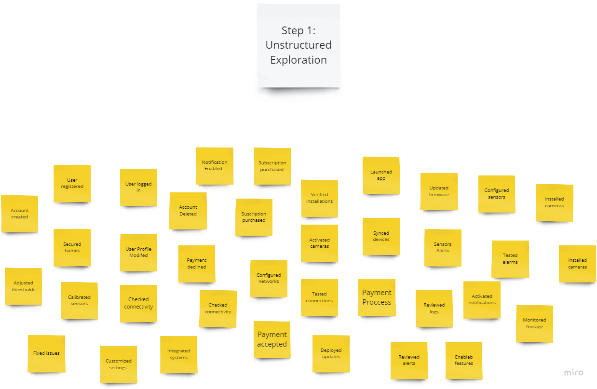

#### 4.1.1.1. Candidate Context Discovery

link del miro : https://miro.com/app/board/uXjVKjBJwpE=/?share_link_id=165602234559

**Bounded Context:**

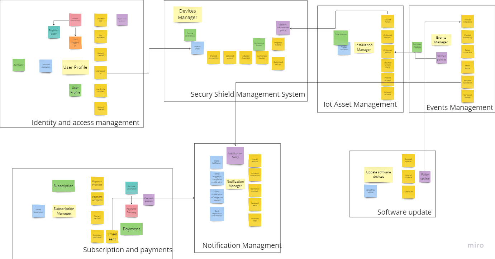

**User profile context:**
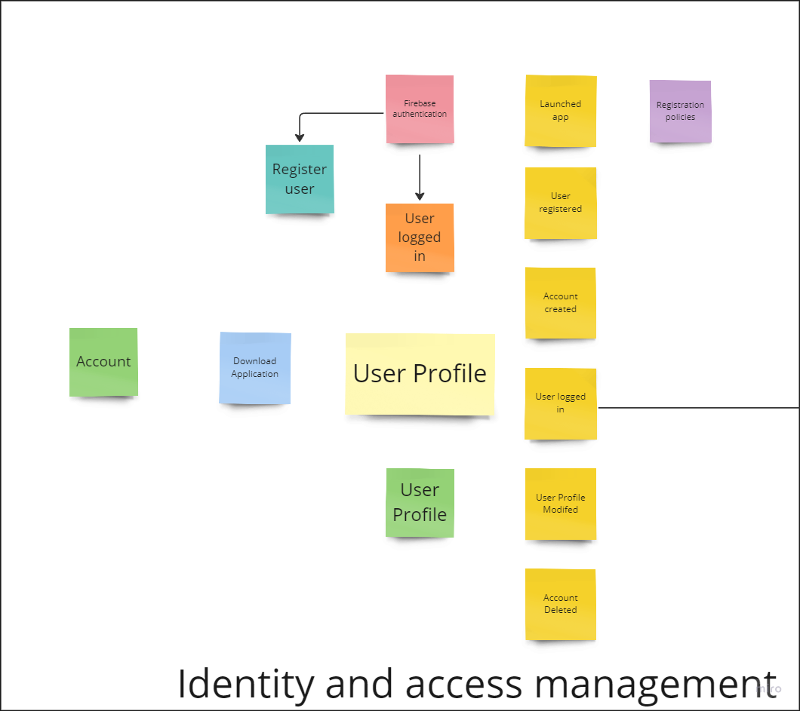

**Devices Context:**
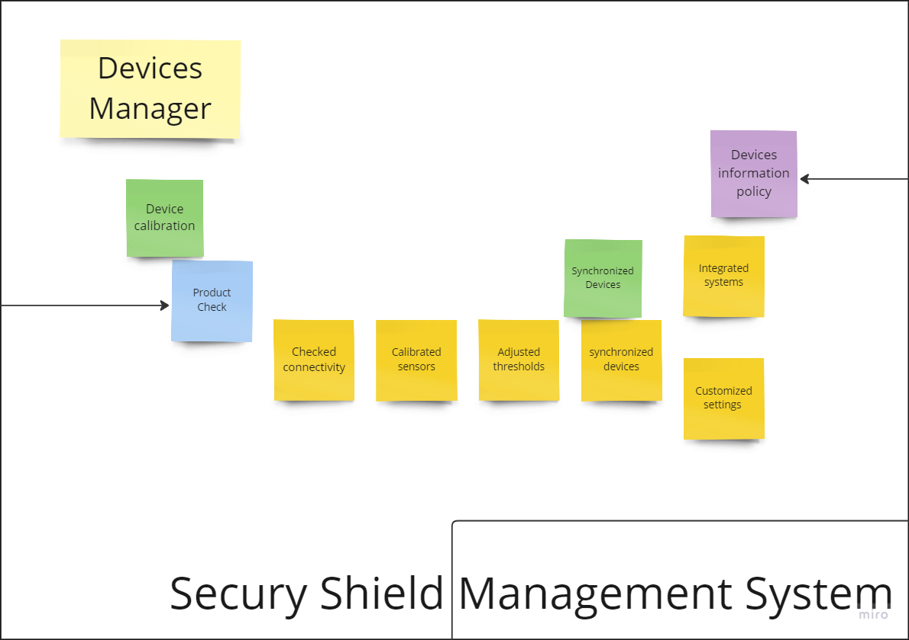

**Installation devices Context:**
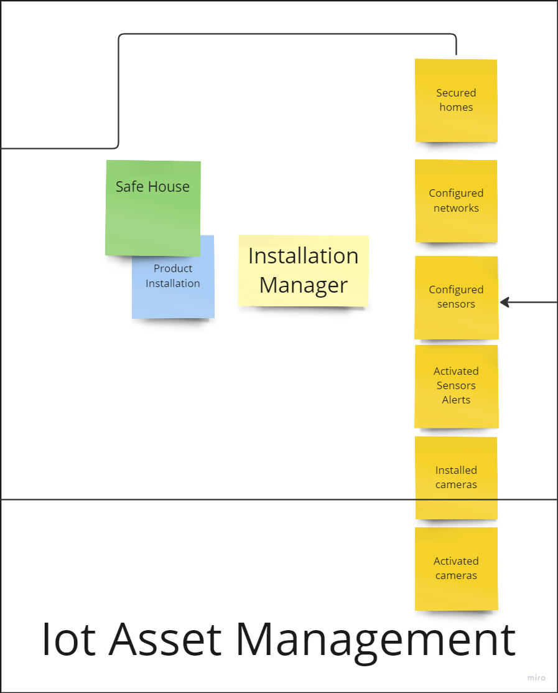

**Events Context:**
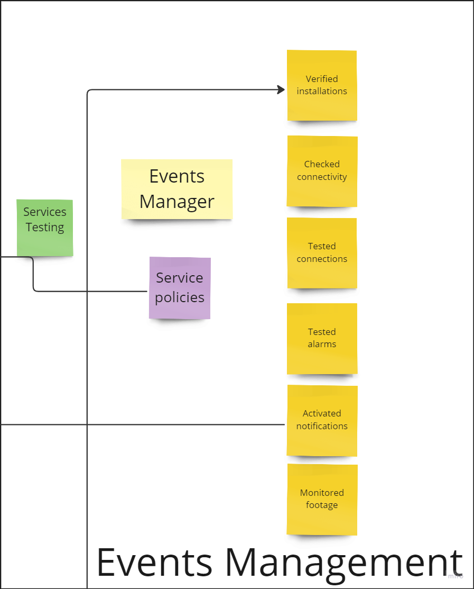
**Notifications Context:**
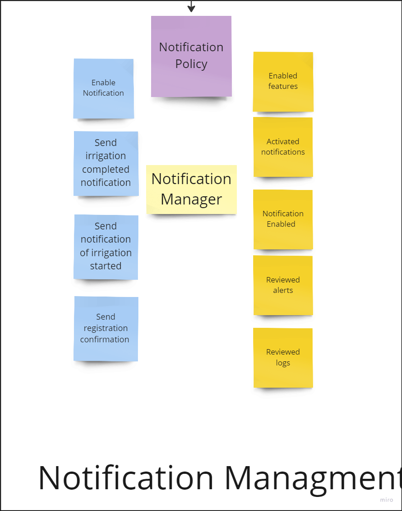
**Update software devices Context:**
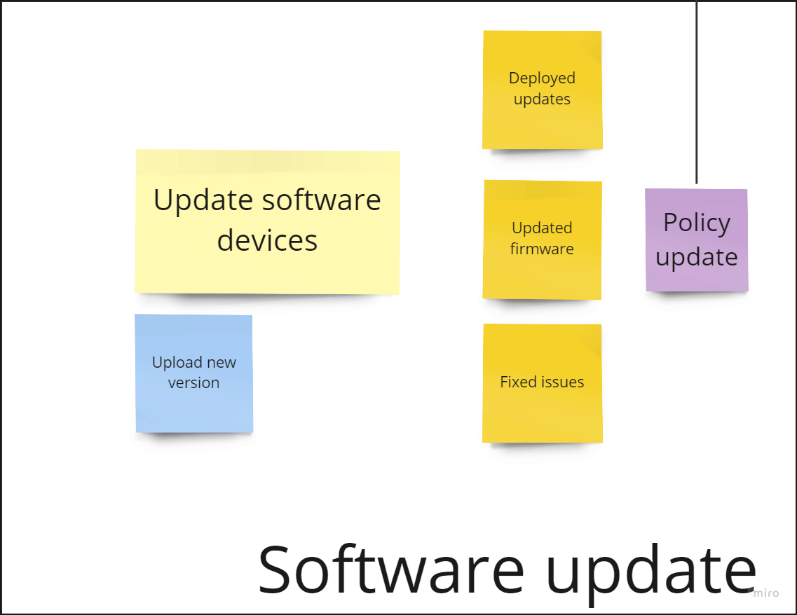
**Suscription Context:**
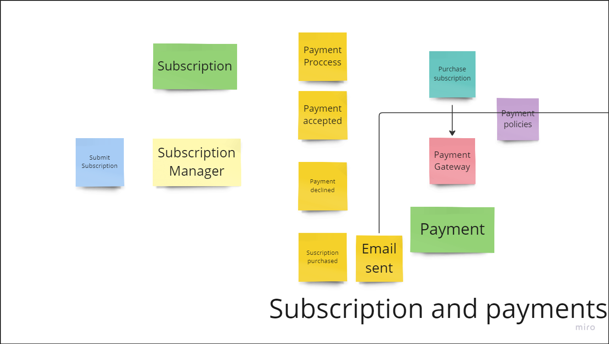

#### 4.1.1.2. Domain Message Flows Modeling
#### 4.1.1.3. Bounded Context Canvases

### 4.1.2. Context Mapping
**Area Management Context - Device Management Context:**

La relación entre Area Management Context y Device Management Context es de Partnership. El contexto Area Management organiza las propiedades y áreas, mientras que el contexto Device Management gestiona los dispositivos dentro de esas áreas. Ambos contextos colaboran estrechamente para garantizar una integración efectiva entre la organización espacial y la gestión de dispositivos en el sistema de seguridad basado en IoT.

**Area Management Context - Events Context:**

La relación entre Area Management Context y Events Context es de Customer-Supplier. El contexto Area Management define las áreas, mientras que el contexto Events registra y gestiona los eventos que ocurren en esas áreas, como la activación de sensores o alarmas. Events Context depende de los datos de Area Management para asociar los eventos correctamente a sus ubicaciones.

**Area Management Context - Subscriptions Context:**

La relación entre ambos contextos también es de tipo Customer-Supplier. En esta relación, el contexto Subscriptions Management gestiona los planes y pagos de los usuarios, determinando cuántas áreas pueden gestionar según su plan de suscripción. Area Management depende de las reglas definidas por Subscriptions Management para limitar o permitir la creación de más áreas en función del plan del usuario. Esta relación garantiza que el acceso a más áreas esté controlado por el nivel de suscripción, manteniendo la coherencia entre la gestión de áreas y las restricciones del plan en el sistema de seguridad.

**Events Context - Device Management Context:**

La relación entre ambos contextos son de tipo Conformist porque el Events Context depende directamente de los dispositivos definidos en el Device Management Context para registrar y manejar los eventos. En esta relación, el Events Context no redefine ni expande significativamente la estructura o el modelo de los dispositivos, sino que adopta la representación de los dispositivos tal como se modelan en el Device Management Context.

### 4.1.3. Software Architecture

En esta parte, mostraremos la representación de la Arquitectura de Software de la solución en base a los modelos C4

#### 4.1.3.1. Software Architecture System Landscape Diagram

Este diagrama nos ofrece una visión mas general de como es la interacción de los usuarios con los sistemas externos, nos permite comprender la conexión de los componentes para contribuir al funcionamiento general de las aplicaciones.

#### 4.1.3.2. Software Architecture Context Level Diagrams

En este tipo de diagramas, se muestra como nuestro sistema interactúa con elementos externos.

#### 4.1.3.3. Software Architecture Container Level Diagrams

Son representaciones visuales de la arquitectura de software a nivel de contenedores, que muestran cómo se agrupan y se comunican los distintos componentes y servicios dentro de un sistema o aplicación. Estos diagramas proporcionan una vista detallada de la organización de los contenedores de software, lo que ayuda a entender la estructura y las interacciones en la arquitectura general.
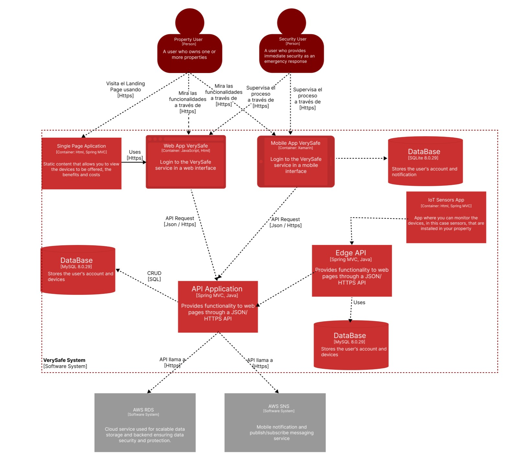

#### 4.1.3.4. Software Architecture Deployment Diagrams

Son representaciones gráficas que ilustran cómo se despliegan y ejecutan los componentes de software en la infraestructura de hardware o en un entorno de producción.
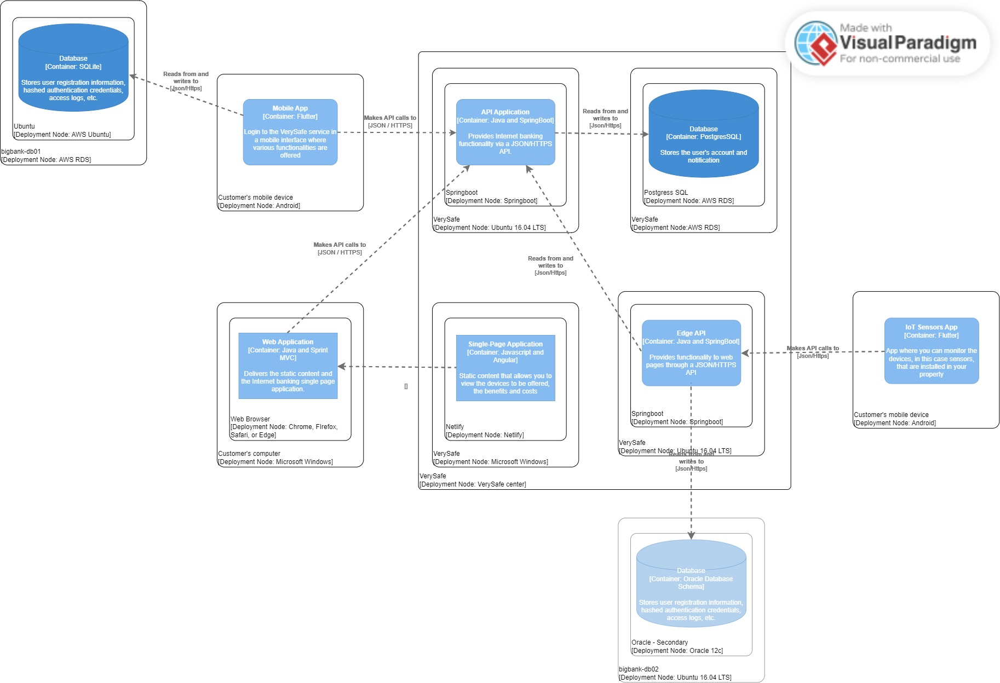

## 4.2. Tactical-Level Domain-Driven Design
### 4.2.1. Bounded Context: Subscriptions
#### 4.2.1.1. Domain Layer
En esta capa reside el núcleo de la aplicación encargado de gestionar las suscripciones y el sistema de pagos en la aplicación.

- Entities:
  - Payments:
  - Subscriptions:
  - Subscriptions Plans:s

- Value Objects:
  - Email: Un objeto de valor para representar direcciones de correo electrónico válidas.
  - Password: Un objeto de valor para manejar contraseñas de manera segura.

- Aggregates:
  - UserAggregate: Puede ser un agregado que incluye la entidad de usuario y los roles relacionados.

- Factories:
  - UserFactory: Para crear instancias de usuarios y roles de manera consistente.

- Domain Services:
  - AuthenticationService: Puede ser un servicio de dominio encargado de la autenticación de usuarios.

- Repositories:
  - UserRepository: Define cómo se accede y se persisten los usuarios y roles.

#### 4.2.1.2. Interface Layer
#### 4.2.1.3. Application Layer
#### 4.2.1.4. Infrastructure Layer
#### 4.2.1.5. Bounded Context Software Architecture Component Level Diagrams
#### 4.2.1.6. Bounded Context Software Architecture Code Level Diagrams
#### 4.2.1.6.1. Bounded Context Domain Layer Class Diagrams
#### 4.2.1.6.1. Bounded Context Database Design Diagram

# Conclusiones
## Conclusiones y Recomendaciones

# Bibliografía

# Anexos

