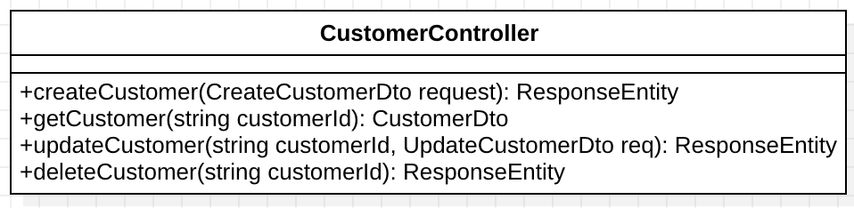

# Report Iot

Carrera: Ingeniería de Software

Nombre del curso: Desarrollo de Soluciones IOT

Sección: WV71

Nombre del profesor: Velasquez Nuñez, Angel Augusto

"Informe de TB1"

Nombre del startup: VerySafe

Nombre del producto: FalconShield

Relación de integrantes:

- Gabriela Soledad Nomberto Ramos
- Dennis Piero Quevedo Yucra
- Max Dayson Sabino Arostegui
- Elvia Guadalupe Arteaga Cruz
- Jamutaq Piero Ortega Vélez

Mes y año: Agosto 2024

Ciclo: 2024-2

## Registro de Versiones del Informe
# Student Outcome
# CAPÍTULO I: INTRODUCTION
## 1.1 Startup Profile
### 1.1.1 Descripción de la Startup
### 1.1.2 Perfiles de integrantes del equipo
## 1.2 Solution Profile
### 1.2.1  Antecedentes y problemática
### 1.2.2 Lean UX Process
#### 1.2.2.1 Lean UX Problem Statements
#### 1.2.2.2 Lean UX Assumptions
#### 1.2.2.3 Lean UX Hypothesis Statements
#### 1.2.2.4 Lean UX Canvas
## 1.3 Segmentos objetivo

# CAPÍTULO II: REQUERIMENTS ELICITATION & ANALYSIS
## 2.1 Competidores
### 2.1.1. Análisis competitivo
## 2.2 Entrevistas
### 2.2.1. Diseño de entrevistas
### 2.2.2. Registro de entrevistas
### 2.2.3. Análisis de entrevistas
## 2.3 Needfinding
### 2.3.1. User Personas
### 2.3.2. User Task Matrix
### 2.3.3. User Journey Mapping
### 2.3.4. Empathy Mapping
### 2.3.5. As-Is Scenario Mapping
## 2.4. Ubiquitous Language

# CAPÍTULO III: REQUIREMENTS SPECIFICATION
## 3.1. To-Be Scenario Mapping.
## 3.2. User Stories.
## 3.3. Impact Mapping.
## 3.4. Product Backlog.

# Capítulo IV: Solution Software Design
## 4.1. Strategic-Level Domain-Driven Design
### 4.1.1. EventStorming
#### 4.1.1.1 Candidate Context Discovery
#### 4.1.1.2 Domain Message Flows Modeling
#### 4.1.1.3 Bounded Context Canvases
### 4.1.2. Context Mapping

1. **Events Management Context - Notification Management Context (Customer/Supplier):**
  La relación entre estos dos bounded contexts sigue el patrón Customer/Supplier. El Events Management Context es el proveedor que genera eventos críticos como alertas de seguridad o cambios en el estado de los dispositivos IoT. El Notification Management Context, como cliente, consume estos eventos y se encarga de enviar notificaciones al usuario a través de distintos canales (correo, SMS, etc.).

    

2. **IoT Asset Management Context - Software Update Context (Conformist):**
  El IoT Asset Management Context, encargado de gestionar los dispositivos IoT, depende del Software Update Context para implementar actualizaciones y parches. En este caso, el primero actúa como un Conformist, ya que debe adherirse a las reglas y servicios proporcionados por el Software Update Context sin imponer sus propias reglas, asegurando que las actualizaciones se apliquen de manera consistente.

    

3.	**Security Shield Management System Context - Identity and Access Management Context (Shared Kernel):**
  Ambos bounded contexts comparten un núcleo común (Shared Kernel), ya que el Security Shield Management System necesita autenticar y autorizar a los usuarios y dispositivos, lo cual está estrechamente ligado con las políticas y mecanismos del Identity and Access Management Context. Debido a la naturaleza crítica de la seguridad, estas dos áreas deben compartir información sensible y estar completamente sincronizadas en términos de datos y lógicas de negocio relacionadas con la identidad.

    

4.	**Subscription and Payment Context - Notification Management Context (Anti-Corruption Layer):**
  La relación entre estos dos bounded contexts se beneficia de un Anti-Corruption Layer para traducir y aislar los modelos de dominio. El Subscription and Payment Context maneja información financiera y suscripciones, mientras que el Notification Management Context envía alertas sobre el estado de las suscripciones o pagos. Para evitar que las complejidades del modelo de pagos interfieran con la simplicidad del sistema de notificaciones, se utiliza una capa anti-corrupción que actúa como interfaz entre ambos contexts.

    

### 4.1.3. Software Architecture
#### 4.1.3.1. Software Architecture System Landscape Diagram
#### 4.1.3.2. Software Architecture Context Level Diagrams
#### 4.1.3.2. Software Architecture Container Level Diagrams
#### 4.1.3.3. Software Architecture Deployment Diagrams
## 4.2. Tactical-Level Domain-Driven Design
### 4.2.1. Bounded Context: Subscription & Payments context
El Subscription and Payment Context abarca todos los procesos y funciones relacionados con la gestión de suscripciones y pagos dentro de nuestro sistema. Este contexto es responsable de manejar la creación, modificación y cancelación de suscripciones, así como de procesar pagos y gestionar el estado de los mismos. Incluye la administración de detalles relacionados con los clientes, el seguimiento de las facturas y el estado de cada pago, y la sincronización con sistemas externos como Stripe. Asegura que las suscripciones y pagos se gestionen de manera eficiente y precisa, proporcionando una experiencia de servicio continua y sin interrupciones para los usuarios. A continuación, se detallan las clases identificadas en este contexto:

1. Clase Customer
    - Propósito: La clase Customer representa a un cliente en el sistema. Contiene la información esencial del cliente, como su nombre y correo electrónico, y un identificador que enlaza con el sistema de Stripe para gestionar pagos y suscripciones
    - Atributos:
      - `id: string` - Identificador único del cliente
      - `name: String` - Nombre del cliente
      - `email: String` - Correo electrónico del cliente
      - `stripeCustomerId: String` - Identificador del cliente en el sistema de Stripe
    - Métodos:
      - `getCustomerDetails(): CustomerDetails` - Retorna los detalles básicos del cliente (nombre y correo electrónico)
      - `registerStripeCustomer(): void` - Registra al cliente en Stripe
   	- Relaciones:
     	- `1...n` con Subscription, ya que un cliente puede tener varias suscripciones activas.

    

2. Clase Subscription
    - Propósito: La clase Subscription gestiona las suscripciones de un cliente a un servicio específico. Mantiene los detalles esenciales, como el estado de la suscripción y las fechas de inicio y finalización. Los detalles más complejos de la suscripción son manejados por Stripe.
    - Atributos:
      - `id: string` - Identificador único de la suscripción
      - `status: string` - Estado actual de la suscripción (ejm: ACTIVA, CANCELADA, etc.)
      - `planId: string` - Identificador del plan de suscripción
      - `status: string` - Estado actual de la suscripción (activo, inactivo, cancelado)
      - `startDate: Date` - Fecha de inicio de la suscripción
      - `endDate: Date` - Fecha de finalización de la suscripción
      - `stripeSubscriptionId: string` - Identificador de la suscripción en Stripe
    - Métodos:
      - `getSubscriptionDetails(): SubscriptionDetails` - Retorna los detalles de la suscripción
      - `cancelSubscription(): void` - Cancela la suscripción
    - Relaciones:
      - `n...1` con Customer, ya que una suscripción pertenece a un cliente.
      - `1...n` con Payment, una suscripción puede tener múltiples pagos.

    

3. Clase Payment
    - Propósito: Esta clase almacena la información de los pagos realizados por un cliente en relación con una suscripción. Aunque Stripe gestiona el procesamiento de pagos, esta clase registra información relevante localmente, como el estado y monto del pago.
    - Atributos:
      - `id: string` - Identificador único del pago
      - `amount: double` - Monto del pago
      - `currency: string` - Moneda en la que se realizó el pago (ejm: USD, EUR)
      - `paymentDate: Date` - Fecha en la que se procesó el pago
      - `status: string` - Estado actual del pago (ejm: SUCCEEDED, FAILED)
      - `stripePaymentId: string` - Identificador del pago en el sistema de Stripe
    - Métodos:
      - `getPaymentDetails(): PaymentDetails` - Retorna los detalles del pago
    - Relaciones:
      - `n...1` con Subscription, un pago pertenece a una suscripción.
      - `1...n` con Invoice, un pago puede tener varias facturas asociadas.

    

4. Clase Invoice
    - Propósito: Esta clase representa una factura generada por un pago. Aunque Stripe emite las facturas, esta clase localiza la información esencial de las mismas, como el monto total y la fecha de emisión.
    - Atributos:
      - `id: string` - Identificador único de la factura
      - `invoiceDate: Date` - Fecha de emisión de la factura
      - `totalAmount: double` - Monto total de la factura
      - `stripeInvoiceId: string` - Identificador de la factura en Stripe
    - Métodos:
      - `getInvoiceDetails(): InvoiceDetails` - Retorna los detalles de la factura
    - Relaciones:
      - `n...1` con Payment, una factura pertenece a un pago.

    

#### 4.2.1.1. Domain Layer

- Clases Core de la aplicación:
  - Entities:
    1. Customer: Representa a un usuario de la aplicación móvil que se suscribe a servicios IoT de seguridad. Esta entidad contiene la información básica del cliente y está relacionada con las suscripciones que tiene activas.
    

    2. Subscription: Representa una suscripción de un cliente a un plan específico. Esta clase encapsula el estado y los detalles relevantes de la suscripción, como su duración y la integración con Stripe.
    

    3. Payment: Esta entidad representa un pago asociado a una suscripción, aunque Stripe procesa los pagos, esta entidad almacena localmente la información esencial del pago.
    

    4. Invoice: La entidad Invoice representa una factura generada por un pago hecho por Stripe, esta entidad almacena localmente los detalles esenciales de la factura.
    

  - Value Objects:
    1. SubscriptionPlan: Encapsula los detalles de un pago, como el monto, la moneda y la fecha de procesamiento. Este objeto se utiliza para transmitir información de pago entre las capas de la aplicación.
    

    2. Money: Encapsula el concepto de dinero, incluyendo el monto y la moneda. Se utiliza en los pagos, planes de suscripción y otros.    
    

    3. Currency: Este enumerado define los códigos de moneda estándar que se utilizan en la aplicación. Se utiliza para garantizar la consistencia en la representación de monedas en toda la aplicación.
    
    
    4. SubscriptionStatus: Este enumerado define los posibles estados de una suscripción, como activa, cancelada o pendiente, se utiliza para controlar el ciclo de vida de las suscripciones.
    

    5. PaymentStatus: Este enumerado define los estados posibles de un pago, como exitoso, fallido o pendiente. Se utiliza para rastrear el estado de los pagos.
    
  
  - Aggregates:
    1. CustomerAggregate: Eencapsula la lógica de negocio relacionada con los clientes y sus suscripciones. Esto permite gestionar de manera coherente y transaccional las operaciones relacionadas con los clientes.
    
  
  - Domain Services:
    1. SubscriptionService: Este servicio contiene la lógica de negocio relacionada con la gestión de suscripciones, como la creación, cancelación y renovación de suscripciones. Este servicio se encarga de coordinar las operaciones de suscripción.
    

- Reglas de negocio:
  - Las suscripciones deben renovarse automáticamente a menos que se cancelen antes de la fecha de renovación.
  - No se puede cancelar una suscripción con pagos pendientes.
  - Los pagos deben procesarse de manera segura y reflejarse en el estado de la suscripción correspondiente.
  - Los pagos fallidos deben ser gestionados adecuadamente para evitar interrupciones en el servicio.
  - Las facturas deben generarse automáticamente después de cada pago exitoso.
  - La información del cliente, como su correo electrónico, debe estar siempre actualizada en Stripe.

#### 4.2.1.2. Interface Layer
En esta capa se presentan las clases que permiten la comunicación entre la capa de dominio y la capa de aplicación, manejando las solicitudes de los usuarios y devolviendo las respuestas adecuadas. Para el contexto de Subscription & Payments, se han identificado los siguientes controladores:

- CustomerController: expone las operaciones relacionadas con los clientes de la aplicación. Permite la creación, actualización y consulta de los clientes, así como la gestión de su relación con Stripe. Al crear un cliente, se genera un identificador (stripeCustomerId) que es guardado en la entidad local y se sincroniza con el sistema de Stripe.
  

- SubscriptionController: gestiona las operaciones relacionadas con las suscripciones de los clientes. Este controlador permite crear nuevas suscripciones, actualizar el estado de las mismas y cancelarlas, todo esto interactuando con los servicios de Stripe.
  

- PlanController: gestiona los planes de suscripción disponibles en la aplicación. Los usuarios pueden consultar los planes disponibles, sus características y precios.
  

#### 4.2.1.3. Application Layer
Esta capa, para el Subscription and Payment Context, se definen los flujos de negocio a través de clases de tipo Command Handlers y Event Handlers, asegurando que los procesos de suscripción, pago y gestión de eventos externos (como los webhooks de Stripe) se manejen correctamente. Estos handlers permiten que el sistema sea reactivo, eficiente y mantenga la consistencia entre las operaciones internas y los eventos externos. A continuación, se presentan los handlers y eventos identificados para este contexto:

- Command Handlers:
  1. CreateSubscriptionCommandHandler: Maneja el proceso de creación de una nueva suscripción para un cliente. Este handler se encarga de validar los datos de entrada y crea la suscripción tanto en el sistema como en Stripe.
  

  2. ProcessPaymentCommandHandler: Se encarga de guardar el pago procesado por Stripe en la base de datos y mantener la consistencia entre el estado del pago y la suscripción asociada.
  

  3. CancelSubscriptionCommandHandler: Gestiona la cancelación de una suscripción existente. Este handler verifica si la suscripción puede ser cancelada, actualiza su estado y notifica a Stripe para reflejar el cambio.
  

- Event Handlers:
  1. StripeWebhookEventHandler: Maneja los eventos provenientes de Stripe a través de webhooks. Se asegura de procesar adecuadamente los eventos de facturación, pagos fallidos, renovaciones de suscripciones, etc.
  

  2. SubscriptionExpiredEventHandler: Reacciona cuando una suscripción ha llegado a su fecha de finalización sin ser renovada. Gestiona la lógica relacionada con la expiración, como la notificación al cliente y la desactivación de servicios vinculados.
  

  3. PaymentFailedEventHandler: Este handler reacciona a eventos de pagos fallidos, ya sea generados por el dominio o recibidos de Stripe. Se encarga de notificar al cliente, reintentar el pago y, si es necesario, cancelar la suscripción.
  

- Capabilities Cubiertos: 
  
  Las clases de la Application Layer están diseñadas para cubrir los siguientes capabilities del sistema:

	1.	Gestión de Suscripciones: A través de los Command Handlers como CreateSubscriptionCommandHandler y CancelSubscriptionCommandHandler, el sistema permite a los clientes gestionar sus suscripciones, incluyendo su creación, cancelación y renovación.
	2.	Procesamiento de Pagos: Mediante ProcessPaymentCommandHandler y event handlers como PaymentFailedEventHandler, el sistema registra los pagos, incluyendo la integración con Stripe y manejo de pagos fallidos.
	3.	Manejo de Eventos Externos (Stripe Webhooks): StripeWebhookEventHandler garantiza que el sistema reaccione correctamente a los eventos provenientes de Stripe, sincronizando los estados de suscripciones y pagos entre la plataforma y el sistema.
	4.	Manejo de Expiración de Suscripciones: SubscriptionExpiredEventHandler asegura que, cuando una suscripción expire, se tomen las acciones adecuadas, como notificar al cliente y desactivar servicios asociados.

#### 4.2.1.4. Infrastructure Layer
Esta capa es responsable de proporcionar la implementación de las operaciones que interactúan con recursos externos, como bases de datos, servicios de terceros (por ejemplo, Stripe), sistemas de mensajería y otros. En esta capa, también se implementan los Repositories definidos en la Domain Layer, que permiten la persistencia de las entidades del sistema. A continuación, se presentan las clases clave de esta capa, con una breve descripción de su función en el contexto del sistema:

1. StripePaymentGateway: Es la clase encargada de la integración con el sistema de pagos de Stripe. Implementa las operaciones necesarias para gestionar pagos, suscripciones y facturación a través de la API de Stripe.

2. NotificationService: Se encarga de enviar notificaciones a los usuarios, ya sea por correo electrónico, SMS o cualquier otro medio configurado. Es utilizada para notificar eventos importantes, como pagos fallidos, renovaciones de suscripción o vencimientos.

3. StripeWebhookService: Se encarga de procesar las notificaciones recibidas desde Stripe a través de webhooks. Esta clase recibe los eventos de Stripe y los transforma en eventos internos del dominio que los Event Handlers procesan.

4. PaymentRepository: Esta clase maneja las operaciones de almacenamiento y recuperación de información relacionada con los pagos realizados por los clientes.

5. SubscriptionRepository: Esta clase se encarga de manejar las operaciones de persistencia de las suscripciones en la base de datos.

6. CustomerRepository: Se encarga de gestionar la persistencia de la información de los clientes, incluyendo la sincronización con el sistema de Stripe.

#### 4.2.1.5. Bounded Context Software Architecture Component Level Diagrams
En esta sección, el equipo explica y presenta los Component Diagrams de C4 Model para cada uno de los Containers considerados para el bounded context. En estos diagramas el equipo busca reflejar la descomposición de cada Container para identificar los bloques estructurales principales y sus interacciones. Un Component Diagram debe mostrar cómo un container está conformado por components, qué son cada uno de dichos components, sus responsabilidades y los detalles de implementación/tecnología

#### 4.2.1.6. Bounded Context Software Architecture Code Level Diagrams
##### 4.2.1.6.1. Bounded Context Domain Layer Class Diagrams
##### 4.2.1.6.2. Bounded Context Database Design Diagram