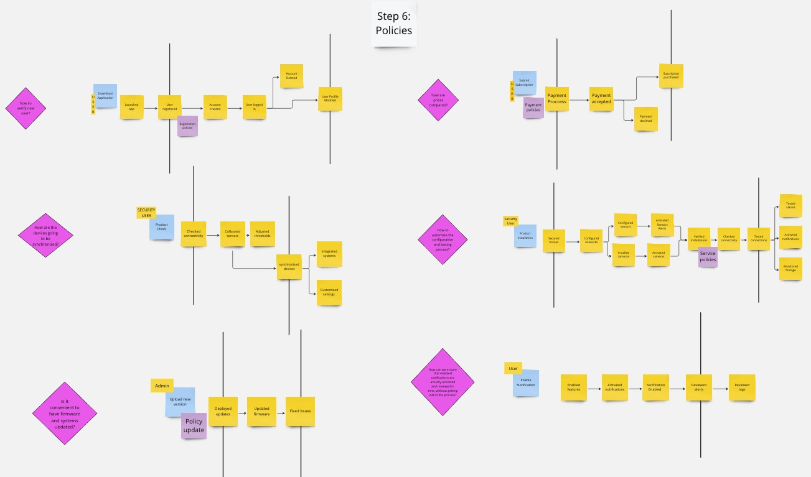
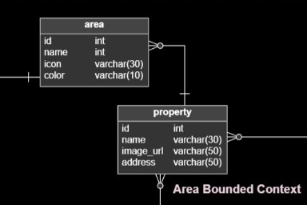

# Report Iot

Carrera: Ingeniería de Software

Nombre del curso: Desarrollo de Soluciones IOT

Sección: WV71

Nombre del profesor: Velasquez Nuñez, Angel Augusto

"Informe de TB1"

Nombre del startup: VerySafe

Nombre del producto: FalconShield

Relación de integrantes:

- Gabriela Soledad Nomberto Ramos
- Dennis Piero Quevedo Yucra
- Max Dayson Sabino Arostegui
- Elvia Guadalupe Arteaga Cruz
- Jamutaq Piero Ortega Vélez

Mes y año: Agosto 2024

Ciclo: 2024-2

## Registro de Versiones del Informe
# Student Outcome
# CAPÍTULO I: INTRODUCTION
## 1.1 Startup Profile
### 1.1.1 Descripción de la Startup
### 1.1.2 Perfiles de integrantes del equipo
## 1.2 Solution Profile
### 1.2.1  Antecedentes y problemática
### 1.2.2 Lean UX Process
#### 1.2.2.1 Lean UX Problem Statements
#### 1.2.2.2 Lean UX Assumptions
#### 1.2.2.3 Lean UX Hypothesis Statements
#### 1.2.2.4 Lean UX Canvas
## 1.3 Segmentos objetivo

# CAPÍTULO II: REQUERIMENTS ELICITATION & ANALYSIS
## 2.1 Competidores
### 2.1.1. Análisis competitivo
## 2.2 Entrevistas
### 2.2.1. Diseño de entrevistas
### 2.2.2. Registro de entrevistas
### 2.2.3. Análisis de entrevistas
## 2.3 Needfinding
### 2.3.1. User Personas
### 2.3.2. User Task Matrix
### 2.3.3. User Journey Mapping
### 2.3.4. Empathy Mapping
### 2.3.5. As-Is Scenario Mapping
## 2.4. Ubiquitous Language

# CAPÍTULO III: REQUIREMENTS SPECIFICATION
## 3.1. To-Be Scenario Mapping.
## 3.2. User Stories.
## 3.3. Impact Mapping.
## 3.4. Product Backlog.

# Capítulo IV: Solution Software Design
## 4.1. Strategic-Level Domain-Driven Design
### 4.1.1. EventStorming
Es una técnica colaborativa que nos permite explorar a fondo el dominio de nuestra aplicación de FalconShield, para realizar el proceso, se llevó a cabo diversas reuniones y con apoyo de la herramienta Miro se pudo desarrollar todo el flujo y los pasos. Para el primer paso se analizaron diversas opiniones sobre los posibles eventos del dominio y se fue clasificando según criterios, tales como frecuencia, relevancia, etc.

1. **Primer paso: Unstructured Exploration**

    Para este paso se analizaron diversas opiniones sobre los posibles eventos del dominio y se fue clasificando según criterios, tales como frecuencia, relevancia, etc.
    
    

2. **Segundo paso: Timelines**
   
    En este paso se procedió a ordenar los eventos en una línea de tiempo, para poder visualizar mejor el flujo de los eventos y las interacciones entre ellos.
    
    
3. **Tercer paso: Pain Points**
   
    En este paso se identifaron posibles cuellos de botella o problemas en el flujo de eventos, para poder abordarlos y solucionarlos de manera efectiva.
    
    

4. **Cuarto paso: Pivotal Points**
   
    En este paso se identificaron puntos o eventos importantes que pueden ser cruciales para el funcionamiento del sistema, y que deben ser considerados con especial atención.

    

5. **Quinto paso: Commands**
    Aquí se identificaron los comandos que se pueden ejecutar en el sistema, y que generan eventos en el dominio.
    
    

#### 4.1.1.1 Candidate Context Discovery
Una vez identificados los eventos clave, se procedió a seguir los otros pasos para finalmente agruparlos en contextos delimitados, que representan áreas de interés o responsabilidades dentro del sistema. Estos contextos se definen en función de la cohesión de los eventos y las reglas de negocio asociadas.

6. **Sexto paso: Policies**
   
    En este paso se identificaron los eventos que deberían ser ejecutados de forma automática por el sistema, sin intervención del usuario o si se requiere de alguna política de negocio para su ejecución.

    

7. **Séptimo paso: Read Models**
   
    En este paso se identificaron los eventos que generan información que debe ser almacenada y consultada posteriormente, para poder visualizar el estado actual del sistema.

    

8. **Octavo paso: External Systems**
   
    En este paso se identificaron los eventos que interactúan con sistemas externos, como APIs de terceros, bases de datos, etc.

    

9. **Noveno paso: Aggregates**
   
    En este paso se identificaron los eventos que están relacionados entre sí y que pueden ser agrupados en un agregado, para poder gestionarlos de forma coherente.

    

10. **Décimo paso: Bounded Contexts**
   
    En este paso se agruparon los eventos en contextos delimitados, que representan áreas de interés o responsabilidades dentro del sistema. Estos contextos se definen en función de la cohesión de los eventos y las reglas de negocio asociadas.

    

Enlace a los diagramas de EventStorming: [EventStorming](https://miro.com/app/board/uXjVKjBJwpE=/?share_link_id=833719450756)

#### 4.1.1.2 Domain Message Flows Modeling

Para el modelado de los flujos de mensajes del dominio, se utilizó la técnica de EventStorming para identificar los eventos clave y las interacciones entre ellos. A partir de estos eventos, se crearon diagramas de flujo de mensajes que representan cómo se comunican los distintos componentes del sistema para lograr los objetivos del negocio. A continuación, se presentan los diagramas de flujo de mensajes para los contextos identificados en el paso anterior.

1. Sincronización del sistema de seguridad:

2. Alerta y notificación de eventos:

3. Alerta y notificación de eventos:

4. Respuesta a la activación de la alarma:

#### 4.1.1.3 Bounded Context Canvases
### 4.1.2. Context Mapping

1. **Events Management Context - Notification Management Context (Customer/Supplier):**
  La relación entre estos dos bounded contexts sigue el patrón Customer/Supplier. El Events Management Context es el proveedor que genera eventos críticos como alertas de seguridad o cambios en el estado de los dispositivos IoT. El Notification Management Context, como cliente, consume estos eventos y se encarga de enviar notificaciones al usuario a través de distintos canales (correo, SMS, etc.).

    

2. **IoT Asset Management Context - Software Update Context (Conformist):**
  El IoT Asset Management Context, encargado de gestionar los dispositivos IoT, depende del Software Update Context para implementar actualizaciones y parches. En este caso, el primero actúa como un Conformist, ya que debe adherirse a las reglas y servicios proporcionados por el Software Update Context sin imponer sus propias reglas, asegurando que las actualizaciones se apliquen de manera consistente.

    

3.	**Security Shield Management System Context - Identity and Access Management Context (Shared Kernel):**
  Ambos bounded contexts comparten un núcleo común (Shared Kernel), ya que el Security Shield Management System necesita autenticar y autorizar a los usuarios y dispositivos, lo cual está estrechamente ligado con las políticas y mecanismos del Identity and Access Management Context. Debido a la naturaleza crítica de la seguridad, estas dos áreas deben compartir información sensible y estar completamente sincronizadas en términos de datos y lógicas de negocio relacionadas con la identidad.

    

4.	**Subscription and Payment Context - Notification Management Context (Anti-Corruption Layer):**
  La relación entre estos dos bounded contexts se beneficia de un Anti-Corruption Layer para traducir y aislar los modelos de dominio. El Subscription and Payment Context maneja información financiera y suscripciones, mientras que el Notification Management Context envía alertas sobre el estado de las suscripciones o pagos. Para evitar que las complejidades del modelo de pagos interfieran con la simplicidad del sistema de notificaciones, se utiliza una capa anti-corrupción que actúa como interfaz entre ambos contexts.

    

### 4.1.3. Software Architecture

En esta parte, mostraremos la representación de la Arquitectura de Software de la solución en base a los modelos C4 para poder obtener una mejor visión de nuestro sistema

#### 4.1.3.1. Software Architecture System Landscape Diagram

Este diagrama nos ofrece una visión mas general de como es la interacción de los usuarios con los sistemas externos, nos permite comprender la conexión de los componentes para contribuir al funcionamiento general de las aplicaciones.

#### 4.1.3.2. Software Architecture Context Level Diagrams

En este tipo de diagramas, se muestra como nuestro sistema interactúa con elementos externos.

En nuestro diagrama mostramos a los usuarios que son los consumidores de inmuebles o negocios que buscan mantener mejorar la seguridad de su inmueble, este esta conectado con la aplicación para que el usuario pueda interactuar y finalmente se conecta con un servicio externo que utilizamos para el envío de notificaciones.

#### 4.1.3.2. Software Architecture Container Level Diagrams

Son representaciones visuales de la arquitectura de software a nivel de contenedores, que muestran cómo se agrupan y se comunican los distintos componentes y servicios dentro de un sistema o aplicación. Estos diagramas proporcionan una vista detallada de la organización de los contenedores de software, lo que ayuda a entender la estructura y las interacciones en la arquitectura general.

Para el diagrama de contenedores desglosamos a nuestros usuarios que son el propietario de inmuebles y el usuario de seguridad, cada uno interactua con nuestras aplicaciones en este caso el propietario interactua con nuestro Single Page Application, Web Application y Mobile Application dado que podra manejar un sistema más integral. Asimismo el usuario de seguridad tendra su tipo de acceso en el Web Application y Mobile Application para el monitoreo de las alarmas de seguridad.
Pasando con las aplicaciones propuestas, tenemos que el Single Page Application que es una primera vista de nuestra propuesta de solucion se conect con el Web Application.
Para el Web Application tenemos que se conecta con la API de la applicacion y esta misma API va a una base de datos de la aplicacion. 
Para lo que es el Mobile Application tiene conexion a su misma base de datos y conexion con el API principal de nuestra aplicacion. 
Asi tambien tenemos nuestros dispositivo IoT, el cual se conecta con el edge API y este a su vez a su base de datos con el API general de todo la aplicacion.
Finalmente, el API principal lo conectamos con nuestro servicio externo de mensajeria AWS SNS.

#### 4.1.3.3. Software Architecture Deployment Diagrams

Son representaciones gráficas que ilustran cómo se despliegan y ejecutan los componentes de software en la infraestructura de hardware o en un entorno de producción.

## 4.2. Tactical-Level Domain-Driven Design
### 4.2.1. Bounded Context: Subscription & Payments context
El Subscription and Payment Context abarca todos los procesos y funciones relacionados con la gestión de suscripciones y pagos dentro de nuestro sistema. Este contexto es responsable de manejar la creación, modificación y cancelación de suscripciones, así como de procesar pagos y gestionar el estado de los mismos. Incluye la administración de detalles relacionados con los clientes, el seguimiento de las facturas y el estado de cada pago, y la sincronización con sistemas externos como Stripe. Asegura que las suscripciones y pagos se gestionen de manera eficiente y precisa, proporcionando una experiencia de servicio continua y sin interrupciones para los usuarios. A continuación, se detallan las clases identificadas en este contexto:

1. Clase Customer
    - Propósito: La clase Customer representa a un cliente en el sistema. Contiene la información esencial del cliente, como su nombre y correo electrónico, y un identificador que enlaza con el sistema de Stripe para gestionar pagos y suscripciones
    - Atributos:
      - `id: string` - Identificador único del cliente
      - `name: String` - Nombre del cliente
      - `email: String` - Correo electrónico del cliente
      - `stripeCustomerId: String` - Identificador del cliente en el sistema de Stripe
    - Métodos:
      - `getCustomerDetails(): CustomerDetails` - Retorna los detalles básicos del cliente (nombre y correo electrónico)
      - `registerStripeCustomer(): void` - Registra al cliente en Stripe
   	- Relaciones:
     	- `1...n` con Subscription, ya que un cliente puede tener varias suscripciones activas.

    

2. Clase Subscription
    - Propósito: La clase Subscription gestiona las suscripciones de un cliente a un servicio específico. Mantiene los detalles esenciales, como el estado de la suscripción y las fechas de inicio y finalización. Los detalles más complejos de la suscripción son manejados por Stripe.
    - Atributos:
      - `id: string` - Identificador único de la suscripción
      - `status: string` - Estado actual de la suscripción (ejm: ACTIVA, CANCELADA, etc.)
      - `planId: string` - Identificador del plan de suscripción
      - `status: string` - Estado actual de la suscripción (activo, inactivo, cancelado)
      - `startDate: Date` - Fecha de inicio de la suscripción
      - `endDate: Date` - Fecha de finalización de la suscripción
      - `stripeSubscriptionId: string` - Identificador de la suscripción en Stripe
    - Métodos:
      - `getSubscriptionDetails(): SubscriptionDetails` - Retorna los detalles de la suscripción
      - `cancelSubscription(): void` - Cancela la suscripción
    - Relaciones:
      - `n...1` con Customer, ya que una suscripción pertenece a un cliente.
      - `1...n` con Payment, una suscripción puede tener múltiples pagos.

    

3. Clase Payment
    - Propósito: Esta clase almacena la información de los pagos realizados por un cliente en relación con una suscripción. Aunque Stripe gestiona el procesamiento de pagos, esta clase registra información relevante localmente, como el estado y monto del pago.
    - Atributos:
      - `id: string` - Identificador único del pago
      - `amount: double` - Monto del pago
      - `currency: string` - Moneda en la que se realizó el pago (ejm: USD, EUR)
      - `paymentDate: Date` - Fecha en la que se procesó el pago
      - `status: string` - Estado actual del pago (ejm: SUCCEEDED, FAILED)
      - `stripePaymentId: string` - Identificador del pago en el sistema de Stripe
    - Métodos:
      - `getPaymentDetails(): PaymentDetails` - Retorna los detalles del pago
    - Relaciones:
      - `n...1` con Subscription, un pago pertenece a una suscripción.
      - `1...n` con Invoice, un pago puede tener varias facturas asociadas.

    

4. Clase Invoice
    - Propósito: Esta clase representa una factura generada por un pago. Aunque Stripe emite las facturas, esta clase localiza la información esencial de las mismas, como el monto total y la fecha de emisión.
    - Atributos:
      - `id: string` - Identificador único de la factura
      - `invoiceDate: Date` - Fecha de emisión de la factura
      - `totalAmount: double` - Monto total de la factura
      - `stripeInvoiceId: string` - Identificador de la factura en Stripe
    - Métodos:
      - `getInvoiceDetails(): InvoiceDetails` - Retorna los detalles de la factura
    - Relaciones:
      - `n...1` con Payment, una factura pertenece a un pago.

    

#### 4.2.1.1. Domain Layer

- Clases Core de la aplicación:
  - Entities:
    1. Customer: Representa a un usuario de la aplicación móvil que se suscribe a servicios IoT de seguridad. Esta entidad contiene la información básica del cliente y está relacionada con las suscripciones que tiene activas.
    

    2. Subscription: Representa una suscripción de un cliente a un plan específico. Esta clase encapsula el estado y los detalles relevantes de la suscripción, como su duración y la integración con Stripe.
    

    3. Payment: Esta entidad representa un pago asociado a una suscripción, aunque Stripe procesa los pagos, esta entidad almacena localmente la información esencial del pago.
    

    4. Invoice: La entidad Invoice representa una factura generada por un pago hecho por Stripe, esta entidad almacena localmente los detalles esenciales de la factura.
    

  - Value Objects:
    1. SubscriptionPlan: Encapsula los detalles de un pago, como el monto, la moneda y la fecha de procesamiento. Este objeto se utiliza para transmitir información de pago entre las capas de la aplicación.
    

    2. Money: Encapsula el concepto de dinero, incluyendo el monto y la moneda. Se utiliza en los pagos, planes de suscripción y otros.    
    

    3. Currency: Este enumerado define los códigos de moneda estándar que se utilizan en la aplicación. Se utiliza para garantizar la consistencia en la representación de monedas en toda la aplicación.
    
    
    4. SubscriptionStatus: Este enumerado define los posibles estados de una suscripción, como activa, cancelada o pendiente, se utiliza para controlar el ciclo de vida de las suscripciones.
    

    5. PaymentStatus: Este enumerado define los estados posibles de un pago, como exitoso, fallido o pendiente. Se utiliza para rastrear el estado de los pagos.
    
  
  - Aggregates:
    1. CustomerAggregate: Eencapsula la lógica de negocio relacionada con los clientes y sus suscripciones. Esto permite gestionar de manera coherente y transaccional las operaciones relacionadas con los clientes.
    
  
  - Domain Services:
    1. SubscriptionService: Este servicio contiene la lógica de negocio relacionada con la gestión de suscripciones, como la creación, cancelación y renovación de suscripciones. Este servicio se encarga de coordinar las operaciones de suscripción.
    

- Reglas de negocio:
  - Las suscripciones deben renovarse automáticamente a menos que se cancelen antes de la fecha de renovación.
  - No se puede cancelar una suscripción con pagos pendientes.
  - Los pagos deben procesarse de manera segura y reflejarse en el estado de la suscripción correspondiente.
  - Los pagos fallidos deben ser gestionados adecuadamente para evitar interrupciones en el servicio.
  - Las facturas deben generarse automáticamente después de cada pago exitoso.
  - La información del cliente, como su correo electrónico, debe estar siempre actualizada en Stripe.

#### 4.2.1.2. Interface Layer
En esta capa se presentan las clases que permiten la comunicación entre la capa de dominio y la capa de aplicación, manejando las solicitudes de los usuarios y devolviendo las respuestas adecuadas. Para el contexto de Subscription & Payments, se han identificado los siguientes controladores:

- CustomerController: expone las operaciones relacionadas con los clientes de la aplicación. Permite la creación, actualización y consulta de los clientes, así como la gestión de su relación con Stripe. Al crear un cliente, se genera un identificador (stripeCustomerId) que es guardado en la entidad local y se sincroniza con el sistema de Stripe.
  

- SubscriptionController: gestiona las operaciones relacionadas con las suscripciones de los clientes. Este controlador permite crear nuevas suscripciones, actualizar el estado de las mismas y cancelarlas, todo esto interactuando con los servicios de Stripe.
  

- PlanController: gestiona los planes de suscripción disponibles en la aplicación. Los usuarios pueden consultar los planes disponibles, sus características y precios.
  

#### 4.2.1.3. Application Layer
Esta capa, para el Subscription and Payment Context, se definen los flujos de negocio a través de clases de tipo Command Handlers y Event Handlers, asegurando que los procesos de suscripción, pago y gestión de eventos externos (como los webhooks de Stripe) se manejen correctamente. Estos handlers permiten que el sistema sea reactivo, eficiente y mantenga la consistencia entre las operaciones internas y los eventos externos. A continuación, se presentan los handlers y eventos identificados para este contexto:

- Command Handlers:
  1. CreateSubscriptionCommandHandler: Maneja el proceso de creación de una nueva suscripción para un cliente. Este handler se encarga de validar los datos de entrada y crea la suscripción tanto en el sistema como en Stripe.
  

  2. ProcessPaymentCommandHandler: Se encarga de guardar el pago procesado por Stripe en la base de datos y mantener la consistencia entre el estado del pago y la suscripción asociada.
  

  3. CancelSubscriptionCommandHandler: Gestiona la cancelación de una suscripción existente. Este handler verifica si la suscripción puede ser cancelada, actualiza su estado y notifica a Stripe para reflejar el cambio.
  

- Event Handlers:
  1. StripeWebhookEventHandler: Maneja los eventos provenientes de Stripe a través de webhooks. Se asegura de procesar adecuadamente los eventos de facturación, pagos fallidos, renovaciones de suscripciones, etc.
  

  2. SubscriptionExpiredEventHandler: Reacciona cuando una suscripción ha llegado a su fecha de finalización sin ser renovada. Gestiona la lógica relacionada con la expiración, como la notificación al cliente y la desactivación de servicios vinculados.
  

  3. PaymentFailedEventHandler: Este handler reacciona a eventos de pagos fallidos, ya sea generados por el dominio o recibidos de Stripe. Se encarga de notificar al cliente, reintentar el pago y, si es necesario, cancelar la suscripción.
  

- Capabilities Cubiertos: 
  
  Las clases de la Application Layer están diseñadas para cubrir los siguientes capabilities del sistema:

	1.	Gestión de Suscripciones: A través de los Command Handlers como CreateSubscriptionCommandHandler y CancelSubscriptionCommandHandler, el sistema permite a los clientes gestionar sus suscripciones, incluyendo su creación, cancelación y renovación.
	2.	Procesamiento de Pagos: Mediante ProcessPaymentCommandHandler y event handlers como PaymentFailedEventHandler, el sistema registra los pagos, incluyendo la integración con Stripe y manejo de pagos fallidos.
	3.	Manejo de Eventos Externos (Stripe Webhooks): StripeWebhookEventHandler garantiza que el sistema reaccione correctamente a los eventos provenientes de Stripe, sincronizando los estados de suscripciones y pagos entre la plataforma y el sistema.
	4.	Manejo de Expiración de Suscripciones: SubscriptionExpiredEventHandler asegura que, cuando una suscripción expire, se tomen las acciones adecuadas, como notificar al cliente y desactivar servicios asociados.

#### 4.2.1.4. Infrastructure Layer
Esta capa es responsable de proporcionar la implementación de las operaciones que interactúan con recursos externos, como bases de datos, servicios de terceros (por ejemplo, Stripe), sistemas de mensajería y otros. En esta capa, también se implementan los Repositories definidos en la Domain Layer, que permiten la persistencia de las entidades del sistema. A continuación, se presentan las clases clave de esta capa, con una breve descripción de su función en el contexto del sistema:

1. StripePaymentGateway: Es la clase encargada de la integración con el sistema de pagos de Stripe. Implementa las operaciones necesarias para gestionar pagos, suscripciones y facturación a través de la API de Stripe.

2. NotificationService: Se encarga de enviar notificaciones a los usuarios, ya sea por correo electrónico, SMS o cualquier otro medio configurado. Es utilizada para notificar eventos importantes, como pagos fallidos, renovaciones de suscripción o vencimientos.

3. StripeWebhookService: Se encarga de procesar las notificaciones recibidas desde Stripe a través de webhooks. Esta clase recibe los eventos de Stripe y los transforma en eventos internos del dominio que los Event Handlers procesan.

4. PaymentRepository: Esta clase maneja las operaciones de almacenamiento y recuperación de información relacionada con los pagos realizados por los clientes.

5. SubscriptionRepository: Esta clase se encarga de manejar las operaciones de persistencia de las suscripciones en la base de datos.

6. CustomerRepository: Se encarga de gestionar la persistencia de la información de los clientes, incluyendo la sincronización con el sistema de Stripe.

#### 4.2.1.5. Bounded Context Software Architecture Component Level Diagrams
En esta sección, el equipo explica y presenta los Component Diagrams de C4 Model para cada uno de los Containers considerados para el bounded context. En estos diagramas el equipo busca reflejar la descomposición de cada Container para identificar los bloques estructurales principales y sus interacciones. Un Component Diagram debe mostrar cómo un container está conformado por components, qué son cada uno de dichos components, sus responsabilidades y los detalles de implementación/tecnología

#### 4.2.1.6. Bounded Context Software Architecture Code Level Diagrams
##### 4.2.1.6.1. Bounded Context Domain Layer Class Diagrams

El diagrama UML del bounded context Subscription & Payments muestra las clases y sus relaciones en la capa de dominio. Las entidades principales, como Customer, Subscription, Payment e Invoice, se relacionan entre sí para representar la lógica de negocio del contexto. Además, se incluyen los Value Objects y Aggregates que encapsulan la información y la lógica de negocio relacionada con las suscripciones y pagos.

##### 4.2.1.6.2. Bounded Context Database Design Diagram

El diseño de la base de datos para el contexto Subscription & Payments refleja la estructura de las entidades y sus relaciones. Cada tabla representa una entidad del dominio, con sus atributos y claves primarias y foráneas. La base de datos se ha diseñado para garantizar la integridad de los datos y soportar las operaciones de gestión de suscripciones y pagos.

#### 4.2.2. Bounded Context: Device
#### 4.2.2.1 Domain Layer
- **Entidades de dominio**:
  - **Device**: Representa un dispositivo IoT instalado en el inmueble, incluyendo sus características y estado.
  - **Installation**: Representa la instalación de un dispositivo en un inmueble, incluyendo la fecha de instalación y el estado de la instalación.
  - **Property**: Representa la propiedad (inmueble) donde los dispositivos están instalados, incluyendo detalles sobre la ubicación y características.

- **Objetos de valor**:
  - **DeviceConfiguration**: Contiene la configuración específica de cada dispositivo, como el tipo de dispositivo, configuraciones de red y parámetros operativos.
  - **InstallationDetails**: Información sobre la instalación del dispositivo, como la ubicación exacta y el método de instalación.

- **Repositorios**:
  - **DeviceRepository**: Maneja la persistencia de los dispositivos.
  - **InstallationRepository**: Maneja la persistencia de las instalaciones de dispositivos.
  - **PropertyRepository**: Maneja la persistencia de las propiedades donde se instalan los dispositivos.

#### 4.2.2.2 Interface Layer
- **DeviceController**: Gestiona la configuración y visualización de dispositivos IoT. Permite a los usuarios ver, agregar y actualizar la información de los dispositivos instalados, así como revisar el estado y configuraciones de cada dispositivo.

- **InstallationController**: Maneja la gestión de la instalación de dispositivos. Permite a los usuarios iniciar nuevas instalaciones, actualizar el estado de las instalaciones y visualizar el historial de instalaciones.

- **PropertyController**: Gestiona la información de las propiedades donde los dispositivos están instalados. Permite a los usuarios ver detalles sobre las propiedades y asociar dispositivos con propiedades específicas.

#### 4.2.2.3. Application Layer
- **Command Handlers**:
  - **RegisterDeviceCommandHandler**: Procesa la solicitud para registrar un nuevo dispositivo IoT en el sistema. Este handler maneja la creación de registros para nuevos dispositivos y su configuración inicial.
  - **UpdateDeviceConfigurationCommandHandler**: Maneja las actualizaciones en la configuración de un dispositivo existente.
  - **InstallDeviceCommandHandler**: Procesa la solicitud para instalar un dispositivo en una propiedad. Maneja la asociación del dispositivo con la propiedad y actualiza el estado de la instalación.
  - **UninstallDeviceCommandHandler**: Maneja la solicitud para desinstalar un dispositivo, actualizando el estado del dispositivo y la propiedad asociada.

- **Event Handlers**:
  - **DeviceRegisteredEventHandler**: Responde a eventos que confirman la creación y registro exitoso de un dispositivo. Actualiza el estado del dispositivo en la base de datos y emite eventos relacionados.
  - **DeviceConfigurationUpdatedEventHandler**: Maneja eventos que indican que la configuración de un dispositivo ha sido actualizada. Actualiza la base de datos y notifica a los usuarios correspondientes.
  - **DeviceInstalledEventHandler**: Maneja eventos de instalación exitosa de un dispositivo. Actualiza el estado de la instalación y emite notificaciones.
  - **DeviceUninstalledEventHandler**: Responde a eventos que indican que un dispositivo ha sido desinstalado. Actualiza el estado en la base de datos y emite notificaciones relacionadas.

#### 4.2.2.5. Bounded Context Software Architecture Component Level Diagrams

Este diagrama proporciona una vista de la estructura de la arquitectura y cómo los diferentes componentes interactúan dentro del aggregate Devices.

#### 4.2.2.6.1. Bounded Context Domain Layer Class Diagrams
El diagrama UML del bounded context "Devices" ilustra las clases Property, Devices, Installation y DeviceConfigurations con sus respectivos atributos y métodos. Las clases también contienen métodos para crear, actualizar, validar y eliminar instancias. 

#### 4.2.2.6.1. Bounded Context Domain Layer Class Diagrams
Este diagrama de base de datos representa las tablas y las relaciones dentro del bounded context "Devices". Se define la entidad devices, que almacena información sobre ek tipo y la descripción del dispositivo de seguridad.La entidad devices_type almacena el tipo de dispositivo.

<!-- TODO -->
### 4.2.3. Bounded Context: Areas
#### 4.2.3.1. Domain Layer
- Entities:
  - Area: Representa un área específica en la que se colocan los dispositivos.
    - Atributos: id, name, icon, color.
  - Property: Representa una propiedad que puede tener múltiples áreas.
    - Atributos: id, name, image_url, address.

- Value Objects:
  - AreaId: Identificador único de un área.
  - PropertyId: Identificador único de una propiedad.

- Aggregates:
  - AreaAggregate: Agregado raíz que encapsula las operaciones relacionadas con las áreas, incluyendo la creación, actualización y eliminación de áreas.
  - PropertyAggregate: Agregado raíz que encapsula las operaciones relacionadas con las propiedades, incluyendo la asociación con áreas.

- Domain Services:
  - AreaService: Define las operaciones de negocio relacionadas con las áreas, como la creación, actualización y eliminación de áreas.
  - PropertyService: Define las operaciones de negocio relacionadas con las propiedades, como la gestión de áreas asociadas.

- Repositories:
  - AreaRepository: Interfaz que define las operaciones de persistencia relacionadas con las áreas.
  - PropertyRepository: Interfaz que define las operaciones de persistencia relacionadas con las propiedades.

#### 4.2.3.2. Interface Layer
- API Endpoints:
  - POST /areas: Crea una nueva área.
  - PUT /areas/{areaId}: Actualiza una área existente.
  - DELETE /areas/{areaId}: Elimina una área.
  - GET /areas/{areaId}: Obtiene los detalles de una área.
  - POST /properties: Crea una nueva propiedad.
  - PUT /properties/{propertyId}: Actualiza una propiedad existente.
  - DELETE /properties/{propertyId}: Elimina una propiedad.
  - GET /properties/{propertyId}: Obtiene los detalles de una propiedad.

- DTOs:
  - AreaDTO: Representa los datos de un área para ser enviados o recibidos a través de la API.
  - PropertyDTO: Representa los datos de una propiedad para ser enviados o recibidos a través de la API.

- Controllers:
  - AreaController: Controlador que gestiona las operaciones relacionadas con las áreas, como la creación, actualización y eliminación de áreas.
  - PropertyController: Controlador que gestiona las operaciones relacionadas con las propiedades, como la creación, actualización y eliminación de propiedades.

#### 4.2.3.3. Application Layer
- Application Services:
  - AreaApplicationService: Servicio de aplicación que coordina las operaciones relacionadas con las áreas, como la creación, actualización y eliminación de áreas.
  - PropertyApplicationService: Servicio de aplicación que gestiona las operaciones relacionadas con las propiedades, como la creación, actualización y eliminación de propiedades.

- Commands/Queries:
  - CreateAreaCommand: Comando para crear una nueva área.
  - UpdateAreaCommand: Comando para actualizar una área existente.
  - DeleteAreaCommand: Comando para eliminar una área.
  - GetAreaQuery: Consulta para obtener los detalles de una área.
  - CreatePropertyCommand: Comando para crear una nueva propiedad.
  - UpdatePropertyCommand: Comando para actualizar una propiedad existente.
  - DeletePropertyCommand: Comando para eliminar una propiedad.
  - GetPropertyQuery: Consulta para obtener los detalles de una propiedad.

- Events:
  - AreaCreatedEvent: Evento que se dispara cuando se crea una nueva área.
  - AreaUpdatedEvent: Evento que se dispara cuando se actualiza una área.
  - AreaDeletedEvent: Evento que se dispara cuando se elimina una área.
  - PropertyCreatedEvent: Evento que se dispara cuando se crea una nueva propiedad.
  - PropertyUpdatedEvent: Evento que se dispara cuando se actualiza una propiedad.
  - PropertyDeletedEvent: Evento que se dispara cuando se elimina una propiedad.

#### 4.2.3.4. Infrastructure Layer
- Repositories Implementations:
  - AreaRepositoryImpl: Implementación concreta del repositorio de áreas que se encarga de la persistencia de las áreas en la base de datos.
  - PropertyRepositoryImpl: Implementación concreta del repositorio de propiedades que se encarga de la persistencia de las propiedades en la base de datos.

- External Services:
  - En este contexto, no se han identificado servicios externos específicos para las áreas y propiedades, pero podrían incluir servicios de almacenamiento de imágenes o integraciones con sistemas de mapeo si se requieren en el futuro.

#### 4.2.3.5. Bounded Context Software Architecture Component Level Diagrams

#### 4.2.3.6. Bounded Context Software Architecture Code Level Diagrams
#### 4.2.3.6.1. Bounded Context Domain Layer Class Diagrams
El diagrama UML del bounded context "Areas" ilustra las clases Area y Property con sus respectivos atributos y métodos. En este contexto, Area representa las distintas áreas dentro de una propiedad, mientras que Property representa el conjunto completo de estas áreas. Cada clase tiene atributos básicos como identificadores, nombres, y otras características relevantes. Las clases también contienen métodos para crear, actualizar y eliminar instancias. La relación entre Property y Area está representada mediante una composición, donde una propiedad contiene múltiples áreas, lo que refuerza la relación de uno a muchos entre ambas clases.

#### 4.2.3.6.2. Bounded Context Database Design Diagram
Este diagrama de base de datos representa las tablas y las relaciones dentro del bounded context "Areas". Se define la tabla area, que almacena información sobre las áreas específicas donde se colocan dispositivos de seguridad, y la tabla property, que representa una propiedad, la cual puede contener múltiples áreas. La relación entre estas dos entidades es de uno a muchos, donde una propiedad puede tener varias áreas asociadas. Los atributos principales incluyen identificadores únicos para cada entidad, nombres descriptivos, y detalles adicionales como iconos y colores para las áreas, y direcciones para las propiedades.

### 4.2.4. Bounded Context: User context
El User Context abarca los procesos y funciones relacionados con la gestión del usuario y el rol que desempeña cada uno dentro de nuestro sistema. Aqui podemos manejar la creación, modificación o eliminación del usuario de nuestro sistema, asimismo podemos gestionar la asiganción de roles.

1. Clase User
   * Propósito: La clase User representa a los usuarios del sistema. Un usuario puede tener un rol asignado
   * Atributos:
     * `id: string`: Identificador único del usuario
     * `firstname: string`: Nombre del usuario
     * `lastname: string`: Apellido del usuario
     * `email: string`: Correo electrónico del usuario
     * `password: string`: Contraseña cifrada del usuario
     * `phone: number`: Número Telefónico del usuario
     * `dni: char(8)`: Documento Nacional de Identidad del usuario
     * `rols_id: int`: Identificador del rol asignado al usuario
   * Métodos:
     * `getUserDetails(): void` - Retorna los detalles importantes del usuario para el inicio de sesión.
     * `registerUser(): void` - Registro del usuario en el sistema
   * Relaciones:
     * `n...1` con Roles ya que un rol puede tener varios usuarios

2. Clase Roles
   * Propósito: Representa los distintos roles que los usuarios puedan tener dentor del sistema para que determine los permisos y acciones que puedan realizar.
   * Atributos:
     * `id: string`: Identificador único del rol
     * `type: string`: Tipo del rol que podría desempeñar el usuario.
   * Relaciones: 
     * `1...n` con User dado que un rol puede tener varios usuario.

#### 4.2.4.1. Domain Layer
En la capa de dominio encontramos nuestras clases centrales como núcleo de nuestro sistema y las reglas de negocio que incluyen lo siguiente:

* Entities:
  * User: Representa a un usuario del sistema y debe de ser único.
    * Atributos: id, firstname, lastname, email, password,phone, dni
  * Role: Representa el rol que desempeña el usuario dentro de la aplicacion.
    * Atributos: id, type.

* Value Objects:
  * UserId: Identificador único de cada usuario
  * RoleId: Identificador único de cada rol asignado a un usuario
  * Password: Objeto de valor para manejar contraseñas seguras y encriptadas.
  * Email: Objeto de valor para manejar correos únicos por cada usuario.
  
* Aggregates: 
  * UserAggregate: Es un agregado que incluye la entidad de usuario y los roles relacionados a ella. Además encapsula a las reglas y lógica de negocio.

* Domain Services: 
  * AuthenticationSerivce: Puede ser incluido un servicio de dominio encargado de la autenticación del usuario
  
* Repositories: 
  * UserRepository: Define los métodos para almacenar, modificar, eliminar y recuperar información de los usuarios en la base de datos
  * RoleRepository: Define los métofdos para gestionar la persistencia de roles.

#### 4.2.4.2. Interface Layer
Aquí manejamos las interacciones y solicitudes entre el sistema y los usuarios y consigo devolviendo respuestas optimas. Para el Bounded Context de User tenemos lo siguiente:

* Controllers:
  * UserController: Se expone las operaciones relacionadas con el usuario como la creción, actualización, consulta y eliminación del usuario. Al crearse un usuario, este a su vez se le asigna un rol.
  * RoleController: Gestiona las peticiones relacionadas con la administración de roles, como la creación de nuevos roles o la modificación de roles existentes.
  

#### 4.2.4.3. Application Layer
Para esta capa definimos los flujos de negocios a traves de clases de tipo Command  Handlers y Event Handlers, asegurando asi el manejor de las clases correctamente.

* Command Handlers:
  * CreateUserCommandHandler: Maneja la lógica de creación de nuevos usuarios, asegurándose que cada uno cumpla con todas las reglas de negocio, como validar el correo único y el cifrado de contraseñas
  * AssignRoleToUserCommandHandler: Gestiona la asiganción de roles a los usuarios
* Event Handlers:
  * UserRegisteredEventHandler: Este handler puede enviar una notificación cuando un nuevo usuario es registrado existosamente en el sistema

#### 4.2.4.4. Infrastructure Layer
En esta capa veremos las relaciones de nuestreas clases con las conexiones a los servicios externos como las bases de datos

**Repositories:**
  * UserRepository: Implementacion de la interfaz de repositorio para acceder a la base de datos que almacena la información de los usuarios.
  * RoleRepository: Implementacion de la interfaz de repositorio para gestionar la persistencia de roles a travez de la base de datos.

**External Service:**
* MessageService: Servicio externo que se utiliza para enviar notificaciones a los usuarios en caso haya cambios en la aplicación móvil o una gestión de alarmas.

#### 4.2.4.5. Bounded Context Software Architecture Component Level Diagrams
En esta parte presentaremos el Diagrama de componentes en el modelo C4, mostraremos las descomposicion del container en componentes y sus interacciones

#### 4.2.4.6. Bounded Context Software Architecture Code Level Diagrams
##### 4.2.4.6.1. Bounded Context Domain Layer Class Diagrams
##### 4.2.4.6.2. Bounded Context Database Design Diagram
En el diagrama de base de datos de usuario podemos ver la relacion existente de las tablas dentro del bounded context "User". Aqui definimos la tabla usuario, en el cual almacenamos información importante del usuario para que pueda registrarse en la aplicacion que a su vez esta relacionada con un rol de usuario el cual asigna los permisos al sistema dependiendo el rol que desempeñen dentro de nuestra aplicación dando conocer asi que un rol lo puede desempeñar varios usuarios pero un usuario tiene un unico rol. Los atributos los cuales manejamos incluyen identificadores unicos para cada entidad asi como detalles principales que debemos tener para la aplicacion. 

### 4.2.5. Bounded Context: Events context
El Event Context abarca los procesos y funciones relacionados con la gestión de los eventos y/o sucesos que puedan ocurrir a traves de nuestro sistema de alarma. Podemos manejar la creación o modificación de las alarmas según el usuario lo crea conveniente.

1. Clase Events
   * Propósito: La clase Events representa a los eventos que puedan suceder por las alarmas puestas en nuestros.
   * Atributos:
     * `id: string`: Identificador único del evento
     * `title: string`: Título del suceso 
     * `description: string`: Descripción del evento sucedido
     * `timestamp: string`: Hora en el cual sucedio el evento
   * Métodos:
     * `getEventDetails(): void` - Retorna los detalles importantes del evento para el registro correspondiente.
     * `registerEvent(): void` - Registro de un nuevo evento en el sistema
   * Relaciones:
     * `1...1` con Tipo de Evento ya que un tipo de evento puede tener un evento que sucedió

2. Clase Events_type
   * Propósito: Representa los distintos roles que los usuarios puedan tener dentor del sistema para que determine los permisos y acciones que puedan realizar.
   * Atributos:
     * `id: string`: Identificador único del rol
     * `type: string`: Tipo del rol que podría desempeñar el usuario.
   * Relaciones: 
     * `1...1` con Type dado que un evento puede tener un tipo de evento.

#### 4.2.4.1. Domain Layer
En la capa de dominio encontramos nuestras clases centrales como núcleo de nuestro sistema y las reglas de negocio que incluyen lo siguiente:

* Entities:
  * Events: Representa a un evento que pudo ocurrir y capto nuestro sistema de seguridad.
    * Atributos: id, title, description, timestamp.
  * EventsType: Representa el tipo de evento que desempeña el evento dentro de la aplicacion.
    * Atributos: id, type.

* Value Objects:
  * EventId: Identificador único de cada usuario
  * TypeEventId: Identificador único de cada rol asignado a un usuario.
  
* Aggregates: 
  * EventsAggregate: Es un agregado que incluye la entidad de usuario y los roles relacionados a ella. Además encapsula a las reglas y lógica de negocio.

* Domain Services: 
  * MessageService: Puede ser incluido un servicio de dominio encargado de la notificación al usuario de un evento ocurrido.
  
* Repositories: 
  * EventRepository: Define los métodos para almacenar, modificar, eliminar y recuperar información de los usuarios en la base de datos
  * EventTypeRepository: Define los métofdos para gestionar la persistencia de roles.

#### 4.2.4.2. Interface Layer
Aquí manejamos las interacciones y solicitudes entre el sistema y los usuarios y consigo devolviendo respuestas optimas. Para el Bounded Context de Event tenemos lo siguiente:

* Controllers:
  * EventController: Se expone las operaciones relacionadas con el evento como la creción, actualización y consulta del evento. Al crearse un evento, este a su vez.
  * EventTypeController: Gestiona las peticiones relacionadas con la administración de tipos de eventos, como la creación de nuevos eventos o la modificación de eventos existentes.
  

#### 4.2.4.3. Application Layer
Para esta capa definimos los flujos de negocios a traves de clases de tipo Command  Handlers y Event Handlers, asegurando asi el manejor de las clases correctamente.

* Command Handlers:
  * CreateEventCommandHandler: Maneja la lógica de creación de nuevos eventos, asegurándose que cada uno cumpla con todas las reglas de negocio.
  * AssignTypeToEventCommandHandler: Gestiona la asiganción de tipos de eventos a los eventos
* Event Handlers:
  * EventRegisteredEventHandler: Este handler puede enviar una notificación cuando un nuevo evento esta sucediendo.

#### 4.2.4.4. Infrastructure Layer
En esta capa veremos las relaciones de nuestreas clases con las conexiones a los servicios externos como las bases de datos

**Repositories:**
  * EventRepository: Implementacion de la interfaz de repositorio para acceder a la base de datos que almacena la información de los eventos.
  * EvenTypeRepository: Implementacion de la interfaz de repositorio para gestionar el tipo de evento a travez de la base de datos.

**External Service:**
* MessageService: Servicio externo que se utiliza para enviar notificaciones a los usuarios en caso haya cambios en la gestión de alarmas.

#### 4.2.4.5. Bounded Context Software Architecture Component Level Diagrams
En esta parte presentaremos el Diagrama de componentes en el modelo C4, mostraremos las descomposicion del container en componentes y sus interacciones

#### 4.2.4.6. Bounded Context Software Architecture Code Level Diagrams
##### 4.2.4.6.1. Bounded Context Domain Layer Class Diagrams
##### 4.2.4.6.2. Bounded Context Database Design Diagram
En el diagrama de base de datos de usuario podemos ver la relacion existente de las tablas dentro del bounded context "Event". Aqui definimos la tabla event, en el cual almacenamos información importante del evento o suceso que suceda en el momento que pueda activarse una alarma, además esta esta relacionado con un tipo de evento para una mejor gestión al momento de registrar el evento ocurrido. Los atributos los cuales manejamos incluyen identificadores unicos para cada entidad asi como detalles principales que debemos tener para la aplicacion. 

