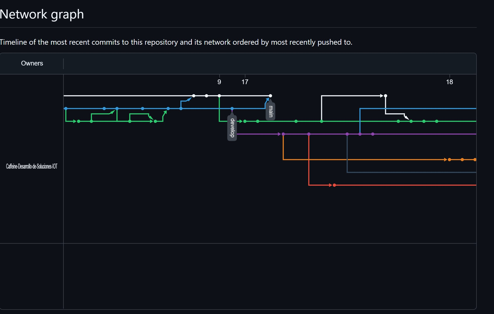
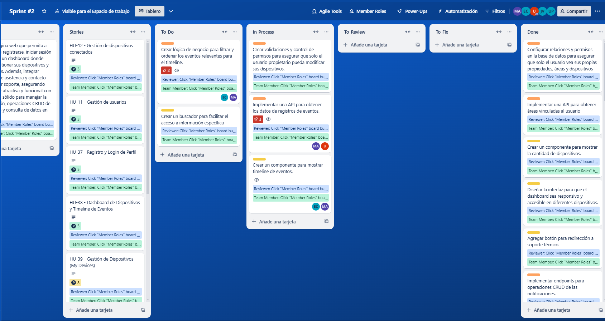
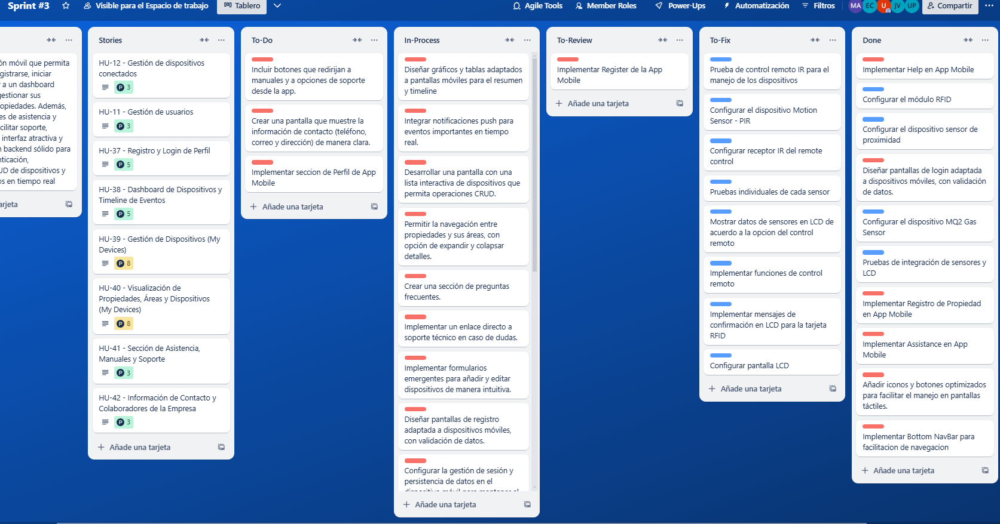

# Report Iot

Carrera: Ingeniería de Software

Nombre del curso: Desarrollo de Soluciones IOT

Sección: WV71

Nombre del profesor: Velasquez Nuñez, Angel Augusto

"Informe de TB1"

Nombre del startup: VerySafe

Nombre del producto: FalconShield

Relación de integrantes:

- Gabriela Soledad Nomberto Ramos
- Dennis Piero Quevedo Yucra
- Max Dayson Sabino Arostegui
- Elvia Guadalupe Arteaga Cruz
- Jamutaq Piero Ortega Vélez

Mes y año: Agosto 2024

Ciclo: 2024-2

## Registro de Versiones del Informe
# Student Outcome
# CAPÍTULO I: INTRODUCTION
## 1.1 Startup Profile
### 1.1.1 Descripción de la Startup
### 1.1.2 Perfiles de integrantes del equipo
## 1.2 Solution Profile
### 1.2.1  Antecedentes y problemática
### 1.2.2 Lean UX Process
#### 1.2.2.1 Lean UX Problem Statements
#### 1.2.2.2 Lean UX Assumptions
#### 1.2.2.3 Lean UX Hypothesis Statements
#### 1.2.2.4 Lean UX Canvas
## 1.3 Segmentos objetivo

# CAPÍTULO II: REQUERIMENTS ELICITATION & ANALYSIS
## 2.1 Competidores
### 2.1.1. Análisis competitivo
## 2.2 Entrevistas
### 2.2.1. Diseño de entrevistas
### 2.2.2. Registro de entrevistas
### 2.2.3. Análisis de entrevistas
## 2.3 Needfinding
### 2.3.1. User Personas
### 2.3.2. User Task Matrix
### 2.3.3. User Journey Mapping
### 2.3.4. Empathy Mapping
### 2.3.5. As-Is Scenario Mapping
## 2.4. Ubiquitous Language

# CAPÍTULO III: REQUIREMENTS SPECIFICATION
## 3.1. To-Be Scenario Mapping.
## 3.2. User Stories.
## 3.3. Impact Mapping.
## 3.4. Product Backlog.

# CAPÍTULO IV: SOLUTION SOFTWARE DESIGN
## 4.1. Strategic-Level Domain-Driven Design
### 4.1.1. EventStorming
#### 4.1.1.1 Candidate Context Discovery
#### 4.1.1.2 Domain Message Flows Modeling
#### 4.1.1.3 Bounded Context Canvases
### 4.1.2. Context Mapping
### 4.1.3. Software Architecture
#### 4.1.3.1. Software Architecture System Landscape Diagram
#### 4.1.3.2. Software Architecture Context Level Diagrams
#### 4.1.3.2. Software Architecture Container Level Diagrams
#### 4.1.3.3. Software Architecture Deployment Diagrams
## 4.2. Tactical-Level Domain-Driven Design
### 4.2.X. Bounded Context: <Bounded Context Name>
#### 4.2.X.1. Domain Layer
#### 4.2.X.2. Interface Layer
#### 4.2.X.3. Application Layer
#### 4.2.X.4. Infrastructure Layer
#### 4.2.X.5. Bounded Context Software Architecture Component Level Diagrams
#### 4.2.X.6. Bounded Context Software Architecture Code Level Diagrams
##### 4.2.X.6.1. Bounded Context Domain Layer Class Diagrams
##### 4.2.X.6.2. Bounded Context Database Design Diagram

# CAPÍTULO V: SOLUTION UI/UX DESIGN
## 5.1. Style Guidelines
### 5.1.1. General Style Guidelines
### 5.1.2. Web, Mobile and IoT Style Guidelines
## 5.2. Information Architecture
### 5.2.1. Organization Systems
### 5.2.2. Labeling Systems
### 5.2.3. SEO Tags and Meta Tags
### 5.2.4. Searching Systems
### 5.2.5. Navigation Systems
## 5.3. Landing Page UI Design
### 5.3.1. Landing Page Wireframe
### 5.3.2. Landing Page Mock-up
## 5.4. Applications UX/UI Design
### 5.4.1. Applications Wireframes
### 5.4.2. Applications Wireflow Diagrams
### 5.4.2. Applications Mock-ups
### 5.4.3. Applications User Flow Diagrams
## 5.5. Applications Prototyping

# CAPÍTULO VI: PRODUCT IMPLEMENTATION, VALIDATION & DEPLOYMENT
## 6.1. Software Configuration Management
### 6.1.1. Software Development Environment Configuration
En esta sección se presenta la configuración del entorno de desarrollo de software utilizado por el equipo en el proyecto de IoT. A continuación, se detallan las herramientas seleccionadas, junto con sus descripciones y propósitos específicos, así como los enlaces para acceder a cada una de ellas. Estas herramientas son fundamentales para colaborar eficazmente en las diversas etapas del ciclo de vida de los productos digitales, incluyendo la gestión de proyectos, la gestión de requisitos, el diseño UX/UI, el desarrollo de software, las pruebas, el despliegue y la documentación.

| Herramienta | Descripción y propósito | Enlace |
|-------------|-------------------------|--------|
| UX Pressia         | Herramienta para crear mapas de experiencia del usuario, permitiendo visualizar y documentar la experiencia del usuario en un formato colaborativo. Se utilizará para desarrollar y comunicar la experiencia del usuario en las soluciones de IoT.                                         | [https://uxpressia.com](https://uxpressia.com)     |
| Miro               | Pizarra colaborativa en línea ideal para la lluvia de ideas y la planificación de proyectos. Se utilizará para la colaboración en la definición de requisitos y la creación de diagramas de flujo que guiarán el desarrollo del software.                                                            | [https://miro.com](https://miro.com)                 |
| Figma              | Herramienta de diseño de interfaces y prototipado colaborativo que permite trabajar juntos en tiempo real. Se utilizará para diseñar la interfaz de usuario (UI) y crear prototipos interactivos que se validarán con los usuarios finales.                                                        | [https://www.figma.com](https://www.figma.com)      |
| Overflow           | Herramienta de diagramación de flujos de usuario que permite crear recorridos visuales de las interacciones del usuario. Se utilizará para ilustrar cómo los usuarios interactuarán con la solución de IoT.                                                                                     | [https://overflow.io](https://overflow.io)          |
| Structurizr        | Herramienta para crear diagramas de arquitectura de software utilizando el lenguaje C4. Se utilizará para definir y comunicar la arquitectura de la solución IoT.                                                                                                                                              | [https://structurizr.com](https://structurizr.com)  |
| LucidChart         | Herramienta de diagramación en línea que permite crear diagramas de flujo y organigramas. Se utilizará para documentar visualmente los procesos y flujos de trabajo asociados con el desarrollo de la solución de IoT.                                                                           | [https://www.lucidchart.com](https://www.lucidchart.com) |
| Vertabelo          | Herramienta de diseño de bases de datos que permite crear y documentar esquemas de bases de datos. Se utilizará para el modelado de datos en el proyecto, asegurando que la estructura de la base de datos se alinee con los requisitos del sistema IoT.                                             | [https://www.vertabelo.com](https://www.vertabelo.com) |
| HTML5              | Lenguaje de marcado estándar para crear páginas web. Se utilizará para estructurar el contenido de las aplicaciones web del proyecto, asegurando una base sólida para la interfaz de usuario.                                                                                                            | No dispone |
| CSS3               | Hoja de estilo utilizada para diseñar la presentación de las aplicaciones web. Se utilizará para estilizar las interfaces de usuario y garantizar una experiencia visual atractiva y coherente.                                                                                                         | No dispone   |
| JavaScript         | Lenguaje de programación utilizado para desarrollar aplicaciones web interactivas. Se utilizará para implementar la lógica de negocio y las interacciones en la aplicación de IoT.                                                                                                         | No dispone   |
| Angular Framework   | Framework de desarrollo web para construir aplicaciones web de una sola página. Se utilizará para crear la interfaz del usuario y gestionar el estado de la aplicación IoT.                                                                                                                        | [https://angular.io](https://angular.io)          |
| Angular Material    | Biblioteca de componentes de UI para Angular que sigue las pautas de diseño de Material Design. Se utilizará para implementar componentes de interfaz de usuario coherentes y responsivos en la aplicación.                                                                                 | [https://material.angular.io](https://material.angular.io)  |
| TypeScript         | Superset de JavaScript que añade tipado estático. Se utilizará en el proyecto para mejorar la calidad del código y facilitar el desarrollo al proporcionar herramientas de desarrollo más robustas.                                                                                                   | [https://www.typescriptlang.org](https://www.typescriptlang.org)  |
| Trello             | Herramienta de gestión de proyectos que utiliza tableros para organizar tareas y proyectos. Se utilizará para gestionar el progreso del proyecto, asignar tareas y hacer seguimiento del trabajo del equipo.                                                                                             | [https://trello.com](https://trello.com)           |
| GIT                | Sistema de control de versiones distribuido que permite gestionar el código fuente del proyecto. Se utilizará para llevar un seguimiento de los cambios en el código y colaborar eficientemente entre los miembros del equipo.                                                                               | [https://git-scm.com](https://git-scm.com)         |
| GitHub             | Plataforma de desarrollo colaborativo que permite almacenar y gestionar repositorios de código usando Git. Se utilizará para alojar el código del proyecto y facilitar la colaboración entre los miembros del equipo.                                                                                   | [https://github.com](https://github.com)           |
| GitFlow            | Flujo de trabajo para Git que define un modelo de ramificación para gestionar el desarrollo. Se utilizará para organizar el trabajo en el proyecto, facilitando la integración de nuevas características y la gestión de lanzamientos.                                                                     | No dispone |

### 6.1.2. Source Code Management
### 6.1.3. Source Code Style Guide & Conventions
A continuación, se darán a conocer las convenciones, formatos, estilos y entre otras propiedades de los lenguajes trabajados en la presente solución las cuales son: HTML, JavaScript/TypeScript, Java y CSS. Además, por el lado de las pruebas de aceptación también se darán a conocer dichos temas para el lenguaje Gherkin.

**HTML:** Se hará uso de la guía “HTML Style Guide and Coding” de la página W3Schools, la cual menciona las convenciones y estándares de este lenguaje de etiquetas. Hemos considerado las siguientes como las más importantes:

- _Declarar siempre el tipo documento:_ Es decir, colocar siempre la etiqueta \<!DOCTYPE html\> en la primera línea del código.
- _Utilizar el nombre de las etiquetas y sus atributos en minúscula:_ Por un tema de estética y orden del código para que este se vea más limpio y sea más fácil de escribir.
- _Cerrar todas las etiquetas:_ Esto evita futuros problemas o errores de sintaxis.
- _Siempre coloca comillas para los valores de los atributos de las etiquetas:_ De esta forma los valores son más fáciles de leer y se deben utilizar obligatoriamente si este contiene espacios.
- _Especificar siempre los atributos alt, width y height para las imágenes:_ Es importante en caso de que la imagen no se pueda mostrar por algún motivo y también ayuda con el tema de la accesibilidad de los usuarios.
- _No omitir la etiqueta \<title\> ni los metadatos (\<meta\>):_ Estas etiquetas son importantes para la optimización de motores de búsqueda (SEO).

**CSS:** Se siguió la guía “Google HTML/CSS Style Guide” donde se indican las convenciones, reglas y buenas prácticas para este lenguaje. Hemos considerado las siguientes recomendaciones como las más destacadas:

- _Nombre de clases:_ Se recomienda usar nombres generales para las clases, no deben ser específicas por la razón de que deben comportarse como padres.
- _Usar nombres de clase cortos:_ Se recomienda utilizar nombres de clase que sean cortos y descriptivos, para transmitir la idea de lo que representa de manera concisa.
- _Usar delimitadores de nombres de clase adecuados:_ Se debe de separar las palabras en los nombres de clase con solo guiones.
- _Evitar los selectores de ID:_ No se recomienda implementar este tipo de selectores, por la razón de que estos deben ser únicos en toda la página y en proyectos grandes que tengan muchos componentes es difícil de garantizar esa unicidad, es preferible usar selectores de clase.
- _Usar propiedades abreviadas:_ Es muy recomendable usar propiedades que soporten ser declarados de forma abreviada (por ejemplo, la propiedad padding, margin, border, etc.) por la razón de que reduce de forma significativa la cantidad de líneas de código, y es más legible para el programador o diseñador.

**JavaScript:** Se consideró importante seguir una guía de buenas prácticas para un mejor desarrollo del código, para este caso se eligió la guía de la wiki “JavaScript best practices“ del World Wide Web (W3C). Lo cual se destaca lo siguiente:

- _Usar nombres cortos y fáciles de leer:_ Es recomendable nombrar adecuadamente las variables, clases, funciones y otros elementos para que sea más sencillo de leer y comprender.
- _Evitar el uso de variables globales (keyword “var”):_ No se recomienda el uso de este tipo de variables en un proyecto, porque pueden generar muchos errores a medida que el proyecto crece y estas pueden sobrescribirse fácilmente afectando el valor y se pueden declarar otros elementos como funciones con el mismo nombre de la variable y generar errores.
- _Comentar y documentar lo necesario:_ Se recomienda comentar líneas de código que son complejos de entender a simple vista explicando o dejando mensajes para que otros programadores lo entiendan.
- _Usar notaciones sencillas de entender:_ Javascript cuenta con diversas notaciones y operadores para crear o modificar ciertas estructuras de datos como objetos, arrays, selectivas, etc.

**TypeScript:** Se siguieron las convenciones y guías de estilo de código de “TypeScript Style Guide” de Google. Lo cual se destaca lo siguiente: 

- _PascalCase para Clases y Tipos:_ Los nombres de clases y tipos deben usar PascalCase, donde cada palabra comienza con una letra mayúscula. Ejemplo: MiClase. 
- _camelCase para Variables y Funciones:_ Los nombres de variables y funciones deben usar camelCase, donde la primera palabra comienza con minúscula y las siguientes con mayúscula. Ejemplo: miVariable. 
- _UPPER_CASE para Constantes:_ Los nombres de constantes se escriben completamente en mayúsculas y se separan con guiones bajos. Ejemplo: MI_CONSTANTE. 
- _Evitar el tipo Any:_ Se debe evitar el uso de any en TypeScript y, en su lugar, se deben declarar tipos explícitos para variables y parámetros de función siempre que sea posible. 
- _Interfaces para Estructuras de Datos:_ Utilizar interfaces para definir la estructura de datos de objetos y clases.  
- _Uso de Tipos Genéricos:_ Utilizar tipos genéricos para crear componentes y funciones reutilizables que funcionen con varios tipos de datos. 
- _Uso de Modificadores de Acceso:_ Utilizar modificadores de acceso como public, private y protected para controlar la visibilidad y el acceso a propiedades y métodos de una clase. 
- _Nombrar Funciones según su Propósito:_ Dar nombres descriptivos a las funciones que reflejen su propósito y su acción. 

**Angular:** Se siguieron las convenciones y guías de estilo de código de “Angular coding style guide” de la página oficial de Angular.io. Lo cual se destaca lo siguiente: 

- _Nombres de Archivos en kebab-case:_ Los nombres de los archivos de componentes, módulos y servicios deben usar la convención kebab-case, donde las palabras se separan con guiones. Ejemplo: mi-componente.component.ts. 
- _Uso de Decoradores:_ Utilizar decoradores como @Component y @Injectable para anotar componentes, servicios y otros elementos de Angular. 
- _Convención de Carpetas:_ Organizar los archivos de Angular en carpetas según su tipo, como componentes, servicios, módulos, etc. 
- _Uso de Módulos:_ Utilizar módulos para organizar y encapsular funcionalidades relacionadas en la aplicación. 
- _Uso de RxJS:_ Emplear RxJS para gestionar flujos de datos asíncronos y observables en la aplicación. 
- _Uso de Directivas Personalizadas:_ Crear directivas personalizadas cuando sea necesario para agregar funcionalidad específica a elementos del DOM. 
- _Uso de Servicios:_ Separar la lógica de negocio y la comunicación con el servidor en servicios reutilizables. 
- _Evitar Lógica en Plantillas:_ Evitar lógica compleja en las plantillas de componentes y, en su lugar, moverla a los métodos del componente. 
- _Gestión de Rutas:_ Utilizar el enrutamiento de Angular para gestionar las rutas y la navegación entre páginas de la aplicación. 

**Spring:** Se siguieron las convenciones y guías de estilo de código de la documentación oficial de Spring Boot y se destaca lo siguiente: 

- _Uso de Anotaciones:_ Utilizar anotaciones como @Controller, @Service, @Repository y @Component para marcar clases y componentes específicos de Spring. 
- _Convención de Paquetes:_ Organizar los archivos y clases en carpetas que representen la estructura lógica de la aplicación, como controladores, servicios, repositorios, etc. 
- _Convención de Nombres en Bases de Datos:_ Utilizar la convención de nombres en bases de datos como snake_case para nombres de tablas y columnas. Spring Boot se encargará de mapear estos nombres a objetos Java. 
- _Uso de Spring Data JPA:_ Emplear Spring Data JPA para simplificar la interacción con la capa de persistencia y bases de datos. 
- _Uso de Inyección de Dependencias:_ Aplicar la inyección de dependencias utilizando el constructor de las clases. 
- _Configuración Externa:_ Utilizar archivos de configuración externos (como application.properties o application.yml) para configurar propiedades de la aplicación. 
- _Uso de @RestController:_ Usar la anotación @RestController para marcar controladores que devuelven datos en formato JSON. 
- _Manejo de Excepciones:_ Implementar el manejo de excepciones de manera consistente, utilizando las anotaciones @ExceptionHandler y @ControllerAdvice. 
- _Logging con SLF4J:_ Realizar el registro de eventos y seguimiento de la aplicación utilizando la interfaz SLF4J (Simple Logging Facade for Java). 
- _Seguridad con Spring Security:_ Implementar la seguridad en la aplicación utilizando Spring Security para autenticación y autorización. 

**Java:** Se siguieron las convenciones y guías de estilo de código de " Java Style Guide” de Google y se destaca lo siguiente: 

- _Nombres de Clases en CamelCase:_ Los nombres de clases en Java deben seguir la convención CamelCase, donde cada palabra comienza con mayúscula. Ejemplo: MiClase. 
- _Nombres de Paquetes en minúsculas:_ Los nombres de paquetes en Java se escriben en minúsculas y generalmente reflejan la estructura del proyecto. Ejemplo: com.miproyecto. 
- _Nombres de Métodos Descriptivos:_ Dar nombres descriptivos a los métodos que reflejen su propósito y acción, utilizando camelCase. Ejemplo: calcularTotal. 
- _Nombres de Variables en camelCase:_ Los nombres de variables en Java se escriben en camelCase, donde la primera letra comienza con minúscula. Ejemplo: miVariable. 
- _Uso de Comentarios Javadoc:_ Documentar las clases y métodos utilizando comentarios Javadoc para proporcionar una descripción clara y legible de su funcionalidad. 
- _Convención de Nombres para Getters y Setters:_ Los métodos de acceso (getters) y modificación (setters) para propiedades deben seguir la convención getPropiedad y setPropiedad. Ejemplo: getNombre y setNombre. 
- _Uso de Interfaces:_ Utilizar interfaces para definir contratos y proporcionar una forma de implementación común en clases diferentes. 
- _Convención para Manejo de Excepciones:_ Manejar las excepciones de manera adecuada, preferiblemente utilizando bloques try-catch, y proporcionar mensajes descriptivos en las excepciones personalizadas. 
- _Convención de Nombres para Enumeraciones:_ Los nombres de enumeraciones se escriben en mayúsculas y suelen representar valores constantes. Ejemplo: DíasDeLaSemana. 
- _Evitar el Uso de Caracteres Especiales en Nombres:_ Evitar caracteres especiales, espacios y acentos en los nombres de clases, métodos y variables. 

**Gherkin:** Se consideró conveniente usar la guía y convenciones que se mencionan en “Gherkin Conventions for Readable Specifications” para una correcta realización de las pruebas. A continuación, se mencionan los puntos que consideramos más importantes para nuestro trabajo:

- _Los bloques “Give-When-Then” deben ser diferenciados:_ Se recomienda usar una correcta indentación de esos bloques para identificar mejor las secciones de la prueba y también añadiendo la keyword “And” para añadir otra línea en los pasos y otro bloque.
- _Usar tablas para los pasos:_ Si uno de los pasos requiere de más información es recomendable - usar tablas para organizar dicha información y tenga un aspecto más ordenado.
- _Usar comillas simples para los parámetros:_ Se recomienda esta práctica para una mejor legibilidad de los parámetros en un paso y tener una sintaxis más simple.
- _Separar los escenarios con comentarios:_ Si se da el caso de tener muchos escenarios en una prueba, es usar los comentarios como separadores para que visualmente sea más organizado, fácil de leer y distinguir mejor.

### 6.1.4. Software Deployment Configuration

En esta sección especificaremos los pasos necesarios para realizar el despliegue de los productos digitales actuales de la solución. En la fase inicial, se despliega la Landing Page utilizando GitHub Pages y la aplicación Web en Netlify.

**Landing Page - Despliegue en GitHub Pages**

**Pasos para el Despliegue:**
1. Preparación del Repositorio:
   * Asegúrate de tener el repositorio de GitHub creado para la Landing Page.
   * Todos los archivos de la Landing Page (HTML, CSS, JavaScript y activos estáticos) deben estar en el directorio raíz o en una carpeta llamada docs.
  
2. Configurar GitHub Pages:
   * Ve a la sección de Settings en tu repositorio de GitHub.
   * Desplázate hasta GitHub Pages y selecciona la rama desde la que deseas desplegar tu página (generalmente main o master).
   * Si los archivos de tu Landing Page están en una carpeta específica, como docs, selecciona esa carpeta en el desplegable.

3. Publicación:
     * Guarda los cambios. GitHub Pages generará automáticamente una URL donde tu Landing Page estará disponible.
     * Verifica que la Landing Page sea accesible desde la URL proporcionada por GitHub Pages.

4. Actualizaciones:
   * Para hacer cambios en la Landing Page, realiza commits y push en el repositorio. GitHub Pages actualizará automáticamente el sitio con los cambios subidos.

**Web Application - Despliegue en Netlify**
**Pasos para el Despliegue:**

1. Preparación del Proyecto:
  * Asegúrate de que el proyecto esté correctamente configurado en tu entorno local.
  * Genera una versión de producción del proyecto con el comando adecuado (ejemplo: npm run build si usas React).

2. Conexión con Netlify:
   * Inicia sesión en tu cuenta de Netlify.
   * En el panel de control, selecciona "New site from Git".
   * Conecta tu repositorio de GitHub donde está alojada la Web Application.

3. Configuración de Despliegue:
   * Selecciona la rama que deseas desplegar (generalmente main o master).
   * Especifica el comando de construcción (por ejemplo, npm run build) y la carpeta donde se encuentra la salida (build o dist, dependiendo de tu configuración).
  
4. Publicación:
   * Netlify construirá y desplegará automáticamente la aplicación. Una vez que el despliegue esté completo, recibirás una URL para acceder a la aplicación.
   * Puedes personalizar la URL o usar un dominio personalizado en la configuración de Netlify.
5. Actualizaciones:
   * Para actualizar la Web Application, realiza cambios en el código, haz commits y push. Netlify detectará automáticamente los cambios y reconstruirá el sitio.

**Deployment Diagram (C4 Model)**
Para esta parte como es una etapa inicial contamos unicamente con nuestra Landing Page y nuestra primera versión de la aplicación Web

## 6.2. Landing Page, Services & Applications Implementation
### 6.2.1. Sprint 1
#### 6.2.1.1. Sprint Planning 1
<table align="center"  border="1" width="90%" style="text-align:center;">
    <tr align="left">
        <td>
            <b>Sprint #</b>
        </td>
        <td>
            <b>Sprint 1</b>           
        </td>
    </tr>
    <tr align="left">
        <td colspan="2">
            <b>Sprint Planning Background</b>
        </td>
    </tr>
    <tr align="left">
        <td>
            <b>Date</b>
        </td>
        <td>
            20/09/24         
        </td>
    </tr>
       <tr align="left">
        <td>
            <b>Time</b>
        </td>
        <td>
            16:00         
        </td>
    </tr>
       <tr align="left">
        <td>
            <b>Location</b>
        </td>
        <td>
            Canal de voz en Discord      
        </td>
    </tr>
     </tr>
       <tr align="left">
        <td>
            <b>Prepared By</b>
        </td>
        <td>
            Integrantes del equipo  
        </td>
    </tr>
    </tr>
       <tr align="left">
        <td>
            <b>Attendess (to planning meeting)</b>
        </td>
        <td>
            - Gabriela Soledad Nomberto Ramos  
            - Dennis Piero Quevedo Yucra  
            - Max Dayson Sabino Arostegui   
            - Elvia Guadalupe Arteaga Cruz      
            - Jamutaq Piero Ortega Vélez   
        </td>
    </tr>
      </tr>
       <tr align="left">
        <td>
            <b>Sprint n - 1</b>
            <b>Review Summary</b>
        </td>
        <td>
            Se definieron las bases del proyecto con historias de usuario centradas en el desarrollo del Landing Page y la lógica de negocio de la plataforma. Se desplegó el landing page de forma exitosa.
        </td>
    </tr>
    <tr align="left">
        <td>
            <b>Sprint n - 1</b>
            <b>Retrospective Summary</b>
        </td>
        <td>
        Se logró cumplir con los objetivos planteados en el Sprint 1, sin embargo, se identificaron oportunidades de mejora en la comunicación y coordinación del equipo.
        </td>
    </tr>
     <tr align="left">
        <td colspan="2">
            <b>Sprint Goal & User Stories</b>
        </td>
    </tr>
      <tr align="left">
        <td>
            <b>Sprint 1 Velocity</b>
        </td>
        <td>
            -
        </td>
    </tr>
       <tr align="left">
        <td>
            <b>Sum of Story Points</b>
        </td>
        <td>
            -
        </td>
    </tr>
</table> 

#### 6.2.1.2. Sprint Backlog 1
En esta sección se especifican los detalles del Sprint Backlog, que es una lista de tareas que se han realizado para completar el Sprint.

<table align="center" border="1" width="90%" style="text-align:center">
    <tr>
       <td colspan="1"><b>Sprint #</b></td>
       <td colspan="7"><b>Sprint 1</b></td>
     </tr>
     <tr>
       <td colspan="2"><b>User Story</b></td>
       <td colspan="6"><b>Work-Item / Task</b></td>
     </tr>
     <tr>
       <td><b>Id</b></td>
       <td><b>Title</b></td>
       <td><b>Id</b></td>
       <td><b>Title</b></td>
       <td><b>Description</b></td>
       <td><b>Estimation(Hours)</b></td>
       <td><b>Assigned To</b></td>
       <td><b>Status(To-do/ In-Process/ To-Review/ Done)</b></td>
     </tr>
     <tr>
       <td rowspan="3">HU-01	</td>
       <td rowspan="3">Ver historial de eventos</td>
       <td>T01</td>
       <td>Creación del componente</td>
       <td>Crear y tener los archivos de código fuente necesarios  </td>
       <td>0.1</td>
       <td>Jamutaq O.</td>
       <td>Done</td>
    </tr>
    <tr>
       <td>T02</td>
       <td>Estructuración del componente (UI)</td>
       <td>Implementar el código HTML necesario</td>
       <td>2</td>
       <td>Jamutaq O.</td>
       <td>Done</td>
    </tr>
    <tr>
       <td>T03</td>
       <td>Estilado del componente</td>
       <td>Agregar los estilos correspondientes (desde una archivo SCSS o de Angular Material)</td>
       <td>2</td>
       <td>Jamutaq O.</td>
       <td>Done</td>
    </tr>
    <tr>
    </tr>
   <tr>
       <td rowspan="3">HU-03	</td>
       <td rowspan="3">Controlar dispositivos de seguridad</td>
       <td>T04</td>
       <td>Creación de la vista</td>
       <td>Crear el componente para la vista y configurar su ruta</td>
       <td>0.5</td>
       <td>Elvia A.</td>
       <td>Done</td>
    </tr>
    <tr>
       <td>T05</td>
       <td>Creación de subcomponentes necesarios</td>
       <td>Crear o importar componentes como cards, botones y entre otros</td>
       <td>2</td>
       <td>Elvia A.</td>
       <td>Done</td>
    </tr>
    <tr>
       <td>T06</td>
       <td>Creación de los servicios</td>
       <td>Crear los servicios necesarios como llamadas a APIs</td>
       <td>2</td>
       <td>Elvia A.</td>
       <td>Done</td>
    </tr>
    <tr>
       <td rowspan="3">HU-12</td>
       <td rowspan="3">Gestión de dispositivos conectados	</td>
       <td>T07</td>
       <td>Creación de la vista</td>
       <td>Crear el componente para la vista y sus rutas</td>
       <td>1</td>
       <td>Max D.</td>
       <td>Done</td>
    </tr>
    <tr>
       <td>T08</td>
       <td>Creación de subcomponentes</td>
       <td>Crear o importar componentes necesarios</td>
       <td>2</td>
       <td>Max D.</td>
       <td>Done</td>
    </tr>
    <tr>
       <td>T09</td>
       <td>Creación de los servicios</td>
       <td>Crear kos servicios para obtener los datos</td>
       <td>2</td>
       <td>Max D.</td>
       <td>Done</td>
    </tr>
</table>

#### 6.2.1.3. Development Evidence for Sprint Review

Para el despliegue de la aplicación web utilizamos Netlify: 
Enlace de la aplicacion web: https://verysafe.netlify.app/

#### 6.2.1.4. Testing Suite Evidence for Sprint Review

Para evidenciar la colaboración de todos integrantes del equipo Caffeine en el desarrollo del presente sprint, mostramos a continuación la sección Insights del repositorio donde se encuentra almacenada nuestro iot device.

#### 6.2.1.5. Execution Evidence for Sprint Review

#### 6.2.1.6. Software Deployment Evidence for Sprint Review

Enlace de aplicacion web: https://verysafe.netlify.app/

#### 6.2.1.7. Team Collaboration Insights during Sprint
Las actividades de implementación se han desarrollado de acuerdo a lo planificado en el Sprint Planning, donde se han asignado tareas a cada miembro del equipo y se han realizado reuniones grupales para realizar el despliegue. A continuación, se presentan los analíticos de colaboración y commits en GitHub, realizados por los miembros del equipo durante el Sprint 1:

### 6\.2.2. Sprint 2

### 6\.2.2.1. Sprint Planning 2.

En esta sesión de planificación para el Sprint 2, nos enfocaremos en los desarrollos clave del frontend y backend de nuestro producto VerySafe, que busca ofrecer una solución de seguridad integral para propietarios de propiedades y empresas de seguridad. Durante el Sprint 1, logramos sentar las bases del producto al definir los componentes esenciales y avanzar en algunos elementos básicos en el frontend Ahora, el objetivo del Sprint 2 es dar un paso adelante, desarrollando las interfaces de usuario y los servicios backend necesarios para ofrecer una experiencia coherente y funcional.

|**Sprint #**|Sprint 2|
| :- | :- |
|**Sprint Planning Background**||
|Date|15/10/2024|
|Time|11:30 pm|
|Location|Cubículo de la Universidad UPC sede Villa|
|Prepared By|Gabriela Nomberto|
|Attendees (to planning meeting)|Max Sabino, Elvia Arteaga, Jamutaq Ortega y Dennis Quevedo|
|Sprint n – 1 Review Summary|Se realizó el tablero del Sprint 1 en el Trello y creo las tareas relacionados a los user stories.|
|Sprint n – 1 Retrospective Summary  |Dos tareas no lograron completarse.|
|**Sprint Goal & User Stories**||
|Sprint 1 Goal|Crear la página web que permita a los usuarios registrarse, iniciar sesión y acceder a un dashboard donde puedan gestionar sus dispositivos y propiedades  asegurando una interfaz atractiva y funcional con un backend sólido para manejar la autenticación, operaciones CRUD de dispositivos y consulta de datos en tiempo real.|
|Sprint 1 Velocity|34|
|Sum of Story Points|38|

### 6\.2.2.2. Sprint Backlog 2. 

En este Sprint 2, el objetivo principal es desarrollar la página web de VerySafe, que permitirá a los usuarios registrarse, iniciar sesión y acceder a un dashboard para gestionar sus dispositivos y propiedades. Nos enfocaremos en crear una interfaz atractiva y funcional en el frontend, complementada con un backend sólido que gestione la autenticación y soporte las operaciones CRUD para dispositivos, así como consultas de datos en tiempo real. Al finalizar este sprint, buscamos tener una versión funcional de estas funcionalidades clave, lista para pruebas iniciales y validación.

A continuación se muestra el tablero del Sprint2 en Trello. 

Link del trello: https://trello.com/b/F9HDJVzc/sprint-2

<table><tr><th colspan="1" valign="top">Sprint #</th><th colspan="7" valign="top">Sprint n</th></tr>
<tr><td colspan="2" valign="top">User Story</td><td colspan="6" valign="top">Work-Item / Task </td></tr>
<tr><td colspan="1" valign="top">Id</td><td colspan="1" valign="top">Title</td><td colspan="1" valign="top">id</td><td colspan="1" valign="top">Title</td><td colspan="1" valign="top">Description</td><td colspan="1" valign="top">Estimation (Hours)</td><td colspan="1" valign="top">Assigned To</td><td colspan="1" valign="top">Status (To-do / InProcess / ToReview / Done)</td></tr>
<tr><td colspan="1" rowspan="4" valign="top">HU-37</td><td colspan="1" rowspan="4" valign="top">Registro y Login de Perfil</td><td colspan="1" valign="top">TA01</td><td colspan="1" valign="top">Formularios de registro y login</td><td colspan="1" valign="top">Diseñar formularios de registro y login con validaciones de entrada de datos.</td><td colspan="1" valign="top">2</td><td colspan="1" valign="top">Jamutaq</td><td colspan="1" valign="top">Done</td></tr>
<tr><td colspan="1" valign="top">TA02</td><td colspan="1" valign="top">Mensajes de error y éxito</td><td colspan="1" valign="top">Configurar mensajes de error y éxito en los formularios de autenticación.</td><td colspan="1" valign="top">2</td><td colspan="1" valign="top">Jamutaq</td><td colspan="1" valign="top">Done</td></tr>
<tr><td colspan="1" valign="top">TA03</td><td colspan="1" valign="top">Endpoints de registro y autenticación</td><td colspan="1" valign="top">Crear endpoints para registro y autenticación de usuarios.</td><td colspan="1" valign="top">3</td><td colspan="1" valign="top">Jamutaq</td><td colspan="1" valign="top">Done</td></tr>
<tr><td colspan="1" valign="top">TA04</td><td colspan="1" valign="top">Seguridad en autenticación</td><td colspan="1" valign="top">Implementar seguridad con encriptación de contraseñas y generación de tokens de sesión.</td><td colspan="1" valign="top">3</td><td colspan="1" valign="top">Jamutaq</td><td colspan="1" valign="top">Done</td></tr>
<tr><td colspan="1" rowspan="4" valign="top">HU-38</td><td colspan="1" rowspan="4" valign="top">Dashboard de Resumen</td><td colspan="1" valign="top">TA01</td><td colspan="1" valign="top">Crear componente de resumen</td><td colspan="1" valign="top">Crear un componente para mostrar la cantidad de dispositivos y timeline de eventos con gráficos y tablas.</td><td colspan="1" valign="top">3</td><td colspan="1" valign="top">Sabino</td><td colspan="1" valign="top">Done</td></tr>
<tr><td colspan="1" valign="top">TA02</td><td colspan="1" valign="top">Diseño responsivo del dashboard</td><td colspan="1" valign="top">Diseñar la interfaz para que el resumen y el timeline sean responsivos y accesibles en diferentes dispositivos.</td><td colspan="1" valign="top">1</td><td colspan="1" valign="top">Sabino</td><td colspan="1" valign="top">Done</td></tr>
<tr><td colspan="1" valign="top">TA03</td><td colspan="1" valign="top">API de resumen de dispositivos y eventos</td><td colspan="1" valign="top">Implementar una API para obtener los datos de la cantidad de dispositivos y el historial de eventos</td><td colspan="1" valign="top">3</td><td colspan="1" valign="top">Sabino</td><td colspan="1" valign="top">Process</td></tr>
<tr><td colspan="1" valign="top">TA04</td><td colspan="1" valign="top">Filtrado y orden de eventos para timeline</td><td colspan="1" valign="top">Crear lógica de negocio para filtrar y ordenar los eventos relevantes para el timeline.</td><td colspan="1" valign="top">4</td><td colspan="1" valign="top">Sabino</td><td colspan="1" valign="top">Process</td></tr>
<tr><td colspan="1" rowspan="4" valign="top">HU-39</td><td colspan="1" rowspan="4" valign="top">Gestión  de Dispositivos  (My Devices)</td><td colspan="1" valign="top">TA01</td><td colspan="1" valign="top">Componente de tabla interactiva</td><td colspan="1" valign="top">Crear un componente de tabla interactiva para mostrar los dispositivos y permitir opciones CRUD.</td><td colspan="1" valign="top">2</td><td colspan="1" valign="top">Jamutaq</td><td colspan="1" valign="top">Done</td></tr>
<tr><td colspan="1" valign="top">TA02</td><td colspan="1" valign="top">Modales para CRUD de dispositivos</td><td colspan="1" valign="top">Agregar formularios modales para crear y actualizar la información de cada dispositivo.</td><td colspan="1" valign="top">3</td><td colspan="1" valign="top">Elvia</td><td colspan="1" valign="top">Done</td></tr>
<tr><td colspan="1" valign="top">TA03</td><td colspan="1" valign="top">Endpoints CRUD de dispositivos</td><td colspan="1" valign="top">Implementar endpoints para operaciones CRUD en los dispositivos</td><td colspan="1" valign="top">3</td><td colspan="1" valign="top">Elvia</td><td colspan="1" valign="top">Done</td></tr>
<tr><td colspan="1" valign="top">TA04</td><td colspan="1" valign="top">Validaciones y permisos de usuario</td><td colspan="1" valign="top">Crear validaciones y control de permisos para asegurar que solo el usuario propietario pueda modificar sus dispositivos.</td><td colspan="1" valign="top">4</td><td colspan="1" valign="top">Elvia</td><td colspan="1" valign="top">Done</td></tr>
<tr><td colspan="1" rowspan="4" valign="top">HU-40</td><td colspan="1" rowspan="4" valign="top">Visualización de Propiedades, Áreas y Dispositivos (My Devices)</td><td colspan="1" valign="top">TA01</td><td colspan="1" valign="top">Componente de tarjetas de propiedades</td><td colspan="1" valign="top">Crear un componente de tarjeta para mostrar propiedades y áreas con sus respectivos dispositivos.</td><td colspan="1" valign="top">2</td><td colspan="1" valign="top">Jamutaq</td><td colspan="1" valign="top">Done</td></tr>
<tr><td colspan="1" valign="top">TA02</td><td colspan="1" valign="top">Navegación entre propiedades y áreas</td><td colspan="1" valign="top">Diseñar la navegación entre propiedades y áreas, permitiendo expandir o contraer cada una para ver los dispositivos.</td><td colspan="1" valign="top">3</td><td colspan="1" valign="top">Quevedo</td><td colspan="1" valign="top">Done</td></tr>
<tr><td colspan="1" valign="top">TA03</td><td colspan="1" valign="top">API de propiedades y áreas</td><td colspan="1" valign="top">Implementar una API para obtener propiedades, áreas y dispositivos vinculados al usuario.</td><td colspan="1" valign="top">4</td><td colspan="1" valign="top">Elvia</td><td colspan="1" valign="top">Done</td></tr>
<tr><td colspan="1" valign="top">TA04</td><td colspan="1" valign="top">Control de acceso y permisos</td><td colspan="1" valign="top">Configurar relaciones y permisos en la base de datos para asegurar que solo el usuario vea sus propias propiedades, áreas y dispositivos.</td><td colspan="1" valign="top">2</td><td colspan="1" valign="top">Elvia</td><td colspan="1" valign="top">Done</td></tr>
<tr><td colspan="1" rowspan="4" valign="top">HU-41</td><td colspan="1" rowspan="4" valign="top">Sección de Asistencia, Manuales y Soporte</td><td colspan="1" valign="top">TA01</td><td colspan="1" valign="top">Interfaz de preguntas frecuentes</td><td colspan="1" valign="top">Crear una interfaz de preguntas frecuentes y un buscador para facilitar el acceso a información específica</td><td colspan="1" valign="top">2</td><td colspan="1" valign="top">Quevedo</td><td colspan="1" valign="top">Done</td></tr>
<tr><td colspan="1" valign="top">TA02</td><td colspan="1" valign="top">Botones de redirección a soporte</td><td colspan="1" valign="top">Diseñar botones de redirección claros para soporte y manuales adicionales.</td><td colspan="1" valign="top">1</td><td colspan="1" valign="top">Quevedo</td><td colspan="1" valign="top">Done</td></tr>
<tr><td colspan="1" valign="top">TA03</td><td colspan="1" valign="top">API de preguntas frecuentes y manuales</td><td colspan="1" valign="top">Implementar una API que permita acceder y gestionar preguntas frecuentes y manuales de configuración.</td><td colspan="1" valign="top">3</td><td colspan="1" valign="top">Gaby</td><td colspan="1" valign="top">Done</td></tr>
<tr><td colspan="1" valign="top">TA04</td><td colspan="1" valign="top">Redirección a soporte técnico</td><td colspan="1" valign="top">Configurar el servicio de redirección a soporte técnico con la información de contacto y manuales.</td><td colspan="1" valign="top">4</td><td colspan="1" valign="top">Gaby</td><td colspan="1" valign="top">Done</td></tr>
<tr><td colspan="1" rowspan="2" valign="top">HU-42</td><td colspan="1" rowspan="4" valign="top">Información de Contacto y Colaboradores de la Empresa</td><td colspan="1" valign="top">TA01</td><td colspan="1" valign="top">Componente de información de contacto</td><td colspan="1" valign="top">Crear un componente que muestre el número de teléfono, dirección y correo de la empresa.</td><td colspan="1" valign="top">2</td><td colspan="1" valign="top">Gaby</td><td colspan="1" valign="top">Done</td></tr>
<tr><td colspan="1" valign="top">TA02</td><td colspan="1" valign="top">Botón de acceso directo a colaboradores</td><td colspan="1" valign="top">Agregar un botón de acceso directo a los colaboradores de la empresa.</td><td colspan="1" valign="top">1</td><td colspan="1" valign="top">Gaby</td><td colspan="1" valign="top">Done</td></tr>
<tr><td colspan="1" rowspan="2" valign="top"></td><td colspan="1" valign="top">TA03</td><td colspan="1" valign="top">API de información de contacto</td><td colspan="1" valign="top">Implementar una API que permita almacenar y recuperar información de contacto de la empresa.</td><td colspan="1" valign="top">4</td><td colspan="1" valign="top">Quevedo</td><td colspan="1" valign="top">Done</td></tr>
<tr><td colspan="1" valign="top">TA04</td><td colspan="1" valign="top">Permisos de edición para administración</td><td colspan="1" valign="top">Configurar permisos de edición para el equipo de administración que pueda actualizar esta información.</td><td colspan="1" valign="top">2</td><td colspan="1" valign="top">Quevedo</td><td colspan="1" valign="top">Done</td></tr>
</table>

### 6\.2.2.3. Development Evidence for Sprint Review.

A continuación, se presenta la lista de commis realiados en los repositorios para este sprint 2.

<table><tr><th valign="top">Repository</th><th valign="top">Branch</th><th valign="top">Commit Id</th><th valign="top">Commit Message</th><th valign="top">Commit Message Body</th><th valign="top">Commited on (Date)</th></tr>
<tr><td rowspan="5" valign="top">
https://github.com/Caffeine-Desarrollo-de-Soluciones-IOT/falcon-shield-web.git

</td><td valign="top">
feat/areas

</td><td valign="top">01871a0a</td><td valign="top">add: ()</td><td valign="top">properties crud</td><td valign="top">Oct 07 2024</td></tr>
<tr><td valign="top">feat/areas</td><td valign="top">8ba68733</td><td valign="top">add: ()</td><td valign="top">my devices page</td><td valign="top">Oct 05 202</td></tr>
<tr><td valign="top">feat/events</td><td valign="top">3eb0165b</td><td valign="top">add: ()</td><td valign="top">Créate and delete properties</td><td valign="top">Oct 13 2024</td></tr>
<tr><td valign="top">Feat/events</td><td valign="top">570d3898</td><td valign="top">add: ()</td><td valign="top">Update events</td><td valign="top">Nov 02 2024</td></tr>
<tr><td valign="top">develop</td><td valign="top">1dcc1490</td><td valign="top">refactor: ()</td><td valign="top">update area interfaces and service methods for improved data handling</td><td valign="top">Nov 03 2024</td></tr>
<tr><td rowspan="5" valign="top">
 https://github.com/Caffeine-Desarrollo-de-Soluciones-IOT/FalconShield.git 

</td><td valign="top">Feat/notifications</td><td valign="top">8bf251c9</td><td valign="top">Add: ()</td><td valign="top">User profile context</td><td valign="top">Oct 07 2024</td></tr>
<tr><td valign="top">Feat/notifications</td><td valign="top">81f6af96</td><td valign="top">add: ()</td><td valign="top">get, getById, post & delete property</td><td valign="top">Oct 13 2024</td></tr>
<tr><td valign="top">Feat/notifications</td><td valign="top">93ea9db4</td><td valign="top">add: ()</td><td valign="top">base documents notifications</td><td valign="top">Oct 28 2024</td></tr>
<tr><td valign="top">development</td><td valign="top">fd5b57fb</td><td valign="top">add: ()</td><td valign="top">documents java into notification</td><td valign="top">` `Oct 30 202</td></tr>
<tr><td valign="top">development</td><td valign="top">a4376074</td><td valign="top">add ()</td><td valign="top">
add

controller
</td><td valign="top">Nov 02 2024</td></tr>
</table>

### 6\.2.2.4. Testing Suite Evidence for Sprint Review.

En esta sección, presentamos el conjunto de Acceptance Tests relacionados con las User Stories seleccionadas para el desarrollo del Sprint 3. Para estos criterios de aceptación, se utilizó el lenguaje Gherkin bajo el enfoque BDD.
|Repository|Branch|Commit Id|Commit Message|Commit Message Body|Commited on (Date)|
| :- | :- | :- | :- | :- | :- |
|
https://github.com/Caffeine-Desarrollo-de-Soluciones-IOT/FalconShield-Testing.git

|
main

|
ef745cd

|
feat(testing)

|
create hu40 feature

|
03/11/2024

|
|||||||

### 6\.2.2.5. Execution Evidence for Sprint Review.

Esta sección inicia con un resumen que explique lo alcanzado en este Sprint y presenta screenshots de las principales vistas implementadas, junto con un enlace a un video que ilustre y explique la visualización y navegación logrados en este Sprint.

### 6\.2.2.6. Services Documentation Evidence for Sprint Review.

En esta sección se incluye la relación de Endpoints documentados con OpenAPI, relacionados con el alcance del Sprint. La sección inicia con una introducción en la que se resume los logros alcanzados en relación con Documentación de Web Services para este Sprint. Debe elaborarse una tabla en la que se incluya, para cada Endpoint, la indicación de acciones implementadas, junto con los enlaces correspondientes a la documentación desplegada (o URL local en Sprints previos al despliegue de Web Services). Indicar las acciones soportadas incluyendo para cada acción el verbo http (get, post, put, delete, patch), sintaxis de llamada, especificación de posibles parámetros, así como ejemplo y explicación del response. Adicionalmente, debe incluirse y explicarse capturas en imágenes de la interacción, utilizando datos de muestra, con la documentación elaborada. Debe incluirse el URL del repositorio de Web Services, junto con los id de los commits relacionados con Documentación para este Sprint.

#### 6\.2.2.7. Software Deployment Evidence for Sprint Review.

En esta sección se resume los procesos realizados en relación con Deployment durante este Sprint. La sección inicia con una introducción explicando qué se ha realizado con respecto a despliegue durante este Sprint. Abarca actividades de creación de cuentas, configuración de recursos en cloud providers, configuración de proyectos de desarrollo para integración o automatización de labor de Deployment, entre otros. Se considera dentro del proceso de Deployment todos los productos digitales: Landing Page, Web Services y Aplicaciones. Se debe adicionar capturas en imagen y explicaciones de los pasos realizados durante el Sprint.

### 6\.2.2.8. Team Collaboration Insights during Sprint.

Para evidenciar la colaboración de todos integrantes del equipo Caffeine en el desarrollo del presente sprint, mostramos a continuación la sección Insights del repositorio donde se encuentra almacenada nuestro Aplicación Web.

Para evidenciar la colaboración de todos integrantes del equipo Caffeine en el desarrollo del presente sprint, mostramos a continuación la sección Insights del repositorio donde se encuentra almacenada nuestra Web Services.

### 6\.2.3. Sprint 3

En esta sección se registra y explica el avance en términos de producto y trabajo colaborativo para el Sprint n. Incluye como secciones internas: Sprint Planning n, Sprint Backlog n, Development Evidence for Sprint Review, Execution Evidence for Sprint Review, Services Documentation Evidence for Sprint Review, junto con Team Collaboration Insights during Sprint.

### 6\.2.3.1. Sprint Planning 3.

En esta sesión de planificación para el Sprint 3, nos enfocaremos en los desarrollos clave del Aplicación Móvil  de nuestro producto VerySafe y del el IoT Device Embedded Application. Durante el Sprint 2, logramos implementar el fronted y backend para la aplicación web de VerySafe.

|**Sprint #**|Sprint 3|
| :- | :- |
|**Sprint Planning Background**||
|Date|22/10/2024|
|Time|11:30 pm|
|Location|Cubículo de la Universidad UPC sede Villa|
|Prepared By|Gabriela Nomberto|
|Attendees (to planning meeting)|Max Sabino, Elvia Arteaga, Jamutaq Ortega y Dennis Quevedo|
|Sprint n – 1 Review Summary|Se realizó el tablero del Sprint 2 en el Trello y creo las tareas relacionados a los user stories.|
|Sprint n – 1 Retrospective Summary  |Se ha logrado avanzar con 18 task de las 43.|
|**Sprint Goal & User Stories**||
|Sprint 1 Goal|El objetivo principal es desarrollar la aplicación móvil de VerySafe, que permitirá a los usuarios registrarse, iniciar sesión y acceder a un dashboard para gestionar sus dispositivos y propiedades. Nos enfocaremos en crear una interfaz atractiva y funcional. De la misma manera se creará el IoT Device Embedded Application. en Wokwi para simular su funcionamiento|
|Sprint 1 Velocity|26|
|Sum of Story Points|38|

### 6\.2.2.2. Sprint Backlog 3. 

En este Sprint 3, el objetivo principal es desarrollar la aplicación móvil de VerySafe, que permitirá a los usuarios registrarse, iniciar sesión y acceder a un dashboard para gestionar sus dispositivos y propiedades. Nos enfocaremos en crear una interfaz atractiva y funcional. De la misma manera se creara el IoT Device Embedded Application. en Wokwi para simular su funcionamiento.  Al finalizar este sprint, buscamos tener una versión funcional de estas funcionalidades clave, lista para pruebas iniciales y validación.

A continuación se muestra el tablero del Sprint 3 en Trello: 

Link: https://trello.com/b/VzbK516w/sprint-3

<table><tr><th colspan="1" valign="top">Sprint #</th><th colspan="7" valign="top">Sprint 3</th></tr>
<tr><td colspan="2" valign="top">User Story</td><td colspan="6" valign="top">Work-Item / Task </td></tr>
<tr><td colspan="1" valign="top">Id</td><td colspan="1" valign="top">Title</td><td colspan="1" valign="top">id</td><td colspan="1" valign="top">Title</td><td colspan="1" valign="top">Description</td><td colspan="1" valign="top">Estimation (Hours)</td><td colspan="1" valign="top">Assigned To</td><td colspan="1" valign="top">Status (To-do / InProcess / ToReview / Done)</td></tr>
<tr><td colspan="1" rowspan="4" valign="top">HU-37</td><td colspan="1" rowspan="4" valign="top">Registro y Login de Perfil</td><td colspan="1" valign="top">TA01</td><td colspan="1" valign="top">Formularios de registro y login</td><td colspan="1" valign="top">Diseñar pantallas de login adaptada a dispositivos móviles, con validación de datos.</td><td colspan="1" valign="top">2</td><td colspan="1" valign="top">Jamutaq</td><td colspan="1" valign="top">Done</td></tr>
<tr><td colspan="1" valign="top">TA02</td><td colspan="1" valign="top">Formularios de registro y login</td><td colspan="1" valign="top">Diseñar pantallas de registro adaptada a dispositivos móviles, con validación de datos.</td><td colspan="1" valign="top">2</td><td colspan="1" valign="top">Jamutaq</td><td colspan="1" valign="top">InProcess</td></tr>
<tr><td colspan="1" valign="top">TA03</td><td colspan="1" valign="top">Ver perfil</td><td colspan="1" valign="top">Implementar seccion de Perfil de App Mobile</td><td colspan="1" valign="top">3</td><td colspan="1" valign="top">Jamutaq</td><td colspan="1" valign="top">InProcess</td></tr>
<tr><td colspan="1" valign="top">TA04</td><td colspan="1" valign="top">Persistencia de datos</td><td colspan="1" valign="top">Configurar la gestión de sesión y persistencia de datos en el dispositivo móvil para mantener al usuario autenticado. .</td><td colspan="1" valign="top">3</td><td colspan="1" valign="top">Jamutaq</td><td colspan="1" valign="top">InProcess</td></tr>
<tr><td colspan="1" rowspan="2" valign="top">HU-38</td><td colspan="1" rowspan="2" valign="top">Dashboard de Resumen</td><td colspan="1" valign="top">TA01</td><td colspan="1" valign="top">Diseño responsivo del dashboard</td><td colspan="1" valign="top">Diseñar gráficos y tablas adaptados a pantallas móviles para el resumen y timeline</td><td colspan="1" valign="top">3</td><td colspan="1" valign="top">Quevedo</td><td colspan="1" valign="top">InProcess</td></tr>
<tr><td colspan="1" valign="top">TA02</td><td colspan="1" valign="top">Notificaciones de eventos</td><td colspan="1" valign="top">Integrar notificaciones push para eventos importantes en tiempo real.</td><td colspan="1" valign="top">1</td><td colspan="1" valign="top">Quevedo</td><td colspan="1" valign="top">InProcess</td></tr>
<tr><td colspan="1" rowspan="3" valign="top">HU-39</td><td colspan="1" rowspan="3" valign="top">Gestión  de Dispositivos  (My Devices)</td><td colspan="1" valign="top">TA01</td><td colspan="1" valign="top">Conectar dispositivos</td><td colspan="1" valign="top">Implementar conexión de nuevo dispositivo en App Mobile</td><td colspan="1" valign="top">2</td><td colspan="1" valign="top">Jamutaq</td><td colspan="1" valign="top">InProcess</td></tr>
<tr><td colspan="1" valign="top">TA02</td><td colspan="1" valign="top">Sección dispositivos</td><td colspan="1" valign="top">Implementar seccion de dispositivos en App mobile</td><td colspan="1" valign="top">3</td><td colspan="1" valign="top">Elvia</td><td colspan="1" valign="top">InProcess</td></tr>
<tr><td colspan="1" valign="top">TA03</td><td colspan="1" valign="top">Gestión de dispositivos</td><td colspan="1" valign="top">Implementar formularios emergentes para añadir y editar dispositivos de manera intuitiva.</td><td colspan="1" valign="top">3</td><td colspan="1" valign="top">Elvia</td><td colspan="1" valign="top">InProcess</td></tr>
<tr><td colspan="1" rowspan="3" valign="top">HU-40</td><td colspan="1" rowspan="3" valign="top">Visualización de Propiedades, Áreas y Dispositivos (My Devices)</td><td colspan="1" valign="top">TA01</td><td colspan="1" valign="top">Pantalla Areas</td><td colspan="1" valign="top">Implementar Areas en App Mobile</td><td colspan="1" valign="top">2</td><td colspan="1" valign="top">Jamutaq</td><td colspan="1" valign="top">InProcess</td></tr>
<tr><td colspan="1" valign="top">TA02</td><td colspan="1" valign="top">Registro de propiedad</td><td colspan="1" valign="top">
Implementar Registro de Propiedad en App Mobile

</td><td colspan="1" valign="top">3</td><td colspan="1" valign="top">Quevedo</td><td colspan="1" valign="top">Done</td></tr>
<tr><td colspan="1" valign="top">TA03</td><td colspan="1" valign="top">Navegación entre propiedades y áreas</td><td colspan="1" valign="top">Crear una vista de tarjetas para cada propiedad, mostrando áreas y dispositivos asociados.</td><td colspan="1" valign="top">4</td><td colspan="1" valign="top">Elvia</td><td colspan="1" valign="top">InProcess</td></tr>
<tr><td colspan="1" rowspan="4" valign="top">HU-41</td><td colspan="1" rowspan="4" valign="top">Sección de Asistencia, Manuales y Soporte</td><td colspan="1" valign="top">TA01</td><td colspan="1" valign="top">Asistencia para los usuarios</td><td colspan="1" valign="top">Implementar Assistance en App Mobile</td><td colspan="1" valign="top">2</td><td colspan="1" valign="top">Quevedo</td><td colspan="1" valign="top">Done</td></tr>
<tr><td colspan="1" valign="top">TA02</td><td colspan="1" valign="top">Botones de redirección a soporte</td><td colspan="1" valign="top">Diseñar botones de redirección claros para soporte y manuales adicionales.</td><td colspan="1" valign="top">1</td><td colspan="1" valign="top">Quevedo</td><td colspan="1" valign="top">InProcess</td></tr>
<tr><td colspan="1" valign="top">TA03</td><td colspan="1" valign="top">Enlace a soporte tecnico</td><td colspan="1" valign="top">Implementar un  enlace directo a soporte técnico en caso de dudas.</td><td colspan="1" valign="top">3</td><td colspan="1" valign="top">Gaby</td><td colspan="1" valign="top">InProcess</td></tr>
<tr><td colspan="1" valign="top">TA04</td><td colspan="1" valign="top">Resolver dudas</td><td colspan="1" valign="top">Crear una sección de preguntas frecuentes.</td><td colspan="1" valign="top">3</td><td colspan="1" valign="top">Gaby</td><td colspan="1" valign="top">InProcess</td></tr>
<tr><td colspan="1" rowspan="2" valign="top">HU-42</td><td colspan="1" rowspan="2" valign="top">Información de Contacto y Colaboradores de la Empresa</td><td colspan="1" valign="top">TA01</td><td colspan="1" valign="top">Pantalla para los contactos</td><td colspan="1" valign="top">Crear una pantalla que muestre la información de contacto (teléfono, correo y dirección) de manera clara.</td><td colspan="1" valign="top">2</td><td colspan="1" valign="top">Gaby</td><td colspan="1" valign="top">InProcess</td></tr>
<tr><td colspan="1" valign="top">TA02</td><td colspan="1" valign="top">Botón de acceso directo a colaboradores</td><td colspan="1" valign="top">Agregar un botón de acceso directo a los colaboradores de la empresa.</td><td colspan="1" valign="top">1</td><td colspan="1" valign="top">Gaby</td><td colspan="1" valign="top">InProcess</td></tr>
<tr><td colspan="1" rowspan="6" valign="top">HU-43</td><td colspan="1" rowspan="6" valign="top">Configuraciones de la aplicación movil VerySafe</td><td colspan="1" valign="top">TA01</td><td colspan="1" valign="top">Pantalla para los configuraciones</td><td colspan="1" valign="top">Implementar seccion de Configuración</td><td colspan="1" valign="top">2</td><td colspan="1" valign="top">Quevedo</td><td colspan="1" valign="top">InProcess</td></tr>
<tr><td colspan="1" valign="top">TA02</td><td colspan="1" valign="top">Cambiar contraseña</td><td colspan="1" valign="top">Implementar seccion de Configuracion - Change your Password</td><td colspan="1" valign="top">1</td><td colspan="1" valign="top">Sabino</td><td colspan="1" valign="top">InProcess</td></tr>
<tr><td colspan="1" valign="top">TA03</td><td colspan="1" valign="top">Elegir método de pago</td><td colspan="1" valign="top">Implementar seccion Configuracion - Payment Method</td><td colspan="1" valign="top">1</td><td colspan="1" valign="top">Sabino</td><td colspan="1" valign="top">InProcess</td></tr>
<tr><td colspan="1" valign="top">TA04</td><td colspan="1" valign="top">Cambiar Idioma</td><td colspan="1" valign="top">Implementar seccion Configuracion - Application Language</td><td colspan="1" valign="top">1</td><td colspan="1" valign="top">Sabino</td><td colspan="1" valign="top">InProcess</td></tr>
<tr><td colspan="1" valign="top">TA05</td><td colspan="1" valign="top">Cerrar sesión</td><td colspan="1" valign="top">Implementar seccion Configuracion - Log Out</td><td colspan="1" valign="top">1</td><td colspan="1" valign="top">Sabino</td><td colspan="1" valign="top">InProcess</td></tr>
<tr><td colspan="1" valign="top">TA06</td><td colspan="1" valign="top">Eliminar cuenta</td><td colspan="1" valign="top">Implementar seccion Configuracion - Delete Account</td><td colspan="1" valign="top">1</td><td colspan="1" valign="top">Sabino</td><td colspan="1" valign="top">InProcess</td></tr>
<tr><td colspan="1" rowspan="2" valign="top">HU-44</td><td colspan="1" rowspan="2" valign="top">Usabilidad de la aplicación movil Verysafe</td><td colspan="1" valign="top">TA01</td><td colspan="1" valign="top">Agregar iconos y botones</td><td colspan="1" valign="top">Añadir iconos y botones optimizados para facilitar el manejo en pantallas táctiles.</td><td colspan="1" valign="top">3</td><td colspan="1" valign="top">Sabino</td><td colspan="1" valign="top">Done</td></tr>
<tr><td colspan="1" valign="top">TA02</td><td colspan="1" valign="top">Agregar NavBar</td><td colspan="1" valign="top">Implementar Bottom NavBar para facilitacion de navegacion</td><td colspan="1" valign="top">2</td><td colspan="1" valign="top">Sabino</td><td colspan="1" valign="top">Done</td></tr>
<tr><td colspan="1" rowspan="2" valign="top">HU-45</td><td colspan="1" rowspan="2" valign="top">Control Remoto de Dispositivos</td><td colspan="1" valign="top">TA01</td><td colspan="1" valign="top">Prueba de control remoto IR</td><td colspan="1" valign="top">Realizar pruebas de control remoto IR para el manejo de los dispositivos.</td><td colspan="1" valign="top">3</td><td colspan="1" valign="top">Jamutaq</td><td colspan="1" valign="top">Done</td></tr>
<tr><td colspan="1" valign="top">TA02</td><td colspan="1" valign="top">Funciones de control remoto</td><td colspan="1" valign="top">Implementar funciones de control remoto para activar y desactivar dispositivos.</td><td colspan="1" valign="top">2</td><td colspan="1" valign="top">
Jamutaq

</td><td colspan="1" valign="top">Done</td></tr>
<tr><td colspan="1" rowspan="3" valign="top">HU-46</td><td colspan="1" rowspan="3" valign="top">Configuración y Pruebas de Sensores</td><td colspan="1" valign="top">TA01</td><td colspan="1" valign="top">Configurar Motion Sensor (PIR)</td><td colspan="1" valign="top">Configurar el dispositivo Motion Sensor - PIR.</td><td colspan="1" valign="top">3</td><td colspan="1" valign="top">Quevedo</td><td colspan="1" valign="top">Done</td></tr>
<tr><td colspan="1" valign="top">TA02</td><td colspan="1" valign="top">Configurar sensor de proximidad</td><td colspan="1" valign="top">Configurar el dispositivo sensor de proximidad.</td><td colspan="1" valign="top">4</td><td colspan="1" valign="top">Quevedo</td><td colspan="1" valign="top">Done</td></tr>
<tr><td colspan="1" valign="top">TA03</td><td colspan="1" valign="top">Pruebas individuales de sensores</td><td colspan="1" valign="top">Realizar pruebas individuales de cada sensor.</td><td colspan="1" valign="top">2</td><td colspan="1" valign="top">Quevedo</td><td colspan="1" valign="top">Done</td></tr>
<tr><td colspan="1" rowspan="2" valign="top">HU-47</td><td colspan="1" rowspan="2" valign="top">Visualización de Datos en Pantalla LCD</td><td colspan="1" valign="top">TA01</td><td colspan="1" valign="top">Mostrar datos en LCD según control</td><td colspan="1" valign="top">Mostrar datos de sensores en LCD de acuerdo a la opción del control remoto.</td><td colspan="1" valign="top">4</td><td colspan="1" valign="top">Gaby</td><td colspan="1" valign="top">Done</td></tr>
<tr><td colspan="1" valign="top">TA02</td><td colspan="1" valign="top">Configurar pantalla LCD</td><td colspan="1" valign="top">Configurar la pantalla LCD para visualizar datos.</td><td colspan="1" valign="top">

2
</td><td colspan="1" valign="top">Gaby</td><td colspan="1" valign="top">Done</td></tr>
<tr><td colspan="1" rowspan="2" valign="top">HU-48</td><td colspan="1" rowspan="2" valign="top">Integración y Mensajes de Confirmación en LCD</td><td colspan="1" valign="top">TA01</td><td colspan="1" valign="top">Mensajes de confirmación para RFID</td><td colspan="1" valign="top">Implementar mensajes de confirmación en LCD para la tarjeta RFID.</td><td colspan="1" valign="top">3</td><td colspan="1" valign="top">Elvia</td><td colspan="1" valign="top">Done</td></tr>
<tr><td colspan="1" valign="top">TA02</td><td colspan="1" valign="top">Pruebas de integración de sensores y LCD</td><td colspan="1" valign="top">Realizar pruebas de integración entre sensores y la pantalla LCD.</td><td colspan="1" valign="top">1</td><td colspan="1" valign="top">Elvia</td><td colspan="1" valign="top">Done</td></tr>
<tr><td colspan="1" valign="top">HU-49</td><td colspan="1" valign="top">Configuración del Sensor de Gas</td><td colspan="1" valign="top">TA01</td><td colspan="1" valign="top">Configurar MQ2 Gas Sensor</td><td colspan="1" valign="top">
Configurar el dispositivo MQ2 Gas Sensor.

</td><td colspan="1" valign="top">2</td><td colspan="1" valign="top">Elvia</td><td colspan="1" valign="top">Done</td></tr>
<tr><td colspan="1" valign="top">HU-50</td><td colspan="1" valign="top">Configuración del Módulo RFID</td><td colspan="1" valign="top">TA01</td><td colspan="1" valign="top">Configurar módulo RFID</td><td colspan="1" valign="top">Configurar el módulo RFID para habilitar la autenticación.</td><td colspan="1" valign="top">3</td><td colspan="1" valign="top">Sabino</td><td colspan="1" valign="top">Done</td></tr>
</table>

### 6\.2.2.3. Development Evidence for Sprint Review.

El repositorio FalconShield-EdgeApi ha tenido avances significativos, incluyendo la implementación de la base de la API, CRUD para actuadores, documentación Swagger, y API de sensores. Estos cambios refuerzan la infraestructura de la Edge API, garantizando que sea robusta, bien documentada, y funcional para manejar sensores y actuadores en un entorno IoT.

|Repository|Branch|Commit Id|Commit Message|Commit Message Body|Commited on (Date)|
| :- | :- | :- | :- | :- | :- |
|
GabySol26/FalconShield-EdgeApi

|
add base repository 

|
07ca48a23cff0b23290ba10e62f72edddd664bcc

|
add base repository

|
add base repository 

|
02/10/2024

|
| GabySol26/FalconShield-EdgeApi| add: base edge api | 07ca48a23cff0b23290ba10e62f72edddd664bcc| add: base edge api | add: base edge api | 02/10/2024 |
| quevedito2/FalconShield-EdgeApi | add: crud actuator | b6ce930efd3921dbe112e803aa5dc133246bba46 | add: crud actuator |add: crud actuator | 02/10/2024 |
| deyson63/FalconShield-EdgeApi | add: documentation swagger |  158591609b2863f8289f88f23b67b7493be6ab66 | add: documentation swagger | add: documentation swagger | 02/10/2024 | 
| miikuru002/FalconShield-EdgeApi | add: snesor api | 19153ed38e046d50adf2ca72f853d8690e43f4bb | add: snesor api | add: snesor api |  02/10/2024 | 
| elvi98/FalconShield-EdgeApi | fix: swagger actuators | bc790e496d9bfbaa47f16cb06dd257959b05ef62 | fix: swagger actuators | fix: swagger actuators | 02/10/2024 |
| GabySol26/FalconShield-EdgeApi  | add: descriptions sensors swagger api | 54607743a414bbc7b0a64013eb70b9badba9435a | add: descriptions sensors swagger api | add: descriptions sensors swagger api | 02/10/2024 | 

### 6\.2.3.4. Testing Suite Evidence for Sprint Review.

En esta sección, presentamos el conjunto de Acceptance Tests relacionados con las User Stories seleccionadas para el desarrollo del Sprint 3. Para estos criterios de aceptación, se utilizó el lenguaje Gherkin bajo el enfoque BDD.
|Repository|Branch|Commit Id|Commit Message|Commit Message Body|Commited on (Date)|
| :- | :- | :- | :- | :- | :- |
|
https://github.com/Caffeine-Desarrollo-de-Soluciones-IOT/FalconShield-Testing.git

|
main

|
ef745cd

|
feat(testing)

|
create hu40 feature

|
03/11/2024

|
|||||||

### 6\.2.3.5. Execution Evidence for Sprint Review.

Para esta seccion mostraremos las evidencias correspondientes al sprint 3 que se encarga de la aplicación Movil, Edge API y IoT Device.
**Mobile Application**
**Edge API**
Para esta parte mostramos los endpoints utilizados y creados que se manejaran para la conexión a wokwi

### 6\.2.3.6. Services Documentation Evidence for Sprint Review.
A continuación, se detallan los nuevos endpoints implementados y las operaciones asociadas:

| Endpoint                  | Http Verb | Acción                                   | Descripción                                   |
|---------------------------|-----------|------------------------------------------|-----------------------------------------------|
| `api/actuators/register`  | POST      | Controlar el actuador y sus lecturas     | Registra y controla el estado de un actuador  |
| `api/actuators/{id}/status` | GET     | Obtener el status de los actuadores      | Obtiene el estado actual de un actuador específico |
| `api/sensors/readings`    | GET       | Obtener los datos de los sensores        | Recupera las lecturas actuales de los sensores |
| `api/sensors/reading`     | POST      | Procesar la lectura de datos de los sensores | Envía y procesa una nueva lectura de un sensor |
| `api/sensors/mac-address` | POST      | Registro de MAC Address de los sensores  | Registra la dirección MAC de un sensor        |

### 6\.2.3.7. Software Deployment Evidence for Sprint Review.
 
Para el despliegue de la Mobile App empleamos Firebase

Link de la Mobile App desplegada: ()

Para el dispositivo IoT utilizamos Wokwi

Link de la dispositivo IoT: ()

Para el despliegue de la Edge API

Link de la API desplegada: (http://localhost:8080/swagger-ui/index.html#/)

#### 6\.2.3.8. Team Collaboration Insights during Sprint.

Para evidenciar la colaboración de todos integrantes del equipo FalconShield en el desarrollo del presente sprint, mostramos a continuación la sección Insights del repositorio donde se encuentra almacenada nuestro Edge api.

### 6\.3. Validation Interviews.

### 6\.3.1. Diseño de Entrevistas.

### User Flows para el Proceso de Validación de VerySafe

#### Segmento: Dueños de Inmueble
1. Exploración del Landing Page y Comprensión del Valor Propuesto
2. Recepción y Configuración de Notificaciones de Seguridad
3. Consulta del Historial de Eventos de Seguridad
4. Activación y Desactivación de Alertas

#### Segmento: Empresas de Seguridad
1. Exploración Corporativa del Landing Page
2. Monitoreo de Múltiples Propiedades y Recepción de Alertas
3. Configuración de Notificaciones y Personalización por Propiedad
4. Consulta de Historial Corporativo y Filtrado de Eventos
5. Interacción Remota con las Propiedades (Activación/Desactivación de Alarmas)

### Elementos a Incluir en la Sesión de Validación para el Segmento Objetivo “Dueños de Inmueble”

#### 1. Landing Page de VerySafe
- **Presentación del Landing Page**  
  - Pregunta: ¿Cómo describirías la manera en que se presenta la información en la página de inicio? ¿Es clara y atractiva?

- **Navegación y Usabilidad**  
  - Pregunta: ¿Encuentras que la navegación en el sitio es intuitiva y fácil de entender?

- **Valor Propuesto**  
  - Pregunta: ¿Entiendes claramente cuál es el valor de VerySafe para la seguridad de tu propiedad?

- **Planes de Suscripción**  
  - Pregunta: ¿Consideras que la sección de planes de suscripción comunica bien las opciones y beneficios?

#### 2. Aplicación Móvil de VerySafe
- **Recepción de Alertas de Seguridad (Funcionalidad Clave)**  
  - Pregunta: ¿Recibes las alertas de movimiento, humo o cambios de temperatura de manera clara y oportuna? ¿Te sientes más seguro con estas alertas?

- **Configuración de Notificaciones Personalizadas**  
  - Pregunta: ¿Te resulta sencillo personalizar las notificaciones para los eventos que deseas monitorizar?

- **Acceso al Historial de Eventos de Seguridad**  
  - Pregunta: ¿Es útil el historial de eventos de seguridad? ¿Encuentras fácil filtrar y acceder a los registros específicos?

- **Interacción y Diseño de la Aplicación**  
  - Pregunta: ¿Te parece que el diseño y la interacción de la app son intuitivos y claros para la gestión de seguridad?

### Elementos a Incluir en la Sesión de Validación para el Segmento Objetivo “Empresas de Seguridad”

#### 1. Landing Page de VerySafe
- **Presentación del Landing Page**  
  - Pregunta: ¿Cómo describirías la forma en que se presenta la información y los servicios de VerySafe? ¿Es adecuada para una empresa de seguridad?

- **Navegación y Usabilidad desde una Perspectiva Corporativa**  
  - Pregunta: ¿Es intuitivo y fácil de usar el sitio para un uso corporativo, donde necesitas gestionar múltiples propiedades?

- **Valor Propuesto para Empresas de Seguridad**  
  - Pregunta: ¿Percibes claramente cuál es el valor de VerySafe para facilitar la seguridad y monitoreo de varias propiedades?

- **Opciones de Suscripción**  
  - Pregunta: ¿Consideras que las opciones de suscripción son claras y adecuadas para un uso a gran escala?

#### 2. Aplicación Móvil de VerySafe para Gestión Corporativa
- **Monitoreo de Alertas en Múltiples Propiedades**  
  - Pregunta: ¿Te parece útil y fácil de usar la función de monitoreo de alertas en diferentes propiedades? ¿Te ayuda a responder rápidamente a eventos críticos?

- **Acceso y Filtros en el Historial de Seguridad**  
  - Pregunta: ¿Encuentras práctico el historial de seguridad para revisar y filtrar eventos por cada propiedad?

- **Configuración y Personalización de Notificaciones**  
  - Pregunta: ¿Es fácil para tu empresa personalizar las notificaciones para distintos tipos de eventos? ¿Te permite esta opción un control efectivo?

- **Interacción con el Sistema para la Activación y Desactivación de Alarmas**  
  - Pregunta: ¿Te resulta intuitiva la funcionalidad de activar o desactivar alarmas de forma remota en distintas propiedades?

6\.3.2. Registro de Entrevistas.

* **Segmento 1: Dueños de inmuebles**

- Entrevista N°1:
  - Nombres y apellidos: Diana Gomez Oré
  - Edad: 25 años
  - Distrito: Chorrillos
  - Timing:
  - Duración:
  - Link: [Enlace entrevista 1]()

    

Antes de la entrevista Diana me comentó que le pareció interesante el tener 3 idiomas en la landing page, esto debido a que no era algo común para ella. Durante la entrevista se pudo apreciar que la sección que más llamó su atención en la landing page fue la de los planes, ya que indicó que tener la información de los planes a la mano le facilita el poder seleccionar cuál desea adquirir y poder comparar sus características. En cuanto al prototipo de la aplicación web, lo que más le agradó fue la sección de dispositivos por áreas, esto debido a que le encontró utilidad al hecho de tener los dispositivos filtrados mediante áreas correspondientes. Finalmente, ella comentó que le parece importante el recibir notificaciones sobre eventos que puedan sucitarse en su propiedad, debido a que toma mucho en cuanta su seguridad al vivir sola. Es así que Diana indicó que le gustaría mucho el poder recibir estas notificaciones mediante una aplicación móvil, ya que es el dispositivo que tiene a su mano con mayor frecuencia.

- Entrevista N°2:
  - Nombres y apellidos: Aldahir Valenzuela
  - Edad: 23 años
  - Distrito: San Borja
  - Timing: 
  - Duración: 07:04 minutos
  - Link: https://youtu.be/NO6eZs-q9hM
     
    

En la entrevista, Aldahir menciona que la landing page es intuitiva y fácil de navegar. Además, destaca que los planes se muestran de manera clara y que las imágenes ayudan a comprender los beneficios que obtendrá el usuario. Con respecto al prototipo de la aplicación móvil, le agrada la funcionalidad para agregar una nueva propiedad y asignar áreas a estas, así como la opción de activar y desactivar dispositivos. También resalta la utilidad de recibir notificaciones cuando se genera un evento en los dispositivos, aunque advierte que podría ser molesto si el dispositivo genera alertas por eventos que no son de emergencia. En cuanto a las mejoras sugeridas, propone ajustar la imagen de fondo en el inicio de la landing page, ya que actualmente no tiene suficiente contraste con el texto del eslogan, lo cual dificulta su lectura.

6\.3.3. Evaluaciones según heurísticas. 

Esta sección contiene el proceso de evaluación de las sesiones de validación basado en heurísticas, considerando heurísticas de usabilidad, arquitectura de información e inclusive design de la experiencia propuesta. Para esto la sección debe contener la estructura del formato para evaluaciones de heurísticas indicado en el Anexo D. Formato para Evaluación de User Experience según Heurísticas. 

6\.4. Video About-the-Product.

**Conclusiones**

En esta sección se incluye como secciones internas Conclusiones y recomendaciones, así como Video About-The-Team.

Conclusiones y recomendaciones.

* La API REST proporciona un backend robusto para manejar las solicitudes de la aplicación móvil y otros clientes. Debe estar bien documentada y seguir las mejores prácticas de diseño RESTful.
* La Edge API facilita la comunicación y el procesamiento de datos en dispositivos de borde (como ESP32). Es crucial para aplicaciones IoT que requieren decisiones en tiempo real.
* La aplicación móvil está progresando bien con características implementadas como la navegación mediante BottomNavBar y la gestión de propiedades. La UI es intuitiva y sigue el diseño previsto.

Video About-the-Team.

En esta sección el equipo elabora un resumen de los aspectos más relevantes del video About-The-Team, la pauta de secuencias de contenido (secciones con el timing de inicio de cada una, es decir hh:mm:ss de cada sección dentro del video) incluyendo además un cuadro de video representativo del mismo, junto con el URL de la versión publicada en Microsoft Stream (y además, el URL de la versión publicada en YouTube utilizada para incrustarse en el Landing Page). Este video resume el proceso de trabajo realizado, incluyendo escenas con imágenes o video de sesiones de trabajo real del equipo, complementando con narración (voz en off) del proceso. Incluye además el testimonio ante cámara de cada participante describiendo actividades realizadas, logro de outcomes y desarrollo de competencias alcanzados. Ver otras indicaciones importantes en el Anexo C. Indicaciones para secciones que incluyen Videos

Bibliografía

En esta sección el equipo especifica todas las referencias bibliográficas en formato APA, utilizadas como base para el desarrollo del trabajo o referenciadas en secciones del informe. 

Anexos

 
