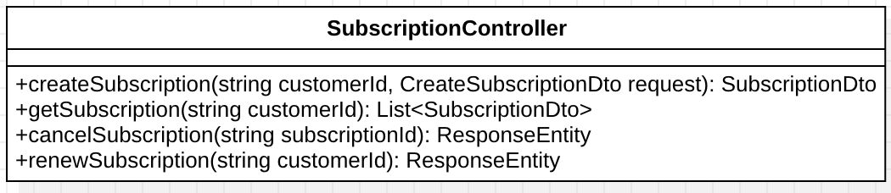
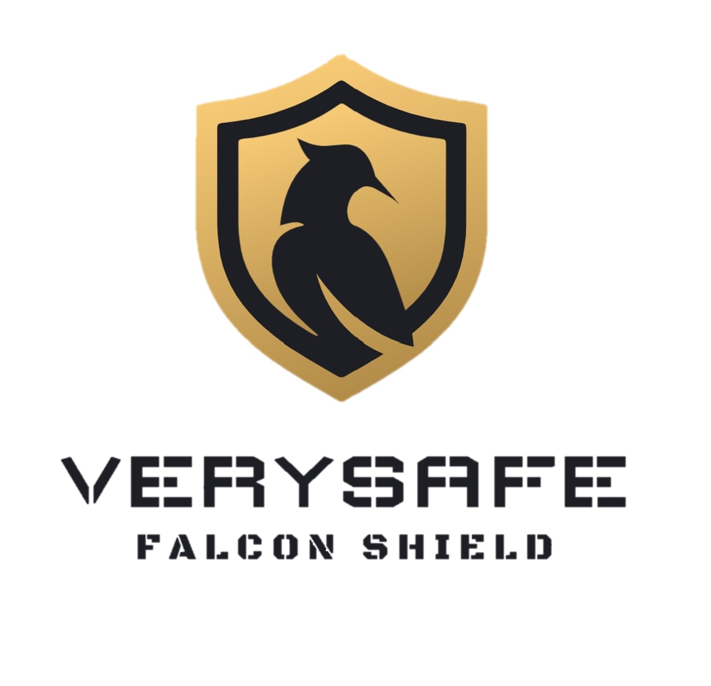
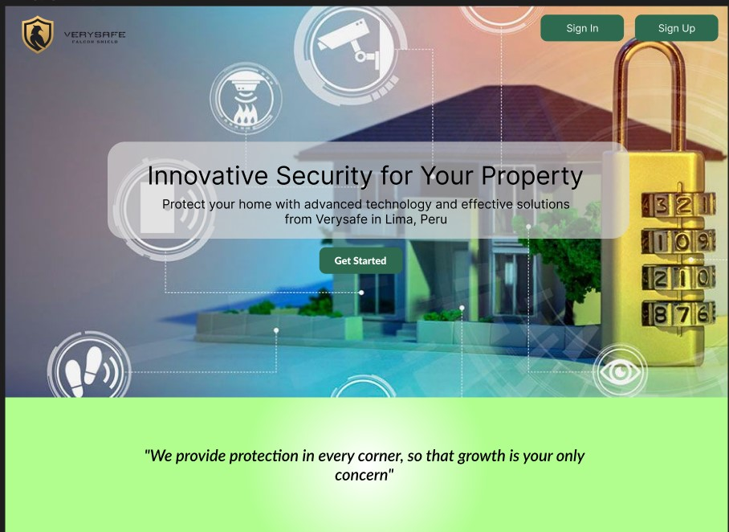
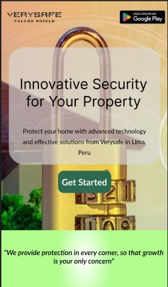
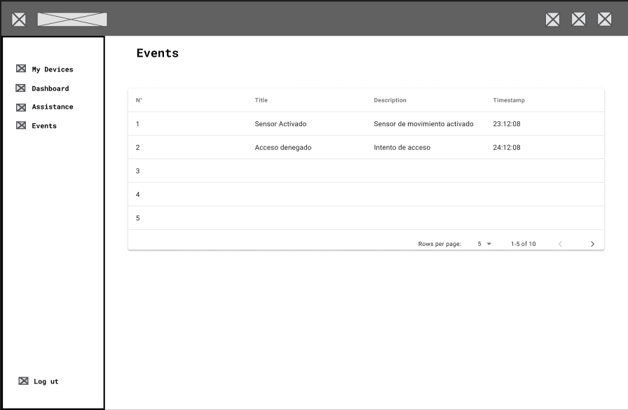
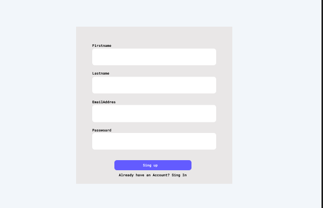

Carrera: Ingeniería de Software

Nombre del curso: Desarrollo de Soluciones IOT

Sección: WV71

Nombre del profesor: Velasquez Nuñez, Angel Augusto

"Informe de TP1"

Nombre del startup: VerySafe

Nombre del producto: FalconShield

Relación de integrantes:

- Gabriela Soledad Nomberto Ramos
- Dennis Piero Quevedo Yucra
- Max Dayson Sabino Arostegui
- Elvia Guadalupe Arteaga Cruz
- Jamutaq Piero Ortega Vélez

Mes y año: Agosto 2024

Ciclo: 2024-2

## Registro de Versiones del Informe
# Student Outcome
| Criterio específico | Acciones realizadas | Conclusiones |
|----------------------|----------------------|--------------|
| Trabaja en equipo para proporcionar liderazgo en forma conjunta | **TB1:**   **Max Dayson Sabino Arostegui:**   Colabore en todos los capitulos con los puntos: estrategia y tácticas frente a competidores, product backlog, diseños de entrevista, registro de entrevista y con el bounded context devices. Todo esto me ayudó a fomentar el trabajo en equipo   **Gabriela Nomberto Ramos**   Colabore en todos los capitulos tanto como la definicion y focalziacion del alcance de nuestro producto asi como las arquitecturas, modelos y mejoras continuas   **Elvia Arteaga Cruz**   Con el equipo trabajamos de manera colaborativa para organizarnos y repartir equitativamente las tareas que podían realizarse de manera individual, pero también para juntarnos en tareas grupales, como el event storming.   **Dennis Quevedo Yucra**   Colaboré en todos los capitulos tanto como la definicion de los segmentos objetivos asi como las user person, impact map, y arquitecturas   **Jamutaq Ortega Vélez**   Colaboré en todos capítulos y la comunicación y organización con el equipo se mantuvo constante y buena durante todo el desarrollo del entregable.  **TP1:**   **Max Dayson Sabino Arostegui:**   Colabore en la creación del diseño de la aplicación web, realize los wireframes y mockups, asimismo realize el sprint1 en la parte de creación para la sección eventos   **Elvia Arteaga Cruz**   Colaboré en la redacción de organization y navigation systems, así como en la recopilación de las herramientas utilizadas en el proyecto hasta esta entrega. En la parte de desarrollo, colaboré en la implementación del frontend de la página web y de la fake api con json server.   **Jamutaq Ortega Vélez**   Me encargué de elaborar y colaborar con mi equipo el desarrollo de la aplicación web junto con la implementación de componentes y vistas principales. |Concluimos que las reuniones y las mejoras continuas entre todos nos ayuda a mejorar el reporte de trabajo y poder colaborar todo de forma equitativa |
| Crea un entorno colaborativo e inclusivo, establece metas, planifica tareas y cumple objetivos.   *Gabriela Nomberto**   Colabore con la redaccion del documento. |Para este apartado, todos aportamos en la estructuracion y llenado del reporte, trabajando asi en grupo y entendiendonos entre todos | **TB1:**   **Max Dayson Sabino Arostegui:**   Durante las reuniones en el aula planificamos las tareas y definimos las metas. En cada reunión revisamos el avance para recalcar los objetivos   **Gabriela Nomberto Ramos**   Tuvimos reuniones en el salón de clase el cual nos ayudo mucho a definir lo que cada uno debe de hacer, asimismo por medio de un grupo de WhatsApp pudimos absolver algunas dudas    **Elvia Arteaga Cruz**   El tiempo brindado por el profesor durante las horas de clase para organizar el proyecto fue de mucha utilidad para el desarrollo del mismo. Ese tiempo fue aprovechado para organizar las tareas individuales y realizar las tareas grupales. Además, contamos con medios digitales para la comunicación continua, tales como Whatsapp y Discord.    **Dennis Quevedo Yucra**   Durante las reuniones en el salón de clase el cual nos definimos y consultamos al profesor muchas dudas que teniamos y tambien se definió lo que cada uno debe de hacer, asimismo por medio de un grupo de WhatsApp pudimos absolver algunas dudas como tambien en discord   **Jamutaq Ortega Vélez**   Trabajamos de manera colaborativa en todo momento. Planificamos nuestros avances y tuvimos tiempo de hacer correcciones también.   **TP1:**   **Max Dayson Sabino Arostegui:**   Realize el sprint 1 en colaboración con los demás mientros del equipo, me conecte a las reuniones por discord y fomente el trabajo en equipo.   **Elvia Arteaga Cruz**   Tuvimos reunines mediante discord de manera frecuente para coordinar los puntos a avanzar. Esto nos ayudó a organizarnos en las tareas individuales y grupales.   **Jamutaq Ortega Vélez**   Coordiné con mi equipo las reuniones para el desarrollo y feedback de los puntos realizados y a corregir.   *Gabriela Nomberto**   Coordiné con mi equipo las reuniones para el desarrollo y feedback de los puntos realizados y a corregir. |Para este apartado, todos aportamos en la estructuracion y llenado del reporte, trabajando asi en grupo y entendiendonos entre todos|Para este apartado, todos aportamos en la estructuracion y llenado del reporte, trabajando asi en grupo y entendiendonos entre todos |

# CAPÍTULO I: INTRODUCTION
## 1.1 Startup Profile
### 1.1.1 Descripción de la Startup
### 1.1.2 Perfiles de integrantes del equipo
| Integrante | Imagen |
|----------------------|----------------------|
| **Elvia Guadalupe Arteaga Cruz:**  Código: u201616507  Soy una estudiante de la carrera de ingeniería de software. Ingresé a la universidad para estudiar ingeniería mecatrónica, pero el mundo de la programación siempre me gustó más, es por ello que decidí cambiarme de carrera. Me gusta mucho la tecnología y las grandes cosas que se pueden hacer con ella. Tengo la ilusión de crear productos y servicios que ayuden a facilitar la vida de las personas y que nos ayuden a crecer como sociedad.|  |
| **Max Dayson Sabino Arostegui:**  Código: u20201a991  Soy estudiante de Ingeniería de Software y me interesa especialmente el machine learning y la ciberseguridad. Tengo experiencia con la metodología ágil SCRUM y estoy familiarizado con varios frameworks y lenguajes de programación, como Angular, Vue, C++ y Python. Además, poseo habilidades blandas importantes como el trabajo en equipo, asertividad y cooperación.| |
| **Gabriela Soledad Nomberto Ramos:**  Código: u202113876  Soy estudiante de la carrera de Ingeniería de Software en el 9no ciclo. Tengo experiencia amplia en diversos lenguajes de programación, así como el uso de servidores cloud, soy muy organizada, responsable y sobre todo puntual. Además, soy bailarina de caporales en una agrupación externa a la universidad. Todo ello me enseñó a como trabajar en equipo, apoyar e investigar temas que me emocionan como lo es ciberseguridad y bases de datos, mis mejores habilidades es la comunicación en grupo y solucionar problemas bajo presión.| |
| **Dennis Piero Quevedo Yucra:**  Código: u201619823  Soy Dennis Piero Quevedo, estudiante de la carrera de Ingeniería de Software y estoy cursando el 9no ciclo. Tengo conocimientos en múltiples lenguajes de programación. Así mismo, me encuentro realizando mis prácticas pre-profesionales aplicando todos los conocimientos adquiridos a lo largo de la carrera. Me considero una persona responsable y sobre todo puntual. Por otro lado, soy ciclista aficionado, me gusta mucho aprender por cuenta propia y una de mis mejores habilidades es solucionar los problemas a la brevedad posible.| |
| **Jamutaq Piero Ortega Vélez:**  Código: u201911703  Soy estudiante de la carrera de Ingeniería de Software, tengo 22 años y me encuentro en el 7mo ciclo. Me considero una persona honrada, respetuosa y responsable, siempre me gusta aportar y ayudar a mi equipo de trabajo. Poseo una gran experiencia en el desarrollo de soluciones backend con tecnologías que como Spring Boot con Java, .NET Core con C# y Node.js con JS y TS. Además, también me apasiona el mundo del DevOps y tecnologías cloud. Me gusta mucho la música y la meditación, y en mis tiempos libres me dedico a caminar y a reflexionar sobre la vida.| |

## 1.2 Solution Profile

En este apartado daremos una explicación detallada del producto de software que presentaremos como factor innovador y la forma de monetización

Company Name

Decidimos nombrar nuestra empresa "VerySafe," una combinación de las palabras en inglés "Very" y "Safe." "Very" significa "muy," lo que refleja nuestro compromiso de ofrecer un producto que vaya más allá de las expectativas. "Safe" significa "seguro," y captura la esencia de nuestra misión de brindar dispositivos que garanticen la seguridad de los inmuebles. Así, nace VerySafe, una empresa dedicada a proporcionar soluciones de seguridad de alta calidad, comprometida a proteger lo que más valoras.

Product Name

Decidimos llamar a nuestro conjunto de productos "FalconShield." Este nombre combina dos palabras en ingléS, primero "Falcon," que hace referencia al halcón, un símbolo de agudeza y vigilancia, y "Shield," que significa escudo, representando protección. Así, "FalconShield" evoca la imagen de un guardián alerta y confiable, reflejando nuestro compromiso de ofrecer productos que aseguren la protección y seguridad de los inmmuebles de nuestros clientes. Optamos por este nombre en inglés para hacerlo más atractivo y comercializable en el mercado global, ya que el inglés es ampliamente reconocido y comprendido en todo el mundo.

Product Description

FalconShield es una innovadora línea de dispositivos de seguridad diseñados para proteger inmuebles de manera integral. Nuestra oferta incluye una variedad de soluciones avanzadas, como sistemas de sesores y alarmas inteligentes, que se adaptan a las necesidades específicas de cada cliente. Los usuarios podrán acceder a una interfaz sencilla y eficiente, donde podrán controlar y supervisar todos los dispositivos conectados. Además, FalconShield se integra con otros servicios y plataformas de seguridad, permitiendo un monitoreo continuo. Al utilizar nuestros productos, los clientes tendrán la tranquilidad de saber que su propiedad está protegida por una tecnología de vanguardia, respaldada por un equipo de expertos dedicados a brindar un servicio de excelencia. Obteniendo convenios con empresas para el seguimiento de seguridad y empresas de mantenimientos que se le pueda ofrecer a los productos que cada cliente solicite.

Monetización

VerySafe generará ingresos de forma en subscripciones y/o alquileres de nuestros productos

### 1.2.1  Antecedentes y problemática

Para la realizacion de este segmento utilizaremos la técnica de las 5W y 2H

Descripción de la Problemática

Nuestro software se enfoca en el sector inmobiliario, dado que hemos evidenciado un incremento en cuanto a robos, intrusiones y actos vandálicos y la protección del hogar es primordial, por ende la diversidad de soluciones que existen en el mercado llegan a ser costosas. Es por esto que "VerySafe" busca cubrir estas necesidades de seguridad y protección de una forma más accesibles a la mayuor cantidad de personas

**Herramienta 5W y 2H**

What - ¿Cuál es el problema?

El problema principal es el aumento de robos, intrusiones y actos vandálicos en inmuebles de Lima Metropolitana. La seguridad de los hogares y propiedades se ve comprometida, y las soluciones disponibles en el mercado suelen ser costosas, limitando su accesibilidad para la mayoría de la población.

When - ¿Cuándo sucede el problema?

Este problema es persistente y puede ocurrir en cualquier momento, pero es particularmente crítico durante las noches y en momentos en que los propietarios no están en sus hogares. Además, en épocas festivas o de alta movilidad, los incidentes tienden a aumentar.

Where - ¿Dónde surge el problema?

El problema surge principalmente en zonas urbanas de Lima Metropolitana, donde la densidad de población y la disparidad económica generan áreas con altos índices de delincuencia. Tanto en barrios residenciales como en zonas comerciales, la vulnerabilidad a estos actos es significativa.

Who - ¿Quienes son afectados por el problema?

Los principales afectados son los propietarios de viviendas que carecen de un sistema de seguridad de calidad.

Why - ¿Cuál es la causa del problema?

La causa del problema radica en la falta de seguridad adecuada en muchas propiedades, combinada con la creciente actividad delictiva en la región. Además, la accesibilidad limitada a sistemas de seguridad avanzados debido a su alto costo agrava la situación, dejando a muchas personas y negocios vulnerables.

How - ¿Cómo se llevan a cabo los hechos?

Los robos e intrusiones suelen llevarse a cabo mediante el forzamiento de cerraduras, rotura de ventanas o el acceso no autorizado a través de puntos vulnerables de las propiedades. Los delincuentes aprovechan la falta de sistemas de seguridad activos o la ausencia de los propietarios para cometer estos actos.

How Much - ¿Cuál es la magnitud del problema?

El delito de robo en viviendas ha experimentado un incremento significativo en el área urbana del Perú, especialmente en Lima Metropolitana. Según el Instituto Nacional de Estadística e Informática (INEI), en 2022, el 9.9 % de las viviendas fueron afectadas por este tipo de delito. Este porcentaje aumentó a 12.9 % en 2023, y para abril de 2024, ya se había alcanzado el 13.1 %. Estos datos evidencian una preocupante tendencia al alza en la frecuencia de robos a viviendas, lo que subraya la urgencia de implementar soluciones de seguridad más accesibles y efectivas para proteger a los hogares.

### 1.2.2 Lean UX Process
#### 1.2.2.1 Lean UX Problem Statements
El estado actual del dominio de la seguridad IoT para el hogar se ha centrado principalmente en los usuarios residenciales, las empresas de seguridad y las empresas de instalación y mantenimiento. Los puntos críticos incluyen la falta de un acceso centralizado a la información de los dispositivos, problemas de coordinación en emergencias y dificultades en la gestión del mantenimiento.

Lo que los productos/servicios existentes no logran abordar es la necesidad de integrar la gestión de dispositivos, la respuesta en tiempo real ante emergencias y la administración del mantenimiento en una plataforma unificada. Además, los competidores no ofrecen alianzas con empresas de seguridad, lo que resulta en respuestas menos especializadas.

Nuestro producto/servicio abordará esta brecha mediante el desarrollo de una plataforma IoT unificada que conecte dispositivos de seguridad, mejore la coordinación con empresas de seguridad aliadas y optimice la gestión del mantenimiento en tiempo real.

Nuestro enfoque inicial será los usuarios residenciales, ya que necesitan una experiencia de usuario simplificada que permita un control centralizado de sus dispositivos y una respuesta más rápida ante emergencias.

Sabremos que tenemos éxito cuando veamos un aumento en la satisfacción del cliente, una mayor utilización diaria de la plataforma, una reducción en el tiempo de respuesta de emergencias y una mejora en la coordinación con empresas de seguridad y mantenimiento.
#### 1.2.2.2 Lean UX Assumptions
1. User Assumptions
- Los usuarios residenciales prefieren una única plataforma centralizada para gestionar todos sus dispositivos de seguridad en lugar de utilizar múltiples aplicaciones.
- Los usuarios valoran la capacidad de recibir notificaciones en tiempo real sobre el estado de sus dispositivos y eventos de seguridad.
- Los usuarios se sienten más seguros al saber que existe una alianza con una empresa de seguridad para responder rápidamente a emergencias.
- Los usuarios tienen conocimientos básicos de tecnología IoT y son capaces de interactuar con interfaces sencillas.

2. Business Assumptions
- Las empresas de seguridad están interesadas en formar alianzas para integrar sus servicios con plataformas de seguridad IoT, ya que esto mejora su capacidad de respuesta.
- Las empresas de instalación y mantenimiento ven un valor en poder gestionar el estado de los dispositivos y coordinar las tareas de mantenimiento a través de una única plataforma.
- La implementación de una solución de seguridad IoT que optimice la gestión de dispositivos y emergencias atraerá tanto a nuevos clientes residenciales como a empresas de seguridad y mantenimiento.

3. User Outcomes Assumptions
- Los usuarios residenciales utilizarán la plataforma de forma recurrente para monitorear su hogar y gestionar sus dispositivos de seguridad.
- Los usuarios se sentirán más satisfechos y seguros al poder recibir asistencia inmediata en caso de emergencia, reduciendo la ansiedad relacionada con la seguridad del hogar.
- Los usuarios adoptarán la plataforma y recomendarán el servicio a otros propietarios de viviendas una vez que experimenten su efectividad.

4. Business Outcomes Assumptions
- Las empresas de seguridad mejorarán sus tiempos de respuesta en emergencias gracias a la integración en tiempo real con la plataforma.
- La plataforma permitirá a las empresas de instalación y mantenimiento reducir los costos operativos al automatizar el monitoreo y la notificación de fallos o necesidades de mantenimiento.
- El éxito de la plataforma en el segmento residencial facilitará la expansión hacia otros mercados, como empresas comerciales y oficinas.

5. Features Assumptions
- Una interfaz intuitiva y centralizada para el control de todos los dispositivos IoT será clave para que los usuarios residenciales adopten la plataforma.
- La integración en tiempo real con empresas de seguridad, permitiendo la comunicación inmediata y el envío de datos críticos durante una emergencia, será una característica fundamental para diferenciarse de la competencia.
- La plataforma necesitará incluir funcionalidades de mantenimiento automatizado, como notificaciones de fallos en los dispositivos, para atraer a las empresas de instalación y mantenimiento.

#### 1.2.2.3 Lean UX Hypothesis Statements
- Creemos que lograremos una mejora significativa en la satisfacción y retención de los usuarios para nuestra plataforma IoT de seguridad. Si los usuarios residenciales tienen acceso a una plataforma centralizada que integra monitoreo en tiempo real, coordinación de respuesta a emergencias y gestión del mantenimiento, alcanzarán una experiencia de usuario fluida y una mayor sensación de seguridad, con notificaciones oportunas, gestión simplificada de dispositivos y respuestas eficaces a emergencias. Con una interfaz unificada que conecta todos los dispositivos de seguridad, alertas en tiempo real y la integración con empresas de seguridad para una respuesta rápida ante emergencias.

- Creemos que lograremos un mayor nivel de eficiencia operativa para las empresas de seguridad. Si estas empresas pueden acceder a datos y alertas en tiempo real desde la plataforma IoT integrada, alcanzarán tiempos de respuesta más rápidos ante emergencias y una mejor coordinación con los usuarios residenciales. Con la integración de datos en tiempo real y alertas que facilitan la toma de decisiones informadas durante los incidentes.

- Creemos que lograremos una reducción de los costos operativos para las empresas de instalación y mantenimiento. Si estas empresas pueden utilizar una sola plataforma para gestionar el estado de los dispositivos y las tareas de mantenimiento, alcanzarán una programación de mantenimiento más eficiente y menos fallos inesperados. Con notificaciones automatizadas sobre problemas en los dispositivos y un panel centralizado para el seguimiento de las actividades de mantenimiento.

- Creemos que lograremos una mayor adopción de nuestra plataforma IoT de seguridad entre los usuarios residenciales. Si ofrecemos una solución que simplifica la gestión de dispositivos y mejora las capacidades de respuesta ante emergencias, alcanzarán una mayor tasa de compromiso con el uso de la plataforma y recomendaciones positivas a otros usuarios. Con una interfaz fácil de usar que integra todas las funciones de seguridad y proporciona una coordinación efectiva en emergencias.

- Creemos que lograremos una integración más eficiente entre las empresas de seguridad y la plataforma IoT. Si las empresas de seguridad pueden recibir información detallada y en tiempo real sobre las alertas y el estado de los dispositivos, alcanzarán una coordinación más fluida y respuestas más especializadas durante las emergencias. Con una plataforma que facilita el acceso a datos críticos y la comunicación inmediata con los usuarios residenciales.

- Creemos que lograremos una mejora en la gestión del mantenimiento para los dispositivos de seguridad. Si los usuarios y las empresas de mantenimiento tienen acceso a herramientas que permiten un seguimiento proactivo del estado de los dispositivos, alcanzarán una reducción en los tiempos de inactividad y un aumento en la durabilidad de los dispositivos. Con funcionalidades de monitoreo continuo y alertas automáticas sobre necesidades de mantenimiento o fallos.

- Creemos que lograremos una mayor confianza en la plataforma por parte de los usuarios. Si implementamos medidas de seguridad robustas y proporcionamos soporte técnico eficiente, alcanzarán una mayor confianza en la protección de sus datos y en la efectividad del sistema de seguridad. Con protocolos de seguridad avanzados y un soporte técnico accesible y confiable.

#### 1.2.2.4 Lean UX Canvas
En el desarrollo de soluciones innovadoras para el mercado de seguridad IoT para el hogar, es crucial entender y validar los problemas y necesidades tanto desde la perspectiva del negocio como de los usuarios finales. El Lean UX Canvas es una herramienta esencial que nos permite estructurar y visualizar los elementos clave de nuestro proyecto, facilitando la identificación de problemas, la definición de resultados esperados y la planificación de experimentos para validar nuestras suposiciones.

Este canvas se centra en resolver el problema principal relacionado con la falta de integración eficaz en los sistemas de seguridad actuales. A través de un enfoque iterativo y basado en evidencia, nuestro objetivo es desarrollar una solución que mejore la experiencia de gestión de seguridad para los usuarios residenciales, optimice la respuesta a emergencias para las empresas de seguridad, y facilite el mantenimiento para los proveedores de instalación y mantenimiento.

El Lean UX Canvas que a continuación se presenta detalla los problemas de negocio, los resultados esperados, los tipos de usuarios a enfocar, los beneficios para los usuarios, las soluciones propuestas, las hipótesis a validar, los riesgos críticos y los experimentos necesarios para aprender rápidamente y ajustar nuestra estrategia en función de los hallazgos. Esta estructura nos guiará en la creación de una solución eficaz y centrada en el usuario, maximizando nuestras oportunidades de éxito en el mercado.

## 1.3 Segmentos objetivo
Según el Instituto Nacional de Estadística e Informática (INEI), cerca del 12% de las viviendas en áreas urbanas de Perú sufrieron robos o intentos de robo en años recientes. Sin embargo, solo el 17.9% de las víctimas denuncian estos delitos, lo que sugiere que el problema es más amplio de lo que reflejan las cifras oficiales​. Los métodos de los delincuentes son cada vez más variados. Entre las tácticas más comunes están el engaño a empleados domésticos, la simulación de ser trabajadores de empresas de servicios públicos, y los robos durante días feriados, cuando las casas suelen estar desocupadas​.

Por otro lado, los inmuebles a nivel de Lima Metropolitana y la Provincia Constitucional del Callao tambien fueron afectadas por robo o
intento de robo en el año 2021. A nivel de ámbitos geográficos, el porcentaje de viviendas afectadas por robo o intento
de robo fue mayor en la Provincia Constitucional del Callao (7,9%), que en Lima Metropolitana (7,2%).

Por lo mencionado anteriormente es que hemos establecido 2 segmentos objetivos:

### Segmento objetivo 1: Dueños de Inmuebles
Nuestro primer segmento objetivo son los propietarios de uno o varios inmuebles, tanto construidos como en proceso de construcción. Este grupo incluye personas que, al no contar con sistemas de seguridad adecuados, deben visitar o supervisar periódicamente sus propiedades para asegurarse de que no hayan sido vulneradas o víctimas de robos.

### Segmento objetivo 2: Empresas de Seguridad
Nuestro segundo segmento objetivo son las empresas de seguridad que buscan mejorar y fortalecer sus servicios de videovigilancia mediante el uso de un software robusto y completo, diseñado para satisfacer plenamente las necesidades de sus clientes y optimizar la gestión de seguridad.

=======
## 1.2 Solution Profile
### 1.2.1  Antecedentes y problemática
### 1.2.2 Lean UX Process
#### 1.2.2.1 Lean UX Problem Statements
#### 1.2.2.2 Lean UX Assumptions
#### 1.2.2.3 Lean UX Hypothesis Statements
#### 1.2.2.4 Lean UX Canvas
## 1.3 Segmentos objetivo

# CAPÍTULO II: REQUERIMENTS ELICITATION & ANALYSIS
## 2.1 Competidores

Como grupo, investigamos a nuestros principales competidores de los cuales ofrezcan servicios similares o parecidos a los nuestros. Llegamos a la conclusion de comparar con tres empresas las cuales son las siguiente:

**1. Verisure**: Es una empresa de seguridad que ofrece como servicios primero la inspeccion del inmueble del cual solicitan sus productos para ofrecer mejor seguridad. Además, cuenta con una central de monitoreo para poder recepcionar las alarmas los siete días de las semanas y las 24 horas del día. Estos cuentan con dispositivos de seguridad como sensores para las puertes, camaras de video, camaras de foto, etc.
**2. Prosegur**: Es una empresa que brinda Alarmas monitoreadas y seguridad a cualquier tipo de persona. Ofrecen kits de seguridad para que el cliente decida cual es de su mejor agrado y prosegur acude a la instalacion, asimismo no solo se dedica en la seguridad del inmueble sino tambien de vehiculos. Todo ello esta monitoreado por una central de alertas para que al activarse pueda acudir un motorizado a corroborar la alerta dada.
**3. Securitas**: Empresa de seguridad que se basa en comprender al cliente para poder ofrecer sus servicios de los cuales el mas conocido es la camara de videovigilancia, además de brindar seguridad en muchos aspectos como seguridad remota o seguridad electrónica, tambien ofrece servicios de proteccion contra incendios para sus clientes ofreciendoles asi un reporte anual desde su compra

Teniendo estos competidores mejor descritos, podremos hacer nuestro análisis competitivo a continuación.

### 2.1.1. Análisis competitivo

Para el análisis competitivo, observamos a tres empresas que se encuentran en el mercado que ofrecen una similitud y estos son los siguientes: 

| Competitive Analysis Landscape |
| -- |
| ¿Por qué llevar a cabo este análisis? |
| ¿Cómo se posiciona VerySafe en comparación con sus principales competidores por los clientes en el mercado de seguridad de inmuebles en Lima Metropolitana? |

**Perfil del Startup**

| Startup | VerySafe | Verisure | Prosegur | Securitas |
| -- | -- | -- | -- | -- |
| Logo |  |  |  |  |
| **Overview** | Ofrece soluciones de seguridad accesibles y personalizadas para inmuebles. Se enfoca en integrar tecnología avanzada con un enfoque en la accesibilidad, buscando proteger hogares y pequeñas empresas con productos innovadores y servicios flexibles que se adaptan a las necesidades de sus clientes. | Ofrece sistemas de alarmas conectadas y monitoreo remoto 24/7. Con una fuerte presencia en el mercado peruano, Verisure ofrece soluciones de alta tecnología que combinan la seguridad física y digital, destacándose por su fiabilidad y servicio al cliente. | Ofrece una amplia gama de servicios que incluyen desde alarmas y videovigilancia hasta servicios de seguridad física y logística de valores, adaptándose tanto a clientes residenciales como corporativos con soluciones integradas. | Ofrece soluciones personalizadas que combinan seguridad física y digital, dirigidas principalmente a grandes empresas e instituciones. Su enfoque está en la integración de tecnologías innovadoras y la adaptación a las necesidades específicas de cada cliente. | 
|**Ventaja competitiva ¿Qué valor ofrece a los clientes?** | Ofrecer soluciones tecnológicas avanzadas IoT a precios accesibles, con un enfoque en personalización y accesibilidad para un público amplio. | Alta tecnología en sistemas de monitoreo remoto y servicio al cliente eficiente. | Amplia gama de servicios de seguridad integrados con una fuerte presencia en el mercado local e internacional | Tecnología avanzada y un enfoque en la integración de soluciones de seguridad física y digital. | 

**Perfil de Marketing**

| Startup | VerySafe | Verisure | Prosegur | Securitas |
| -- | -- | -- | -- | -- |
| **Mercado Objetivo** | Propietarios de Inmuebles que se encuentren en Lima Metropolitana | Hogares y pequeñas empresas que buscan sistemas de alarma conectados de alta gama. | Grandes empresas, instituciones y hogares de clase media-alta. | Grandes empresas, instituciones gubernamentales y hogares de clase media-alta. |
| **Estrategias de Marketing** | Campañas digitales enfocadas en el costo-beneficio y accesibilidad de los productos. Publicidad en medios locales. | Marketing enfocado en la tecnología avanzada y la confiabilidad. Campañas en redes sociales y medios de comunicación masiva. | Marketing tradicional y digital enfocado en la solidez de la marca y la experiencia. | Estrategias de marketing centradas en la seguridad integral y la tecnología de punta. |

**Perfil de Producto**

| Startup | VerySafe | Verisure | Prosegur | Securitas |
| -- | -- | -- | -- | -- |
| **Productos & Servicios** | Sistemas de sensores, cámaras y alarmas inteligentes, integrados con una plataforma digital para monitoreo y control remoto 24/7. | Alarmas conectadas, sensores de movimiento, y monitoreo remoto 24/7. | Alarmas, cámaras de vigilancia, control de accesos, monitoreo, y guardias de seguridad | Sistemas de seguridad integrados, alarmas, cámaras, monitoreo, y servicios de guardias.|
| **Precios & Costos** | Modelo de precios accesible, con opciones de suscripción o alquiler. | Precios medios-altos, con modelos de suscripción. | Variedad de precios según los servicios, generalmente en un rango medio-alto. Y dependiendo del kit elegido. | Variedad de precios, con un enfoque en soluciones a medida para clientes corporativos. |
| **Canales de distribución (Web y/o Móvil)** | Venta y distribución a través de web y aplicación móvil, con opciones de instalación y soporte técnico. | Distribución a través de web, móvil, y red de instaladores locales. | Distribución a través de web, puntos de venta físicos y contacto directo con clientes. | Distribución a través de web, móvil, y ventas directas a través de representantes.|

**Analisis SWOT**

| Startup | VerySafe | Verisure | Prosegur | Securitas |
| -- | -- | -- | -- | -- |
| **Fortalezas** | Accesibilidad en precios, personalización de productos, enfoque local. | Tecnología avanzada, reputación global, servicio al cliente robusto. | Amplia gama de servicios, presencia fuerte en el mercado, reconocimiento de marca. | Integración de servicios, tecnología avanzada, capacidad de adaptación |
| **Debilidades** | Menor reconocimiento de la empresa y marca | Precio elevado, menos accesible para clientes de clase media-baja. | Alto costo de los servicios, enfoque más en clientes corporativos que en residenciales. | Alto costo, enfoque más en grandes empresas e instituciones. | 
| **Oportunidades** | Expandirse a nuevos segmentos de mercado, como pequeñas empresas y hogares de clase media. | Creciente demanda de seguridad avanzada en hogares y empresas. | Crecimiento del mercado de seguridad en hogares y negocios. | Expansión en servicios digitales y mercados emergentes. | 
| **Amenazas** | Competencia fuerte de marcas establecidas | Competencia en precios de empresas locales y nuevas tecnologías. | Innovaciones tecnológicas y nuevos competidores más ágiles. | Innovación tecnológica de startups más ágiles y económicas. |

## 2.2 Entrevistas
### 2.2.1. Diseño de entrevistas
### 2.2.2. Registro de entrevistas

* **Segmento 1: Dueños de inmuebles**

  - Entrevista N°1:
    - Nombres y apellidos: Jesús Aliaga
    - Edad: 60 años
    - Distrito: Los Olivos
    - Timing: 0:00
    - Duración: 9:35
    - Link: [Enlace entrevista 1](https://upcedupe-my.sharepoint.com/:v:/g/personal/u202113876_upc_edu_pe/EXHqrhK5ujRBmGwX9MkluJUBF2d1Zprer7bJl0F41fEX1g?e=WkDqqD&nav=eyJyZWZlcnJhbEluZm8iOnsicmVmZXJyYWxBcHAiOiJTdHJlYW1XZWJBcHAiLCJyZWZlcnJhbFZpZXciOiJTaGFyZURpYWxvZy1MaW5rIiwicmVmZXJyYWxBcHBQbGF0Zm9ybSI6IldlYiIsInJlZmVycmFsTW9kZSI6InZpZXcifX0%3D)
    
    
    Jesús manifiesta que la inseguridad ha incrementado significativamente estos últimos años, por lo cual comenta que una solución de un sistema de seguridad sería muy valiosa para su inmueble ya que actualmente lo maneja de forma manual con cercos. Además destaca que para un mejor manejo, dicha solución debe tener una aplicación móvil y un sistema de alertas para varias personas, así las personas encargadas puedan saber lo que está pasando en tiempo real.

  - Entrevista N°2:
    - Nombres y apellidos: Diana Gomez Oré
    - Edad: 25 años
    - Distrito: Chorrillos
    - Timing: 9:35
    - Duración: 5:22
    - Link: [Enlace entrevista 2](https://upcedupe-my.sharepoint.com/:v:/g/personal/u202113876_upc_edu_pe/EXHqrhK5ujRBmGwX9MkluJUBF2d1Zprer7bJl0F41fEX1g?e=Hh8QaG&nav=eyJyZWZlcnJhbEluZm8iOnsicmVmZXJyYWxBcHAiOiJTdHJlYW1XZWJBcHAiLCJyZWZlcnJhbFZpZXciOiJTaGFyZURpYWxvZy1MaW5rIiwicmVmZXJyYWxBcHBQbGF0Zm9ybSI6IldlYiIsInJlZmVycmFsTW9kZSI6InZpZXcifSwicGxheWJhY2tPcHRpb25zIjp7InN0YXJ0VGltZUluU2Vjb25kcyI6NTc0Ljc0fX0%3D)
    
    
    Antes de la entrevista, Diana me comentó que se acaba de mudar sola hace aproximadamente 6 meses, por lo que el tema de seguridad es algo que le preocupa, debido a que deja su hogar solo cuando se va al trabajo. Además me comentó que ha investigado un poco sobre algunas opciones de empresas de seguridad, pero aún no se decide por alguna de ellas.

    Durante la entrevista, Diana mencionó que no ha tenido problemas de seguridad aún, pero que toda la seguridad que tiene en su hogar es colocar llave al cerrar la puerta. Es por ello que le parece interesante y ve como opción a futuro el adquirir un sistema de seguridad. Para ella es muy importante que la empresa de seguridad le brinde la confianza y seguridad que requiere un servicio de esta índole, además de que se realicen mantenimientos cada cierto tiempo y que la atención al cliente en caso de dudas o fallos sea rápida. Ella considera que los dispositivos más importantes serían cámaras, sensores y un pinpad. Además, mencionó que ella preferiría ser alertada de algún intruso mediante una llamada, ya que la atendería con mayor rapidez que un mensaje o notificación. Sin embargo, dijo que no le molestaría recibir notificaciones referentes a la seguridad de su hogar. Por último, mencionó que ella prefiere gestionar el sistema de seguridd de su hogar mediante una aplicación, ya que de esa manera podría visualizar sus cámaras y estar al tanto de la situación de su hogar en todo momento.

    También pude notar que Diana utiliza un celular con android y una laptop con Windows. Además, sus canales de comunicación son principalmente WhatsApp e Instagram. Su relación con la tecnología es bastante buena, debido a que en su trabajo están en constante capacitación, sobretodo para el uso de pc. Asimismo, está acostumbrada a utilizar browsers basados en chromium, tales como Chrome y Brave.

- Entrevista N°4:
    - Nombres y apellidos: Aaron Alva Moreno
    - Edad: 24 años
    - Distrito: San Juan de Lurigancho
    - Timing: 23:37
    - Duración: 5:00
    - Link: [Enlace entrevista 4](https://upcedupe-my.sharepoint.com/:v:/g/personal/u202113876_upc_edu_pe/EXHqrhK5ujRBmGwX9MkluJUBF2d1Zprer7bJl0F41fEX1g?e=WkDqqD&nav=eyJyZWZlcnJhbEluZm8iOnsicmVmZXJyYWxBcHAiOiJTdHJlYW1XZWJBcHAiLCJyZWZlcnJhbFZpZXciOiJTaGFyZURpYWxvZy1MaW5rIiwicmVmZXJyYWxBcHBQbGF0Zm9ybSI6IldlYiIsInJlZmVycmFsTW9kZSI6InZpZXcifX0%3D)
    
    
    Aaron compartió que recientemente ha comenzado un proceso de mudanza en una zona algo conflictiva de San Juan de Lurigancho. Al iniciar la entrevista, su preocupación por la seguridad se hizo evidente, ya que mencionó que en su vecindario hay un aumento alarmante en los robos de inmuebles y hogares. Esta situación lo ha llevado a buscar soluciones efectivas que le brinden mayor tranquilidad y protección. La sensación de inseguridad en su nuevo entorno es algo que le preocupa profundamente, lo que ha intensificado su interés por encontrar un sistema de seguridad que se adapte a sus necesidades.

    En su búsqueda de una solución, Aaron se mostró abierto a explorar tecnologías de Internet de las Cosas (IoT) que puedan mejorar la seguridad de su hogar. Está interesado en sistemas que no solo ofrezcan protección, sino que también permitan una gestión eficiente a través de notificaciones en tiempo real. Esta funcionalidad podría ayudarlo a sentirse más seguro y al tanto de cualquier situación inusual en su entorno. La posibilidad de monitorear su hogar de manera remota y recibir alertas inmediatas sobre posibles amenazas es una característica que considera fundamental para tomar decisiones informadas y reaccionar rápidamente ante cualquier eventualidad. Asimismo, nos comento que el en sistemas operativos es fanático de windows y android.

* **Segmento 2: Empresas de Seguridad**
- Entrevista N°5:
    - Nombres y apellidos: Diego Acuña
    - Edad: 28 años
    - Distrito: San Isidro
    - Timing: 26:31
    - Duración: 4:00
    - Link: [Enlace entrevista 5](https://upcedupe-my.sharepoint.com/:v:/g/personal/u202113876_upc_edu_pe/EXHqrhK5ujRBmGwX9MkluJUBF2d1Zprer7bJl0F41fEX1g?e=WkDqqD&nav=eyJyZWZlcnJhbEluZm8iOnsicmVmZXJyYWxBcHAiOiJTdHJlYW1XZWJBcHAiLCJyZWZlcnJhbFZpZXciOiJTaGFyZURpYWxvZy1MaW5rIiwicmVmZXJyYWxBcHBQbGF0Zm9ybSI6IldlYiIsInJlZmVycmFsTW9kZSI6InZpZXcifX0%3D)
    
    
    
    En esta ocasión, entrevistamos a Diego, quien dirige una compañía de seguridad. Durante la conversación, Diego expresó su deseo de mejorar gradualmente la eficiencia de su servicio, ya que actualmente sus tiempos de respuesta ante emergencias pueden llegar a ser de hasta 10 minutos, dependiendo de la zona donde se active la alarma. Esta situación lo preocupa, ya que en muchas ocasiones el tiempo es crucial para garantizar la seguridad de sus clientes. Además, mencionó que, aunque está familiarizado con los dispositivos IoT, ha enfrentado problemas con algunos de ellos, como fallos en la conectividad que retrasan las notificaciones.

    Diego está decidido a explorar nuevas opciones y tecnologías que puedan optimizar su sistema de seguridad. Está dispuesto a investigar otros tipos de dispositivos que ofrezcan mayor fiabilidad y rapidez en la comunicación de alertas. Su enfoque proactivo refleja su compromiso con la mejora continua de su empresa, buscando siempre proporcionar un servicio más eficiente y efectivo a sus clientes. La incorporación de soluciones innovadoras podría no solo disminuir los tiempos de respuesta, sino también aumentar la confianza de sus clientes en la seguridad que brinda. Nos comenta además que en su compañía, utilizan mejor el sistema Windows para el monitoreo de las alarmas.

- Entrevista N°6:
    - Nombres y apellidos: Jorge Luis Quevedo Yucra
    - Edad: 19 años
    - Distrito: Chorrillos
    - Timing: 23:37
    - Duración: 5:00
    - Link: [Enlace entrevista 4](https://upcedupe-my.sharepoint.com/:v:/g/personal/u202113876_upc_edu_pe/EXHqrhK5ujRBmGwX9MkluJUBF2d1Zprer7bJl0F41fEX1g?e=WkDqqD&nav=eyJyZWZlcnJhbEluZm8iOnsicmVmZXJyYWxBcHAiOiJTdHJlYW1XZWJBcHAiLCJyZWZlcnJhbFZpZXciOiJTaGFyZURpYWxvZy1MaW5rIiwicmVmZXJyYWxBcHBQbGF0Zm9ybSI6IldlYiIsInJlZmVycmFsTW9kZSI6InZpZXcifX0%3D)
    
    
Las respuestas de Jorge revelan un enfoque sólido y flexible en la gestión de seguridad mediante tecnologías IoT, demostrando una profunda comprensión de las necesidades actuales del sector. Su empresa se distingue por un firme compromiso con la capacitación constante de su equipo, asegurando que el personal esté altamente preparado para enfrentar los desafíos de un entorno tecnológico en evolución. Además, han adoptado una estrategia proactiva en la integración de soluciones tecnológicas avanzadas, lo que les permite optimizar la eficiencia operativa y mejorar la detección y respuesta ante cualquier posible amenaza. La combinación de estos factores, junto con un enfoque en la mejora continua de sus procesos internos, garantiza que la empresa no solo reaccione rápidamente ante incidentes, sino que también se mantenga a la vanguardia en la protección de activos y la seguridad integral de sus clientes.

### 2.2.3. Análisis de entrevistas
## 2.3 Needfinding
### 2.3.1. User Personas
Las personas que se presentan a continuación son una representación de los segmentos de usuarios definidos, se han tomado en cuenta las características más relevantes de las entrevistas realizadas y el análisis de la competencia las cuales incluyen: edad, distrito, dispositivos tecnológicos que utilizan, canales de comunicación, relación con la tecnología, necesidades y preferencias.

- **Segmento 1: Dueños de inmuebles**

- **Segmento 2: Empresas de seguridad**

### 2.3.2. User Task Matrix

Los User Personas que se han definido son Seele Vollerei el cual representa al primer segmento, dueño de inmueble y José Ramirez para el segundo segmento, empresa de seguridad. A continuación, se presenta la matriz de tareas de los User Personas.

<table border="1">
  <thead>
    <tr>
      <th rowspan="2">Task</th>
      <th colspan="2">Seele Vollerei   (Dueño de inmueble)</th>
      <th colspan="2">José Ramirez   (Empresa de seguridad)</th>
    </tr>
    <tr>
      <th>Frecuencia</th>
      <th>Importancia</th>
      <th>Frecuencia</th>
      <th>Importancia</th>
    </tr>
  </thead>
  <tbody>
    <tr>
      <td>Monitorización de cámaras en tiempo real</td>
      <td>Casi siempre</td>
      <td>Alta</td>
      <td>Siempre</td>
      <td>Alta</td>
    </tr>
    <tr>
      <td>Revisión de grabaciones de las cámaras</td>
      <td>A veces</td>
      <td>Media alta</td>
      <td>Siempre</td>
      <td>Alta</td>
    </tr>
    <tr>
      <td>Recepción de alertas en tiempo real</td>
      <td>Siempre</td>
      <td>Alta</td>
      <td>Siempre</td>
      <td>Alta</td>
    </tr>
    <tr>
      <td>Respuesta ante incidentes</td>
      <td>Rara vez</td>
      <td>Alta</td>
      <td>Siempre</td>
      <td>Alta</td>
    </tr>
    <tr>
      <td>Análisis de patrones de seguridad</td>
      <td>Pocas veces</td>
      <td>Alta</td>
      <td>Siempre</td>
      <td>Alta</td>
    </tr>
    <tr>
      <td>Realización de informes de actividad</td>
      <td>Casi nunca</td>
      <td>Baja</td>
      <td>Siempre</td>
      <td>Alta</td>
    </tr>
    <tr>
      <td>Instalación de nuevas cámaras y/o dispositivos IoT</td>
      <td>A veces</td>
      <td>Alta</td>
      <td>Rara vez (no es su rubro)</td>
      <td>Baja</td>
    </tr>
    <tr>
      <td>Configuración y mantenimiento de los dispositivos IoT y cámaras</td>
      <td>Casi siempre</td>
      <td>Alta</td>
      <td>Casi nunca</td>
      <td>Baja</td>
    </tr>
  </tbody>
</table>

Las tareas que se realizan con mayor frecuencia e importancia por parte de los User Personas son la monitorización de cámaras en tiempo real, la recepción de alertas en tiempo real y la revisión de las grabaciones. En cuanto a las diferencias, se puede observar que Seele Vollerei realiza la instalación de nuevas cámaras y/o dispositivos IoT, mientras que José Ramirez no lo hace, ya que no es su rubro. Por otro lado, las demás tareas coinciden en su importancia y frecuencia, aunque José Ramirez realiza la mayoría de tareas con mayor frecuencia que Seele Vollerei debido a que es su trabajo.

### 2.3.3. User Journey Mapping

En esta sección se realiza la demostración de la experiencia del usuario con el producto o servicio (como está actualmente). En este caso, se ha realizado el mapeo del viaje del usuario desde el momento en que se plantea la necesidad de adquirir un sistema de seguridad hasta que se instala y se configura el sistema en su hogar (Dueño de inmueble) y desde que se recibe la solicitud o alerta de un cliente hasta que se resuelve el incidente (Empresa de seguridad).

- **User Journey Mapping (Seele Vollerei - Dueño de inmueble)**

- **User Journey Mapping (José Ramirez - Empresa de seguridad)**
.png)

Se presenta el User Journey Map para el segmento de Empresa de Seguridad, en el cual se establecen las distintas etapas por las que pasa este usuario durante el uso de la aplicación.

### 2.3.4. Empathy Mapping

El proceso de elaboración del Empathy Mapping se ha realizado tomando en cuenta las entrevistas realizadas a los usuarios de cada segmento y en base a la información recopilada en las mismas. A continuación, se presentan los Empathy Mapping de los User Personas definidos.

- **Empathy Mapping (Seele Vollerei - Dueño de inmueble)**

- **Empathy Mapping (José Ramirez - Empresa de seguridad)**
.png)

José Ramírez se encuentra en una posición de búsqueda activa de soluciones tecnológicas que mejoren los servicios de seguridad que su empresa ofrece. Su principal desafío es integrar de manera efectiva nuevas tecnologías de videovigilancia IoT sin sacrificar la calidad del servicio ni incrementar demasiado los costos operativos. Está motivado por mantenerse a la vanguardia en un sector altamente competitivo, pero también está preocupado por la complejidad técnica y la compatibilidad de las nuevas soluciones. Su decisión de adoptar un nuevo sistema de seguridad depende en gran medida de la facilidad de implementación, la fiabilidad, y la capacidad para mejorar la experiencia de sus clientes.

### 2.3.5. As-Is Scenario Mapping

Para la elaboración del As-Is Scenario Mapping se ha seguido el proceso de mapeo de escenarios actuales de los User Personas definidos y una lluvia de ideas tomando en cuenta su situación actual, necesidades, preferencias y el mercado actual. A continuación, se presentan los As-Is Scenario Mapping de los User Personas definidos.

- **As-Is Scenario Mapping (Seele Vollerei - Dueño de inmueble)**

- **As-Is Scenario Mapping (José Ramirez - Empresa de seguridad)**

Este As-Is Scenario Mapping refleja el viaje de José Ramírez desde la investigación inicial hasta el uso diario y el mantenimiento de un sistema de videovigilancia IoT, destacando tanto los puntos positivos como los desafíos que enfrenta.

## 2.4. Ubiquitous Language
Para el desarrollo de esta sección, como grupo debemos estar alineados con los términos y conceptos claves que son necesarios para la realización del proyecto. Además, nos ayuda a tener un lenguaje en común para entender nuestros objetivos, funcionalidades y benerfios.

Para VerySafe tenemos los siguientes términos:

1. Property Owner (Propietario de Inmueble): Persona o entidad que posee un inmueble y tiene la responsabilidad de protegerlo.
   Definición: Persona física o jurídica que es propietaria de un bien inmueble, como una casa, edificio o terreno, y busca soluciones para mejorar la seguridad de su propiedad.

2. Security Company (Empresa de Seguridad): Organización encargada de proveer servicios de vigilancia y protección a inmuebles.
   Definición: Empresa especializada en ofrecer servicios de monitoreo, control de accesos y respuesta ante incidentes para asegurar propiedades frente a amenazas como robos o intrusiones.

3. Real-Time Monitoring (Monitoreo en Tiempo Real): Supervisión continua y en vivo de una propiedad utilizando dispositivos tecnológicos.
   Definición: Proceso mediante el cual se recogen datos de manera inmediata desde sensores o cámaras para tener una visión constante de lo que ocurre en la propiedad.

4. Intrusion Detection (Detección de Intrusos): Sistema que permite identificar la entrada no autorizada en una propiedad.
   Definición: Tecnología diseñada para alertar cuando una persona o entidad no autorizada intenta ingresar a una propiedad.

5. Motion Sensor (Sensor de Movimiento): Dispositivo que detecta cualquier tipo de movimiento dentro de un área específica.
   Definición: Sensor que responde a cualquier cambio de posición o desplazamiento dentro de su rango, utilizado para alertar de posibles intrusos.

6. Proximity Sensor (Sensor de Proximidad): Dispositivo que detecta la cercanía de personas u objetos sin contacto físico.
   Definición: Sensor que percibe la aproximación de un objeto o individuo a un punto específico, utilizado para gestionar accesos o alertar sobre entradas no autorizadas.

7. Access Control (Control de Acceso): Mecanismo que regula y monitorea quién puede entrar o salir de un inmueble.
   Definición: Sistema de seguridad que restringe el acceso a personas autorizadas, permitiendo o denegando entradas basadas en credenciales predefinidas.

8. Surveillance Data (Datos de Vigilancia): Información recopilada a través de cámaras o sensores en un inmueble.
   Definición: Conjunto de datos generados por dispositivos de monitoreo, tales como imágenes o registros de movimiento, que se utilizan para evaluar y garantizar la seguridad de la propiedad.

9. Security Threat (Amenaza de Seguridad): Cualquier situación o evento que ponga en riesgo la seguridad de un inmueble.
    Definición: Situación que compromete la integridad de una propiedad, ya sea por la presencia de personas no autorizadas o por vulnerabilidades en el sistema de protección.

10. Alarm System (Sistema de Alarma): Dispositivo que emite una alerta cuando detecta una posible amenaza.
    Definición: Sistema de seguridad que se activa para notificar sobre una intrusión o anomalía en la propiedad, ya sea mediante sonido, luz o notificaciones electrónicas.

11. Incident Response (Respuesta ante Incidentes): Proceso que se sigue tras la detección de una amenaza en una propiedad.
    Definición: Serie de acciones realizadas después de la activación de una alerta, que pueden incluir el envío de personal de seguridad o la notificación a las autoridades.

12. Perimeter Security (Seguridad Perimetral): Medidas de protección implementadas en los límites de una propiedad.
    Definición: Estrategias de seguridad diseñadas para proteger las áreas exteriores de una propiedad, evitando accesos no autorizados a través de cercas, cámaras o sensores.

13. False Alarm (Falsa Alarma): Activación de un sistema de seguridad sin la presencia de una amenaza real.
    Definición: Situación en la que el sistema de seguridad detecta una actividad que no representa un peligro, como el movimiento de un animal, y genera una alerta innecesaria.
=======

# CAPÍTULO III: REQUIREMENTS SPECIFICATION

## 3.1. To-Be Scenario Mapping
El To-Be Scenario Mapping es una herramienta clave para visualizar el recorrido ideal de los usuarios al interactuar con un sistema de seguridad IoT. Este enfoque permite identificar y optimizar cada fase del proceso, asegurando que las soluciones se alineen con las necesidades y expectativas de los usuarios.

A través de este mapeo, se busca mejorar la eficiencia y la experiencia del usuario, fomentando la confianza y tranquilidad tanto de los propietarios de inmuebles como de las empresas de seguridad. A continuación, se presentan los To-Be Scenario Mapping para cada segmento.

* **Segmento 1: Dueños de inmuebles**

El To Be Scenario Mapping para los dueños de inmuebles tiene como objetivo visualizar el recorrido ideal que experimentarán estos usuarios al interactuar con un sistema de seguridad IoT. Al identificar cada paso que estos propietarios realizan, desde la investigación hasta el uso diario y mantenimiento del sistema, se puede comprender mejor cómo proporcionar una experiencia fluida y satisfactoria.

Este mapeo se centra en las acciones, pensamientos y emociones de los dueños de inmuebles en cada fase de interacción con el sistema. De este modo, se busca diseñar una solución que no solo sea eficiente y segura, sino también intuitiva y alineada con las expectativas y necesidades específicas de los usuarios. A través de este proceso, el objetivo es garantizar que los usuarios experimenten confianza, tranquilidad y satisfacción durante todo el ciclo de vida de su sistema de seguridad.

* **Segmento 2: Empresa de seguridad**

El To Be Scenario Mapping para las empresas de seguridad ofrece una representación detallada de cómo estas organizaciones interactúan con los sistemas de seguridad IoT y los clientes a lo largo de todo el proceso de respuesta a incidentes. Desde la recepción de una alerta hasta la mejora continua de los protocolos y sistemas, este mapeo busca optimizar cada paso crítico para garantizar un servicio eficiente, preciso y confiable.

El enfoque está en los desafíos que enfrentan las empresas de seguridad al validar alertas, coordinar respuestas y asegurar que sus equipos y procedimientos estén siempre actualizados y preparados para incidentes futuros. A través de este mapeo, se pretende crear una experiencia integrada, en la que la tecnología y la comunicación con los clientes se alineen para ofrecer una respuesta rápida y efectiva, manteniendo la confianza y satisfacción de los usuarios.

## 3.2. User Stories

En esta sección se presentan las historias de usuario correspondientes a nuestra aplicación móvil, sitio web estático y dispositivos edge. Estas historias describen las características necesarias para nuestros dos segmentos objetivo. Además, se especifican los criterios de aceptación que nos permitirán verificar si las funcionalidades cumplen con las necesidades de los usuarios.

| **ID**  | **Título**                                                        | **Descripción**                                                                                                   | **Criterios de Aceptación (Cucumber)**                                                                                                                                          | **Relacionado con (Epic ID)** |
|---------|-------------------------------------------------------------------|-------------------------------------------------------------------------------------------------------------------|---------------------------------------------------------------------------------------------------------------------------------------------------------------------------------|-------------------------------|
| **HU-01** | Ver historial de eventos                                          | Como propietario de un inmueble, quiero poder ver el historial de los eventos para revisar incidentes pasados. | **Given** que el propietario está en la página Events **When** selecciona el evento **Then** puede ver todas las notificaciones en base al evento.    **Given** que no hay notificaciones en el evento seleccionado **When** selecciona la fila **Then** se muestra un mensaje indicando que no hay notificaciones para ese evento.           | Epic 1                        |
| **HU-02** | Configurar notificaciones personalizadas                          | Como empresa de seguridad, quiero configurar las alertas para recibir notificaciones específicas según los tipos de eventos en cada propiedad. | **Given** que el usuario está en la sección de configuraciones **When** crea una nueva alerta personalizada **Then** recibe notificaciones solo para los eventos configurados.    **Given** que hay varias alertas personalizadas creadas **When** elimina una alerta personalizada **Then** la alerta se elimina y ya no recibe notificaciones de ese tipo.            | Epic 1                        |
| **HU-03** | Controlar dispositivos de seguridad                               | Como propietario de un inmueble, quiero controlar mis dispositivos de seguridad desde la aplicación web para armar o desarmar la alarma. | **Given** que el propietario está en el panel de control de dispositivos **When** selecciona un dispositivo y una acción (armar/desarmar) **Then** el dispositivo realiza la acción y se muestra una notificación de confirmación.    **Given** que un dispositivo no responde **When** intenta armar o desarmar el dispositivo **Then** se muestra un mensaje de error indicando que no se pudo completar la acción. | Epic 2                        |
| **HU-04** | Resumen de eventos                                               | Como usuario, quiero un resumen de todos los eventos desde una única interfaz para gestionar los dispositivos de manera eficiente. | **Given** que el usuario está en el dashboard **When** selecciona una propiedad **Then** puede ver un resumen en tiempo real de todos los dispositivos y alertas de esa propiedad.    **Given** que hay una alerta activa en una propiedad **When** selecciona la propiedad **Then** se muestra la alerta en la parte superior del resumen con opciones para gestionarla.       | Epic 2                        |
| **HU-05** | Reportar un incidente                                             | Como propietario de un inmueble, quiero reportar un incidente directamente desde la aplicación web para que la empresa de seguridad lo gestione. | **Given** que el propietario está en la sección de reportes **When** llena el formulario de incidente y lo envía **Then** la empresa de seguridad recibe una notificación con los detalles del reporte.    **Given** que el formulario de reporte tiene campos obligatorios vacíos **When** intenta enviarlo **Then** se muestra un mensaje de error indicando que debe completar los campos obligatorios. | Epic 3                        |
| **HU-06** | Recibir notificaciones en tiempo real                             | Como propietario de un inmueble, quiero recibir notificaciones en tiempo real en mi móvil sobre cualquier alerta de seguridad para tomar acciones inmediatas. | **Given** que el propietario tiene la aplicación móvil instalada **When** se activa una alerta **Then** recibe una notificación push con la descripción del evento.    **Given** que la alerta no ha sido atendida en 5 minutos **When** la aplicación verifica el tiempo transcurrido **Then** envía una notificación de recordatorio al propietario. | Epic 4                        |
| **HU-07** | Acceso remoto a cámaras                                          | Como empresa de seguridad, quiero acceder a las cámaras de las propiedades desde mi dispositivo móvil para verificar en tiempo real cualquier alerta. | **Given** que la empresa de seguridad tiene acceso a la propiedad en la aplicación **When** selecciona la opción de cámaras **Then** puede ver las imágenes en vivo de todas las cámaras instaladas.    **Given** que una cámara está fuera de servicio **When** intenta acceder a las imágenes **Then** se muestra un mensaje indicando que la cámara no está disponible. | Epic 4                        |
| **HU-08** | Control de acceso remoto                                         | Como propietario de un inmueble, quiero controlar el acceso a mi propiedad desde mi móvil para abrir o cerrar puertas de manera remota. | **Given** que el propietario tiene la aplicación instalada **When** selecciona la opción de control de acceso **Then** puede abrir o cerrar puertas conectadas con un solo clic.    **Given** que una puerta está bloqueada **When** el propietario intenta abrirla desde la app **Then** se muestra un mensaje de error indicando que no se puede completar la acción. | Epic 5                      |
| **HU-09** | Crear y gestionar alertas desde la app                          | Como empresa de seguridad, quiero poder crear y gestionar alertas desde mi móvil para estar siempre en control, incluso cuando no estoy en la oficina. | **Given** que la empresa de seguridad está en la aplicación **When** crea una nueva alerta personalizada **Then** esta se activa y puede recibir notificaciones basadas en esa configuración.    **Given** que la empresa desea modificar una alerta activa **When** edita los parámetros de la alerta **Then** los cambios se reflejan de inmediato en la app. | Epic 5                       |
| **HU-10** | Ver grabaciones de seguridad                                      | Como propietario de un inmueble, quiero ver las grabaciones de seguridad desde mi móvil para revisar eventos pasados mientras estoy fuera de casa. | **Given** que el propietario está en la app **When** selecciona una fecha y hora **Then** puede ver la grabación correspondiente directamente desde su dispositivo móvil.    **Given** que no hay grabaciones disponibles para la fecha seleccionada **When** el propietario intenta visualizarla **Then** se muestra un mensaje indicando que no hay grabaciones para ese periodo. | Epic 6                       |
| **HU-11** | Gestión de usuarios                                              | Como administrador, quiero poder gestionar todos los usuarios desde el backend para controlar el acceso y los permisos de la plataforma. | **Given** que el administrador está en el panel de administración **When** agrega, edita o elimina un usuario **Then** los cambios se reflejan en la aplicación web y móvil.    **Given** que un usuario ha sido eliminado **When** el administrador revisa la lista de usuarios **Then** el usuario eliminado ya no aparece en la lista. | Epic 7                        |
| **HU-12** | Gestión de dispositivos conectados                                 | Como administrador, quiero poder gestionar todos los dispositivos conectados para monitorear su estado y funcionamiento. | **Given** que el administrador está en el panel de administración **When** visualiza el listado de dispositivos **Then** puede actualizar su estado, ver logs y desconectar dispositivos si es necesario.    **Given** que un dispositivo no responde **When** el administrador intenta actualizar su estado **Then** se muestra un mensaje de error indicando que el dispositivo está desconectado. | Epic 7                        |
| **HU-13** | Integración con sistemas de terceros                               | Como administrador, quiero integrar la plataforma con sistemas de seguridad de terceros para ampliar las capacidades del sistema. | **Given** que el administrador está en el panel de integraciones **When** configura una integración nueva **Then** los dispositivos y datos del sistema de terceros se sincronizan con la plataforma.    **Given** que la integración ha fallado **When** el administrador revisa los logs de la integración **Then** se muestra el motivo del fallo y las posibles soluciones. | Epic 7                        |
| **HU-14** | Gestión de logs y auditoría                                       | Como administrador, quiero poder acceder a los logs y realizar auditorías para monitorear la actividad del sistema y detectar anomalías. | **Given** que el administrador está en la sección de logs **When** selecciona un rango de fechas **Then** puede ver todas las actividades registradas en ese periodo.    **Given** que el administrador necesita exportar los logs **When** selecciona la opción de exportación **Then** los logs se descargan en un archivo CSV. | Epic 8                        |
| **HU-15** | Configuración de políticas de seguridad                            | Como administrador, quiero poder configurar políticas de seguridad para asegurar que todos los dispositivos y datos cumplan con los estándares requeridos. | **Given** que el administrador está en la sección de políticas **When** establece una nueva política de seguridad **Then** se aplica a todos los dispositivos y usuarios de la plataforma.    **Given** que una política de seguridad no cumple con los estándares **When** el administrador intenta guardarla **Then** se muestra un mensaje de advertencia y la política no se guarda. | Epic 8                        |
| **HU-16** | Detección de anomalías en tiempo real                             | Como propietario de un inmueble, quiero que los dispositivos en el edge detecten anomalías en tiempo real para reaccionar de inmediato ante posibles amenazas. | **Given** que tengo dispositivos edge instalados **When** ocurre una anomalía **Then** el dispositivo envía una alerta inmediata a la app móvil y web.    **Given** que la anomalía se ha solucionado **When** el dispositivo envía un informe de la resolución **Then** se notifica al propietario. | Epic 9                       |
| **HU-17** | Actualización remota de firmware                                    | Como administrador, quiero poder actualizar remotamente el firmware de los dispositivos en el edge para asegurar su correcto funcionamiento y seguridad. | **Given** que estoy en el panel de dispositivos **When** selecciono actualizar el firmware de un dispositivo **Then** el dispositivo se actualiza automáticamente y se reinicia.    **Given** que la actualización falla **When** el sistema intenta de nuevo **Then** se envía una notificación al administrador sobre el error. | Epic 9                       |
| **HU-18** | Autonomía operativa de dispositivos edge                           | Como empresa de seguridad, quiero que los dispositivos en el edge funcionen de manera autónoma si pierden conexión con el servidor para asegurar la continuidad del servicio. | **Given** que un dispositivo edge pierde conexión **When** continúa operando de manera autónoma **Then** las alertas y registros se guardan localmente hasta que se restablezca la conexión.    **Given** que la conexión se restablece **When** se sincronizan los datos almacenados **Then** el servidor muestra el historial completo de alertas. | Epic 9                       |
| **HU-19** | Monitoreo de alertas en dispositivos edge                          | Como propietario de un inmueble, quiero monitorear las alertas de mis dispositivos edge.                              | **Given** que estoy en el dashboard de alertas **When** le doy click a un dispositivo **Then** puedo ver un historial de alertas del dispositivo y recibir sugerencias de optimización.    **Given** que un dispositivo ha tenido múltiples alertas **When** reviso el historial **Then** se muestran estadísticas de frecuencia y tipo de alertas. | Epic 10                       |
| **HU-20** | Reinicio remoto de dispositivos edge                               | Como administrador, quiero poder reiniciar remotamente los dispositivos en el edge para solucionar problemas de manera eficiente. | **Given** que estoy en el panel de dispositivos **When** selecciono la opción de reinicio **Then** el dispositivo se reinicia automáticamente y notifica al usuario.    **Given** que el dispositivo no responde **When** intento reiniciarlo **Then** se envía una alerta al administrador indicando que el dispositivo está inoperativo. | Epic 10                      |
| **HU-21** | Control de luces inteligentes                                       | Como propietario de un inmueble, quiero controlar las luces inteligentes de mi propiedad desde la app para encender o apagar según necesidad. | **Given** que estoy en la app móvil **When** selecciono una luz que quiero modificar **Then** puedo encenderla, apagarla o ajustar la intensidad.    **Given** que la luz está encendida **When** la apago **Then** se refleja el cambio en la app inmediatamente. | Epic 11                       |
| **HU-22** | Monitoreo de sensores de movimiento                                 | Como empresa de seguridad, quiero monitorear en tiempo real los sensores de movimiento de los dispositivos IoT para detectar intrusos. | **Given** que estoy en el dashboard de sensores **When** un sensor detecta movimiento **Then** recibo una alerta inmediata en la app.    **Given** que la alerta se activa **When** reviso el registro de eventos **Then** se muestra la hora y la ubicación del movimiento detectado. | Epic 11                       |
| **HU-23** | Monitorización de baterías en dispositivos IoT                      | Como empresa de seguridad, quiero monitorear el nivel de batería de los dispositivos IoT para asegurar que siempre estén operativos. | **Given** que estoy en el dashboard de energía **When** el nivel de batería es bajo **Then** recibo una alerta para reemplazar o recargar el dispositivo.    **Given** que el nivel de batería se ha recuperado **When** recargo el dispositivo **Then** se notifica el estado actualizado de la batería. | Epic 12                       |
| **HU-24** | Automatización de escenarios                                        | Como propietario de un inmueble, quiero crear escenarios automatizados en mi app para que los dispositivos IoT actúen en conjunto según la hora o eventos específicos. | **Given** que estoy en la app **When** configuro un escenario **Then** los dispositivos correspondientes se activan o desactivan automáticamente según lo programado.    **Given** que un escenario está activo **When** ocurre el evento programado **Then** se notifica al usuario de la acción realizada. | Epic 12                       |
| **HU-25** | Respuesta automatizada ante amenazas                                 | Como empresa de seguridad, quiero que el sistema responda automáticamente ante amenazas identificadas por los dispositivos de seguridad para minimizar el tiempo de reacción. | **Given** que una amenaza es detectada **When** el sistema la confirma **Then** se activan las medidas de seguridad preconfiguradas (alarma, bloqueo de puertas, notificación a autoridades).    **Given** que las medidas de seguridad están activadas **When** se recibe una nueva alerta **Then** el sistema registra la acción y notifica a los usuarios autorizados. | Epic 13                       |
| **HU-26** | Uso compartido de dispositivos                                       | Como propietario de un inmueble, quiero compartir el control de ciertos dispositivos con otros usuarios desde la app para que también puedan manejarlos. | **Given** que estoy en la sección de dispositivos **When** configuro el uso compartido **Then** el otro usuario tiene acceso limitado o completo según lo configurado.    **Given** que el acceso está compartido **When** el otro usuario intenta acceder **Then** se registra la actividad y se notifica al propietario. | Epic 14                       |
| **HU-27** | Alertas de mantenimiento preventivo                                  | Como propietario de un inmueble, quiero recibir alertas de mantenimiento preventivo de los dispositivos para evitar fallos y asegurar su operación continua. | **Given** que tengo dispositivos operando **When** alguno necesita mantenimiento **Then** recibo una alerta en la app y el email con los pasos a seguir para realizar el mantenimiento.    **Given** que he realizado el mantenimiento **When** actualizo el estado en la app **Then** se registra la acción y se confirma la operación continua del dispositivo. | Epic 15                       |
| **HU-28** | Sección de "Hero" con slogan y mensaje de bienvenida               | Como visitante, quiero ver una sección de "Hero" con un slogan atractivo y un mensaje de bienvenida al acceder a la landing page. | **Given** que el usuario accede a la landing page **When** se muestra la sección de "Hero" **Then** debe incluir un slogan y un mensaje de bienvenida visualmente atractivos. | Epic 1                        |
| **HU-29** | Sección de "Solutions" para mostrar tecnologías y beneficios       | Como visitante, quiero ver una sección de "Solutions" que muestre las tecnologías y beneficios del sistema. | **Given** que el usuario está en la landing page **When** accede a la sección de "Solutions" **Then** debe ver las tecnologías y beneficios destacados de manera clara y concisa. | Epic 1                        |
| **HU-30** | Sección de "Followers" con experiencias positivas de usuarios      | Como visitante, quiero ver una sección de "Followers" que presente experiencias positivas de usuarios previos. | **Given** que el usuario está en la landing page **When** accede a la sección de "Followers" **Then** debe visualizar testimonios o experiencias positivas de usuarios. | Epic 1                        |
| **HU-31** | Sección de "Learn more about us" con explicación visual del sistema | Como visitante, quiero ver una sección que explique visualmente el sistema y sus características. | **Given** que el usuario está en la landing page **When** accede a la sección "Learn more about us" **Then** debe encontrar una explicación visual clara del sistema. | Epic 1                        |
| **HU-32** | Sección de "Política de Privacidad" o "Protección de Datos"      | Como visitante, quiero acceder a la sección de "Política de Privacidad" para entender cómo se protegen mis datos. | **Given** que el usuario está en la landing page **When** accede a la sección de "Política de Privacidad" **Then** debe visualizar la información relevante sobre la protección de datos. | Epic 1                        |
| **HU-33** | Sección de "Llamada a la Acción" para descarga en Google Play/App Store | Como visitante, quiero ver una sección de "Llamada a la Acción" que me invite a descargar la aplicación. | **Given** que el usuario está en la landing page **When** accede a la sección de "Llamada a la Acción" **Then** debe ver los botones para descargar en Google Play y App Store. | Epic 1                        |
| **HU-34** | Sección de "Subscription Plans" con diferentes opciones de planes  | Como visitante, quiero ver una sección de "Subscription Plans" que muestre las diferentes opciones de suscripción. | **Given** que el usuario está en la landing page **When** accede a la sección de "Subscription Plans" **Then** debe visualizar las diferentes opciones de planes y precios. | Epic 1                        |
| **HU-35** | Diseño responsivo para usuarios móviles                             | Como usuario móvil, quiero que la landing page se vea bien en mi dispositivo para una mejor experiencia de usuario. | **Given** que un usuario accede a la landing page desde un dispositivo móvil **When** carga la página **Then** debe mostrarse un diseño responsivo y optimizado para móviles. | Epic 1                        |
| **HU-36** | Cambio de idioma en la landing page                            | Como visitante, quiero poder seleccionar mi idioma en el sitio web para comprender toda la información y navegar de manera más efectiva | **Given** que el usuario está en la landing page **When** selecciona un idioma de la opción de idiomas disponible **Then** el contenido de la página se actualiza al idioma seleccionado.
**Given** que el usuario cambia el idioma **When** navega a diferentes secciones de la página **Then** el contenido se muestra en el idioma elegido en todas las secciones. | Epic 1                        |

## 3.3. Impact Mapping
La herramienta denominada Impact Mapping consiste en una forma visual de representar las metas que nos plasmamos para llegar a cada sector de nuestro público. Por esta razón, el equipo utilizó este artefacto con el fin de definir nuestro camino para alcanzar a los segmentos objetivos. De este modo, al final del mapa mental identificamos las acciones y funcionalidades que debemos llevar a cabo para formar el proyecto de manera eficiente.

### User: Dueño de Inmuebles

A continuación, se presenta el Impact Map en el usuario, dueño de inmuebles; para la cual nos basamos en las User Stories de nuestro proyecto, brindando las alternativas con las que dispone los aplicativos para solucionar y satisfacer las necesidades del usuario.

### User: Empresa de seguridad
Este mapa de impacto incluye los objetivos empresariales, los efectos deseados en la organización de seguridad y las historias de usuario relacionadas. El enfoque es en mejorar la eficiencia operativa y la satisfacción del cliente mediante el uso de tecnología IoT para vigilancia en tiempo real y respuestas automatizadas a amenazas.

## 3.4. Product Backlog

Una vez que todas las User Stories están redactadas, es necesario priorizarlas. El Product Backlog se encarga de establecer un orden de relevancia entre todas las historias de usuario. Además, se incluirán los Story Points asignados a cada historia, que representan el esfuerzo requerido para completar exitosamente la User Story correspondiente.

=======
## 3.1. To-Be Scenario Mapping.
## 3.2. User Stories.
## 3.3. Impact Mapping.
## 3.4. Product Backlog.

# CAPÍTULO IV: SOLUTION SOFTWARE DESIGN
## 4.1. Strategic-Level Domain-Driven Design
### 4.1.1. EventStorming
Es una técnica colaborativa que nos permite explorar a fondo el dominio de nuestra aplicación de FalconShield, para realizar el proceso, se llevó a cabo diversas reuniones y con apoyo de la herramienta Miro se pudo desarrollar todo el flujo y los pasos. Para el primer paso se analizaron diversas opiniones sobre los posibles eventos del dominio y se fue clasificando según criterios, tales como frecuencia, relevancia, etc.

1. **Primer paso: Unstructured Exploration**

    Para este paso se analizaron diversas opiniones sobre los posibles eventos del dominio y se fue clasificando según criterios, tales como frecuencia, relevancia, etc.
    
    

2. **Segundo paso: Timelines**
   
    En este paso se procedió a ordenar los eventos en una línea de tiempo, para poder visualizar mejor el flujo de los eventos y las interacciones entre ellos.
    
    

3. **Tercer paso: Pain Points**
   
    En este paso se identifaron posibles cuellos de botella o problemas en el flujo de eventos, para poder abordarlos y solucionarlos de manera efectiva.
    
    

4. **Cuarto paso: Pivotal Points**
   
    En este paso se identificaron puntos o eventos importantes que pueden ser cruciales para el funcionamiento del sistema, y que deben ser considerados con especial atención.

    

5. **Quinto paso: Commands**
    Aquí se identificaron los comandos que se pueden ejecutar en el sistema, y que generan eventos en el dominio.
    
    

#### 4.1.1.1 Candidate Context Discovery
Una vez identificados los eventos clave, se procedió a seguir los otros pasos para finalmente agruparlos en contextos delimitados, que representan áreas de interés o responsabilidades dentro del sistema. Estos contextos se definen en función de la cohesión de los eventos y las reglas de negocio asociadas.

1. **Sexto paso: Policies**
   
    En este paso se identificaron los eventos que deberían ser ejecutados de forma automática por el sistema, sin intervención del usuario o si se requiere de alguna política de negocio para su ejecución.

    

2. **Séptimo paso: Read Models**
   
    En este paso se identificaron los eventos que generan información que debe ser almacenada y consultada posteriormente, para poder visualizar el estado actual del sistema.

    

3. **Octavo paso: External Systems**
   
    En este paso se identificaron los eventos que interactúan con sistemas externos, como APIs de terceros, bases de datos, etc.

    

4. **Noveno paso: Aggregates**
   
    En este paso se identificaron los eventos que están relacionados entre sí y que pueden ser agrupados en un agregado, para poder gestionarlos de forma coherente.

    

5. **Décimo paso: Bounded Contexts**
   
    En este paso se agruparon los eventos en contextos delimitados, que representan áreas de interés o responsabilidades dentro del sistema. Estos contextos se definen en función de la cohesión de los eventos y las reglas de negocio asociadas.

    

Enlace a los diagramas de EventStorming: [EventStorming](https://miro.com/app/board/uXjVKjBJwpE=/?share_link_id=833719450756)

#### 4.1.1.2 Domain Message Flows Modeling

Para el modelado de los flujos de mensajes del dominio, se utilizó la técnica de EventStorming para identificar los eventos clave y las interacciones entre ellos. A partir de estos eventos, se crearon diagramas de flujo de mensajes que representan cómo se comunican los distintos componentes del sistema para lograr los objetivos del negocio. A continuación, se presentan los diagramas de flujo de mensajes para los contextos identificados en el paso anterior.

1. Sincronización del sistema de seguridad:

2. Alerta y notificación de eventos:

3. Alerta y notificación de eventos:

4. Respuesta a la activación de la alarma:

#### 4.1.1.3 Bounded Context Canvases
### 4.1.2. Context Mapping

1. **Events Management Context - Notification Management Context (Customer/Supplier):**
  La relación entre estos dos bounded contexts sigue el patrón Customer/Supplier. El Events Management Context es el proveedor que genera eventos críticos como alertas de seguridad o cambios en el estado de los dispositivos IoT. El Notification Management Context, como cliente, consume estos eventos y se encarga de enviar notificaciones al usuario a través de distintos canales (correo, SMS, etc.).

    

2. **IoT Asset Management Context - Software Update Context (Conformist):**
  El IoT Asset Management Context, encargado de gestionar los dispositivos IoT, depende del Software Update Context para implementar actualizaciones y parches. En este caso, el primero actúa como un Conformist, ya que debe adherirse a las reglas y servicios proporcionados por el Software Update Context sin imponer sus propias reglas, asegurando que las actualizaciones se apliquen de manera consistente.

    

3.	**Security Shield Management System Context - Identity and Access Management Context (Shared Kernel):**
  Ambos bounded contexts comparten un núcleo común (Shared Kernel), ya que el Security Shield Management System necesita autenticar y autorizar a los usuarios y dispositivos, lo cual está estrechamente ligado con las políticas y mecanismos del Identity and Access Management Context. Debido a la naturaleza crítica de la seguridad, estas dos áreas deben compartir información sensible y estar completamente sincronizadas en términos de datos y lógicas de negocio relacionadas con la identidad.

    

4.	**Subscription and Payment Context - Notification Management Context (Anti-Corruption Layer):**
  La relación entre estos dos bounded contexts se beneficia de un Anti-Corruption Layer para traducir y aislar los modelos de dominio. El Subscription and Payment Context maneja información financiera y suscripciones, mientras que el Notification Management Context envía alertas sobre el estado de las suscripciones o pagos. Para evitar que las complejidades del modelo de pagos interfieran con la simplicidad del sistema de notificaciones, se utiliza una capa anti-corrupción que actúa como interfaz entre ambos contexts.

    

### 4.1.3. Software Architecture

En esta parte, mostraremos la representación de la Arquitectura de Software de la solución en base a los modelos C4 para poder obtener una mejor visión de nuestro sistema

#### 4.1.3.1. Software Architecture System Landscape Diagram

Este diagrama nos ofrece una visión mas general de como es la interacción de los usuarios con los sistemas externos, nos permite comprender la conexión de los componentes para contribuir al funcionamiento general de las aplicaciones.

#### 4.1.3.2. Software Architecture Context Level Diagrams

En este tipo de diagramas, se muestra como nuestro sistema interactúa con elementos externos.

En nuestro diagrama mostramos a los usuarios que son los consumidores de inmuebles o negocios que buscan mantener mejorar la seguridad de su inmueble, este esta conectado con la aplicación para que el usuario pueda interactuar y finalmente se conecta con un servicio externo que utilizamos para el envío de notificaciones.

#### 4.1.3.2. Software Architecture Container Level Diagrams

Son representaciones visuales de la arquitectura de software a nivel de contenedores, que muestran cómo se agrupan y se comunican los distintos componentes y servicios dentro de un sistema o aplicación. Estos diagramas proporcionan una vista detallada de la organización de los contenedores de software, lo que ayuda a entender la estructura y las interacciones en la arquitectura general.

Para el diagrama de contenedores desglosamos a nuestros usuarios que son el propietario de inmuebles y el usuario de seguridad, cada uno interactua con nuestras aplicaciones en este caso el propietario interactua con nuestro Single Page Application, Web Application y Mobile Application dado que podra manejar un sistema más integral. Asimismo el usuario de seguridad tendra su tipo de acceso en el Web Application y Mobile Application para el monitoreo de las alarmas de seguridad.
Pasando con las aplicaciones propuestas, tenemos que el Single Page Application que es una primera vista de nuestra propuesta de solucion se conect con el Web Application.
Para el Web Application tenemos que se conecta con la API de la applicacion y esta misma API va a una base de datos de la aplicacion. 
Para lo que es el Mobile Application tiene conexion a su misma base de datos y conexion con el API principal de nuestra aplicacion. 
Asi tambien tenemos nuestros dispositivo IoT, el cual se conecta con el edge API y este a su vez a su base de datos con el API general de todo la aplicacion.
Finalmente, el API principal lo conectamos con nuestro servicio externo de mensajeria AWS SNS.

#### 4.1.3.3. Software Architecture Deployment Diagrams

Son representaciones gráficas que ilustran cómo se despliegan y ejecutan los componentes de software en la infraestructura de hardware o en un entorno de producción.

## 4.2. Tactical-Level Domain-Driven Design
### 4.2.1. Bounded Context: Subscription & Payments context
El Subscription and Payment Context abarca todos los procesos y funciones relacionados con la gestión de suscripciones y pagos dentro de nuestro sistema. Este contexto es responsable de manejar la creación, modificación y cancelación de suscripciones, así como de procesar pagos y gestionar el estado de los mismos. Incluye la administración de detalles relacionados con los clientes, el seguimiento de las facturas y el estado de cada pago, y la sincronización con sistemas externos como Stripe. Asegura que las suscripciones y pagos se gestionen de manera eficiente y precisa, proporcionando una experiencia de servicio continua y sin interrupciones para los usuarios. A continuación, se detallan las clases identificadas en este contexto:

1. Clase Customer
    - Propósito: La clase Customer representa a un cliente en el sistema. Contiene la información esencial del cliente, como su nombre y correo electrónico, y un identificador que enlaza con el sistema de Stripe para gestionar pagos y suscripciones
    - Atributos:
      - `id: string` - Identificador único del cliente
      - `name: String` - Nombre del cliente
      - `email: String` - Correo electrónico del cliente
      - `stripeCustomerId: String` - Identificador del cliente en el sistema de Stripe
    - Métodos:
      - `getCustomerDetails(): CustomerDetails` - Retorna los detalles básicos del cliente (nombre y correo electrónico)
      - `registerStripeCustomer(): void` - Registra al cliente en Stripe
   	- Relaciones:
     	- `1...n` con Subscription, ya que un cliente puede tener varias suscripciones activas.

    

2. Clase Subscription
    - Propósito: La clase Subscription gestiona las suscripciones de un cliente a un servicio específico. Mantiene los detalles esenciales, como el estado de la suscripción y las fechas de inicio y finalización. Los detalles más complejos de la suscripción son manejados por Stripe.
    - Atributos:
      - `id: string` - Identificador único de la suscripción
      - `status: string` - Estado actual de la suscripción (ejm: ACTIVA, CANCELADA, etc.)
      - `planId: string` - Identificador del plan de suscripción
      - `status: string` - Estado actual de la suscripción (activo, inactivo, cancelado)
      - `startDate: Date` - Fecha de inicio de la suscripción
      - `endDate: Date` - Fecha de finalización de la suscripción
      - `stripeSubscriptionId: string` - Identificador de la suscripción en Stripe
    - Métodos:
      - `getSubscriptionDetails(): SubscriptionDetails` - Retorna los detalles de la suscripción
      - `cancelSubscription(): void` - Cancela la suscripción
    - Relaciones:
      - `n...1` con Customer, ya que una suscripción pertenece a un cliente.
      - `1...n` con Payment, una suscripción puede tener múltiples pagos.

    

3. Clase Payment
    - Propósito: Esta clase almacena la información de los pagos realizados por un cliente en relación con una suscripción. Aunque Stripe gestiona el procesamiento de pagos, esta clase registra información relevante localmente, como el estado y monto del pago.
    - Atributos:
      - `id: string` - Identificador único del pago
      - `amount: double` - Monto del pago
      - `currency: string` - Moneda en la que se realizó el pago (ejm: USD, EUR)
      - `paymentDate: Date` - Fecha en la que se procesó el pago
      - `status: string` - Estado actual del pago (ejm: SUCCEEDED, FAILED)
      - `stripePaymentId: string` - Identificador del pago en el sistema de Stripe
    - Métodos:
      - `getPaymentDetails(): PaymentDetails` - Retorna los detalles del pago
    - Relaciones:
      - `n...1` con Subscription, un pago pertenece a una suscripción.
      - `1...n` con Invoice, un pago puede tener varias facturas asociadas.

    

4. Clase Invoice
    - Propósito: Esta clase representa una factura generada por un pago. Aunque Stripe emite las facturas, esta clase localiza la información esencial de las mismas, como el monto total y la fecha de emisión.
    - Atributos:
      - `id: string` - Identificador único de la factura
      - `invoiceDate: Date` - Fecha de emisión de la factura
      - `totalAmount: double` - Monto total de la factura
      - `stripeInvoiceId: string` - Identificador de la factura en Stripe
    - Métodos:
      - `getInvoiceDetails(): InvoiceDetails` - Retorna los detalles de la factura
    - Relaciones:
      - `n...1` con Payment, una factura pertenece a un pago.

    

#### 4.2.1.1. Domain Layer

- Clases Core de la aplicación:
  - Entities:
    1. Customer: Representa a un usuario de la aplicación móvil que se suscribe a servicios IoT de seguridad. Esta entidad contiene la información básica del cliente y está relacionada con las suscripciones que tiene activas.
    

    2. Subscription: Representa una suscripción de un cliente a un plan específico. Esta clase encapsula el estado y los detalles relevantes de la suscripción, como su duración y la integración con Stripe.
    

    3. Payment: Esta entidad representa un pago asociado a una suscripción, aunque Stripe procesa los pagos, esta entidad almacena localmente la información esencial del pago.
    

    4. Invoice: La entidad Invoice representa una factura generada por un pago hecho por Stripe, esta entidad almacena localmente los detalles esenciales de la factura.
    

  - Value Objects:
    1. SubscriptionPlan: Encapsula los detalles de un pago, como el monto, la moneda y la fecha de procesamiento. Este objeto se utiliza para transmitir información de pago entre las capas de la aplicación.

    

    2. Money: Encapsula el concepto de dinero, incluyendo el monto y la moneda. Se utiliza en los pagos, planes de suscripción y otros.    

    

    3. Currency: Este enumerado define los códigos de moneda estándar que se utilizan en la aplicación. Se utiliza para garantizar la consistencia en la representación de monedas en toda la aplicación.

    
    
    4. SubscriptionStatus: Este enumerado define los posibles estados de una suscripción, como activa, cancelada o pendiente, se utiliza para controlar el ciclo de vida de las suscripciones.

    

    5. PaymentStatus: Este enumerado define los estados posibles de un pago, como exitoso, fallido o pendiente. Se utiliza para rastrear el estado de los pagos.

    
  
  - Aggregates:
    1. CustomerAggregate: Eencapsula la lógica de negocio relacionada con los clientes y sus suscripciones. Esto permite gestionar de manera coherente y transaccional las operaciones relacionadas con los clientes.

    
  
  - Domain Services:
    1. SubscriptionService: Este servicio contiene la lógica de negocio relacionada con la gestión de suscripciones, como la creación, cancelación y renovación de suscripciones. Este servicio se encarga de coordinar las operaciones de suscripción.

    

- Reglas de negocio:
  - Las suscripciones deben renovarse automáticamente a menos que se cancelen antes de la fecha de renovación.
  - No se puede cancelar una suscripción con pagos pendientes.
  - Los pagos deben procesarse de manera segura y reflejarse en el estado de la suscripción correspondiente.
  - Los pagos fallidos deben ser gestionados adecuadamente para evitar interrupciones en el servicio.
  - Las facturas deben generarse automáticamente después de cada pago exitoso.
  - La información del cliente, como su correo electrónico, debe estar siempre actualizada en Stripe.

#### 4.2.1.2. Interface Layer
En esta capa se presentan las clases que permiten la comunicación entre la capa de dominio y la capa de aplicación, manejando las solicitudes de los usuarios y devolviendo las respuestas adecuadas. Para el contexto de Subscription & Payments, se han identificado los siguientes controladores:

- CustomerController: expone las operaciones relacionadas con los clientes de la aplicación. Permite la creación, actualización y consulta de los clientes, así como la gestión de su relación con Stripe. Al crear un cliente, se genera un identificador (stripeCustomerId) que es guardado en la entidad local y se sincroniza con el sistema de Stripe.
- 
  

- SubscriptionController: gestiona las operaciones relacionadas con las suscripciones de los clientes. Este controlador permite crear nuevas suscripciones, actualizar el estado de las mismas y cancelarlas, todo esto interactuando con los servicios de Stripe.
- 
  

- PlanController: gestiona los planes de suscripción disponibles en la aplicación. Los usuarios pueden consultar los planes disponibles, sus características y precios.
- 
  

#### 4.2.1.3. Application Layer
Esta capa, para el Subscription and Payment Context, se definen los flujos de negocio a través de clases de tipo Command Handlers y Event Handlers, asegurando que los procesos de suscripción, pago y gestión de eventos externos (como los webhooks de Stripe) se manejen correctamente. Estos handlers permiten que el sistema sea reactivo, eficiente y mantenga la consistencia entre las operaciones internas y los eventos externos. A continuación, se presentan los handlers y eventos identificados para este contexto:

- Command Handlers:
  1. CreateSubscriptionCommandHandler: Maneja el proceso de creación de una nueva suscripción para un cliente. Este handler se encarga de validar los datos de entrada y crea la suscripción tanto en el sistema como en Stripe.

  

  2. ProcessPaymentCommandHandler: Se encarga de guardar el pago procesado por Stripe en la base de datos y mantener la consistencia entre el estado del pago y la suscripción asociada.

  

  3. CancelSubscriptionCommandHandler: Gestiona la cancelación de una suscripción existente. Este handler verifica si la suscripción puede ser cancelada, actualiza su estado y notifica a Stripe para reflejar el cambio.

  

- Event Handlers:
  1. StripeWebhookEventHandler: Maneja los eventos provenientes de Stripe a través de webhooks. Se asegura de procesar adecuadamente los eventos de facturación, pagos fallidos, renovaciones de suscripciones, etc.

  

  2. SubscriptionExpiredEventHandler: Reacciona cuando una suscripción ha llegado a su fecha de finalización sin ser renovada. Gestiona la lógica relacionada con la expiración, como la notificación al cliente y la desactivación de servicios vinculados.

  

  3. PaymentFailedEventHandler: Este handler reacciona a eventos de pagos fallidos, ya sea generados por el dominio o recibidos de Stripe. Se encarga de notificar al cliente, reintentar el pago y, si es necesario, cancelar la suscripción.

  

- Capabilities Cubiertos: 
  
  Las clases de la Application Layer están diseñadas para cubrir los siguientes capabilities del sistema:

	1.	Gestión de Suscripciones: A través de los Command Handlers como CreateSubscriptionCommandHandler y CancelSubscriptionCommandHandler, el sistema permite a los clientes gestionar sus suscripciones, incluyendo su creación, cancelación y renovación.
	2.	Procesamiento de Pagos: Mediante ProcessPaymentCommandHandler y event handlers como PaymentFailedEventHandler, el sistema registra los pagos, incluyendo la integración con Stripe y manejo de pagos fallidos.
	3.	Manejo de Eventos Externos (Stripe Webhooks): StripeWebhookEventHandler garantiza que el sistema reaccione correctamente a los eventos provenientes de Stripe, sincronizando los estados de suscripciones y pagos entre la plataforma y el sistema.
	4.	Manejo de Expiración de Suscripciones: SubscriptionExpiredEventHandler asegura que, cuando una suscripción expire, se tomen las acciones adecuadas, como notificar al cliente y desactivar servicios asociados.

#### 4.2.1.4. Infrastructure Layer
Esta capa es responsable de proporcionar la implementación de las operaciones que interactúan con recursos externos, como bases de datos, servicios de terceros (por ejemplo, Stripe), sistemas de mensajería y otros. En esta capa, también se implementan los Repositories definidos en la Domain Layer, que permiten la persistencia de las entidades del sistema. A continuación, se presentan las clases clave de esta capa, con una breve descripción de su función en el contexto del sistema:

1. StripePaymentGateway: Es la clase encargada de la integración con el sistema de pagos de Stripe. Implementa las operaciones necesarias para gestionar pagos, suscripciones y facturación a través de la API de Stripe.

2. NotificationService: Se encarga de enviar notificaciones a los usuarios, ya sea por correo electrónico, SMS o cualquier otro medio configurado. Es utilizada para notificar eventos importantes, como pagos fallidos, renovaciones de suscripción o vencimientos.

3. StripeWebhookService: Se encarga de procesar las notificaciones recibidas desde Stripe a través de webhooks. Esta clase recibe los eventos de Stripe y los transforma en eventos internos del dominio que los Event Handlers procesan.

4. PaymentRepository: Esta clase maneja las operaciones de almacenamiento y recuperación de información relacionada con los pagos realizados por los clientes.

5. SubscriptionRepository: Esta clase se encarga de manejar las operaciones de persistencia de las suscripciones en la base de datos.

6. CustomerRepository: Se encarga de gestionar la persistencia de la información de los clientes, incluyendo la sincronización con el sistema de Stripe.

#### 4.2.1.5. Bounded Context Software Architecture Component Level Diagrams
En el caso del Bounded Context Subscription & Payments, se ha identificado los siguientes componentes y sus interacciones:

#### 4.2.1.6. Bounded Context Software Architecture Code Level Diagrams
##### 4.2.1.6.1. Bounded Context Domain Layer Class Diagrams

El diagrama UML del bounded context Subscription & Payments muestra las clases y sus relaciones en la capa de dominio. Las entidades principales, como Customer, Subscription, Payment e Invoice, se relacionan entre sí para representar la lógica de negocio del contexto. Además, se incluyen los Value Objects y Aggregates que encapsulan la información y la lógica de negocio relacionada con las suscripciones y pagos.

##### 4.2.1.6.2. Bounded Context Database Design Diagram

El diseño de la base de datos para el contexto Subscription & Payments refleja la estructura de las entidades y sus relaciones. Cada tabla representa una entidad del dominio, con sus atributos y claves primarias y foráneas. La base de datos se ha diseñado para garantizar la integridad de los datos y soportar las operaciones de gestión de suscripciones y pagos.

### 4.2.2. Bounded Context: Device
#### 4.2.2.1 Domain Layer
- **Entidades de dominio**:
  - **Device**: Representa un dispositivo IoT instalado en el inmueble, incluyendo sus características y estado.
  - **Installation**: Representa la instalación de un dispositivo en un inmueble, incluyendo la fecha de instalación y el estado de la instalación.
  - **Property**: Representa la propiedad (inmueble) donde los dispositivos están instalados, incluyendo detalles sobre la ubicación y características.

- **Objetos de valor**:
  - **DeviceConfiguration**: Contiene la configuración específica de cada dispositivo, como el tipo de dispositivo, configuraciones de red y parámetros operativos.
  - **InstallationDetails**: Información sobre la instalación del dispositivo, como la ubicación exacta y el método de instalación.

- **Repositorios**:
  - **DeviceRepository**: Maneja la persistencia de los dispositivos.
  - **InstallationRepository**: Maneja la persistencia de las instalaciones de dispositivos.
  - **PropertyRepository**: Maneja la persistencia de las propiedades donde se instalan los dispositivos.

#### 4.2.2.2 Interface Layer
- **DeviceController**: Gestiona la configuración y visualización de dispositivos IoT. Permite a los usuarios ver, agregar y actualizar la información de los dispositivos instalados, así como revisar el estado y configuraciones de cada dispositivo.

- **InstallationController**: Maneja la gestión de la instalación de dispositivos. Permite a los usuarios iniciar nuevas instalaciones, actualizar el estado de las instalaciones y visualizar el historial de instalaciones.

- **PropertyController**: Gestiona la información de las propiedades donde los dispositivos están instalados. Permite a los usuarios ver detalles sobre las propiedades y asociar dispositivos con propiedades específicas.

#### 4.2.2.3. Application Layer
- **Command Handlers**:
  - **RegisterDeviceCommandHandler**: Procesa la solicitud para registrar un nuevo dispositivo IoT en el sistema. Este handler maneja la creación de registros para nuevos dispositivos y su configuración inicial.
  - **UpdateDeviceConfigurationCommandHandler**: Maneja las actualizaciones en la configuración de un dispositivo existente.
  - **InstallDeviceCommandHandler**: Procesa la solicitud para instalar un dispositivo en una propiedad. Maneja la asociación del dispositivo con la propiedad y actualiza el estado de la instalación.
  - **UninstallDeviceCommandHandler**: Maneja la solicitud para desinstalar un dispositivo, actualizando el estado del dispositivo y la propiedad asociada.

- **Event Handlers**:
  - **DeviceRegisteredEventHandler**: Responde a eventos que confirman la creación y registro exitoso de un dispositivo. Actualiza el estado del dispositivo en la base de datos y emite eventos relacionados.
  - **DeviceConfigurationUpdatedEventHandler**: Maneja eventos que indican que la configuración de un dispositivo ha sido actualizada. Actualiza la base de datos y notifica a los usuarios correspondientes.
  - **DeviceInstalledEventHandler**: Maneja eventos de instalación exitosa de un dispositivo. Actualiza el estado de la instalación y emite notificaciones.
  - **DeviceUninstalledEventHandler**: Responde a eventos que indican que un dispositivo ha sido desinstalado. Actualiza el estado en la base de datos y emite notificaciones relacionadas.

#### 4.2.2.5. Bounded Context Software Architecture Component Level Diagrams

Este diagrama proporciona una vista de la estructura de la arquitectura y cómo los diferentes componentes interactúan dentro del aggregate Devices.

#### 4.2.2.6.1. Bounded Context Domain Layer Class Diagrams
El diagrama UML del bounded context "Devices" ilustra las clases Property, Devices, Installation y DeviceConfigurations con sus respectivos atributos y métodos. Las clases también contienen métodos para crear, actualizar, validar y eliminar instancias. 

#### 4.2.2.6.1. Bounded Context Domain Layer Class Diagrams
Este diagrama de base de datos representa las tablas y las relaciones dentro del bounded context "Devices". Se define la entidad devices, que almacena información sobre ek tipo y la descripción del dispositivo de seguridad.La entidad devices_type almacena el tipo de dispositivo.

<!-- TODO -->
### 4.2.3. Bounded Context: Area
#### 4.2.3.1. Domain Layer
- Entities:
  - Area: Representa un área específica en la que se colocan los dispositivos.
    - Atributos: id, name, icon, color.
  - Property: Representa una propiedad que puede tener múltiples áreas.
    - Atributos: id, name, image_url, address.

- Value Objects:
  - AreaId: Identificador único de un área.
  - PropertyId: Identificador único de una propiedad.

- Aggregates:
  - AreaAggregate: Agregado raíz que encapsula las operaciones relacionadas con las áreas, incluyendo la creación, actualización y eliminación de áreas.
  - PropertyAggregate: Agregado raíz que encapsula las operaciones relacionadas con las propiedades, incluyendo la asociación con áreas.

- Domain Services:
  - AreaService: Define las operaciones de negocio relacionadas con las áreas, como la creación, actualización y eliminación de áreas.
  - PropertyService: Define las operaciones de negocio relacionadas con las propiedades, como la gestión de áreas asociadas.

- Repositories:
  - AreaRepository: Interfaz que define las operaciones de persistencia relacionadas con las áreas.
  - PropertyRepository: Interfaz que define las operaciones de persistencia relacionadas con las propiedades.

#### 4.2.3.2. Interface Layer
- API Endpoints:
  - POST /areas: Crea una nueva área.
  - PUT /areas/{areaId}: Actualiza una área existente.
  - DELETE /areas/{areaId}: Elimina una área.
  - GET /areas/{areaId}: Obtiene los detalles de una área.
  - POST /properties: Crea una nueva propiedad.
  - PUT /properties/{propertyId}: Actualiza una propiedad existente.
  - DELETE /properties/{propertyId}: Elimina una propiedad.
  - GET /properties/{propertyId}: Obtiene los detalles de una propiedad.

- DTOs:
  - AreaDTO: Representa los datos de un área para ser enviados o recibidos a través de la API.
  - PropertyDTO: Representa los datos de una propiedad para ser enviados o recibidos a través de la API.

- Controllers:
  - AreaController: Controlador que gestiona las operaciones relacionadas con las áreas, como la creación, actualización y eliminación de áreas.
  - PropertyController: Controlador que gestiona las operaciones relacionadas con las propiedades, como la creación, actualización y eliminación de propiedades.

#### 4.2.3.3. Application Layer
- Application Services:
  - AreaApplicationService: Servicio de aplicación que coordina las operaciones relacionadas con las áreas, como la creación, actualización y eliminación de áreas.
  - PropertyApplicationService: Servicio de aplicación que gestiona las operaciones relacionadas con las propiedades, como la creación, actualización y eliminación de propiedades.

- Commands/Queries:
  - CreateAreaCommand: Comando para crear una nueva área.
  - UpdateAreaCommand: Comando para actualizar una área existente.
  - DeleteAreaCommand: Comando para eliminar una área.
  - GetAreaQuery: Consulta para obtener los detalles de una área.
  - CreatePropertyCommand: Comando para crear una nueva propiedad.
  - UpdatePropertyCommand: Comando para actualizar una propiedad existente.
  - DeletePropertyCommand: Comando para eliminar una propiedad.
  - GetPropertyQuery: Consulta para obtener los detalles de una propiedad.

- Events:
  - AreaCreatedEvent: Evento que se dispara cuando se crea una nueva área.
  - AreaUpdatedEvent: Evento que se dispara cuando se actualiza una área.
  - AreaDeletedEvent: Evento que se dispara cuando se elimina una área.
  - PropertyCreatedEvent: Evento que se dispara cuando se crea una nueva propiedad.
  - PropertyUpdatedEvent: Evento que se dispara cuando se actualiza una propiedad.
  - PropertyDeletedEvent: Evento que se dispara cuando se elimina una propiedad.

#### 4.2.3.4. Infrastructure Layer
- Repositories Implementations:
  - AreaRepositoryImpl: Implementación concreta del repositorio de áreas que se encarga de la persistencia de las áreas en la base de datos.
  - PropertyRepositoryImpl: Implementación concreta del repositorio de propiedades que se encarga de la persistencia de las propiedades en la base de datos.

- External Services:
  - En este contexto, no se han identificado servicios externos específicos para las áreas y propiedades, pero podrían incluir servicios de almacenamiento de imágenes o integraciones con sistemas de mapeo si se requieren en el futuro.

#### 4.2.3.5. Bounded Context Software Architecture Component Level Diagrams
Este diagrama proporciona una vista de la estructura de la arquitectura y cómo los diferentes componentes interactúan dentro del aggregate Areas.

#### 4.2.3.6. Bounded Context Software Architecture Code Level Diagrams
#### 4.2.3.6.1. Bounded Context Domain Layer Class Diagrams
El diagrama UML del bounded context "Areas" ilustra las clases Area y Property con sus respectivos atributos y métodos. En este contexto, Area representa las distintas áreas dentro de una propiedad, mientras que Property representa el conjunto completo de estas áreas. Cada clase tiene atributos básicos como identificadores, nombres, y otras características relevantes. Las clases también contienen métodos para crear, actualizar y eliminar instancias. La relación entre Property y Area está representada mediante una composición, donde una propiedad contiene múltiples áreas, lo que refuerza la relación de uno a muchos entre ambas clases.

#### 4.2.3.6.2. Bounded Context Database Design Diagram
Este diagrama de base de datos representa las tablas y las relaciones dentro del bounded context "Areas". Se define la tabla area, que almacena información sobre las áreas específicas donde se colocan dispositivos de seguridad, y la tabla property, que representa una propiedad, la cual puede contener múltiples áreas. La relación entre estas dos entidades es de uno a muchos, donde una propiedad puede tener varias áreas asociadas. Los atributos principales incluyen identificadores únicos para cada entidad, nombres descriptivos, y detalles adicionales como iconos y colores para las áreas, y direcciones para las propiedades.

### 4.2.4. Bounded Context: User context
El User Context abarca los procesos y funciones relacionados con la gestión del usuario y el rol que desempeña cada uno dentro de nuestro sistema. Aqui podemos manejar la creación, modificación o eliminación del usuario de nuestro sistema, asimismo podemos gestionar la asiganción de roles.

1. Clase User
   * Propósito: La clase User representa a los usuarios del sistema. Un usuario puede tener un rol asignado
   * Atributos:
     * `id: string`: Identificador único del usuario
     * `firstname: string`: Nombre del usuario
     * `lastname: string`: Apellido del usuario
     * `email: string`: Correo electrónico del usuario
     * `password: string`: Contraseña cifrada del usuario
     * `phone: number`: Número Telefónico del usuario
     * `dni: char(8)`: Documento Nacional de Identidad del usuario
     * `rols_id: int`: Identificador del rol asignado al usuario
   * Métodos:
     * `getUserDetails(): void` - Retorna los detalles importantes del usuario para el inicio de sesión.
     * `registerUser(): void` - Registro del usuario en el sistema
   * Relaciones:
     * `n...1` con Roles ya que un rol puede tener varios usuarios

2. Clase Roles
   * Propósito: Representa los distintos roles que los usuarios puedan tener dentor del sistema para que determine los permisos y acciones que puedan realizar.
   * Atributos:
     * `id: string`: Identificador único del rol
     * `type: string`: Tipo del rol que podría desempeñar el usuario.
   * Relaciones: 
     * `1...n` con User dado que un rol puede tener varios usuario.

#### 4.2.4.1. Domain Layer
En la capa de dominio encontramos nuestras clases centrales como núcleo de nuestro sistema y las reglas de negocio que incluyen lo siguiente:

* Entities:
  * User: Representa a un usuario del sistema y debe de ser único.
    * Atributos: id, firstname, lastname, email, password,phone, dni
  * Role: Representa el rol que desempeña el usuario dentro de la aplicacion.
    * Atributos: id, type.

* Value Objects:
  * UserId: Identificador único de cada usuario
  * RoleId: Identificador único de cada rol asignado a un usuario
  * Password: Objeto de valor para manejar contraseñas seguras y encriptadas.
  * Email: Objeto de valor para manejar correos únicos por cada usuario.
  
* Aggregates: 
  * UserAggregate: Es un agregado que incluye la entidad de usuario y los roles relacionados a ella. Además encapsula a las reglas y lógica de negocio.

* Domain Services: 
  * AuthenticationSerivce: Puede ser incluido un servicio de dominio encargado de la autenticación del usuario
  
* Repositories: 
  * UserRepository: Define los métodos para almacenar, modificar, eliminar y recuperar información de los usuarios en la base de datos
  * RoleRepository: Define los métofdos para gestionar la persistencia de roles.

#### 4.2.4.2. Interface Layer
Aquí manejamos las interacciones y solicitudes entre el sistema y los usuarios y consigo devolviendo respuestas optimas. Para el Bounded Context de User tenemos lo siguiente:

* Controllers:
  * UserController: Se expone las operaciones relacionadas con el usuario como la creción, actualización, consulta y eliminación del usuario. Al crearse un usuario, este a su vez se le asigna un rol.
  * RoleController: Gestiona las peticiones relacionadas con la administración de roles, como la creación de nuevos roles o la modificación de roles existentes.
  

#### 4.2.4.3. Application Layer
Para esta capa definimos los flujos de negocios a traves de clases de tipo Command  Handlers y Event Handlers, asegurando asi el manejor de las clases correctamente.

* Command Handlers:
  * CreateUserCommandHandler: Maneja la lógica de creación de nuevos usuarios, asegurándose que cada uno cumpla con todas las reglas de negocio, como validar el correo único y el cifrado de contraseñas
  * AssignRoleToUserCommandHandler: Gestiona la asiganción de roles a los usuarios
* Event Handlers:
  * UserRegisteredEventHandler: Este handler puede enviar una notificación cuando un nuevo usuario es registrado existosamente en el sistema

#### 4.2.4.4. Infrastructure Layer
En esta capa veremos las relaciones de nuestreas clases con las conexiones a los servicios externos como las bases de datos

**Repositories:**
  * UserRepository: Implementacion de la interfaz de repositorio para acceder a la base de datos que almacena la información de los usuarios.
  * RoleRepository: Implementacion de la interfaz de repositorio para gestionar la persistencia de roles a travez de la base de datos.

**External Service:**
* MessageService: Servicio externo que se utiliza para enviar notificaciones a los usuarios en caso haya cambios en la aplicación móvil o una gestión de alarmas.

#### 4.2.4.5. Bounded Context Software Architecture Component Level Diagrams
En esta parte presentaremos el Diagrama de componentes en el modelo C4, mostraremos las descomposicion del container en componentes y sus interacciones

#### 4.2.4.6. Bounded Context Software Architecture Code Level Diagrams
##### 4.2.4.6.1. Bounded Context Domain Layer Class Diagrams
##### 4.2.4.6.2. Bounded Context Database Design Diagram
En el diagrama de base de datos de usuario podemos ver la relacion existente de las tablas dentro del bounded context "User". Aqui definimos la tabla usuario, en el cual almacenamos información importante del usuario para que pueda registrarse en la aplicacion que a su vez esta relacionada con un rol de usuario el cual asigna los permisos al sistema dependiendo el rol que desempeñen dentro de nuestra aplicación dando conocer asi que un rol lo puede desempeñar varios usuarios pero un usuario tiene un unico rol. Los atributos los cuales manejamos incluyen identificadores unicos para cada entidad asi como detalles principales que debemos tener para la aplicacion. 

### 4.2.5. Bounded Context: Events context
El Event Context abarca los procesos y funciones relacionados con la gestión de los eventos y/o sucesos que puedan ocurrir a traves de nuestro sistema de alarma. Podemos manejar la creación o modificación de las alarmas según el usuario lo crea conveniente.

1. Clase Events
   * Propósito: La clase Events representa a los eventos que puedan suceder por las alarmas puestas en nuestros.
   * Atributos:
     * `id: string`: Identificador único del evento
     * `title: string`: Título del suceso 
     * `description: string`: Descripción del evento sucedido
     * `timestamp: string`: Hora en el cual sucedio el evento
   * Métodos:
     * `getEventDetails(): void` - Retorna los detalles importantes del evento para el registro correspondiente.
     * `registerEvent(): void` - Registro de un nuevo evento en el sistema
   * Relaciones:
     * `1...1` con Tipo de Evento ya que un tipo de evento puede tener un evento que sucedió

2. Clase Events_type
   * Propósito: Representa los distintos roles que los usuarios puedan tener dentor del sistema para que determine los permisos y acciones que puedan realizar.
   * Atributos:
     * `id: string`: Identificador único del rol
     * `type: string`: Tipo del rol que podría desempeñar el usuario.
   * Relaciones: 
     * `1...1` con Type dado que un evento puede tener un tipo de evento.

#### 4.2.4.1. Domain Layer
En la capa de dominio encontramos nuestras clases centrales como núcleo de nuestro sistema y las reglas de negocio que incluyen lo siguiente:

* Entities:
  * Events: Representa a un evento que pudo ocurrir y capto nuestro sistema de seguridad.
    * Atributos: id, title, description, timestamp.
  * EventsType: Representa el tipo de evento que desempeña el evento dentro de la aplicacion.
    * Atributos: id, type.

* Value Objects:
  * EventId: Identificador único de cada usuario
  * TypeEventId: Identificador único de cada rol asignado a un usuario.
  
* Aggregates: 
  * EventsAggregate: Es un agregado que incluye la entidad de usuario y los roles relacionados a ella. Además encapsula a las reglas y lógica de negocio.

* Domain Services: 
  * MessageService: Puede ser incluido un servicio de dominio encargado de la notificación al usuario de un evento ocurrido.
  
* Repositories: 
  * EventRepository: Define los métodos para almacenar, modificar, eliminar y recuperar información de los usuarios en la base de datos
  * EventTypeRepository: Define los métofdos para gestionar la persistencia de roles.

#### 4.2.4.2. Interface Layer
Aquí manejamos las interacciones y solicitudes entre el sistema y los usuarios y consigo devolviendo respuestas optimas. Para el Bounded Context de Event tenemos lo siguiente:

* Controllers:
  * EventController: Se expone las operaciones relacionadas con el evento como la creción, actualización y consulta del evento. Al crearse un evento, este a su vez.
  * EventTypeController: Gestiona las peticiones relacionadas con la administración de tipos de eventos, como la creación de nuevos eventos o la modificación de eventos existentes.

#### 4.2.4.3. Application Layer
Para esta capa definimos los flujos de negocios a traves de clases de tipo Command  Handlers y Event Handlers, asegurando asi el manejor de las clases correctamente.

* Command Handlers:
  * CreateEventCommandHandler: Maneja la lógica de creación de nuevos eventos, asegurándose que cada uno cumpla con todas las reglas de negocio.
  * AssignTypeToEventCommandHandler: Gestiona la asiganción de tipos de eventos a los eventos
* Event Handlers:
  * EventRegisteredEventHandler: Este handler puede enviar una notificación cuando un nuevo evento esta sucediendo.

#### 4.2.4.4. Infrastructure Layer
En esta capa veremos las relaciones de nuestreas clases con las conexiones a los servicios externos como las bases de datos

**Repositories:**
  * EventRepository: Implementacion de la interfaz de repositorio para acceder a la base de datos que almacena la información de los eventos.
  * EvenTypeRepository: Implementacion de la interfaz de repositorio para gestionar el tipo de evento a travez de la base de datos.

**External Service:**
* MessageService: Servicio externo que se utiliza para enviar notificaciones a los usuarios en caso haya cambios en la gestión de alarmas.

#### 4.2.4.5. Bounded Context Software Architecture Component Level Diagrams
En esta parte presentaremos el Diagrama de componentes en el modelo C4, mostraremos las descomposicion del container en componentes y sus interacciones

#### 4.2.4.6. Bounded Context Software Architecture Code Level Diagrams
##### 4.2.4.6.1. Bounded Context Domain Layer Class Diagrams
##### 4.2.4.6.2. Bounded Context Database Design Diagram
En el diagrama de base de datos de usuario podemos ver la relacion existente de las tablas dentro del bounded context "Event". Aqui definimos la tabla event, en el cual almacenamos información importante del evento o suceso que suceda en el momento que pueda activarse una alarma, además esta esta relacionado con un tipo de evento para una mejor gestión al momento de registrar el evento ocurrido. Los atributos los cuales manejamos incluyen identificadores unicos para cada entidad asi como detalles principales que debemos tener para la aplicacion. 

=======
### 4.2.X. Bounded Context: <Bounded Context Name>
#### 4.2.X.1. Domain Layer
#### 4.2.X.2. Interface Layer
#### 4.2.X.3. Application Layer
#### 4.2.X.4. Infrastructure Layer
#### 4.2.X.5. Bounded Context Software Architecture Component Level Diagrams
#### 4.2.X.6. Bounded Context Software Architecture Code Level Diagrams
##### 4.2.X.6.1. Bounded Context Domain Layer Class Diagrams
##### 4.2.X.6.2. Bounded Context Database Design Diagram

# CAPÍTULO V: SOLUTION UI/UX DESIGN
## 5.1. Style Guidelines

Para esta sección, acordamos como equipo ciertos diseños, fuentes, colores, etc. para estar de acorde en todos nuestros diseños y en el momento de programación.

### 5.1.1. General Style Guidelines

Para esta parte mostraremos nuestra guía organizada de los estilos y herramientas que se estarán utilizando para la contrucción del diseño.

**Brand Overview**

La seguridad es una preocupación creciente en Lima, Perú, debido al aumento de robos e intrusiones en propiedades residenciales y comerciales. Los propietarios buscan soluciones efectivas que no solo sean accesibles, sino también confiables y tecnológicamente avanzadas para proteger lo que más valoran. Sin embargo, las soluciones de seguridad tradicionales tienden a ser costosas y, en muchos casos, ineficientes en ofrecer respuestas rápidas o integrarse con la tecnología moderna.

Nuestra solución, FalconShield, responde a esta necesidad crítica al ofrecer un ecosistema de seguridad IoT (Internet de las Cosas) que incluye sensores avanzados, cámaras inteligentes y sistemas de alarmas, todos integrados en una plataforma centralizada y fácil de usar. Este producto no solo permite monitorear y controlar el estado de seguridad en tiempo real, sino que también se asocia con empresas de seguridad para proporcionar una respuesta rápida y coordinada en caso de emergencias. VerySafe, nuestra empresa, se compromete a garantizar que la seguridad de nuestros usuarios sea accesible, eficaz y moderna.

**Brand Name**

El nombre de nuestra solución es FalconShield. Este surgió de la combinación de dos palabras que simbolizan nuestros valores fundamentales. Falcon, que representa agudeza y vigilancia, alude a la capacidad de nuestro sistema para detectar intrusiones y amenazas de manera precisa y rápida. Shield, que significa escudo, refuerza el concepto de protección y defensa contra cualquier peligro que pueda afectar las propiedades de nuestros usuarios.

Elegimos el nombre en inglés para que sea comercialmente atractivo a nivel global y fácil de recordar en el mercado local. Este enfoque hace que el producto sea accesible y entendible no solo en Perú, sino también para una posible expansión en el futuro. VerySafe, el nombre de nuestra empresa, refleja nuestro compromiso de brindar soluciones que vayan más allá de las expectativas, asegurando una protección "muy segura" para todos nuestros clientes.

A continuación, presentaremos nuestro logo: 

**Typography**

La tipografía debe ser clara y fácilmente legible, reflejando profesionalismo y modernidad. Aquí algunas recomendaciones:

* **Fuente primaria:** Lato o Open Sans son excelentes opciones para reflejar tecnología avanzada y claridad. Son fuentes sans-serif modernas y versátiles.

* **Jerarquía de texto:**
* 
  * **Títulos y encabezados:** Deben estar en negrita y ser grandes para capturar la atención. Tamaños sugeridos: 24px para el encabezado principal, 20px para subtítulos.
  * **Cuerpo del texto:** Para mejorar la legibilidad en dispositivos móviles y de escritorio, el tamaño sugerido es entre 16px-18px.
Botones y CTA (Call to Action): El texto debe ser claro y conciso, con tamaños de entre 14px-16px.
    

**Colors**

Los colores juegan un papel clave en el diseño de VerySafe y FalconShield, y deben reflejar seguridad, confianza y tecnología. Basado en el análisis, tenemos estos colores

**Color Primario : Verde**

El verde es el color primario de nuestra marca, seleccionado para reflejar varios valores clave:

* **Seguridad y protección:** El verde es un color que transmite estabilidad y confianza, características fundamentales para una marca de seguridad.
* **Tecnología avanzada:** También representa crecimiento y evolución, lo que refuerza el enfoque innovador de FalconShield en la utilización de tecnología IoT avanzada.
* **Sostenibilidad y modernidad:** El verde es un color que conecta con la idea de un futuro más seguro y sostenible, lo que encaja con nuestra visión de integrar soluciones que sean accesibles para todos.

**Color Secundario: Azul Marino**

El azul marino es el color secundario de la marca, elegido por sus asociaciones con profesionalismo, tecnología avanzada y tranquilidad. El azul marino complementa al verde oscuro y agrega una capa de sofisticación y profundidad visual. Es ideal para utilizar en elementos como los fondos de secciones, textos secundarios y detalles gráficos.

**Color de estado: Error - Rojo**

Utilizamos el color rojo ya que siempre han estado como el error de algún proceso. Así que usaremos este color en caso el usuario realice una actividad errónea

**Colores Neutros: Gris Claro y Blanco**

Para equilibrar los colores primarios y secundarios, utilizamos el gris claro y el blanco como colores neutros. Estos colores ayudan a proporcionar claridad y simplicidad, lo que es esencial en una plataforma de seguridad donde la información debe ser clara y directa.

**Spacing**

El espaciado es crucial para mejorar la experiencia del usuario y mantener un diseño limpio y fácil de navegar.

* **Margen y relleno:** Mantén un margen consistente entre secciones principales (al menos 80px en desktop y 40px en móvil) para que el contenido no se vea apretado. Esto facilita la escaneabilidad de la página.
* **Espaciado entre elementos:** Usa un espaciado generoso entre los elementos de cada sección, por ejemplo, entre un título y un bloque de texto (al menos 20px en desktop, 15px en móvil) y entre tarjetas o bloques de información como los planes de suscripción.
  

**Tono de Comunicación y Lenguaje**
Dado que el producto se dirige tanto a usuarios residenciales como a empresas de seguridad, el tono debe ser serio, profesional, y confiable, pero también accesible. Aquí te dejo una guía del tono:

* **Tono General:**
    * Serio y Formal, pero no distante. Los usuarios deben sentir que están en buenas manos, y la comunicación debe transmitir autoridad en seguridad, pero con un enfoque amigable y fácil de entender.
  
* **Aplicación del Tono:**
  * Botones y llamadas a la acción (CTA): Usa verbos claros y directos, como “Proteger mi hogar”, “Descargar App”, o “Ver más”.
  * Mensajes de bienvenida y testimonios: Puedes ser un poco más informal y cercano para crear un vínculo con el usuario. Por ejemplo: “Disfruta de la tranquilidad de saber que FalconShield cuida lo que más valoras.”
  * Instrucciones y mensajes operacionales: El tono debe ser respetuoso y profesional, evitando la jerga técnica innecesaria.

**Referencias y Principios de Diseño**
Las decisiones de diseño se basan en los principios de Diseño Responsivo y Diseño Inclusivo, asegurando que el contenido sea accesible en cualquier dispositivo y para usuarios con diferentes capacidades visuales. El uso de colores contrastantes, tipografías legibles y espaciados amplios contribuye a una experiencia de usuario óptima.

* Diseño Responsivo: El contenido debe ajustarse correctamente a pantallas de diferentes tamaños, asegurando que las columnas de soluciones y planes se apilen en dispositivos móviles.
* Accesibilidad: Aplicar una buena relación de contraste entre los colores del texto y el fondo. Añadir textos alternativos a las imágenes para aquellos que usen lectores de pantalla.

### 5.1.2. Web, Mobile and IoT Style Guidelines

### **Web Application**
La plataforma web será un punto de control principal para los usuarios, tanto propietarios de inmuebles como empresas de seguridad, que gestionarán sus sistemas de seguridad de manera remota. El diseño web será completamente responsive, adaptándose a cualquier tamaño de pantalla sin comprometer la claridad de la información ni la facilidad de uso. Se tendrá en cuenta una variedad de resoluciones, asegurando que tanto en dispositivos móviles como en pantallas de escritorio, los elementos clave sean accesibles y fáciles de interactuar.

#### **Patrón de Diseño**
Utilizaremos el patrón Z, ya que este patrón guía naturalmente la vista del usuario de izquierda a derecha y luego en diagonal, formando un trayecto en "Z". Este recorrido visual es ideal para resaltar la información más importante. 

#### **Estructura del Contenido**
- **Logo y Menú**: El logo de la empresa en la esquina superior izquierda y el menú de navegación en la parte superior derecha garantizan un acceso rápido a las secciones más importantes.
- **Panel de Control**: Justo debajo del menú, se mostrará el panel de control principal, donde el usuario podrá visualizar el estado general del sistema en tiempo real.
- **Uso de Espacios**: Los espacios serán generosos entre secciones para evitar la saturación de información, y los gráficos e íconos ayudarán a los usuarios a navegar de manera intuitiva.
- **Color y Tipografía**: Se utilizarán colores neutros con acentos en colores vivos para destacar elementos importantes (verde para seguridad, rojo para alertas). La tipografía será clara y legible, priorizando la simplicidad.

#### **Interacciones y Feedback**
- Los botones y formularios proporcionarán un feedback visual claro mediante cambios de color o animaciones sutiles, de modo que el usuario sepa que su acción fue reconocida.
- **Microinteracciones** como notificaciones emergentes se mostrarán cuando se detecten eventos importantes, como alertas de seguridad.

### **Mobile Application**
La app móvil se diseñará para ofrecer a los usuarios la capacidad de gestionar y monitorear sus sistemas de seguridad de manera eficiente desde cualquier lugar, con un enfoque en la accesibilidad y facilidad de uso en pantallas más pequeñas.

#### **Diseño Responsive**
El diseño de la app seguirá el patrón Z para guiar intuitivamente la atención del usuario. Los elementos más importantes, como el estado del sistema y las alertas, se mostrarán en la parte superior, mientras que el menú principal se encontrará en la parte inferior, facilitando la navegación con el pulgar.

#### **Interfaz de Usuario**
- **Pantalla de inicio**: Presentará un resumen visual del estado actual de los dispositivos (cámaras, sensores, alarmas) con íconos grandes e interactivos.
- **Gestión de cámaras**: Al seleccionar una cámara, se abrirá la transmisión en vivo y se ofrecerán botones destacados para revisar el historial o capturar imágenes.
- **Alertas**: Las alertas y notificaciones se mostrarán en tiempo real y serán accesibles mediante deslizamientos, con la posibilidad de personalizar las notificaciones push.

#### **Interacciones**
- Los gestos de deslizamiento permitirán a los usuarios navegar entre cámaras y alertas con facilidad.
- Botones flotantes estarán presentes para activar o desactivar funciones clave como alarmas o tomar capturas rápidas desde las cámaras.

### **IoT Device**
Los dispositivos IoT, como las cámaras y sensores, son fundamentales para la experiencia del usuario. Las interfaces de estos dispositivos deben ser claras, minimalistas y fácilmente accesibles tanto para profesionales como para usuarios novatos.

#### **Diseño de la Pantalla del Dispositivo IoT**
- **Prioridad en los datos críticos**: Los datos más importantes, como el estado de las cámaras, la batería de los sensores y las alertas activas, se mostrarán de manera prominente en la pantalla principal del dispositivo IoT.
  
- **Interfaz minimalista**: El diseño de la pantalla será simple y sin distracciones, mostrando solo la información esencial con opciones para acceder a más detalles si es necesario.

#### **Interacciones**
- **Iconografía intuitiva**: Se utilizarán íconos claros y reconocibles para representar el estado del sistema. Por ejemplo, un ícono de cámara indicará el estado de videovigilancia, un triángulo de advertencia mostrará alertas activas, y un candado indicará el estado de las alarmas.
  
- **Controles táctiles**: Los dispositivos tendrán botones físicos y táctiles para facilitar su uso, y permitirán la interacción remota mediante la aplicación móvil o web.

#### **Color**
- Los colores seguirán un esquema similar a las interfaces web y móvil, con colores brillantes para alertas importantes (rojo, amarillo).

## 5.2. Information Architecture
### 5.2.1. Organization Systems
**1. Dueños de inmuebles**

**2. Empresas de seguridad**
**Jerarquía Visual:** Se utilizará para resaltar herramientas y reportes críticos en tiempo real. Las alertas, notificaciones y opciones de respuesta rápida serán el foco principal.
**Organización Matricial:** Para las tareas complejas como la coordinación de respuestas ante incidentes, se utilizará una organización matricial que permita acceder a diferentes funciones y recursos de manera rápida y paralela, manteniendo la flexibilidad en la navegación.
**Esquemas de Categorización:**
 - **Cronológico:** Las alertas y eventos de seguridad se organizarán cronológicamente, permitiendo un monitoreo eficaz de situaciones en curso y el acceso a históricos de incidentes.
 - **Por Audiencia:** Diferentes tipos de usuarios dentro de las empresas de seguridad, como operadores o técnicos de campo, tendrán acceso a contenidos específicos según sus roles.

### 5.2.2. Labeling Systems

A continuación, el equipo mostrará el sistema de etiquetado que otorgará una descripción breve y clara de la información brindada por nuestra plataforma de seguridad IoT, tanto para la Landing Page como para las interfaces web y móvil.

### **Landing Page**

Presentamos los encabezados con los que contará esta página:

- **Inicio/Home**: Sección preseleccionada por defecto que brindará una visión general del sistema de seguridad IoT y sus principales características, incluyendo cámaras, sensores y alarmas.
- **Conócenos/About Us**: Sección que permitirá a los usuarios conocer más sobre la empresa, incluyendo nuestra misión, visión, valores y equipo.
- **Servicios/Services**: Sección que muestra los servicios disponibles, tales como monitoreo de cámaras, control de sensores, y gestión de alarmas, con detalles sobre los beneficios de cada uno.
- **Planes/Plans**: Sección donde se presentarán los distintos planes de servicio (Básico, Premium, Gold) con sus respectivas características y precios.
- **Contáctanos/Contact Us**: Sección donde se muestran los canales de comunicación para que los usuarios puedan contactarse con el equipo de soporte o realizar consultas.

### **Aplicación Web y Móvil**

Presentamos las etiquetas que se utilizarán en las interfaces web y móvil para que los usuarios puedan navegar fácilmente entre las funciones y características del sistema de seguridad IoT.

#### **Para propietarios de inmuebles:**

- **Inicio/Home**: Pantalla principal donde se muestra un resumen general del estado de seguridad de la propiedad, incluyendo alertas recientes, cámaras activas y el estado de los sensores.
- **Cámaras/Cameras**: Pantalla que permite a los usuarios ver la transmisión en vivo de las cámaras de seguridad, revisar grabaciones pasadas y gestionar la configuración de las cámaras.
- **Sensores/Sensors**: Pantalla que muestra el estado de los sensores instalados (como sensores de movimiento, de apertura de puertas, etc.) y el historial de activaciones.
- **Alarmas/Alarms**: Pantalla para gestionar el sistema de alarmas, incluyendo activar o desactivar las alarmas, y ver el historial de activaciones.
- **Historial/History**: Sección donde el usuario puede revisar el historial de eventos del sistema, como la activación de alarmas, movimientos detectados por los sensores, o cualquier evento relacionado con las cámaras.
- **Configuración/Settings**: Sección donde los usuarios pueden ajustar las configuraciones del sistema, agregar nuevos dispositivos, personalizar notificaciones y actualizar la información de la cuenta.

#### **Para empresas de seguridad:**

- **Panel de Control/Dashboard**: Pantalla que presenta un resumen de las propiedades que la empresa monitorea, mostrando las alertas más recientes, cámaras activas y sensores conectados.
- **Cámaras/Cameras**: Pantalla que permite acceder a la transmisión en vivo de las cámaras instaladas en las propiedades de los clientes, así como gestionar el almacenamiento de video y programar grabaciones.
- **Sensores/Sensors**: Pantalla que muestra el estado de los sensores instalados en todas las propiedades que monitorea la empresa, con la capacidad de activar o desactivar sensores específicos de manera remota.
- **Alarmas/Alarms**: Sección para controlar y gestionar las alarmas de todas las propiedades monitoreadas. Se puede configurar la respuesta ante alertas y coordinar con los equipos de emergencia.
- **Configuración/Settings**: Página donde los administradores pueden agregar nuevos dispositivos, gestionar usuarios y permisos, así como ajustar las configuraciones del sistema y personalizar alertas.

### **IoT Devices**

Para los dispositivos IoT que forman parte del sistema de seguridad (cámaras, sensores, alarmas), utilizaremos etiquetas simples que representen claramente su función:

- **Estado/Status**: Muestra el estado del dispositivo (Activo/Inactivo) y su conexión a la red.
- **Alertas/Alerts**: Muestra cualquier alerta relacionada con el dispositivo, como fallos, detecciones de movimiento o intentos de sabotaje.
- **Configuración/Settings**: Opción para ajustar la configuración del dispositivo, como la sensibilidad del sensor o la calidad de grabación de la cámara.
- **Historial/History**: Registra los eventos recientes capturados por el dispositivo, como activaciones de sensores o grabaciones de video.

### 5.2.3. SEO Tags and Meta Tags

Presentaremos las etiquetas que identificarán y diferenciarán a nuestro sitio web. Asimismo para el app movil incluiremos el ASO.

**Landing Page:**
1. Title (Título):
   1. Title: FalconShield - Seguridad Avanzada para tu Hogar y Negocio
   
2. Meta Tags:
   1. Meta Description: 
    `<meta name="description" content="FalconShield ofrece soluciones de seguridad avanzada para hogares y negocios. Con monitoreo en tiempo real, sensores, cámaras y alarmas IoT, garantizamos la protección de lo que más valoras.">`
    2. Meta Keywords:
      `<meta name="keywords" content="seguridad IoT, cámaras de seguridad, alarmas, sensores, protección de propiedades, seguridad en tiempo real, FalconShield, seguridad para el hogar, VerySafe">`
    3. Meta Author:
      `<meta name="author" content="Equipo FalconShield">`

3. Open Graph Tags:
   1. Open Graph Title
      `<meta property="og:title" content="FalconShield - Protección Inteligente para tu Propiedad">`
    2. Open Graph Description
      `<meta property="og:description" content="Con FalconShield, monitorea y protege tu hogar o negocio desde cualquier lugar con tecnología IoT avanzada. Cámaras, alarmas y sensores inteligentes a tu disposición.">`
    3. Open Graph Image
        `<meta property="og:image" content="https://tusitio.com/imagen_falconshield.jpg">`
    4. Open Graph URL
      `<meta property="og:url" content="https://tusitio.com">`

**Web Application:**

1. Title (Título):
   1. Title: FalconShield App - Controla la Seguridad de tu Propiedad desde Cualquier Lugar

2. Meta Tags:
   1. Meta Description:
      `<meta name="description" content="Gestiona tu sistema de seguridad con la app FalconShield. Monitoreo en tiempo real, alertas instantáneas y control total de tus dispositivos IoT desde una plataforma intuitiva.">`
   2. Meta Keywords:
      `<meta name="keywords" content="app de seguridad, control de seguridad IoT, monitoreo de cámaras, control de alarmas, FalconShield app, seguridad en tiempo real, VerySafe">`
   3.  Meta Author:
      `<meta name="author" content="Gaby Nomberto, Equipo FalconShield">`

1. Open Graph Tags:
   1. Open Graph Title:
      `<meta property="og:title" content="FalconShield App - Monitorea tu Seguridad en Tiempo Real">`
   2. Open Graph Description:
      `<meta property="og:description" content="Con la app FalconShield, protege tu hogar o negocio. Recibe alertas y controla tus dispositivos de seguridad desde tu teléfono.">`
   3. Open Graph Image:
    `<meta property="og:image" content="https://tusitio.com/app_falconshield.jpg">`
   4. Open Graph URL:
    `<meta property="og:url" content="https://tusitio.com/app">`

**ASO (App Store Optimization) para Aplicaciones Móviles:**

1. App Title:
   1. FalconShield: Seguridad Inteligente en Tiempo Real
2. App Subtitle: 
   1. Protege tu hogar y negocio con monitoreo avanzado IoT

3. App Keywords:
   1. seguridad IoT, cámaras de seguridad, alarmas, sensores, monitoreo en tiempo real, protección de propiedades, FalconShield, seguridad inteligente, VerySafe

4. App Description:
   1. FalconShield es una solución de seguridad inteligente que te permite proteger tu hogar y negocio con tecnología IoT avanzada. Desde la app puedes monitorear en tiempo real, controlar tus cámaras, alarmas y sensores, y recibir alertas instantáneas ante cualquier amenaza. Con una interfaz fácil de usar, FalconShield te brinda la tranquilidad que necesitas. Descárgala ahora y asegúrate de que lo que más valoras esté siempre protegido.

5. App Store Screenshots and Media:
   1. Asegúrate de incluir capturas de pantalla que muestren la interfaz de usuario, la funcionalidad de monitoreo en tiempo real, el control de dispositivos IoT, y las alertas en acción. Estas imágenes deben reflejar la facilidad de uso y el nivel avanzado de tecnología ofrecido.

### 5.2.4. Searching Systems
### 5.2.5. Navigation Systems
**1. Propietarios de inmuebles**
- **Navegación Basada en Menús Desplegables:** La Landing Page incluirá un menú principal en la parte superior, con opciones desplegables que permitirán a los usuarios acceder a categorías de productos (cámaras, sensores, alarmas) y servicios (instalación, mantenimiento). Esto simplificará la búsqueda y permitirá que encuentren fácilmente lo que necesitan.
 - **CTA (Call to Action):** Botones de CTA destacados visualmente guiarán a los usuarios a realizar acciones clave como “Solicitar una Cotización”, “Programar Instalación” o “Ver Ofertas Especiales”. Estos botones estarán distribuidos estratégicamente en toda la página para incentivar la interacción.
 - **Breadcrumbs:** Para garantizar que los usuarios nunca se sientan perdidos, se incluirán breadcrumbs o "migas de pan" en páginas internas. Estos indicarán la ruta de navegación y permitirán volver a secciones anteriores sin dificultad.
 - **Search Bar:** La barra de búsqueda estará disponible en la parte superior de la página, permitiendo a los usuarios realizar búsquedas rápidas y específicas sobre productos y servicios.

**2. Empresas de seguridad**
 - **Panel de Control Personalizado:** En las aplicaciones, las empresas de seguridad tendrán acceso a un panel de control principal, diseñado como un centro de operaciones. Desde aquí, podrán acceder a alertas recientes, coordinar respuestas y gestionar equipos. Este panel funcionará como el punto central de navegación.
 - **Navegación por Filtros:** Las alertas de seguridad podrán filtrarse por fecha, gravedad o tipo de incidente, ayudando a los operadores a priorizar las respuestas. Esto optimizará la navegación, especialmente en situaciones de alto volumen de alertas.
 - **Navegación Secuencial:** Durante la coordinación de una respuesta a un incidente, el sistema guiará a los usuarios paso a paso, desde la recepción de la alerta hasta la resolución, asegurando que cada fase del proceso sea clara y fácil de seguir.

## 5.3. Landing Page UI Design

Para esta parte como grupo explicaremos nuestro diseño de Landing page, donde hemos utilizado buenas prácticas de diseño. Asimismo, utilizamos Figma como herramienta principal para el diseño de nuestros wireframes y mockups.

### 5.3.1. Landing Page Wireframe

Para nuestra base de Landing Page utilizamos el diseño Wireframe que nos da una visión mejor de cómo queremos que quede nuestro diseño, esto a su vez es diseñado tanto para un sitio web de escritorio y móvil. Además, hemos utilizado los principios, elementos de diseño, diseño inclusivo y arquitecturas de informacipon que se han planteado anteriormente.

Primero explicaremos cada parte de nuestra landing page:

**a. Landing Page Wireframe**
Como encabezado tendremos nuestro nombre y logo de la Empresa, así como Call to Action que nos dirigirán tanto a la aplicación web de nuestra empresa o que nos ayudará a desplazarnos dentro de la Landing Page. Asimismo contaremos con una frase de valor *"We provide protection in every corner, so that growth is your only concern" ("Brindamos protección en cada rincón, para que el crecimiento sea tu única preocupación")*. Para la parte de móvil, tendrá un call to action que nos redirigirá a la parte para descargar la aplicación móvil.

| Wireframe para Desktop | Wireframe para Mobile |
| -- |-- |
|  |  |

Luego, ponemos nuestras soluciones que tenemos que son las cámaras de seguridad, sensores y alarmas. Aquí explicaremos brevemente las soluciones que brindamos al usuario.

| Wireframe para Desktop | Wireframe para Mobile |
| -- |-- |
|  |  |

Seguidamente, presentamos nuestros planes en este caso solo tendremos 3; el básico, el premium y el gold que le ofrecemos al usuario y asimismo a un precio cómodo.

| Wireframe para Desktop | Wireframe para Mobile |
| -- |-- |
|  |  |

Luego, tenemos nustra sección en donde presentamos el equipo de trabajo, aquí se pondrá una fotografía de cada uno esto nos ayudará a generar confianza con nuestros nuevos usuarios o con los usuarios que ya tenemos.

| Wireframe para Desktop | Wireframe para Mobile |
| -- |-- |
|  |  |

Asimismo, tendremos una sección con los comentarios de los usuarios y además para lo que es el Landing Page Web una sección adicional en donde encontrarán nuestro App Móvil

| Wireframe para Desktop | Wireframe para Mobile |
| -- |-- |
|  |  |

Por último tendremos nuestra sección donde hablamos más sobre la aplicación mediante un video y nuestro footer.

| Wireframe para Desktop | Wireframe para Mobile |
| -- |-- |
|  |  |

Luego de explicar cada sección, mostramos nuestros wireframe completo tanto para la parte del escritorio como para el mobile.

| Wireframe para Desktop | Wireframe para Mobile |
| -- |-- |
|  |  |

### 5.3.2. Landing Page Mock-up

Para nuestro diseño final de Landing Page utilizamos el diseño Mock-up que nos da una visión final de como queremos que quede nuestro diseño, esto a su vez es diseñado tanto para un sitio web de escritorio y móvil. Además, hemos utilizado los principios, elementos de diseño, diseño inclusivo y arquitecturas de informacipon que se han planteado anteriormente.

Primero explicaremos cada parte de nuestra landing page:

**a. Landing Page Mock-up**
Como encabezado tendremos nuestro nombre y logo de la Empresa, así como Call to Action que nos dirigirán tanto a la aplicación web como para registrarse o iniciar sesión si ya es usuario de nuestra empresa o que nos ayudará a desplazarnos dentro de la Landing Page. Asimismo contaremos con una frase de valor *"We provide protection in every corner, so that growth is your only concern" ("Brindamos protección en cada rincón, para que el crecimiento sea tu única preocupación")*. Para la parte de móvil, tendrá un call to action que nos redirigirá a la parte para descargar la aplicación móvil.

| Wireframe para Desktop | Wireframe para Mobile |
| -- |-- |
|  |  |

Luego, ponemos nuestras soluciones que tenemos que son las cámaras de seguridad, sensores y alarmas. Aquí explicaremos con una descripción corta las soluciones que brindamos al usuario.

| Wireframe para Desktop | Wireframe para Mobile |
| -- |-- |
|  |  |

Seguidamente, presentamos nuestros planes en este caso solo tendremos 3; el básico, el premium y el gold que le ofrecemos al usuario y asimismo a un precio cómodo.

| Wireframe para Desktop | Wireframe para Mobile |
| -- |-- |
|  |  |

Luego, tenemos nustra sección en donde presentamos el equipo de trabajo, aquí se pondrá una fotografía de cada uno esto nos ayudará a generar confianza con nuestros nuevos usuarios o con los usuarios que ya tenemos.

| Wireframe para Desktop | Wireframe para Mobile |
| -- |-- |
|  |  |

Asimismo, tendremos una sección con los comentarios de los usuarios y además para lo que es el Landing Page Web una sección adicional en donde encontrarán nuestro App Móvil

| Wireframe para Desktop | Wireframe para Mobile |
| -- |-- |
|  |  |

Por último tendremos nuestra sección donde hablamos más sobre la aplicación mediante un video y nuestro footer.

| Wireframe para Desktop | Wireframe para Mobile |
| -- |-- |
|  |  |

Luego de explicar cada sección, mostramos nuestros wireframe completo tanto para la parte del escritorio como para el mobile.

| Wireframe para Desktop | Wireframe para Mobile |
| -- |-- |
|  |  |

## 5.4. Applications UX/UI Design

Para esta parte como grupo explicaremos nuestro diseños Wireframes y Mock-ups de nuestra aplicación móvil y aplicación web de nuestro producto FalconShield

### 5.4.1. Applications Wireframes

**WEB APPLICATION WIREFRAMES**

Se presenta el diseño visual y de interacción en formato de wireframes de nuestro producto digital.

Tenemos las pantallas generales que vendrían a ser el inicio sesión y registro.

Iniciar sesión: En esta pantalla le mostramos al usuario los campos a llenar para ingresas con su cuenta en nuestra plataforma,

Registrar cuenta: En esta pantalla le mostramos al usuario los campos a llenar para crearse una cuenta en nuestra plataforma. Se usaron elementos como formas, textos y colores.

Mis dispositivos: En esta parte el usuario podra visualizar los dispositivos asociados a su cuenta.

Dashboard: En esta pantalla se mostrará un resumen de los eventos de todos los dispositivos de manera grafica.

Asistencia: En esta parte el usuario podra contarse para recibir una asistencia tecnica cuando lo requiera.

Eventos: En esta pantalla el usuario visualiza los eventos registrados por los dispositivos.

**MOBILE APPLICATION WIREFRAMES**

Presentaremos nuestro diseño visual en el formato de wireframe que nos da una visión de bajo nivel al diseño que quisieramos lograr. Tengamos en cuenta que la aplicación móvil solo va dirigida a un segmento objetivo que es el Dueño de Inmueble.

Tenemos nuestras pantallas generales como el inicio de sesión y el registro del usuario, asi como las pantallas de registro o inicio de sesión exitoso.

| Wireframe | Descripción |
|-- | -- |
| | **Inicio de Sesión:** En esta pantalla le mostamos al usuario los campos que tiene que llenar para que ingrese a nuestra aplicación. |
|  | **Inicio de sesión exitoso:**  En esta pantalla le mostramos al usuario que pudo acceder de forma exitosa dado que ingreso correctamente sus credenciales. |
|  | **Registrar una cuenta:** En esta pantalla le mostamos al usuario los campos que tiene que llenar para poder crearse una cuenta. |
|  | **Registro exitoso:** En esta pantalla le mostramos al usuario que pudo crear correctamente su nueva cuenta. |

Asimismo contamos dentro de la aplicación con la pantalla principal Home:

| Wireframe | Descripción |
| -- | -- |
|  | **Pantalla de Incio:** En esta pantalla le mostramos al usuario sus dispositivos que ha solicitado asimismo en que ambientes se han instalado. Tener en cuenta que esta pantalla sera de tipo scroll. |

Tenemos tambiens nuestra pantalla donde el usuario podrá ver su información personal.
| Wireframe | Descripción |
| -- | -- |
|  | **Perfil del usuario:** En esta pantalla el usuario podrá ver su información asi como otras funciones adicionales. |

Tenemos tambien nuestras pantallas para que el usuario agregue los dispositivos luego de ser instalados.

| Wireframe | Descripción |
| -- | -- |
|  | **Pantalla principal de los Dispositivos:** En esta pantalla le presentaremos al usuario los dispositivos adquiridos, asi como un boton que puede agregar luego de obtener más|
|  | **Selección tipo de conexión con el dispositivo nuevo:** En esta pantalla el usuario podrá elegir el tipo de conexión con su nuevo dispositivo en este caso Bluetooth |
|  | **Selección del nuevo dispositivo:** En esta pantalla el usuario podrá seleccionar el nuevo dispositivo adquirido para poder agregarlo. |
|  | **Selección de ambiente:** En esta pantalla el usuario podrá elegir en que ambiente de su inmueble fue colocado el nuevo dispositivo |
|  | **Ingreso de nombre del dispositivo nuevo:** En esta pantalla el usuario podrá ingresar como quiere que se llame su nuevo dispositivo. |
|  | **Registro de dispositivo nuevo exitoso:** En esta pantala el usuario podrá ver que agrego su dispositivo nuevo de forma exitosa en la aplicación |
|  | **Ver nuevo dispositivo:** En esta pantalla el usuario podrá verificar el nuevo dispositivo que ha agregado. |
|  | **Detalles del dispositivo:** En esta pantalla el usuario verá los detalles del dispositivo ya sea su descripcióm, el tipo de dispositvo, etc. |

Tenemos tambien nuestras pantallas para que el usuario agregue los nuevos ambientes que desea un dispositivo.

| Wireframe | Descripción |
| -- | -- |
|  | **Pantalla principal de los ambientes:** En esta pantalla el usuario podrá visualizar los ambientes en los cuales tiene un dispositivo de seguridad |
|  | **Ingreso del nombre del nuevo ambiente:** En esta pantalla el usuario podrá ingresar el nombre del nuevo ambiente que quiera crear |
|  | **Selección del nuevo ambiente:** En esta pantalla el usuario podrá elegir el nuevo ambiente que va a tener un dispositivo de seguridad |
|  | **Ambiente agregado de forma exitosa:** En esta pantalla el usuario verá que su ambiente se ha agregado exitosamente |
|  | **Nuevo ambiente visualizado:** En esta pantalla el usuario verá que se agrego el ambiente en la aplicación móvil. |
|  | **Detalles del ambiente:** En esta pantalla el usuario verá que dispositivos se encuentran en el ambiente seleccionado. |

### 5.4.2. Applications Wireflow Diagrams
En esta sección se presentará los flujos de navegación entre pantallas de nuestra aplicación que visualizará el usuario y la interacción que tendrá con los elementos que presenta cada sección.

**WEB APPLICATION WIREFLOWS:**

| **User Goal:** Como usuario, deseo iniciar sesión con mi cuenta previamente creada para ingresar a la aplicación. |  |
| --- | --- |
| **User Goal:** Como usuario, quiero controlar mis dispositivos de seguridad desde la aplicación web para armar o desarmar la alarma.. |  |
| --- | --- |
| **User Goal:** Como usuario, quiero un resumen de todos los eventos desde una única interfaz para gestionar los dispositivos de manera eficiente. |  |
| --- | --- |
| **User Goal:** Como usuario, quiero tener una asistencia tecnica para solucionar problemas con el dispositivo. | |
| --- | --- |
| **User Goal:** Como usuario, quiero ver las eventos registrados por los dispositivos. |  |
| --- | --- |

**MOBILE APPLICATION WIREFLOWS:**

Segmento objetivo Dueños de Inmuebles

| **User Goal:** Como usuario, deseo crear una cuenta para registrarme dentro de la aplicación. |  |
| --- | --- |
| **User Goal:** Como usuario, deseo iniciar sesión con mi cuenta previamente creada para ingresar a la aplicación. |  |
| --- | --- |
| **User Goal:** Como usuario, deseo ingresar a mi perfil para visualizar los datos que presento en la aplicación. |  |
| --- | --- |
| **User Goal:** Como usuario, deseo agregar un nuevo dispositivo para que pueda tener control de otra area de mi inmueble. |  |
| --- | --- |
| **User Goal:** Como usuario, deseo agregar una nueva area para tener control con los dispositivos IoT. |  |
| --- | --- |
| **User Goal:** Como usuario, deseo ver los detalles de los dispositivos para conocer más acerca de sus capacidades e instalaciones en el inmueble. |  |
| --- | --- |

### 5.4.2. Applications Mock-ups

**WEB APPLICATION MOCK-UP**
| Wireframe | Descripción |
|-- | -- |
|| **Inicio de Sesión:** En esta pantalla le mostamos al usuario los campos que tiene que llenar para que ingrese a nuestra aplicación. Utilizamos botones para que el usuario pueda diferenciar |
|  | **Registrar una cuenta:** En esta pantalla le mostamos al usuario los campos que tiene que llenar para poder crearse una cuenta. |
|

| Wireframe | Descripción |
| -- | -- |
|  | **Pantalla Home:** En esta pantalla le mostramos al usuario sus dispositivos, alertas, pendientes y problemas tiene. |
|  | **Pantalla Asisstence:** En esta pantalla le mostramos al usuario un medio para que pueda tener asistencia tecnica. |
|  | **Pantalla My Devices:** En esta pantalla le mostramos al usuario los dispositivos asociados a su cuenta. |
|  | **Pantalla My Devices:** En esta pantalla le mostramos al usuario los dispositivos asociados a su cuenta. |

**MOBILE APPLICATION MOCK-UP**

Presentaremos nuestro diseño visual en el formato de Mockup que nos da una visión de alto nivel del diseño de nuestra aplicación. Tengamos en cuenta que la aplicación móvil solo va dirigida a un segmento objetivo que es el Dueño de Inmueble.

Tenemos nuestras pantallas generales como el inicio de sesión y el registro del usuario, asi como las pantallas de registro o inicio de sesión exitoso.

| Wireframe | Descripción |
|-- | -- |
| | **Inicio de Sesión:** En esta pantalla le mostamos al usuario los campos que tiene que llenar para que ingrese a nuestra aplicación. Utilizamos botones para que el usuario pueda diferenciar |
|  | **Inicio de sesión exitoso:**  En esta pantalla le mostramos al usuario que pudo acceder de forma exitosa dado que ingreso correctamente sus credenciales. |
|  | **Registrar una cuenta:** En esta pantalla le mostamos al usuario los campos que tiene que llenar para poder crearse una cuenta. |
|  | **Registro exitoso:** En esta pantalla le mostramos al usuario que pudo crear correctamente su nueva cuenta. |

Asimismo contamos dentro de la aplicación con la pantalla principal Home:

| Wireframe | Descripción |
| -- | -- |
|  | **Pantalla de Incio:** En esta pantalla le mostramos al usuario sus dispositivos que ha solicitado asimismo en que ambientes se han instalado. Tener en cuenta que esta pantalla sera de tipo scroll. |

Tenemos tambiens nuestra pantalla donde el usuario podrá ver su información personal.
| Wireframe | Descripción |
| -- | -- |
|  | **Perfil del usuario:** En esta pantalla el usuario podrá ver su información asi como otras funciones adicionales. |

Tenemos tambien nuestras pantallas para que el usuario agregue los dispositivos luego de ser instalados.

| Wireframe | Descripción |
| -- | -- |
|  | **Pantalla principal de los Dispositivos:** En esta pantalla le presentaremos al usuario los dispositivos adquiridos, asi como un boton que puede agregar luego de obtener más|
|  | **Selección tipo de conexión con el dispositivo nuevo:** En esta pantalla el usuario podrá elegir el tipo de conexión con su nuevo dispositivo en este caso Bluetooth |
|  | **Selección del nuevo dispositivo:** En esta pantalla el usuario podrá seleccionar el nuevo dispositivo adquirido para poder agregarlo. |
|  | **Selección de ambiente:** En esta pantalla el usuario podrá elegir en que ambiente de su inmueble fue colocado el nuevo dispositivo |
|  | **Ingreso de nombre del dispositivo nuevo:** En esta pantalla el usuario podrá ingresar como quiere que se llame su nuevo dispositivo. |
|  | **Registro de dispositivo nuevo exitoso:** En esta pantala el usuario podrá ver que agrego su dispositivo nuevo de forma exitosa en la aplicación |
|  | **Ver nuevo dispositivo:** En esta pantalla el usuario podrá verificar el nuevo dispositivo que ha agregado. |
|  | **Detalles del dispositivo:** En esta pantalla el usuario verá los detalles del dispositivo ya sea su descripcióm, el tipo de dispositvo, etc. |

Tenemos tambien nuestras pantallas para que el usuario agregue los nuevos ambientes que desea un dispositivo.

| Wireframe | Descripción |
| -- | -- |
|  | **Pantalla principal de los ambientes:** En esta pantalla el usuario podrá visualizar los ambientes en los cuales tiene un dispositivo de seguridad |
|  | **Ingreso del nombre del nuevo ambiente:** En esta pantalla el usuario podrá ingresar el nombre del nuevo ambiente que quiera crear |
|  | **Selección del nuevo ambiente:** En esta pantalla el usuario podrá elegir el nuevo ambiente que va a tener un dispositivo de seguridad |
|  | **Ambiente agregado de forma exitosa:** En esta pantalla el usuario verá que su ambiente se ha agregado exitosamente |
|  | **Nuevo ambiente visualizado:** En esta pantalla el usuario verá que se agrego el ambiente en la aplicación móvil. |
|  | **Detalles del ambiente:** En esta pantalla el usuario verá que dispositivos se encuentran en el ambiente seleccionado. |

### 5.4.3. Applications User Flow Diagrams

**MOBILE APPLICATION USERFLOWS:**
Enlace para una mejor visualización: https://overflow.io/s/3C8AFWFU

| -- | -- |
| -- | -- |
| **USER GOAL:** Como usuario deseo crear una cuenta |  |
| **USER GOAL:** Como usuario deseo iniciar sesión con mi cuenta previamente creada |  |
| **USER GOAL:** Como usuario deseo poder visualizar mi perfil |  |
| **USER GOAL:** Como usuario, deseo agregar un nuevo dispositivo para que pueda tener control de otra area de mi inmueble. |  |
| **USER GOAL:** Como usuario, deseo agregar una nueva area para tener control con los dispositivos IoT. |  |

## 5.5. Applications Prototyping
=======
## 5.5. Applications Prototyping

# CAPÍTULO VI: PRODUCT IMPLEMENTATION, VALIDATION & DEPLOYMENT
## 6.1. Software Configuration Management
### 6.1.1. Software Development Environment Configuration
En esta sección se presenta la configuración del entorno de desarrollo de software utilizado por el equipo en el proyecto de IoT. A continuación, se detallan las herramientas seleccionadas, junto con sus descripciones y propósitos específicos, así como los enlaces para acceder a cada una de ellas. Estas herramientas son fundamentales para colaborar eficazmente en las diversas etapas del ciclo de vida de los productos digitales, incluyendo la gestión de proyectos, la gestión de requisitos, el diseño UX/UI, el desarrollo de software, las pruebas, el despliegue y la documentación.

| Herramienta | Descripción y propósito | Enlace |
|-------------|-------------------------|--------|
| UX Pressia         | Herramienta para crear mapas de experiencia del usuario, permitiendo visualizar y documentar la experiencia del usuario en un formato colaborativo. Se utilizará para desarrollar y comunicar la experiencia del usuario en las soluciones de IoT.                                         | [https://uxpressia.com](https://uxpressia.com)     |
| Miro               | Pizarra colaborativa en línea ideal para la lluvia de ideas y la planificación de proyectos. Se utilizará para la colaboración en la definición de requisitos y la creación de diagramas de flujo que guiarán el desarrollo del software.                                                            | [https://miro.com](https://miro.com)                 |
| Figma              | Herramienta de diseño de interfaces y prototipado colaborativo que permite trabajar juntos en tiempo real. Se utilizará para diseñar la interfaz de usuario (UI) y crear prototipos interactivos que se validarán con los usuarios finales.                                                        | [https://www.figma.com](https://www.figma.com)      |
| Overflow           | Herramienta de diagramación de flujos de usuario que permite crear recorridos visuales de las interacciones del usuario. Se utilizará para ilustrar cómo los usuarios interactuarán con la solución de IoT.                                                                                     | [https://overflow.io](https://overflow.io)          |
| Structurizr        | Herramienta para crear diagramas de arquitectura de software utilizando el lenguaje C4. Se utilizará para definir y comunicar la arquitectura de la solución IoT.                                                                                                                                              | [https://structurizr.com](https://structurizr.com)  |
| LucidChart         | Herramienta de diagramación en línea que permite crear diagramas de flujo y organigramas. Se utilizará para documentar visualmente los procesos y flujos de trabajo asociados con el desarrollo de la solución de IoT.                                                                           | [https://www.lucidchart.com](https://www.lucidchart.com) |
| Vertabelo          | Herramienta de diseño de bases de datos que permite crear y documentar esquemas de bases de datos. Se utilizará para el modelado de datos en el proyecto, asegurando que la estructura de la base de datos se alinee con los requisitos del sistema IoT.                                             | [https://www.vertabelo.com](https://www.vertabelo.com) |
| HTML5              | Lenguaje de marcado estándar para crear páginas web. Se utilizará para estructurar el contenido de las aplicaciones web del proyecto, asegurando una base sólida para la interfaz de usuario.                                                                                                            | No dispone |
| CSS3               | Hoja de estilo utilizada para diseñar la presentación de las aplicaciones web. Se utilizará para estilizar las interfaces de usuario y garantizar una experiencia visual atractiva y coherente.                                                                                                         | No dispone   |
| JavaScript         | Lenguaje de programación utilizado para desarrollar aplicaciones web interactivas. Se utilizará para implementar la lógica de negocio y las interacciones en la aplicación de IoT.                                                                                                         | No dispone   |
| Angular Framework   | Framework de desarrollo web para construir aplicaciones web de una sola página. Se utilizará para crear la interfaz del usuario y gestionar el estado de la aplicación IoT.                                                                                                                        | [https://angular.io](https://angular.io)          |
| Angular Material    | Biblioteca de componentes de UI para Angular que sigue las pautas de diseño de Material Design. Se utilizará para implementar componentes de interfaz de usuario coherentes y responsivos en la aplicación.                                                                                 | [https://material.angular.io](https://material.angular.io)  |
| TypeScript         | Superset de JavaScript que añade tipado estático. Se utilizará en el proyecto para mejorar la calidad del código y facilitar el desarrollo al proporcionar herramientas de desarrollo más robustas.                                                                                                   | [https://www.typescriptlang.org](https://www.typescriptlang.org)  |
| Trello             | Herramienta de gestión de proyectos que utiliza tableros para organizar tareas y proyectos. Se utilizará para gestionar el progreso del proyecto, asignar tareas y hacer seguimiento del trabajo del equipo.                                                                                             | [https://trello.com](https://trello.com)           |
| GIT                | Sistema de control de versiones distribuido que permite gestionar el código fuente del proyecto. Se utilizará para llevar un seguimiento de los cambios en el código y colaborar eficientemente entre los miembros del equipo.                                                                               | [https://git-scm.com](https://git-scm.com)         |
| GitHub             | Plataforma de desarrollo colaborativo que permite almacenar y gestionar repositorios de código usando Git. Se utilizará para alojar el código del proyecto y facilitar la colaboración entre los miembros del equipo.                                                                                   | [https://github.com](https://github.com)           |
| GitFlow            | Flujo de trabajo para Git que define un modelo de ramificación para gestionar el desarrollo. Se utilizará para organizar el trabajo en el proyecto, facilitando la integración de nuevas características y la gestión de lanzamientos.                                                                     | No dispone |

### 6.1.2. Source Code Management
### 6.1.3. Source Code Style Guide & Conventions
A continuación, se darán a conocer las convenciones, formatos, estilos y entre otras propiedades de los lenguajes trabajados en la presente solución las cuales son: HTML, JavaScript/TypeScript, Java y CSS. Además, por el lado de las pruebas de aceptación también se darán a conocer dichos temas para el lenguaje Gherkin.

**HTML:** Se hará uso de la guía “HTML Style Guide and Coding” de la página W3Schools, la cual menciona las convenciones y estándares de este lenguaje de etiquetas. Hemos considerado las siguientes como las más importantes:

- _Declarar siempre el tipo documento:_ Es decir, colocar siempre la etiqueta \<!DOCTYPE html\> en la primera línea del código.
- _Utilizar el nombre de las etiquetas y sus atributos en minúscula:_ Por un tema de estética y orden del código para que este se vea más limpio y sea más fácil de escribir.
- _Cerrar todas las etiquetas:_ Esto evita futuros problemas o errores de sintaxis.
- _Siempre coloca comillas para los valores de los atributos de las etiquetas:_ De esta forma los valores son más fáciles de leer y se deben utilizar obligatoriamente si este contiene espacios.
- _Especificar siempre los atributos alt, width y height para las imágenes:_ Es importante en caso de que la imagen no se pueda mostrar por algún motivo y también ayuda con el tema de la accesibilidad de los usuarios.
- _No omitir la etiqueta \<title\> ni los metadatos (\<meta\>):_ Estas etiquetas son importantes para la optimización de motores de búsqueda (SEO).

**CSS:** Se siguió la guía “Google HTML/CSS Style Guide” donde se indican las convenciones, reglas y buenas prácticas para este lenguaje. Hemos considerado las siguientes recomendaciones como las más destacadas:

- _Nombre de clases:_ Se recomienda usar nombres generales para las clases, no deben ser específicas por la razón de que deben comportarse como padres.
- _Usar nombres de clase cortos:_ Se recomienda utilizar nombres de clase que sean cortos y descriptivos, para transmitir la idea de lo que representa de manera concisa.
- _Usar delimitadores de nombres de clase adecuados:_ Se debe de separar las palabras en los nombres de clase con solo guiones.
- _Evitar los selectores de ID:_ No se recomienda implementar este tipo de selectores, por la razón de que estos deben ser únicos en toda la página y en proyectos grandes que tengan muchos componentes es difícil de garantizar esa unicidad, es preferible usar selectores de clase.
- _Usar propiedades abreviadas:_ Es muy recomendable usar propiedades que soporten ser declarados de forma abreviada (por ejemplo, la propiedad padding, margin, border, etc.) por la razón de que reduce de forma significativa la cantidad de líneas de código, y es más legible para el programador o diseñador.

**JavaScript:** Se consideró importante seguir una guía de buenas prácticas para un mejor desarrollo del código, para este caso se eligió la guía de la wiki “JavaScript best practices“ del World Wide Web (W3C). Lo cual se destaca lo siguiente:

- _Usar nombres cortos y fáciles de leer:_ Es recomendable nombrar adecuadamente las variables, clases, funciones y otros elementos para que sea más sencillo de leer y comprender.
- _Evitar el uso de variables globales (keyword “var”):_ No se recomienda el uso de este tipo de variables en un proyecto, porque pueden generar muchos errores a medida que el proyecto crece y estas pueden sobrescribirse fácilmente afectando el valor y se pueden declarar otros elementos como funciones con el mismo nombre de la variable y generar errores.
- _Comentar y documentar lo necesario:_ Se recomienda comentar líneas de código que son complejos de entender a simple vista explicando o dejando mensajes para que otros programadores lo entiendan.
- _Usar notaciones sencillas de entender:_ Javascript cuenta con diversas notaciones y operadores para crear o modificar ciertas estructuras de datos como objetos, arrays, selectivas, etc.

**TypeScript:** Se siguieron las convenciones y guías de estilo de código de “TypeScript Style Guide” de Google. Lo cual se destaca lo siguiente: 

- _PascalCase para Clases y Tipos:_ Los nombres de clases y tipos deben usar PascalCase, donde cada palabra comienza con una letra mayúscula. Ejemplo: MiClase. 
- _camelCase para Variables y Funciones:_ Los nombres de variables y funciones deben usar camelCase, donde la primera palabra comienza con minúscula y las siguientes con mayúscula. Ejemplo: miVariable. 
- _UPPER_CASE para Constantes:_ Los nombres de constantes se escriben completamente en mayúsculas y se separan con guiones bajos. Ejemplo: MI_CONSTANTE. 
- _Evitar el tipo Any:_ Se debe evitar el uso de any en TypeScript y, en su lugar, se deben declarar tipos explícitos para variables y parámetros de función siempre que sea posible. 
- _Interfaces para Estructuras de Datos:_ Utilizar interfaces para definir la estructura de datos de objetos y clases.  
- _Uso de Tipos Genéricos:_ Utilizar tipos genéricos para crear componentes y funciones reutilizables que funcionen con varios tipos de datos. 
- _Uso de Modificadores de Acceso:_ Utilizar modificadores de acceso como public, private y protected para controlar la visibilidad y el acceso a propiedades y métodos de una clase. 
- _Nombrar Funciones según su Propósito:_ Dar nombres descriptivos a las funciones que reflejen su propósito y su acción. 

**Angular:** Se siguieron las convenciones y guías de estilo de código de “Angular coding style guide” de la página oficial de Angular.io. Lo cual se destaca lo siguiente: 

- _Nombres de Archivos en kebab-case:_ Los nombres de los archivos de componentes, módulos y servicios deben usar la convención kebab-case, donde las palabras se separan con guiones. Ejemplo: mi-componente.component.ts. 
- _Uso de Decoradores:_ Utilizar decoradores como @Component y @Injectable para anotar componentes, servicios y otros elementos de Angular. 
- _Convención de Carpetas:_ Organizar los archivos de Angular en carpetas según su tipo, como componentes, servicios, módulos, etc. 
- _Uso de Módulos:_ Utilizar módulos para organizar y encapsular funcionalidades relacionadas en la aplicación. 
- _Uso de RxJS:_ Emplear RxJS para gestionar flujos de datos asíncronos y observables en la aplicación. 
- _Uso de Directivas Personalizadas:_ Crear directivas personalizadas cuando sea necesario para agregar funcionalidad específica a elementos del DOM. 
- _Uso de Servicios:_ Separar la lógica de negocio y la comunicación con el servidor en servicios reutilizables. 
- _Evitar Lógica en Plantillas:_ Evitar lógica compleja en las plantillas de componentes y, en su lugar, moverla a los métodos del componente. 
- _Gestión de Rutas:_ Utilizar el enrutamiento de Angular para gestionar las rutas y la navegación entre páginas de la aplicación. 

**Spring:** Se siguieron las convenciones y guías de estilo de código de la documentación oficial de Spring Boot y se destaca lo siguiente: 

- _Uso de Anotaciones:_ Utilizar anotaciones como @Controller, @Service, @Repository y @Component para marcar clases y componentes específicos de Spring. 
- _Convención de Paquetes:_ Organizar los archivos y clases en carpetas que representen la estructura lógica de la aplicación, como controladores, servicios, repositorios, etc. 
- _Convención de Nombres en Bases de Datos:_ Utilizar la convención de nombres en bases de datos como snake_case para nombres de tablas y columnas. Spring Boot se encargará de mapear estos nombres a objetos Java. 
- _Uso de Spring Data JPA:_ Emplear Spring Data JPA para simplificar la interacción con la capa de persistencia y bases de datos. 
- _Uso de Inyección de Dependencias:_ Aplicar la inyección de dependencias utilizando el constructor de las clases. 
- _Configuración Externa:_ Utilizar archivos de configuración externos (como application.properties o application.yml) para configurar propiedades de la aplicación. 
- _Uso de @RestController:_ Usar la anotación @RestController para marcar controladores que devuelven datos en formato JSON. 
- _Manejo de Excepciones:_ Implementar el manejo de excepciones de manera consistente, utilizando las anotaciones @ExceptionHandler y @ControllerAdvice. 
- _Logging con SLF4J:_ Realizar el registro de eventos y seguimiento de la aplicación utilizando la interfaz SLF4J (Simple Logging Facade for Java). 
- _Seguridad con Spring Security:_ Implementar la seguridad en la aplicación utilizando Spring Security para autenticación y autorización. 

**Java:** Se siguieron las convenciones y guías de estilo de código de " Java Style Guide” de Google y se destaca lo siguiente: 

- _Nombres de Clases en CamelCase:_ Los nombres de clases en Java deben seguir la convención CamelCase, donde cada palabra comienza con mayúscula. Ejemplo: MiClase. 
- _Nombres de Paquetes en minúsculas:_ Los nombres de paquetes en Java se escriben en minúsculas y generalmente reflejan la estructura del proyecto. Ejemplo: com.miproyecto. 
- _Nombres de Métodos Descriptivos:_ Dar nombres descriptivos a los métodos que reflejen su propósito y acción, utilizando camelCase. Ejemplo: calcularTotal. 
- _Nombres de Variables en camelCase:_ Los nombres de variables en Java se escriben en camelCase, donde la primera letra comienza con minúscula. Ejemplo: miVariable. 
- _Uso de Comentarios Javadoc:_ Documentar las clases y métodos utilizando comentarios Javadoc para proporcionar una descripción clara y legible de su funcionalidad. 
- _Convención de Nombres para Getters y Setters:_ Los métodos de acceso (getters) y modificación (setters) para propiedades deben seguir la convención getPropiedad y setPropiedad. Ejemplo: getNombre y setNombre. 
- _Uso de Interfaces:_ Utilizar interfaces para definir contratos y proporcionar una forma de implementación común en clases diferentes. 
- _Convención para Manejo de Excepciones:_ Manejar las excepciones de manera adecuada, preferiblemente utilizando bloques try-catch, y proporcionar mensajes descriptivos en las excepciones personalizadas. 
- _Convención de Nombres para Enumeraciones:_ Los nombres de enumeraciones se escriben en mayúsculas y suelen representar valores constantes. Ejemplo: DíasDeLaSemana. 
- _Evitar el Uso de Caracteres Especiales en Nombres:_ Evitar caracteres especiales, espacios y acentos en los nombres de clases, métodos y variables. 

**Gherkin:** Se consideró conveniente usar la guía y convenciones que se mencionan en “Gherkin Conventions for Readable Specifications” para una correcta realización de las pruebas. A continuación, se mencionan los puntos que consideramos más importantes para nuestro trabajo:

- _Los bloques “Give-When-Then” deben ser diferenciados:_ Se recomienda usar una correcta indentación de esos bloques para identificar mejor las secciones de la prueba y también añadiendo la keyword “And” para añadir otra línea en los pasos y otro bloque.
- _Usar tablas para los pasos:_ Si uno de los pasos requiere de más información es recomendable - usar tablas para organizar dicha información y tenga un aspecto más ordenado.
- _Usar comillas simples para los parámetros:_ Se recomienda esta práctica para una mejor legibilidad de los parámetros en un paso y tener una sintaxis más simple.
- _Separar los escenarios con comentarios:_ Si se da el caso de tener muchos escenarios en una prueba, es usar los comentarios como separadores para que visualmente sea más organizado, fácil de leer y distinguir mejor.

### 6.1.4. Software Deployment Configuration

En esta sección especificaremos los pasos necesarios para realizar el despliegue de los productos digitales actuales de la solución. En la fase inicial, se despliega la Landing Page utilizando GitHub Pages y la aplicación Web en Netlify.

**Landing Page - Despliegue en GitHub Pages**

**Pasos para el Despliegue:**
1. Preparación del Repositorio:
   * Asegúrate de tener el repositorio de GitHub creado para la Landing Page.
   * Todos los archivos de la Landing Page (HTML, CSS, JavaScript y activos estáticos) deben estar en el directorio raíz o en una carpeta llamada docs.
  
2. Configurar GitHub Pages:
   * Ve a la sección de Settings en tu repositorio de GitHub.
   * Desplázate hasta GitHub Pages y selecciona la rama desde la que deseas desplegar tu página (generalmente main o master).
   * Si los archivos de tu Landing Page están en una carpeta específica, como docs, selecciona esa carpeta en el desplegable.

3. Publicación:
     * Guarda los cambios. GitHub Pages generará automáticamente una URL donde tu Landing Page estará disponible.
     * Verifica que la Landing Page sea accesible desde la URL proporcionada por GitHub Pages.

4. Actualizaciones:
   * Para hacer cambios en la Landing Page, realiza commits y push en el repositorio. GitHub Pages actualizará automáticamente el sitio con los cambios subidos.

**Web Application - Despliegue en Netlify**
**Pasos para el Despliegue:**

1. Preparación del Proyecto:
  * Asegúrate de que el proyecto esté correctamente configurado en tu entorno local.
  * Genera una versión de producción del proyecto con el comando adecuado (ejemplo: npm run build si usas React).

2. Conexión con Netlify:
   * Inicia sesión en tu cuenta de Netlify.
   * En el panel de control, selecciona "New site from Git".
   * Conecta tu repositorio de GitHub donde está alojada la Web Application.

3. Configuración de Despliegue:
   * Selecciona la rama que deseas desplegar (generalmente main o master).
   * Especifica el comando de construcción (por ejemplo, npm run build) y la carpeta donde se encuentra la salida (build o dist, dependiendo de tu configuración).
  
4. Publicación:
   * Netlify construirá y desplegará automáticamente la aplicación. Una vez que el despliegue esté completo, recibirás una URL para acceder a la aplicación.
   * Puedes personalizar la URL o usar un dominio personalizado en la configuración de Netlify.
5. Actualizaciones:
   * Para actualizar la Web Application, realiza cambios en el código, haz commits y push. Netlify detectará automáticamente los cambios y reconstruirá el sitio.

**Deployment Diagram (C4 Model)**
Para esta parte como es una etapa inicial contamos unicamente con nuestra Landing Page y nuestra primera versión de la aplicación Web

## 6.2. Landing Page, Services & Applications Implementation
### 6.2.1. Sprint 1
#### 6.2.1.1. Sprint Planning 1
<table align="center"  border="1" width="90%" style="text-align:center;">
    <tr align="left">
        <td>
            <b>Sprint #</b>
        </td>
        <td>
            <b>Sprint 1</b>           
        </td>
    </tr>
    <tr align="left">
        <td colspan="2">
            <b>Sprint Planning Background</b>
        </td>
    </tr>
    <tr align="left">
        <td>
            <b>Date</b>
        </td>
        <td>
            20/09/24         
        </td>
    </tr>
       <tr align="left">
        <td>
            <b>Time</b>
        </td>
        <td>
            16:00         
        </td>
    </tr>
       <tr align="left">
        <td>
            <b>Location</b>
        </td>
        <td>
            Canal de voz en Discord      
        </td>
    </tr>
     </tr>
       <tr align="left">
        <td>
            <b>Prepared By</b>
        </td>
        <td>
            Integrantes del equipo  
        </td>
    </tr>
    </tr>
       <tr align="left">
        <td>
            <b>Attendess (to planning meeting)</b>
        </td>
        <td>
            - Gabriela Soledad Nomberto Ramos  
            - Dennis Piero Quevedo Yucra  
            - Max Dayson Sabino Arostegui   
            - Elvia Guadalupe Arteaga Cruz      
            - Jamutaq Piero Ortega Vélez   
        </td>
    </tr>
      </tr>
       <tr align="left">
        <td>
            <b>Sprint n - 1</b>
            <b>Review Summary</b>
        </td>
        <td>
            Se definieron las bases del proyecto con historias de usuario centradas en el desarrollo del Landing Page y la lógica de negocio de la plataforma. Se desplegó el landing page de forma exitosa.
        </td>
    </tr>
    <tr align="left">
        <td>
            <b>Sprint n - 1</b>
            <b>Retrospective Summary</b>
        </td>
        <td>
        Se logró cumplir con los objetivos planteados en el Sprint 1, sin embargo, se identificaron oportunidades de mejora en la comunicación y coordinación del equipo.
        </td>
    </tr>
     <tr align="left">
        <td colspan="2">
            <b>Sprint Goal & User Stories</b>
        </td>
    </tr>
      <tr align="left">
        <td>
            <b>Sprint 1 Velocity</b>
        </td>
        <td>
            -
        </td>
    </tr>
       <tr align="left">
        <td>
            <b>Sum of Story Points</b>
        </td>
        <td>
            -
        </td>
    </tr>
</table> 

#### 6.2.1.2. Sprint Backlog 1
En esta sección se especifican los detalles del Sprint Backlog, que es una lista de tareas que se han realizado para completar el Sprint.

<table align="center" border="1" width="90%" style="text-align:center">
    <tr>
       <td colspan="1"><b>Sprint #</b></td>
       <td colspan="7"><b>Sprint 1</b></td>
     </tr>
     <tr>
       <td colspan="2"><b>User Story</b></td>
       <td colspan="6"><b>Work-Item / Task</b></td>
     </tr>
     <tr>
       <td><b>Id</b></td>
       <td><b>Title</b></td>
       <td><b>Id</b></td>
       <td><b>Title</b></td>
       <td><b>Description</b></td>
       <td><b>Estimation(Hours)</b></td>
       <td><b>Assigned To</b></td>
       <td><b>Status(To-do/ In-Process/ To-Review/ Done)</b></td>
     </tr>
     <tr>
       <td rowspan="3">HU-01	</td>
       <td rowspan="3">Ver historial de eventos</td>
       <td>T01</td>
       <td>Creación del componente</td>
       <td>Crear y tener los archivos de código fuente necesarios  </td>
       <td>0.1</td>
       <td>Jamutaq O.</td>
       <td>Done</td>
    </tr>
    <tr>
       <td>T02</td>
       <td>Estructuración del componente (UI)</td>
       <td>Implementar el código HTML necesario</td>
       <td>2</td>
       <td>Jamutaq O.</td>
       <td>Done</td>
    </tr>
    <tr>
       <td>T03</td>
       <td>Estilado del componente</td>
       <td>Agregar los estilos correspondientes (desde una archivo SCSS o de Angular Material)</td>
       <td>2</td>
       <td>Jamutaq O.</td>
       <td>Done</td>
    </tr>
    <tr>
    </tr>
   <tr>
       <td rowspan="3">HU-03	</td>
       <td rowspan="3">Controlar dispositivos de seguridad</td>
       <td>T04</td>
       <td>Creación de la vista</td>
       <td>Crear el componente para la vista y configurar su ruta</td>
       <td>0.5</td>
       <td>Elvia A.</td>
       <td>Done</td>
    </tr>
    <tr>
       <td>T05</td>
       <td>Creación de subcomponentes necesarios</td>
       <td>Crear o importar componentes como cards, botones y entre otros</td>
       <td>2</td>
       <td>Elvia A.</td>
       <td>Done</td>
    </tr>
    <tr>
       <td>T06</td>
       <td>Creación de los servicios</td>
       <td>Crear los servicios necesarios como llamadas a APIs</td>
       <td>2</td>
       <td>Elvia A.</td>
       <td>Done</td>
    </tr>
    <tr>
       <td rowspan="3">HU-12</td>
       <td rowspan="3">Gestión de dispositivos conectados	</td>
       <td>T07</td>
       <td>Creación de la vista</td>
       <td>Crear el componente para la vista y sus rutas</td>
       <td>1</td>
       <td>Max D.</td>
       <td>Done</td>
    </tr>
    <tr>
       <td>T08</td>
       <td>Creación de subcomponentes</td>
       <td>Crear o importar componentes necesarios</td>
       <td>2</td>
       <td>Max D.</td>
       <td>Done</td>
    </tr>
    <tr>
       <td>T09</td>
       <td>Creación de los servicios</td>
       <td>Crear kos servicios para obtener los datos</td>
       <td>2</td>
       <td>Max D.</td>
       <td>Done</td>
    </tr>
</table>

#### 6.2.1.3. Development Evidence for Sprint Review

Para el despliegue de la aplicación web utilizamos Netlify: 
Enlace de la aplicacion web: https://verysafe.netlify.app/

#### 6.2.1.4. Testing Suite Evidence for Sprint Review

Para evidenciar la colaboración de todos integrantes del equipo Caffeine en el desarrollo del presente sprint, mostramos a continuación la sección Insights del repositorio donde se encuentra almacenada nuestro iot device.

#### 6.2.1.5. Execution Evidence for Sprint Review

#### 6.2.1.6. Software Deployment Evidence for Sprint Review

Enlace de aplicacion web: https://verysafe.netlify.app/

#### 6.2.1.7. Team Collaboration Insights during Sprint
Las actividades de implementación se han desarrollado de acuerdo a lo planificado en el Sprint Planning, donde se han asignado tareas a cada miembro del equipo y se han realizado reuniones grupales para realizar el despliegue. A continuación, se presentan los analíticos de colaboración y commits en GitHub, realizados por los miembros del equipo durante el Sprint 1:

